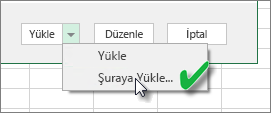
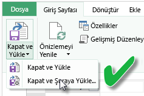
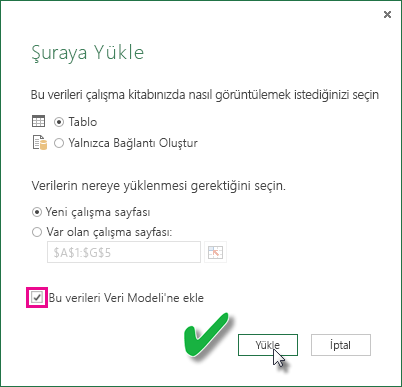

# Refresh a dataset created from an Excel workbook on a local drive (Yerel sürücüdeki bir Excel çalışma kitabından oluşturulan veri kümelerini yenileme)
## Desteklenenler
Power BI'da Şimdi Yenile ve Yenilemeyi Zamanla işlemleri, Power Query (Excel 2016'da Veri Al ve Dönüştür) veya Power Pivot'un şu veri kaynaklarından birine bağlanmak veya Excel veri modeline veri yüklemek için kullanıldığı yerel bir sürücüden içeri aktarılan Excel çalışma kitaplarından oluşturulmuş veri kümeleri için desteklenir:  

### Power BI Gateway - Personal
* Power Query'de gösterilen tüm çevrimiçi veri kaynakları.
* Hadoop dosyası (HDFS) ve Microsoft Exchange dışında, Power Query'de gösterilen tüm şirket içi veri kaynakları.
* Power Pivot'ta gösterilen tüm çevrimiçi veri kaynakları.\*
* Hadoop dosyası (HDFS) ve Microsoft Exchange dışında, Power Pivot'ta gösterilen tüm şirket içi veri kaynakları.

<!-- Refresh Data sources-->
[!INCLUDE [refresh-datasources](./includes/refresh-datasources.md)]

> **Notlar:**  
> 
> * Power BI'ın şirket içi veri kaynaklarına bağlanması ve veri kümesini yenilemesi için bir ağ geçidinin yüklenmesi ve çalışıyor olması gerekmektedir.
> * Excel 2013'ü kullanırken, Power Query'yi en son sürümüne güncelleştirdiğinizden emin olun.
> * Verilerin yalnızca çalışma sayfaları veya bağlantılı tablolarda bulunduğu yerel bir sürücüden içeri alınan Excel çalışma kitapları için yenileme desteklenmez. Yenileme, OneDrive'da depolanan ve OneDrive'dan içeri aktarılan çalışma sayfası verileri için desteklenir. Daha ayrıntılı bilgi için bkz. [Bir Excel çalışma kitabından oluşturulan veri kümelerini OneDrive'da veya SharePoint Online'da yenileme](refresh-excel-file-onedrive.md).
> * Yerel bir sürücüden içeri aktarılan bir Excel çalışma kitabından oluşturulan bir veri kümesini yenilediğinizde, yalnızca veri kaynaklarından sorgulanan veriler yenilenir. Excel veya Power Pivot'ta veri modeli yapısını değiştirirseniz; örneğin yeni bir ölçü oluşturur veya bir sütunun adını değiştirirseniz bu değişiklikler veri kümesine kopyalanmaz. Bu tür değişiklik yaparsanız çalışma kitabını yeniden yüklemeniz veya yayımlamanız gerekir. Çalışma kitabınızın yapısında normal değişiklikler yapmayı düşünüyorsanız ve yeniden yüklemek zorunda kalmadan bu değişikliklerin Power BI'daki veri kümesine yansımasını istiyorsanız çalışma kitabınızı OneDrive'a koymayı düşünebilirsiniz. Power BI, OneDrive'da depolanan ve OneDrive'dan içeri aktarılan çalışma kitaplarının hem yapısını hem de çalışma sayfalarını otomatik olarak yeniler.
> 
> 

## Verilerin Excel veri modeline yüklendiğinden nasıl emin olurum?
Bir veri kaynağına bağlanmak için Power Query (Excel 2016'da Veri Al ve Dönüştür) kullandığınızda, verilerin yükleneceği yer konusunda birkaç seçeneğiniz vardır. Verileri veri modeline veri yüklediğinizden emin olmak için, **Hedefe Yükle** iletişim kutusundaki **Bu verileri Veri Modeline ekle** seçeneğini belirlemelisiniz.

> [!NOTE]
> Buradaki görüntü Excel 2016'dan alınmıştır.
> 
> 

**Gezgin**'de, **Hedefe Yükle…** seçeneğine tıklayın.  
    

Alternatif olarak, Gezgin'de **Düzenle**'ye tıklayıp Sorgu Düzenleyicisi'ni açabilirsiniz. Burada **Kapat ve Hedefe Yükle...** seçeneğine tıklayabilirsiniz.  
    

Ardından, **Hedefe Yükle** seçeneğinde, **Bu verileri Veri Modeline ekle**'yi seçtiğinizden emin olun.  
    

### Power Pivot'ta Dış Veri Alma özelliğini kullanırsam ne olur?
Hiç sorun değil. Şirket içi veya çevrimiçi veri kaynaklarına bağlanmak veya bu kaynaklardaki verileri sorgulamak için Power Pivot'u her kullandığınızda, veriler otomatik olarak veri modeline yüklenir.

## Yenileme işlemini nasıl zamanlarım?
Bir yenileme zamanlaması belirlediğinizde, Power BI güncelleştirilen verileri sorgulamak için veri kümesindeki kimlik bilgilerini ve bağlantı bilgilerini kullanarak doğrudan veri kaynaklarına bağlanır ve ardından, güncelleştirilen verileri veri kümesine yükler. Power BI hizmetinde ilgili veri kümesini temel alan rapor ve panolardaki tüm görselleştirmeler de güncelleştirilir.

Yenileme zamanlamasını ayarlama ile ilgili daha fazla bilgi için bkz. [Yenileme Zamanlaması Yapılandırması](refresh-scheduled-refresh.md).

## Bir şeyler ters gittiğinde
Bir şeyler ters gittiğinde, sorun genellikle Power BI'ın veri kaynaklarında oturum açamamasından veya veri kümesi bir şirket içi veri kaynağına bağlandığında ağ geçidinin çevrimdışı olmasından kaynaklanır. Power BI'ın veri kaynaklarında oturum açabildiğinden emin olun. Bir veri kaynağında oturum açmak için kullandığınız parola değişirse veya Power BI'ın bir veri kaynağındaki oturumu kapanırsa, Veri Kaynağı Kimlik Bilgilerini kullanarak veri kaynaklarınızda yeniden oturum açmayı deneyin.

**Yenileme hatası bildirim e-postası almak istiyorum** seçeneğinin işaretlenmiş olduğundan emin olun. Bir zamanlanmış yenileme işleminin başarısız olup olmadığını hemen bilmek istersiniz.

>[!IMPORTANT]
>Yenileme işlemi, Power Pivot'a bağlı ve Power Pivot'tan sorgulanan OData akışları için desteklenmemektedir. Veri kaynağı olarak bir OData akışı kullanırken Power Query kullanın.

## Sorun giderme
Bazen verileri yenileme işlemi beklendiği gibi gitmeyebilir. Bu, genellikle ağ geçidiyle bağlantılı bir sorundan kaynaklanır. Araçlar ve bilinen sorunlara yönelik sorun giderme makalelerine göz atın.

[Şirket içi veri ağ geçidiyle ilgili sorunları giderme](service-gateway-onprem-tshoot.md)

[Power BI Gateway - Personal ile ilgili sorunları giderme](service-admin-troubleshooting-power-bi-personal-gateway.md)

## Sonraki adımlar
Başka bir sorunuz mu var? [Power BI Topluluğu'na başvurun](http://community.powerbi.com/)

