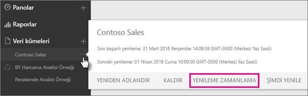
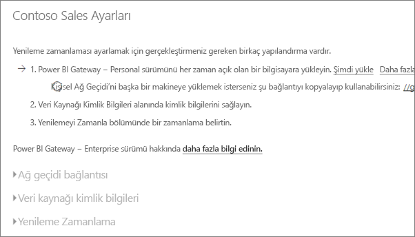
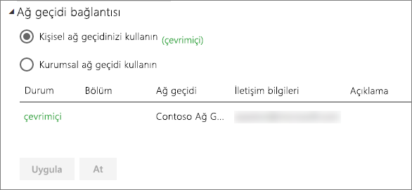
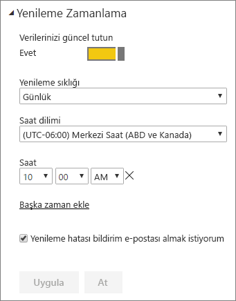

# Zamanlanmış yenileme yapılandırma

>[!NOTE]
>İki ay etkin olunmaması durumunda veri kümenizdeki zamanlanmış yenileme duraklatılır. Daha fazla bilgi için bu makalenin devamındaki [*Zamanlanmış yenileme*](#scheduled-refresh) bölümüne bakın.
>
>

Veri kümeniz **Şimdi Yenile** ve **Yenilemeyi Zamanla** seçenekleri kullanılarak zamanlanmış yenileme işlemi gerçekleştirilmesini destekliyorsa yenilemenin başarılı olması için dikkat edilmesi gereken birkaç gereksinim ve ayar vardır. Bunlar **Ağ geçidi bağlantısı**, **Veri kaynağı kimlik bilgileri** ve **Zamanlanmış yenileme**'dir. Şimdi her birine daha yakından bakalım.

Burada hem [Şirket içi veri ağ geçidi (kişisel mod)](service-gateway-personal-mode.md) hem de [şirket içi veri ağ geçidi](service-gateway-onprem.md) için sağlanan seçenekler açıklanır.

**Zamanlanmış yenileme** ekranına gitmek için aşağıdakileri yapabilirsiniz.

1. **Veri Kümeleri** bölümünde bulunan bir veri kümesinin yanındaki **Diğer seçenekler** (...) simgesini seçin.
2. **Yenilemeyi Zamanla** seçeneğini belirleyin.

    

## Ağ geçidi bağlantısı
Karşılaşacağınız seçenekler, çevrimiçi ve kullanılabilir durumda olan ağ geçidinizin türüne (kişisel veya şirket içi) göre değişir.

Kullanılabilir bir ağ geçidi yoksa **Ağ geçidi bağlantısı**'nın devre dışı olduğunu görürsünüz. Kişisel ağ geçidinin nasıl yükleneceğini gösteren bir iletiyle de karşılaşırsınız.

Yapılandırılmış bir kişisel ağ geçidiniz varsa çevrimiçi olması halinde bu ağ geçidini seçebilirsiniz. Kullanılamıyorsa ağ geçidi çevrimdışı olarak görünür.

Erişim iznine sahip olmanız durumunda ilgili kurumsal ağ geçidini de seçebilirsiniz. Yalnızca hesabınızın belirli bir ağ geçidi için yapılandırılmış veri kaynağına ilişkin **Kullanıcılar** sekmesinde bulunması halinde bir kurumsal ağ geçidi seçeneği sunulur.

## Veri kaynağı kimlik bilgileri
### Power BI Gateway - Personal
Verileri yenilemek için kişisel ağ geçidi kullanıyorsanız arka uç veri kaynağına bağlanmak için kimlik bilgilerini sağlamanız gerekir. Çevrimiçi bir hizmetin içerik paketine bağlıysanız bu bağlantı için girdiğiniz kimlik bilgileri, zamanlanmış yenileme için taşınır.

Yalnızca söz konusu veri kümesinde yenileme özelliğini ilk kez kullanırken veri kaynağında oturum açmanız gerekir. Girdiğiniz kimlik bilgileri veri kümesinde tutulur.

> [!NOTE]
> Belirli kimlik doğrulama yöntemleri ile bir veri kaynağında oturum açarken kullandığınız parolanın değişmesi veya süresinin dolması halinde, söz konusu parolayı veri kaynağına ilişkin **Veri kaynağı kimlik bilgileri** bölümünde de değiştirmeniz gerekir.
>
>

Olası sorunlar genellikle ya ağ geçidinin Windows'da oturum açamayıp hizmeti başlatamaması nedeniyle çevrimdışı olmasından ya da Power BI'ın güncelleştirilmiş verileri sorgulamak üzere veri kaynaklarında oturum açamamasından meydana gelir. Yenileme başarısız olursa veri kümesinin ayarlarını kontrol edin. Ağ geçidi hizmeti çevrimdışıysa **Durum** bölümünde bir hatayla karşılaşırsınız. Power BI'ın veri kaynaklarında oturum açamaması halinde ise hatayla karşılaşacağınız bölüm Veri Kaynağı Kimlik Bilgileri'dir.

### Şirket içi veri ağ geçidi
Verileri yenilemek için şirket içi veri ağ geçidini kullanıyorsanız ağ geçidi yöneticisi tarafından veri kaynağı için tanımlanan kimlik bilgilerini sağlamanız gerekmez.

> [!NOTE]
> Power BI, veri yenileme amacıyla şirket içi SharePoint veri kaynaklarına bağlanmak için yalnızca *Anonim*, *Temel* ve *Windows (NTLM/Kerberos)* kimlik doğrulama yöntemlerinin kullanılmasını destekler. Power BI, şirket içi SharePoint veri kaynaklarındaki verilerin yenilenmesi için *ADFS* veya *Form Tabanlı Kimlik Doğrulama* yöntemlerini desteklemez.
>
>

## Zamanlanmış yenileme
**Zamanlanmış yenileme** bölümünde veri kümesini yenileme sıklığını ve zaman aralıklarını tanımlayabilirsiniz. Bazı veri kaynaklarında yenileme için yapılandırılabilecek bir ağ geçidi gerekmez; diğer veri kaynakları ise ağ geçidi gerektirir.

Ayarları yapılandırmak için **Verilerinizi güncel tutun** kaydırıcısını **Açık** olarak ayarlayın.

> [!NOTE]
> Power BI hizmeti, verilerinizin yenilenmesini, zamanlanmış yenileme saatinizin ilk **15 dakikası** içinde başlatılacak şekilde ayarlar.
>
>

> [!NOTE]
> İki ay etkin olunmaması durumunda veri kümenizdeki zamanlanmış yenileme duraklatılır. Veri kümesinde bir kullanıcı tarafından ziyaret edilen herhangi bir pano veya rapor bulunmuyorsa veri kümesinin etkin olmadığı varsayılır. Böyle bir durumda, veri kümesi sahibine zamanlanmış yenilemenin duraklatıldığını bildiren bir e-posta gönderilir ve veri kümesine ilişkin yenileme zamanlaması **devre dışı** olarak görüntülenir. Zamanlanmış yenilemeyi sürdürmek için, veri kümesi üzerinde oluşturulmuş herhangi bir panoyu veya raporu yeniden ziyaret etmeniz yeterlidir.
>
>

## Hangi veri kaynakları desteklenir?
Zamanlanmış yenileme için farklı ağ geçitlerinde desteklenen çeşitli veri kümeleri vardır. Kullanabileceğiniz veri kümelerine ilişkin fikir edinmek için aşağıya göz atabilirsiniz.

### Power BI Gateway - Personal
**Power BI Desktop**

* Power BI Desktop'taki **Veri Al** ve Sorgu Düzenleyicisi bölümlerinde gösterilen tüm çevrimiçi veri kaynakları.
* Hadoop dosyası (HDFS) ve Microsoft Exchange dışında, Power BI Desktop'taki **Veri Al** ve Sorgu Düzenleyicisi bölümlerinde gösterilen tüm şirket içi veri kaynakları.

**Excel**

> [!NOTE]
> Excel 2016 ve sonraki sürümlerinde, Power Query şeridin **Veri** bölümünde, **Verileri Al ve Dönüştür**'ün altında bulunur.
>
>

* Power Query'de gösterilen tüm çevrimiçi veri kaynakları.
* Hadoop dosyası (HDFS) ve Microsoft Exchange dışında, Power Query'de gösterilen tüm şirket içi veri kaynakları.
* Power Pivot'ta gösterilen tüm çevrimiçi veri kaynakları.
* Hadoop dosyası (HDFS) ve Microsoft Exchange dışında, Power Pivot'ta gösterilen tüm şirket içi veri kaynakları.

<!-- Refresh Data sources-->
[!INCLUDE [refresh-datasources](./includes/refresh-datasources.md)]

## Sorun giderme
Bazen verileri yenileme işlemi beklendiği gibi gitmeyebilir. Bu, genellikle ağ geçidiyle bağlantılı bir sorundan kaynaklanır. Araçlar ve bilinen sorunlara yönelik sorun giderme makalelerine göz atın.

- [Şirket içi veri ağ geçidiyle ilgili sorunları giderme](service-gateway-onprem-tshoot.md)
- [Power BI Gateway - Personal ile ilgili sorunları giderme](service-admin-troubleshooting-power-bi-personal-gateway.md)

## Sonraki adımlar
- [Power BI'da veri yenileme](refresh-data.md)  
- [Power BI Gateway - Personal](service-gateway-personal-mode.md)  
- [Şirket içi veri ağ geçidi (kişisel mod)](service-gateway-onprem.md)  
- [Şirket içi veri ağ geçidiyle ilgili sorunları giderme](service-gateway-onprem-tshoot.md)  
- [Power BI Gateway - Personal ile ilgili sorunları giderme](service-admin-troubleshooting-power-bi-personal-gateway.md)  

Başka bir sorunuz mu var? [Power BI Topluluğu'na sorun](https://community.powerbi.com/)

