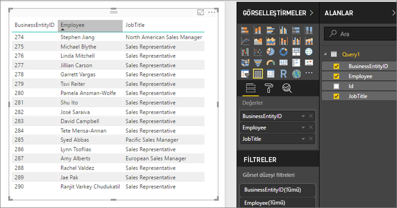

# Power BI Rapor Sunucusu'nda paylaşılan veri kümelerine OData akışları olarak erişme
Paylaşılan veri kümelerine Power BI Desktop'tan OData akışı ile erişebilirsiniz.

1. OData akışı URL'si ile OData kaynağına bağlanırsınız.
   
    
2. Verileri Power BI Desktop'a getirdikten sonra Sorgu Düzenleyicisi'nde değiştirebilirsiniz.
   
    
3. Artık verileri rapor tasarlamada kullanabilirsiniz.
   
    

Power Query'de Açık Tür Sütunları'nı açabilmek ve sütunları ihtiyaçlarınızı karşılayacak şekilde biçimlendirebilmek için **Gelişmiş Seçenekler**'i kullanmayı unutmayın.

[Power BI Desktop'ta OData alanlarına bağlanma](../desktop-connect-odata.md) ile ilgili daha fazla bilgi edinin.

Başka bir sorunuz mu var? [Power BI Topluluğu'na sorun](https://community.powerbi.com/)

