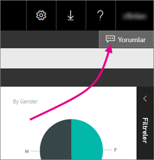
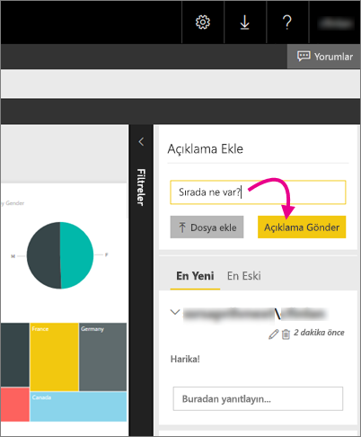

# Rapor sunucularındaki raporlara açıklama ekleme
Bir rapor sunucusunun web portalından raporlara (Power BI raporları dahil) açıklama ekleyebilirsiniz. Açıklamalar raporların üzerinde kalır ve gerekli izinlere sahip olan kullanıcılar rapordaki açıklamaları görebilir. Ayrıntılar için aşağıdaki [İzinler](#permissions) bölümünü inceleyin.

## Açıklama ekleme veya görüntüleme
1. Rapor sunucusunda bir sayfalandırılmış rapor veya Power BI raporu açın.
2. Sağ üst köşeden **Açıklamalar**'ı seçin.
   
    
   
    Açıklamalar bölmesinde var olan açıklamaları görebilirsiniz.
3. Açıklamanızı yazıp **Açıklama Gönder**'i seçin.
   
    
   
    Açıklamanız web portalındaki açıklamalar bölmesinde, önceki açıklamalarla birlikte gösterilir. Açıklamalar, rapor Power BI mobil uygulamalarında açıldığında görünmez.
   
   > [!TIP]
   > Biliyor muydunuz? [Power BI mobil uygulamalarında Power BI raporlarına not ekleyebilir](../mobile-annotate-and-share-a-tile-from-the-mobile-apps.md) ve not eklediğiniz raporları başkalarıyla paylaşabilirsiniz.
   > 
   > 

## İzinler
İzinlerinize bağlı olarak aşağıdakiler geçerli olabilir:

* Açıklamaları göremeyebilirsiniz.
* Tüm açıklamaları görebilir, kendi açıklamanızı gönderebilir, düzenleyebilir ve silebilirsiniz.
* Tüm açıklamaları görebilir, kendi açıklamanızı gönderebilir, düzenleyebilir, silebilir ve diğer kişilerin açıklamalarını silebilirsiniz.

## Sonraki adımlar
* [Power BI Rapor Sunucusu kullanıcı el kitabı](user-handbook-overview.md)  

Başka bir sorunuz mu var? [Power BI Topluluğu'na sorun](https://community.powerbi.com/)

