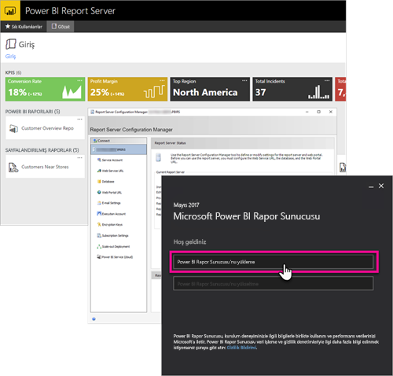

# Yönetici genel bakışı, Power BI Rapor Sunucusu
Bu makalede Power BI, mobil ve sayfalandırılmış raporlarınızı depolayabileceğiniz ve yönetebileceğiniz şirket içi bir konum olan Power BI Rapor Sunucusu'na yönelik yönetici genel bakışı sunulmaktadır. Bu makale, daha fazla bilgi içeren bağlantılarla birlikte Power BI Rapor Sunucunuzu planlama, dağıtma ve yönetme kavramlarını açıklamaktadır.

 
## Yükleme ve geçiş
Power BI Rapor Sunucusu'nu kullanmaya başlamak için yüklemeniz gerekir. Bu görevi nasıl gerçekleştireceğinizi açıklayan makaleler mevcuttur.

Power BI Rapor Sunucusu'na yönelik yükleme, yükseltme veya geçiş işlemlerine başlamadan önce rapor sunucusunun [sistem gereksinimlerine](system-requirements.md) göz atın.

### Yükleniyor
Yeni bir Power BI Rapor Sunucusu dağıtıyorsanız aşağıdaki belgeden faydalanabilirsiniz. 

[Power BI Rapor Sunucusu'nu yükleme](install-report-server.md)

### Geçiş
SQL Server Reporting Services için yerinde yükseltme seçeneği mevcut değildir. Power BI Rapor Sunucusu'na dönüştürmek istediğiniz bir SQL Server Reporting Services örneğiniz varsa geçiş yapmanız gerekir. Geçiş yapmak istemenizi sağlayacak başka nedenler de olabilir. Daha ayrıntılı bilgi için geçiş belgesini inceleyin.

[Rapor sunucusu yüklemesini geçirme](migrate-report-server.md)

## Rapor sunucunuzu yapılandırma
Rapor sunucunuzu yapılandırmak için kullanabileceğiniz birçok seçenek mevcuttur. SSL kullanacak mısınız? E-posta sunucusu yapılandırıyor musunuz? Görselleştirmeleri sabitlemek için Power BI hizmetini tümleştirmek istiyor musunuz?

Yapılandırmanın büyük bölümü Rapor Sunucusu Yapılandırma Yöneticisi'nde gerçekleştirilir. Daha ayrıntılı bilgi için [yapılandırma yöneticisi](/sql/reporting-services/install-windows/reporting-services-configuration-manager-native-mode) belgelerini inceleyin.

## Güvenlik
Güvenlik ve koruma her kuruluş için önemli konulardır. Kimlik doğrulaması, yetkilendirme, roller ve izinler hakkında bilgi edinmek için [güvenlik](/sql/reporting-services/security/reporting-services-security-and-protection) belgelerine göz atabilirsiniz.

## Sonraki adımlar
[Power BI Rapor Sunucusu'nu yükleme](install-report-server.md)  
[Rapor sunucusu ürün anahtarınızı bulma](find-product-key.md)  
[Power BI Rapor Sunucusu için en iyi duruma getirilmiş Power BI Desktop uygulamasını yükleme](install-powerbi-desktop.md)  
[Rapor Oluşturucusu’nu indirme](https://www.microsoft.com/download/details.aspx?id=53613)  
[Download SQL Server Data Tools (SSDT) (SQL Server Veri Araçlarını (SSDT) indirme)](/sql/ssdt/download-sql-server-data-tools-ssdt)

Başka bir sorunuz mu var? [Power BI Topluluğu'na sorun](https://community.powerbi.com/)