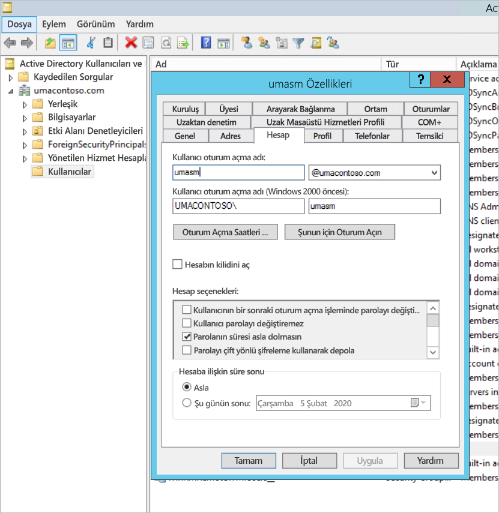

# <a name="configure-power-bi-report-server-with-azure-application-proxy"></a>Power BI Rapor Sunucusu’nu Azure Uygulama Ara Sunucusu’yla yapılandırma

Bu makalede Azure Active Directory Uygulama Ara Sunucusu’nu kullanarak Power BI Rapor Sunucusu’na ve SQL Server Reporting Services (SSRS) 2016 ve üstüne nasıl bağlanabileceğiniz açıklanır. Bu tümleştirme aracılığıyla, şirket ağından uzak olan kullanıcılar istemci tarayıcılarından Power BI Rapor Sunucusu ve Reporting Services raporlarına erişebilir ve Azure Active Directory (AD) tarafından korunabilir. Şirket içi uygulamalara [Azure Active Directory'nin Uygulama Ara Sunucusu](https://docs.microsoft.com/azure/active-directory/manage-apps/application-proxy) aracılığıyla uzaktan erişme hakkında daha fazla bilgi edinin.

## <a name="environment-details"></a>Ortam ayrıntıları

Oluşturduğumuz örnekte şu değerleri kullandık. 

- Etki alanı: umacontoso.com
- Power BI Rapor Sunucusu: PBIRSAZUREAPP.umacontoso.com
- SQL Server Veri Kaynağı: SQLSERVERAZURE.umacontoso.com

## <a name="configure-power-bi-report-server"></a>Power BI Rapor Sunucusu'nu yapılandırma

Power BI Rapor Sunucusu’nu yükledikten sonra (varsayılan olarak Azure VM üzerine), aşağıdaki adımları kullanarak Power BI Rapor Sunucusu web hizmeti ve web portalı URL’lerini yapılandırın:

1. VM güvenlik duvarında 80 numaralı bağlantı noktası (https URL’lerini yapılandırdıysanız 443 numaralı bağlantı noktası) için gelen ve giden kurallarını oluşturun. Ayrıca TCP protokolü (80 numaralı bağlantı noktası) için Azure portalından Azure VM’nin gelen ve giden kurallarını oluşturun.
2. Ortamımızda VM için yapılandırılan DNS adı `pbirsazureapp.eastus.cloudapp.azure.com`‘dur.
3. Power BI Rapor Sunucusu dış web sitesi ve web portalı URL’sini yapılandırmak için **Gelişmiş** sekmesi > **Ekle** düğmesi > **Konak Üst Bilgisi Adı**’nı seçin burada gösterildiği gibi konak adını (DNS adı) ekleyin.

    

1. Hem Web hizmeti hem de Web portalı bölümü için önceki adımı gerçekleştirdik ve rapor sunucusu Yapılandırma Yöneticisi’ne kaydedilen URL’leri aldık:

    - `https://pbirsazureapp.eastus.cloudapp.azure.com/ReportServer`
    - `https://pbirsazureapp.eastus.cloudapp.azure.com/Reports`

2. Azure portalının ağ bölümünde VM için iki IP adresi görüyoruz 

    - **Genel IP**. 
    - **Özel IP**. 
    
    Genel IP adresi sanal makinenin dışından erişim için kullanılır.

3. Bu nedenle Genel IP adresini ve `pbirsazureapp.eastus.cloudapp.azure.com` konak adını dahil etmek için VM’ye (Power BI Rapor Sunucusu) konak dosyasını ekledik.
4. VM yeniden başlatıldığında dinamik IP adresinin değişebileceğine ve konak dosyasına yeniden doğru IP adresini eklemeniz gerekebileceğine dikkat edin. Bundan kaçınmak için Azure portalında Genel IP adresini statik olarak ayarlayabilirsiniz.
5. Yukarıda belirtilen değişiklikler yapıldıktan sonra Web hizmeti ve Web portalı URL’leri başarıyla erişilebilir olmalıdır.
6. Sunucuda `https://pbirsazureapp.eastus.cloudapp.azure.com/ReportServer` URL’ye ulaşınca üç kez kimlik bilgilerini girmemiz istenir ve boş bir ekran görürüz.
7. Şu kayıt defteri girdisini ekleyin:

    `HKEY\_LOCAL\_MACHINE \SYSTEM\CurrentControlset\Control \Lsa\ MSV1\_0` kayıt defteri anahtarı

1. Çok dizeli bir değer olan yen i`BackConnectionHostNames` değerini ekleyin ve `pbirsazureapp.eastus.cloudapp.azure.com` konak adını sağlayın.

Bundan sonra sunucuda da URL’lere erişebiliriz.

## <a name="configure-power-bi-report-server-to-work-with-kerberos"></a>Power BI Rapor Sunucusu'nu Kerberos’la çalışacak şekilde yapılandırma

### <a name="1-configure-the-authentication-type"></a>1. Kimlik doğrulaması türünü yapılandırma

Rapor sunucusu kimlik doğrulaması türünü, Kerberos kısıtlanmış temsil yapılandırmasına izin verecek şekilde yapılandırmanız gerekir. Bu yapılandırma **rsreportserver.config** dosyasında gerçekleştirilir.

rsreportserver.config dosyasında **Authentication/AuthenticationTypes** bölümünü bulun.

RSWindowsNegotiate öğesinin mevcut olduğundan ve kimlik doğrulaması türleri arasında ilk sırada yer aldığından emin olun. Liste aşağıdakine benzer olmalıdır.

```
<AuthenticationTypes>

    <RSWindowsNegotiate/>

</AuthenticationTypes>
```

Yapılandırma dosyasını değiştirmeniz gerekirse, değişikliklerin geçerlilik kazandığından emin olmak için Rapor Sunucusu Yapılandırma Yöneticisi’nden **rapor sunucusunu durdurun ve yeniden başlatın**.

### <a name="2-register-service-principal-names-spns"></a>2. Hizmet asıl adlarını (SPN) kaydetme

Komut istemini yönetici olarak açın ve aşağıdaki adımları uygulayın.

Şu komutları kullanarak **Power BI Rapor Sunucusu hizmet hesabının** altında aşağıdaki SPN’leri ekleyin

```
setspn -s http/ Netbios name\_of\_Power BI Report Server\_server<space> Power BI Report Server\_ServiceAccount

setspn -s http/ FQDN\_of Power BI Report Server\_server<space> Power BI Report Server\_ServiceAccount
```

Şu komutları kullanarak SQL Server hizmet hesabının altına aşağıdaki SPN’leri ekleyin (SQL Server’ın varsayılan örneği için):

```
setspn -s MSSQLSVC/FQDN\_of\_SQL\_Server: 1433 (PortNumber) <SQL service service account>

setspn -s MSSQLSVC/FQDN\_of\_SQL\_Server<SQL service service account>
```

### <a name="3-configure-delegation-settings"></a>3. Temsilci seçme ayarlarını yapılandırma

Rapor sunucusu hizmet hesabında temsilci ayarlarını yapılandırmamız gerekiyor.

1. Active Directory Kullanıcıları ve Bilgisayarları’nı açın.
2. Active Directory Kullanıcıları ve Bilgisayarları'nda rapor sunucusu hizmet hesabı için Özellikler’i açın.
3. Protokol geçişi ile kısıtlanmış temsili yapılandıracağız. Kısıtlanmış temsilde, temsilci olarak seçeceğimiz hizmetleri açıkça belirtmeliyiz.
4. **Rapor sunucusu hizmet hesabına** sağ tıklayın ve **Özellikler**'i seçin.
5. **Temsilci Seçme** sekmesini seçin.
6. **Bu bilgisayara yalnızca belirtilen hizmetlere temsilci seçmek için güven**'i seçin.
7. **Herhangi bir kimlik doğrulama protokolünü kullan**'ı seçin.
8. **Bu hesabın temsilci seçilen kimlik bilgilerini sunacağı hizmetler**: bölümünde **Ekle**'yi seçin.
9. Yeni iletişim kutusunda **Kullanıcı/Bilgisayar**'ı seçin.
10. **SQL Server hizmetine ilişkin hizmet hesabını** girin ve **Tamam**'ı seçin.

    MSSQLSVC ile başlar.

1. SPN’leri ekleyin.
2. **Tamam**’ı seçin. SPN'nin listede görünmesi gerekir.

Bu adımlar Power BI Rapor Sunucusu’nu Kerberos kimlik doğrulama mekanizmasıyla çalışacak ve yerel makinenizde çalışan veri kaynağına test bağlantısı alacak şekilde yapılandırmaya yardımcı olur.

## <a name="configure-azure-application-proxy-connector"></a>Azure Uygulama Ara Sunucusu bağlayıcısını yapılandırma

[Uygulama Ara Sunucusu bağlayıcısıyla ilgili yapılandırma](https://docs.microsoft.com/azure/active-directory/manage-apps/application-proxy-add-on-premises-application#add-an-on-premises-app-to-azure-ad) konusundaki makaleye bakın

Biz Uygulama Ara Sunucusu bağlayıcısını Power BI Rapor Sunucusu’na yükledik ama bunu ayrı bir sunucuda yapılandırabilir ve temsilin düzgün ayarlandığından emin olabilirsiniz.

### <a name="ensure-the-connector-is-trusted-for-delegation"></a>Bağlayıcının temsil için güvenilir olduğundan emin olma

Bağlayıcının, rapor sunucusu uygulama havuzu hesabına eklenen SPN’nin temsili için güvenilir olduğundan emin olun.

Azure AD Uygulama Ara Sunucusu hizmetinin rapor sunucusu uygulama havuzu hesabında kullanıcı kimliklerini temsilci atayabilmesi için Kerberos Kısıtlanmış Temsili’ni (KCD) yapılandırın. Uygulama Ara Sunucusu bağlayıcısının Azure AD’de kimliği doğrulanmış olan kullanıcılarınız için Kerberos biletleri almasını etkinleştirerek KCD’yi yapılandırın. Ardından bu sunucu bağlamı hedef uygulamaya veya bu örnekte Power BI Rapor Sunucusu’na geçirir.

KCD’yi yapılandırmak için aşağıdaki adımları her bağlayıcı makinesinde yineleyin.

1. Etki alanı denetleyicisinde etki alanı yöneticisi olarak oturum açın ve sonra da **Active Directory Kullanıcıları ve Bilgisayarları**’nı açın.
2. Bağlayıcının üzerinde çalıştırıldığı bilgisayarı bulun.
3. Bilgisayara çift tıklayın ve ardından **Temsilci** sekmesini seçin.
4. Temsilci ayarlarını **Bu bilgisayara yalnızca belirtilen hizmetlere temsilci seçmek için güven** olarak belirleyin. Sonra **Herhangi bir kimlik doğrulama protokolünü kullan**'ı seçin.
5. **Ekle**’yi ve ardından **Kullanıcılar veya Bilgisayarlar**’ı seçin.
6. Power BI Rapor Sunucusu için kullandığınız hizmet hesabını girin. Bu hesap, rapor sunucusu yapılandırmasında SPN'yi eklediğiniz hesaptır.
7. **Tamam**'a tıklayın. 
8. Değişiklikleri kaydetmek için **Tamam**’a yeniden tıklayın.

## <a name="publish-through-azure-ad-application-proxy"></a>Azure AD Uygulama Ara Sunucusu aracılığıyla yayımlama

Artık Azure AD Uygulaması Ara Sunucusu’nu yapılandırmaya hazırsınız.

Power BI Rapor Sunucusu’nu aşağıdaki ayarları kullanarak Uygulama Ara Sunucusu aracılığıyla yayımlayın. Uygulama Ara Sunucusu aracılığıyla uygulama yayımlama işleminin adım adım yönergeleri için bkz. [Azure AD Uygulama Ara Sunucusu’nu kullanarak uygulamaları yayımlama](https://docs.microsoft.com/azure/active-directory/manage-apps/application-proxy-add-on-premises-application#add-an-on-premises-app-to-azure-ad).

- **İç URL**: Bağlayıcının şirket ağında ulaşabileceği rapor sunucusunun URL’sini girin. Bağlayıcının yüklendiği sunucudan bu URL’ye ulaşılabildiğinden emin olun. Uygulama Ara Sunucusu aracılığıyla yayımlanan alt yollarla ilgili sorunlardan kaçınmak için `https://servername/` gibi bir üst düzey etki alanı kullanmak iyi bir yöntemdir. Örneğin `https://servername/` kullanın ama `https://servername/reports/` veya `https://servername/reportserver/` kullanmayın. Biz ortamımızı `https://pbirsazureapp.eastus.cloudapp.azure.com/` ile yapılandırdık.

    > [!NOTE]
    > Rapor sunucusuna güvenli HTTPS bağlantısı kullanmanızı öneririz. Nasıl yapılacağına ilişkin bilgi için bkz. [Yerel moddaki rapor sunucusunda SSL bağlantılarını yapılandırma](https://docs.microsoft.com/sql/reporting-services/security/configure-ssl-connections-on-a-native-mode-report-server?view=sql-server-2017).

- **Dış URL**: Power BI mobil uygulamasının bağlanacağı genel URL’yi girin. Özel etki alanı kullanılıyorsa örneğin `https://reports.contoso.com` gibi bir URL olabilir. Özel etki alanı kullanmak için etki alanının sertifikasını karşıya yükleyin ve bir DNS kaydının uygulamanız için varsayılan msappproxy.net etki alanına işaret etmesini sağlayın. Ayrıntılı adımlar için bkz. [Azure AD Uygulama Ara Sunucusu’nda özel etki alanlarıyla çalışma](https://docs.microsoft.com/azure/active-directory/manage-apps/application-proxy-configure-custom-domain).

Biz ortamımız için dış URL’yi `https://pbirsazureapp-umacontoso2410.msappproxy.net/` olarak yapılandırdık.

- **Ön Kimlik Doğrulaması Yöntemi**: Azure Active Directory.
- **Bağlayıcı Grubu:** Varsayılan.


**Ek Ayarlar** bölümünde hiçbir değişiklik yapmadık. Varsayılan seçeneklerle çalışacak şekilde yapılandırıldı.

> [!IMPORTANT]
> Uygulama ara sunucusu yapılandırıldığında, **Arka Uç Uygulama Zaman Aşımı** özelliğinin **Varsayılan** (85 saniye) olarak ayarlandığını unutmayın. Yürütülmesi 85 saniyeden uzun süren raporlarınız varsa bu ayarı, mümkün olan en yüksek zaman aşımı değeri olan **Uzun** (180 saniye) olarak ayarlayın. **Uzun** değeri için yapılandırıldıklarında, tüm raporların 180 saniye içinde tamamlanması gerekir, aksi takdirde zaman aşımına uğrayıp hata verirler.


### <a name="configure-single-sign-on"></a>Çoklu oturum açmayı yapılandırma

Uygulamanız yayımlandığında, aşağıdaki adımları kullanarak çoklu oturum açma ayarlarını yapılandırın:

1. Portaldaki uygulama sayfasında **Çoklu oturum açma**’yı seçin.
2. **Çoklu Oturum Açma Modu** olarak **Tümleşik Windows Kimlik Doğrulaması**’nı seçin.
3. **İç Uygulama SPN'si** öğesini daha önce ayarladığınız değere ayarlayın. Aşağıdaki adımları kullanarak bu değeri belirleyebilirsiniz:

    - Kerberos biletinin oluşturulması için bir rapor çalıştırmayı veya veri kaynağına test bağlantısı oluşturmayı deneyin.
    - Raporun/test bağlantısının başarıyla yürütülmesinin ardından komut istemini açın ve şu komutu çalıştırın: `klist`. Sonuç bölümünde `http/` SPN’siyle bir bilet görüyor olmalısınız. Power BI Rapor Sunucusu’nda yapılandırdığınız SPN’yle aynıysa, bu bölümde bu SPN’yi kullanın.

1. Bağlayıcıyı kullanıcılar adına kullanmak için **Temsilci Oturum Açma Kimliği**’ni seçin. Daha fazla bilgi için bkz. [Farklı şirket içi ve bulut kimlikleriyle çalışma](https://docs.microsoft.com/azure/active-directory/manage-apps/application-proxy-configure-single-sign-on-with-kcd#working-with-different-on-premises-and-cloud-identities).

    Kullanıcı Asıl Adını kullanmanızı öneririz. Biz örneğimizde bunu **Kullanıcı Asıl Adı** seçeneğiyle çalışacak şekilde yapılandırdık:

    

1. Değişikliklerinizi kaydetmek için **Kaydet**’e tıklayın.

### <a name="finish-setting-up-your-application"></a>Uygulamanızı ayarlamayı bitirme

Uygulamanızı ayarlamayı bitirmek için **Kullanıcılar ve gruplar** bölümüne gidin ve bu uygulamaya erişecek kullanıcıları atayın.

1. Power BI Rapor Sunucusu uygulaması için Uygulama kaydının **Kimlik Doğrulaması** bölümündeki **Yeniden Yönlendirme URL’leri** ve **Gelişmiş ayarlar** alanlarını aşağıda gösterildiği gibi yapılandırın:

    - Yeni bir Yeniden Yönlendirme URL’si oluşturun ve bunu **Tür** = **Web** ve **Yeniden Yönlendirme URI’si** = `https://pbirsazureapp-umacontoso2410.msappproxy.net/` ile yapılandırın
    - **Gelişmiş Ayarlar** bölümünde **Oturum Kapatma URL’si** seçeneğini `https://pbirsazureapp-umacontoso2410.msappproxy.net/?Appproxy=logout` ile yapılandırın

    

1. Power BI Rapor Sunucusu uygulaması için Uygulama kaydının **Kimlik Doğrulaması** bölümünü yapılandırmaya devam edin. **Örtük onay**, **Varsayılan istemci türü** ve **Desteklenen hesap türleri**’ni aşağı gösterildiği gibi yapılandırın:

    - **Örtük onay** için **Kimlik belirteçleri**’ni ayarlayın.
    - **Varsayılan istemci türü** için **Hayır**’ı ayarlayın.
    - **Desteklenen hesap türleri** için **Yalnızca bu kuruluş dizinindeki hesaplar (Yalnızca UmaContoso – Tek kiracı)** seçeneğini ayarlayın.

    

1. Çoklu oturum açma ayarlandıktan ve `https://pbirsazureapp-umacontoso2410.msappproxy.net` URL’si çalışmaya başladıktan sonra, oturum açtığımız hesabın Power BI Rapor Sunucusu’nda izinlerin sağlandığı hesapla eşitlendiğinden emin olmamız gerekir.

1. Önce oturum açarken kullanmayı planladığımız özel etki alanını yapılandırmalı ve sonra da bunun doğrulandığından emin olmalıyız
2. Bu örnekte umacontoso.com adlı bir etki alanı satın aldık ve DNS bölgesini girdilerle yapılandırdık. Ayrıca `onmicrosoft.com` etki alanını kullanmayı ve bunu şirket içi AD ile eşitlemeyi de deneyebilirsiniz.

    Başvuru için [Öğretici: Mevcut özel DNS adını Azure App Service'e eşleme](https://docs.microsoft.com/Azure/app-service/app-service-web-tutorial-custom-domain) makalesine bakın.

1. Özel etki alanının DNS girdisini başarıyla doğruladıktan sonra portalda etki alanına ilişkin olarak **Doğrulandı** durumunu görüyor olmalısınız.

    

1. Etki alanı denetleyicisi sunucusuna Microsoft Azure AD Connect yükleyin ve Azure AD ile eşitlenecek şekilde yapılandırın.

    

1. Azure AD şirket içi AD ile eşitlendikten sonra Azure portalında aşağıdaki durumu görürüz:

    

1. Ayrıca, eşitleme başarılı olduktan sonra Etki alanı denetleyicisinde AD etki alanları ve güvenlerini açın. Active Directory Etki Alanları ve Güvenleri > Özellikler’e sağ tıklayın ve UPN’yi ekleyin. Bizim ortamımızda satın aldığınız özel etki alanı `umacontoso.com`‘dur.

1. UPN’yi ekledikten sonra, Azure AD hesabıyla şirket içi AD hesabının bağlanması ve kimlik doğrulaması sırasında belirtecin tanınması için kullanıcı hesaplarını bu UPN ile yapılandırabilmelisiniz.

    Önceki adımı tamamladığınızda, AD etki alanı adı **Kullanıcı oturum açma adı** bölümündeki açılan listede yer alır. Kullanıcı adını yapılandırın ve AD kullanıcı özelliklerinin **Kullanıcı oturum açma adı** bölümündeki açılan listeden etki alanını seçin.

    

1. AD eşitlemesi başarılı olduktan sonra, şirket içi AD hesabının Azure portalında, uygulamanın **Kullanıcılar ve Gruplar** bölümüne alındığını görürsünüz. Hesabın kaynağı **Windows Server AD**’dir.
2. `umasm@umacontoso.com` ile oturum açmak, `Umacontoso\umasm` Windows kimlik bilgileriyle oturum açmakla eşdeğer olacaktır.

    Önceki adımların geçerli olması için şirket içi AD’yi yapılandırmış ve bunu Azure AD ile eşitlemeyi planlıyor olmanız gerekir.

    Yukarıdaki adımları uyguladıktan sonra başarılı oturum açma işlemi:

    

    Ardından web portalı görüntülenir:

    

    Kerberos kimlik doğrulaması kullanılarak veri kaynağına başarılı bir test bağlantısı kurulur:

    

## <a name="access-from-power-bi-mobile-apps"></a>Power BI mobil uygulamalarından erişim

### <a name="configure-the-application-registration"></a>Uygulama kaydını yapılandırma

Power BI mobil uygulamasının Power BI Rapor Sunucusu’na bağlanabilmesi ve erişebilmesi için önce bu makalenin başlarındaki [Azure AD Uygulama Ara Sunucusu aracılığıyla yayımlama](#publish-through-azure-ad-application-proxy) bölümünde sizin için otomatik olarak oluşturulmuş olan uygulama kaydını yapılandırmanız gerekir.

1. Azure Active Directory **Genel Bakış** sayfasında **Uygulama kayıtları**'nı seçin.
2. **Tüm uygulamalar** sekmesinde Power BI Rapor Sunucusu için oluşturduğunuz uygulamayı arayın.
3. Uygulamayı seçin ve sonra da **Kimlik Doğrulaması**’nı seçin.
4. Kullandığınız platforma bağlı olarak aşağıdaki Yeniden Yönlendirme URI’lerini ekleyin.

    Uygulamayı Power BI Mobil **iOS** için yapılandırırken aşağıda gösterilen Genel İstemci (Mobil ve Masaüstü) türündeki Yeniden Yönlendirme URI’lerini ekleyin:

    - `msauth://code/mspbi-adal%3a%2f%2fcom.microsoft.powerbimobile`
    - `msauth://code/mspbi-adalms%3a%2f%2fcom.microsoft.powerbimobilems`
    - `mspbi-adal://com.microsoft.powerbimobile`
    - `mspbi-adalms://com.microsoft.powerbimobilems`

    Uygulamayı Power BI Mobil **Android** için yapılandırırken aşağıda gösterilen Genel İstemci (Mobil ve Masaüstü) türündeki Yeniden Yönlendirme URL’lerini ekleyin:

    - `urn:ietf:wg:oauth:2.0:oob`
    - `mspbi-adal://com.microsoft.powerbimobile`
    - `msauth://com.microsoft.powerbim/g79ekQEgXBL5foHfTlO2TPawrbI%3D`
    - `msauth://com.microsoft.powerbim/izba1HXNWrSmQ7ZvMXgqeZPtNEU%3D`

    Uygulamayı hem Power BI Mobil iOS hem de Android için yapılandırırken, aşağıda gösterilen Genel İstemci (Mobil ve Masaüstü) türündeki Yeniden Yönlendirme URI’sini iOS için yapılandırılan Yeniden Yönlendirme URI’leri listesine ekleyin:

    - `urn:ietf:wg:oauth:2.0:oob`

    > [!IMPORTANT]
    > Uygulamanın düzgün çalışması için Yeniden Yönlendirme URI’lerinin eklenmesi gerekir.

### <a name="connect-from-the-power-bi-mobile-apps"></a>Power BI mobil uygulamalarından bağlanma

1. Power BI mobil uygulamasında rapor sunucusu örneğinize bağlanın. Bağlanmak için, Uygulama Ara Sunucusu aracılığıyla yayımladığınız uygulamanın **Dış URL’sini** girin.
2. **Bağlan**'ı seçin. Azure Active Directory oturum açma sayfasına yönlendirilirsiniz.
3. Kullanıcınızın geçerli kimlik bilgilerini girin ve **Oturum aç**’ı seçin. Rapor sunucunuzdaki öğeleri göreceksiniz.

## <a name="next-steps"></a>Sonraki adımlar

[Azure AD Uygulama Ara Sunucusu ile Power BI Mobil’e uzaktan erişimi etkinleştirme](https://docs.microsoft.com/azure/active-directory/manage-apps/application-proxy-integrate-with-power-bi)

Başka bir sorunuz mu var? [Power BI Topluluğu'na sorun](https://community.powerbi.com/)

                
