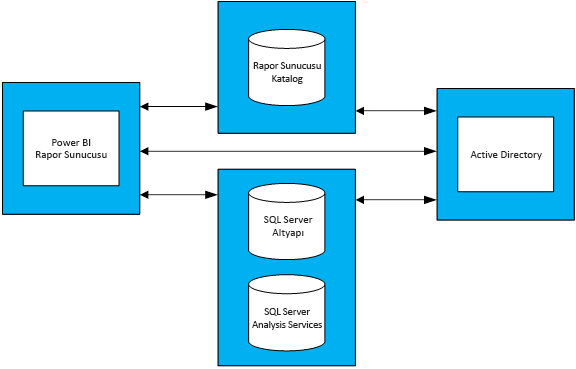

# Power BI Rapor Sunucusu için kapasite planlaması rehberi
Power BI Rapor Sunucusu, müşterilerin şirketi içinde güvenlik duvarlarının arkasında dağıtabileceği bir self servis BI ve kurumsal raporlama çözümüdür. Power BI Desktop'ın etkileşimli rapor işlevleriyle SQL Server Reporting Services'in şirket içi sunucu platformunu birleştirir. Kuruluşlarda analiz ve raporlama kullanımının yoğun ve artan kullanımıyla birlikte, kurumsal kullanıcılar için ölçeklenmesi gereken donanım altyapısının ve yazılım lisanslarının karşılanması zorlaşabilir. Bu makalede, bir rapor sunucusundaki çeşitli iş yüklerine ilişkin çok sayıda yük testi yürütmesinin sonuçları paylaşılarak, Power BI Rapor Sunucusu için kapasite planlamaya yönelik rehberlik sunmak amaçlanmaktadır. Kuruluşların raporları, sorguları ve kullanım desenleri büyük çapta değişiklik göstermekle birlikte; kullanılan testler ve testlerin nasıl yürütüldüğüne ilişkin ayrıntılı bir açıklamayla birlikte bu makalede ortaya konulan sonuçlar, Power BI Rapor Sunucusu dağıtma işleminin ilk aşamalarından olan planlama sürecindeki bir kişi için başvuru noktası oluşturur.

## Yürütmeye ilişkin özet
Power BI Rapor Sunucusu'nda, her biri çeşitli web portalı işlemlerinin gerçekleştirilmesinin yanı sıra farklı türlerde raporların işlenmesini içerecek şekilde, iki farklı türde iş yükü yürüttük. 

* "Power BI Report Heavy" iş yükünde, en sık olarak yürütülen işlem (toplam sürenin %60'ında yürütülen işlem) Power BI raporu işlemeydi.
* "Paginated Report Heavy" iş yükünde ise en sık yürütülen işlem sayfalandırılmış raporlar işlemeydi.

Dört sunuculuk bir Power BI Rapor Sunucusu topolojisinde, herhangi bir anda kullanıcıların en fazla %5'inin rapor sunucusuna erişeceği yönündeki beklentiyle gerçekleştirilen testler sonucunda ortaya çıkan aşağıdaki tabloda, Power BI Rapor Sunucusu'nun en az %99'luk güvenilirlikle hizmet sunabileceği maksimum kullanıcı sayısı gösterilmiştir. 

| İş Yükü | 8 Çekirdek/32 GB RAM | 16 Çekirdek/64 GB RAM |
| --- | --- | --- |
| **Power BI Report Heavy** (>%60) |1.000 kullanıcı |3.000 kullanıcı |
| **Paginated (RDL) Report Heavy** (>%60) |2.000 kullanıcı |3.200 kullanıcı |

Her bir çalıştırmada en yoğun olarak kullanılan kaynak CPU'ydu. Bu nedenle, Power BI Rapor Sunucusu'na yönelik çekirdek sayısının artırılması, bellek veya sabit disk alanının artırılmasına kıyasla sistemin güvenilirliği konusunda daha yüksek bir kazanım elde edilmesini sağlar. 

## Test metodolojisi
Kullanılan test topolojisinde, satıcıya özgü fiziksel donanım yerine Microsoft Azure Sanal Makineler temel alınmıştır. Tüm makineler ABD bölgelerinde barındırılmıştır. Bu, hem şirket içindeki hem de genel buluttaki yaygın donanım sanallaştırma eğilimlerini yansıtır. 

### Power BI Rapor Sunucusu topolojisi
Power BI Rapor Sunucusu dağıtımında aşağıdaki sanal makineler yer almıştır:

* Active Directory Etki Alanı Denetleyicisi: Bu, SQL Server Veritabanı Altyapısı, SQL Server Analysis Services ve Power BI Rapor Sunucusu'nun tüm isteklere yönelik olarak güvenli bir şekilde kimlik doğrulaması gerçekleştirmesi için gereken sanal makinedir.
* SQL Server Veritabanı Altyapısı ve SQL Server Analysis Services: Bu, rapor işleme gerçekleştirirken kullandığımız raporlara ilişkin veritabanlarını depoladığımız yerdir.
* Power BI Rapor Sunucusu
* Power BI Rapor Sunucusu Veritabanı. Rapor sunucusu veritabanı Power BI Rapor Sunucusu yerine farklı bir makinede barırındırılmıştır, bu sayede; bellek, CPU, ağ ve disk kaynaklarını SQL Server Veritabanı Altyapısı ile paylaşması gerekmez.

Topolojide kullanılan her bir sanal makinenin yapılandırmasını ayrıntılı bir şekilde görmek için Ek 1.1 Power BI Rapor Sunucusu Topolojisi ve Ek 1.2 Power BI Sunucusu Sanal Makine Yapılandırması bölümlerine bakın.

### Testler
Yük testi çalıştırmalarında kullanılan testlere, [Reporting Services LoadTest](https://github.com/Microsoft/Reporting-Services-LoadTest) olarak adlandırılan GitHub projesinden ulaşılabilir. Bu araç, kullanıcıların, SQL Server Reporting Services ve Power BI Rapor Sunucusu'na ilişkin performans, güvenilirlik, ölçeklenebilirlik ve kurtarılabilme özelliklerini incelemesine olanak sağlar. Bu proje, dört test çalışması grubundan oluşur:

* Power BI raporu işleme işleminin benzetiminin yapıldığı testler,
* Mobil raporların işlenmesinin benzetiminin yapıldığı testler,
* Sayfalandırılmış küçük ve büyük raporların işlenmesinin benzetiminin yapıldığı testler ve 
* Çeşitli türlerde web portalı işlemlerinin gerçekleştirilmesinin benzetiminin yapıldığı testler. 

Tüm testler, uçtan uca bir işlem (rapor işleme, yeni bir veri kaynağı oluşturma vb.) gerçekleştirmeye yönelik olarak yazılmıştır. Bunu, rapor sunucusuna yönelik bir veya daha fazla web isteğinde bulunarak (API'ler aracılığıyla) gerçekleştirirler. Gerçek dünyada, bir kullanıcının bu uçtan uca işlemleri tamamlaması için birkaç ara işlem gerçekleştirmesi gerekebilir. Örneğin, kullanıcının, bir raporu işlemek için web portalına erişmesi, raporun bulunduğu klasöre gitmesi ve ardından işlemi gerçekleştirmek üzere rapora tıklaması gerekir. Testler uçtan uca bir görevi tamamlamak için gereken tüm işlemleri gerçekleştirmese de Power BI Rapor Sunucusu’nun deneyimleyeceği yükü büyük oranda yansıtmaktadır. GitHub projesini inceleyerek, kullanılan farklı rapor türlerinin yanı sıra gerçekleştirilen çeşitli işlemler hakkında daha fazla bilgi edinebilirsiniz.

### İş Yükleri
Testte kullanılan 2 iş yükü profili vardır: Power BI Report Heavy ve Paginated Report Heavy. Aşağıdaki tabloda, Rapor Sunucusu'na yönelik olarak yürütülen dağıtım istekleri açıklanmıştır.

| Etkinlik | Power BI Report Heavy, Gerçekleşme sıklığı | Paginated Report Heavy, Gerçekleşme sıklığı |
| --- | --- | --- |
| **Power BI raporu işleme** |%60 |%10 |
| **Sayfalandırılmış (RDL) rapor işleme** |%30 |%60 |
| **Mobil rapor işleme** |%5 |%20 |
| **Web portalı işlemleri** |%5 |%10 |

### Kullanıcı yükü
Her bir test çalıştırması sırasında testler, iki iş yükünden birinde belirtilen sıklığa göre yürütülmüştür. Testler, rapor sunucusuna 20 eş zamanlı kullanıcı isteğinin yönlendirilmesiyle başladı. Ardından, kullanıcı yükü, güvenilirlik %99 hedefinin altına düşene kadar kademeli olarak artırıldı.

## Sonuçlar
### Eş zamanlı kullanıcı kapasitesi
Daha önce de belirtildiği gibi testler, 20 eş zamanlı kullanıcının rapor sunucusuna istek göndermesiyle başladı. Ardından, eş zamanlı kullanıcı sayısı, tüm isteklerin %1'inin başarısız olduğu bir durum elde edilene kadar kademeli olarak artırıldı. Aşağıdaki tabloda bulunan sonuçlar, tavan yükte sunucunun %1'in altında bir hata oranıyla işleyebileceği eş zamanlı kullanıcı isteği sayısını göstermektedir.

| İş Yükü | 8 Çekirdek/32 GB | 16 Çekirdek/64 GB |
| --- | --- | --- |
| **Power BI Report Heavy** |50 eş zamanlı kullanıcı |150 eş zamanlı kullanıcı |
| **Paginated Report Heavy** |100 eş zamanlı kullanıcı |160 eş zamanlı kullanıcı |

### Toplam kullanıcı kapasitesi
Microsoft'ta, birkaç ekip tarafından kullanılan bir Power BI Rapor Sunucusu üretim dağıtımına sahibiz. Bu ortamın gerçek kullanımını analiz ettiğimizde, herhangi bir zamandaki (tavan yük sırasındaki de dahil) eş zamanlı kullanıcı sayısının kullanıcı tabanı genelinin %5'ini geçmeme eğilimi gösterdiğini gözlemliyoruz. Bu %5'lik eş zamanlılık oranını karşılaştırma yapmak için kullanarak, Power BI Rapor Sunucusu'nun %99'luk güvenilirlik oranıyla hizmet sunabileceği toplam kullanıcı tabanına ulaştık.

| İş Yükü | 8 Çekirdek/32 GB | 16 Çekirdek/64 GB |
| --- | --- | --- |
| **Power BI Report Heavy** |1.000 kullanıcı |3.000 kullanıcı |
| **Paginated Report Heavy** |2.000 kullanıcı |3.200 kullanıcı |

### Sonuçları görüntüleme
Yük testi sonuçlarını görüntülemek için bir rapor seçin.

| İş Yükü | 8 Çekirdek/32 GB | 16 Çekirdek/64 GB |
| --- | --- | --- |
| **Power BI Report Heavy** |[Görüntüle - 8 çekirdek](https://msit.powerbi.com/view?r=eyJrIjoiMDhhNGY4NGQtNGRhYy00Yzk4LTk2MzAtYzFlNWI5NjBkMGFiIiwidCI6IjcyZjk4OGJmLTg2ZjEtNDFhZi05MWFiLTJkN2NkMDExZGI0NyIsImMiOjV9) |[Görüntüle - 16 çekirdek](https://msit.powerbi.com/view?r=eyJrIjoiNDBiODk1OGUtYTAyOC00MzVhLThmZmYtNzVjNTFjNzMwYzkwIiwidCI6IjcyZjk4OGJmLTg2ZjEtNDFhZi05MWFiLTJkN2NkMDExZGI0NyIsImMiOjV9) |
| **Paginated Report Heavy** |[Görüntüle - 8 çekirdek](https://msit.powerbi.com/view?r=eyJrIjoiNDFiZWYzMTktZGIxNS00MzcwLThjODQtMmJkMGRiZWEzNjhlIiwidCI6IjcyZjk4OGJmLTg2ZjEtNDFhZi05MWFiLTJkN2NkMDExZGI0NyIsImMiOjV9) |[Görüntüle - 16 çekirdek](https://msit.powerbi.com/view?r=eyJrIjoiOTU0YjJkYTgtNDg4Yy00NzlhLWIwMGYtMzg4YWI2MjNmOTZjIiwidCI6IjcyZjk4OGJmLTg2ZjEtNDFhZi05MWFiLTJkN2NkMDExZGI0NyIsImMiOjV9) |

<iframe width="640" height="360" src="https://msit.powerbi.com/view?r=eyJrIjoiMDhhNGY4NGQtNGRhYy00Yzk4LTk2MzAtYzFlNWI5NjBkMGFiIiwidCI6IjcyZjk4OGJmLTg2ZjEtNDFhZi05MWFiLTJkN2NkMDExZGI0NyIsImMiOjV9" frameborder="0" allowFullScreen="true"></iframe>

<iframe width="640" height="360" src="https://msit.powerbi.com/view?r=eyJrIjoiNDBiODk1OGUtYTAyOC00MzVhLThmZmYtNzVjNTFjNzMwYzkwIiwidCI6IjcyZjk4OGJmLTg2ZjEtNDFhZi05MWFiLTJkN2NkMDExZGI0NyIsImMiOjV9" frameborder="0" allowFullScreen="true"></iframe>

<iframe width="640" height="360" src="https://msit.powerbi.com/view?r=eyJrIjoiNDFiZWYzMTktZGIxNS00MzcwLThjODQtMmJkMGRiZWEzNjhlIiwidCI6IjcyZjk4OGJmLTg2ZjEtNDFhZi05MWFiLTJkN2NkMDExZGI0NyIsImMiOjV9" frameborder="0" allowFullScreen="true"></iframe>

<iframe width="640" height="360" src="https://msit.powerbi.com/view?r=eyJrIjoiOTU0YjJkYTgtNDg4Yy00NzlhLWIwMGYtMzg4YWI2MjNmOTZjIiwidCI6IjcyZjk4OGJmLTg2ZjEtNDFhZi05MWFiLTJkN2NkMDExZGI0NyIsImMiOjV9" frameborder="0" allowFullScreen="true"></iframe>

## Özet
Her bir yük testi çalıştırması için, Power BI Rapor Sunucusu makinesindeki tavan yük sırasında en yoğun olarak kullanılan kaynak CPU'ydu. Bu nedenle, sayısının artırılması gereken ilk kaynak çekirdektir. Alternatif olarak, topolojinize Power BI Rapor Sunucusu'nun barındırıldığı daha fazla sunucu ekleyerek ölçeği genişletmeyi de deneyebilirsiniz.

Bu makalede ortaya konulan sonuçlar, belirli veriler kullanılarak özel bir rapor kümesinin belirli bir tekrar deseniyle yürütülmesi sonucunda elde edilmiştir. Kullanışlı bir başvuru noktası olan bu sonuçlardan yararlanırken, sizin kullanımınızın, raporlarınıza, sorgularınıza, kullanım desenlerinize ve Power BI Rapor Sunucusu dağıtımınıza göre şekilleneceğini göz önünde bulundurun.

## Ek
### 1 Topoloji
**1.1 Power BI Rapor Sunucusu Topolojisi**

Yalnızca farklı yapılandırmalarda görülen Power BI Rapor Sunucusu davranışına odaklanmak üzere, her bir makineye yönelik VM yapılandırması (Power BI Rapor Sunucusu'nun barındırıldığı makine dışında) aynı tutulmuştur. Her makine, Premium Depolama Diskleri içeren ikinci nesil (v2) D Serisi makineler temel alınarak hazırlanmıştır. https://azure.microsoft.com/pricing/details/virtual-machines/windows/ sayfasındaki "Genel Amaçlı" bölümünde, her bir VM boyutu ile ilgili ayrıntılı bilgilere ulaşabilirsiniz.

| Sanal Makine Türü | İşlemci | Bellek | Azure VM Boyutu |
| --- | --- | --- | --- |
| **Active Directory Etki Alanı Denetleyicisi** |2 Çekirdek |7 GB |Standard_DS2_v2 |
| **SQL Server Veritabanı Altyapısı ve Analysis Services** |16 Çekirdek |56 GB |Standard_DS5_v2 |
| **Rapor Sunucusu Veritabanı** |16 Çekirdek |56 GB |Standard_DS5_v2 |

**1.2 Power BI Rapor Sunucusu Sanal Makine Yapılandırması** 

Power BI Rapor Sunucusu'nun barındırıldığı Sanal Makine için farklı işlemci ve bellek yapılandırmaları kullanılmıştır. Diğer VM'lerden farklı olarak, bu makine, Premium Depolama Diskleri içeren üçüncü nesil (v3) D Serisi Makineler temel alınarak hazırlanmıştır. https://azure.microsoft.com/pricing/details/virtual-machines/windows/ sayfasındaki "Genel Amaçlı" bölümünde, bu VM boyutu ile ilgili ayrıntılı bilgilere ulaşabilirsiniz.

| Sanal Makine | İşlemci | Bellek | Azure VM Boyutu |
| --- | --- | --- | --- |
| **Power BI Rapor Sunucusu (Küçük)** |8 Çekirdek |32 GB |Standard_D8S_v3 |
| **Power BI Rapor Sunucusu (Büyük)** |16 Çekirdek |64 GB |vStandard_D16S_v3 |

### 2 LoadTest aracını çalıştırma
Reporting Services LoadTest aracını Power BI Rapor Sunucusu'na ilişkin Microsoft Azure dağıtımınızda çalıştırmak için aşağıdaki adımları uygulayın.

1. GitHub'daki (https://github.com/Microsoft/Reporting-Services-LoadTest)) Reporting Services LoadTest projesini kopyalayın.
2. Proje dizininde, RSLoadTests.sln adlı bir çözüm dosyası bulunur. Bu dosyayı Visual Studio 2015 veya sonraki bir sürümünde açın.
3. Bu aracı Power BI Rapor Sunucusu dağıtımınızda mı yoksa Microsoft Azure'daki bir Power BI Rapor Sunucusu dağıtımında mı çalıştırmak istediğinize karar verin. Aracı kendi dağıtımınızda çalıştırmak istiyorsanız 5. adıma gidin.
4. Azure'da bir Power BI Rapor Sunucusu ortamı oluşturmak için https://github.com/Microsoft/Reporting-Services-LoadTest#create-a-sql-server-reporting-services-load-environment-in-azure bölümünde listelenen yönergeleri izleyin.
5. Ortamı dağıtma işlemini tamamladıktan sonra, testleri çalıştırmak üzere https://github.com/Microsoft/Reporting-Services-LoadTest#load-test-execution sayfasında listelenen yönergeleri uygulayın.

Başka bir sorunuz mu var? [Power BI Topluluğu'na sorun](https://community.powerbi.com/)

