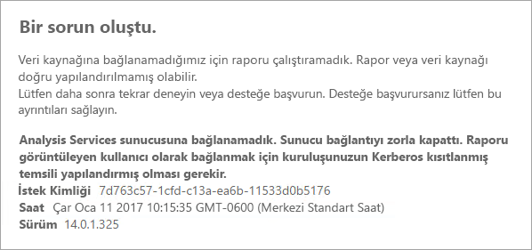
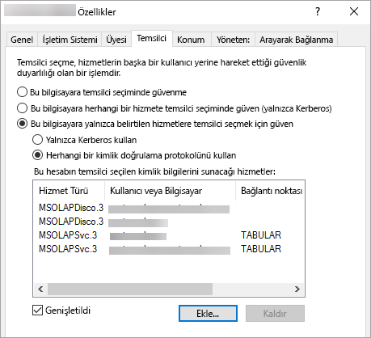

# <a name="configure-kerberos-to-use-power-bi-reports"></a>Power BI raporlarını kullanmak için Kerberos'u yapılandırma
<iframe width="640" height="360" src="https://www.youtube.com/embed/vCH8Fa3OpQ0?showinfo=0" frameborder="0" allowfullscreen></iframe>

Dağıtılmış bir ortam için rapor sunucunuzu, Power BI raporlarında kullanılan veri kaynaklarında Kerberos kimlik doğrulaması gerçekleştirecek şekilde yapılandırmayı öğrenin.

Power BI Rapor Sunucusu, Power BI raporlarını barındırma özelliğine sahiptir. Rapor sunucunuz birçok farklı veri kaynağını desteklemektedir. Bu makalede SQL Server Analysis Services'e odaklanılmış olsa da burada ele alınan kavramları kullanarak SQL Server gibi diğer veri kaynaklarında uygulayabilirsiniz.

Power BI Rapor Sunucusu, SQL Server ve Analysis Services sunucularını tek bir makineye yükleyebilirsiniz. Ek yapılandırma gerçekleştirmenize gerek kalmadan her şey düzgün bir şekilde çalıştığını görürsünüz. Bu harika bir test ortamıdır. Bu hizmetlerin ayrı makinelerde yüklü olması halinde (dağıtılmış ortam olarak adlandırılır) hatalarla karşılaşabilirsiniz. Bu ortamda Kerberos kimlik doğrulamasını kullanmanız gerekir. Bunu uygulamak için belirli bir yapılandırma yoktur. 

Kısıtlanmış temsil yapılandırması gerçekleştirmeniz gerekir. Kerberos, ortamınızda yapılandırılmış ancak kısıtlanmış temsil için yapılandırılmamış olabilir.

## <a name="error-running-report"></a>Rapor çalıştırırken oluşan hata
Rapor sunucunuz doğru şekilde yapılandırılmamışsa aşağıdaki hatayla karşılaşabilirsiniz.

    Something went wrong.

    We couldn’t run the report because we couldn’t connect to its data source. The report or data source might not be configured correctly. 

Teknik ayrıntılar bölümünde aşağıdaki iletiyi görürsünüz.

    We couldn’t connect to the Analysis Services server. The server forcibly closed the connection. To connect as the user viewing the report, your organization must have configured Kerberos constrained delegation.



## <a name="configuring-kerberos-constrained-delegation"></a>Kerberos kısıtlanmış temsil yapılandırmasını gerçekleştirme
Kerberos kısıtlanmış temsil yapılandırmasının çalışması için yapılandırılması gereken birden fazla ayar vardır. Hizmet hesaplarındaki Hizmet Asıl Adları (SPN) ve temsilci ayarları bunlara dahildir.

> [!NOTE]
> SPN'leri ve temsilci ayarlarını yapılandırmak için bir etki alanı yöneticisi olmanız gerekir.
> 
> 

Aşağıdakileri yapılandırmanız veya doğrulamanız gerekir.

1. Rapor Sunucusu yapılandırmasındaki kimlik doğrulaması türü.
2. Rapor sunucusu hizmet hesabına ilişkin SPN'ler.
3. Analysis Services hizmetine ilişkin SPN'ler.
4. Analysis Services makinesi üzerindeki SQL Browser hizmetine ilişkin SPN'ler. Bu yalnızca adlandırılmış örnekler için geçerlidir.
5. Rapor sunucusu hizmet hesabındaki temsilci ayarları.

## <a name="authentication-type-within-report-server-configuration"></a>Rapor Sunucusu yapılandırmasındaki kimlik doğrulaması türü
Rapor sunucusu kimlik doğrulaması türünü, Kerberos kısıtlanmış temsil yapılandırmasına izin verecek şekilde yapılandırmanız gerekir. Bunun için **rsreportserver.config** dosyasını kullanabilirsiniz. Bu dosyanın varsayılan konumu: `C:\Program Files\Microsoft Power BI Report Server\PBIRS\ReportServer`.

rsreportserver.config dosyasında **Authentication/AuthenticationTypes** bölümünü bulun.

RSWindowsNegotiate öğesinin mevcut olduğundan ve kimlik doğrulaması türleri arasında ilk sırada olduğundan emin olun. Liste aşağıdakine benzer olmalıdır.

```
<AuthenticationTypes>
    <RSWindowsNegotiate/>
    <RSWindowsNTLM/>
</AuthenticationTypes>
```

Yapılandırma dosyasını değiştirmeniz gerekirse değişikliklerin geçerli olması için rapor sunucusunu durdurup tekrar başlatmanız gerekir.

Daha fazla bilgi için bkz. [Rapor Sunucusu'nda Windows Kimlik Doğrulamasını yapılandırma](https://docs.microsoft.com/sql/reporting-services/security/configure-windows-authentication-on-the-report-server).

## <a name="spns-for-the-report-server-service-account"></a>Rapor sunucusu hizmet hesabına ilişkin SPN'ler
Daha sonra, rapor sunucusunda geçerli SPN'ler bulunduğundan emin olmanız gerekir. Bu, rapor sunucusu için yapılandırılmış olan hizmet hesabını temel alır.

### <a name="virtual-service-account-or-network-service"></a>Sanal Hizmet Hesabı veya Ağ Hizmeti
Rapor sunucunuz Sanal Hizmet Hesabı veya Ağ Hizmeti için yapılandırılmışsa herhangi bir işlem yapmanız gerekmez. Bunlar makine hesabı bağlamındadır. Makine hesabında varsayılan olarak HOST SPN'leri bulunur. Bunlar HTTP hizmetini kapsar ve rapor sunucusu tarafından kullanılır.

Makine hesabıyla aynı olmayan bir sanal sunucu adı kullanıyorsanız HOST girişleri sizi kapsamaz ve sanal sunucu ana bilgisayar adı için SPN'leri el ile eklemeniz gerekir.

### <a name="domain-user-account"></a>Etki alanı kullanıcı hesabı
Rapor sunucunuz bir etki alanı kullanıcı hesabını kullanacak şekilde yapılandırılmışsa HTTP SPN'lerini ilgili hesapta el ile oluşturmanız gerekir. Bu işlemi Windows ile birlikte gelen setspn aracını kullanarak gerçekleştirebilirsiniz.

> [!NOTE]
> SPN oluşturmak için etki alanı yöneticisi haklarına sahip olmanız gerekir.
> 
> 

İki SPN oluşturmanız önerilir. Birinde NetBIOS adını, diğerinde de tam etki alanı adını (FQDN) kullanabilirsiniz. SPN aşağıdaki biçimde olacaktır.

    <Service>/<Host>:<port>

Power BI Rapor Sunucusu HTTP Hizmeti kullanır. HTTP SPN'leri için bağlantı noktası belirtmeniz gerekmez. Burada ilgilendiğimiz hizmet HTTP'dir. SPN ana bilgisayarı URL'de kullandığınız ad olacaktır. Bu genellikle makine adıdır. Bir yük dengeleyicinin arkasındaysanız sanal makine adı da olabilir.

> [!NOTE]
> URL'yi doğrulamak için tarayıcının adres çubuğuna girdiğiniz adrese veya Rapor Sunucusu Yapılandırma Yöneticisi'nin Web Portal URL (Web Portalı URL'si) sekmesine bakabilirsiniz.
> 
> 

Makinenizin adı ContosoRS ise SPN'leriniz aşağıdaki şekilde olur.

| SPN Türü | SPN |
| --- | --- |
| Tam Etki Alanı Adı (FQDN) |HTTP/ContosoRS.contoso.com |
| NetBIOS |HTTP/ContosoRS |

### <a name="location-of-spn"></a>SPN konumu
SPN'yi nereye yerleştirmeniz gerekir? SPN, hizmet hesabınız için kullandığınız yere yerleştirilir. Sanal Hizmet Hesabı veya Ağ Hizmeti kullanıyorsanız bu yer makine hesabı olacaktır. Daha önce de belirttiğimiz üzere bu işlemi yalnızca sanal URL için gerçekleştirmeniz gerekir. Rapor sunucusu hizmet hesabı için bir etki alanı kullanıcı hesabı kullanıyorsanız SPN'yi ilgili etki alanı kullanıcı hesabına yerleştirmeniz gerekir.

Örneğin, Ağ Hizmeti hesabını kullanıyorsanız ve makinenizin adı ContosoRS ise SPN'yi ContosoRS üzerine yerleştirmeniz gerekir.

RSService üzerinde bulunan bir etki alanı kullanıcı hesabını kullanıyorsanız SPN'yi RSService üzerine yerleştirmeniz gerekir.

### <a name="using-setspn-to-add-the-spn"></a>SPN eklemek için SetSPN aracını kullanma
SPN eklemek için SetSPN aracını kullanabilirsiniz. Makine hesabı ve etki alanı kullanıcı hesabı için yine yukarıdaki örnek üzerinden gideceğiz.

Hem FQDN hem de NetBIOS SPN için SPN'yi bir makine hesabına yerleştirdiğinizde contosoreports sanal URL'sini kullanıyormuşsunuz gibi bir sonuç elde edersiniz.

      Setspn -a HTTP/contosoreports.contoso.com ContosoRS
      Setspn -a HTTP/contosoreports ContosoRS

Hem FQDN hem de NetBIOS SPN için SPN'yi bir etki alanı kullanıcı hesabına yerleştirdiğinizde SPN ana bilgisayarının makine adını kullanıyormuşsunuz gibi bir sonuç elde edersiniz.

      Setspn -a HTTP/ContosoRS.contoso.com RSService
      Setspn -a HTTP/ContosoRS RSService

## <a name="spns-for-the-analysis-services-service"></a>Analysis Services hizmetine ilişkin SPN'ler
Analysis Services hizmetine ilişkin SPN'ler, Power BI Rapor Sunucusu ile benzerdir. Adlandırılmış bir örneğiniz varsa SPN biçimi biraz farklı olacaktır.

Analysis Services için MSOLAPSvc.3 Hizmeti kullanmanız gerekir. SPN'deki bağlantı noktasında örnek adını belirtin. SPN'nin ana bilgisayar bölümü makine adı veya Küme sanal adı olacaktır.

Örnek Analysis Services SPN'si aşağıda verilmiştir.

| Tür | Biçim |
| --- | --- |
| Varsayılan örnek |MSOLAPSvc.3/ContosoAS.contoso.com<br>MSOLAPSvc.3/ContosoAS |
| Adlandırılmış örnek |MSOLAPSvc.3/ContosoAS.contoso.com:ÖRNEKADI<br>MSOLAPSvc.3/ContosoAS:ÖRNEKADI |

SPN yerleşimi de Power BI Rapor Sunucusu'ndaki ile benzerdir. Yerleşim için hizmet hesabı temel alınır.  Yerel Sistem veya Ağ Hizmeti kullanıyorsanız makine hesabı bağlamında olursunuz. Analysis Services örneği için bir etki alanı kullanıcı hesabı kullanıyorsanız SPN'yi ilgili etki alanı kullanıcı hesabına yerleştirmeniz gerekir.

### <a name="using-setspn-to-add-the-spn"></a>SPN eklemek için SetSPN aracını kullanma
SPN eklemek için SetSPN aracını kullanabilirsiniz. Bu örnekte makine adı ContosoAS olacaktır.

Hem FQDN hem de NetBIOS SPN için SPN'yi bir makine hesabına yerleştirdiğinizde aşağıdaki gibi bir sonuç elde edersiniz.

    Setspn -a MSOLAPSvc.3/ContosoAS.contoso.com ContosoAS
    Setspn -a MSOLAPSvc.3/ContosoAS ContosoAS

Hem FQDN hem de NetBIOS SPN için SPN'yi bir etki alanı kullanıcı hesabına yerleştirdiğinizde aşağıdaki gibi bir sonuç elde edersiniz.

    Setspn -a MSOLAPSvc.3/ContosoAS.contoso.com OLAPService
    Setspn -a MSOLAPSvc.3/ContosoAS OLAPService

## <a name="spns-for-the-sql-browser-service"></a>SQL Browser hizmetine ilişkin SPN'ler
Analysis Services adlandırılmış örneğiniz varsa Browser hizmeti için de bir SPN'ye sahip olduğunuzdan emin olun. Söz konusu SPN, Analysis Services için benzersizdir.

SQL Browser hizmetine ilişkin SPN'ler için Power BI Rapor Sunucusu'ndakine benzer işlemler gerçekleştireceğiz.

SQL Browser için MSOLAPDisco.3 hizmeti kullanmanız gerekir. SPN'deki bağlantı noktasında örnek adını belirtin. SPN'nin ana bilgisayar bölümü makine adı veya Küme sanal adı olacaktır.
Örnek adı veya bağlantı noktası için herhangi bir değer belirtmeniz gerekmez.

Örnek Analysis Services SPN'si aşağıda verilmiştir.

    MSOLAPDisco.3/ContosoAS.contoso.com
    MSOLAPDisco.3/ContosoAS

SPN yerleşimi de Power BI Rapor Sunucusu'ndaki ile benzerdir. Buradaki fark, SQL Browser hizmetinin her zaman Yerel Sistem hesabında çalışmasıdır. Bu da SPN'lerin her zaman makine hesabına yerleştirileceği anlamına gelir. 

### <a name="using-setspn-to-add-the-spn"></a>SPN eklemek için SetSPN aracını kullanma
SPN eklemek için SetSPN aracını kullanabilirsiniz. Bu örnekte makine adı ContosoAS olacaktır.

Hem FQDN hem de NetBIOS SPN için SPN'yi makine hesabına yerleştirdiğinizde aşağıdaki gibi bir sonuç elde edersiniz.

    Setspn -a MSOLAPDisco.3/ContosoAS.contoso.com ContosoAS
    Setspn -a MSOLAPDisco.3/ContosoAS ContosoAS

Daha fazla bilgi için bkz. [SQL Server Browser hizmeti için bir SPN gereklidir](https://support.microsoft.com/kb/950599).

## <a name="delegation-settings-on-the-report-server-service-account"></a>Rapor sunucusu hizmet hesabındaki temsilci ayarları
Yapılandırmamız gereken son bölüm, rapor sunucusu hizmet hesabındaki temsilci ayarlarıdır. Bu adımları gerçekleştirmek için farklı araçlardan yardım alabilirsiniz. Bu belgede Active Directory Kullanıcıları ve Bilgisayarları'nı kullanacağız.

İlk olarak Active Directory Kullanıcıları ve Bilgisayarları'nda rapor sunucusu hizmet hesabının özelliklerine gitmeniz gerekir. Bu, Sanal Hizmet Hesabı veya Ağ Hizmeti kullanmanız durumunda makine hesabı; diğer durumlarda ise etki alanı kullanıcı hesabı olacaktır.

Protokol geçişi ile kısıtlanmış temsili yapılandıracağız. Kısıtlanmış temsilde, temsilci olarak seçeceğiniz hizmetleri açıkça belirtmeniz gerekir. Hem Analysis Services hizmeti SPN'sini hem de SQL Browser SPN'sini, Power BI Rapor Sunucusu'nun temsilci seçmek için kullanabileceği listeye ekleyeceğiz.

1. Rapor sunucusu hizmet hesabına sağ tıklayıp **Özellikler**'i seçin.
2. **Temsilci Seçme** sekmesini seçin.
3. **Bu bilgisayara yalnızca belirtilen hizmetlere temsilci seçmek için güven**'i seçin.
4. **Herhangi bir kimlik doğrulama protokolünü kullan**'ı seçin.
5. **Bu hesabın temsilci seçilen kimlik bilgilerini sunacağı hizmetler**: bölümünde **Ekle**'yi seçin.
6. Yeni iletişim kutusunda **Kullanıcı/Bilgisayar**'ı seçin.
7. Analysis Services hizmetine ilişkin hizmet hesabını girin ve **Tamam**'ı seçin.
8. Oluşturduğunuz SPN'yi seçin. `MSOLAPSvc.3` ile başlayacaktır. Hem FQDN hem de NetBIOS SPN'lerini eklediyseniz ikisi de seçilir. Yalnızca birini görebilirsiniz.
9. **Tamam**'ı seçin.  SPN'nin listede görünmesi gerekir.
10. İsterseniz **Genişletilmiş**'i seçerek hem FQDN hem de NetBIOS SPN'sini listede görebilirsiniz.
11. **Ekle**'yi tekrar seçin. Şimdi SQL Browser SPN'sini ekleyeceksiniz.
12. Yeni iletişim kutusunda **Kullanıcı/Bilgisayar**'ı seçin.
13. SQL Browser hizmetinin bulunduğu makinenin Makine adını girin ve **Tamam**'ı seçin.
14. Oluşturduğunuz SPN'yi seçin. `MSOLAPDisco.3` ile başlayacaktır. Hem FQDN hem de NetBIOS SPN'lerini eklediyseniz ikisi de seçilir. Yalnızca birini görebilirsiniz.
15. **Tamam**'ı seçin. **Genişletilmiş**'i işaretlediyseniz iletişim kutusu aşağıdakine benzer olacaktır.
    
    
16. **Tamam**'ı seçin.
17. Power BI Rapor Sunucusu'nu yeniden başlatın.

## <a name="running-a-power-bi-report"></a>Power BI raporu çalıştırma
Yukarıdaki yapılandırma tamamlandıktan sonra raporunuzun doğru şekilde görüntülenmesi gerekir. 


Bu yapılandırma Kerberos kullanılan çoğu durumda çalışır ancak ortamınıza bağlı olarak farklı yapılandırmalara ihtiyaç duyulabilir. Rapor yine de yüklenmiyorsa etki alanı yöneticinizle iletişime geçerek daha ayrıntılı bir araştırma yapabilir veya destek ekibine başvurabilirsiniz.

## <a name="next-steps"></a>Sonraki adımlar
[Yönetici el kitabı](admin-handbook-overview.md)  
[Quickstart: Install Power BI Report Server (Hızlı Başlangıç: Power BI Rapor Sunucusu'nu yükleme)](quickstart-install-report-server.md)  

Başka bir sorunuz mu var? [Power BI Topluluğu'na sorun](https://community.powerbi.com/)

