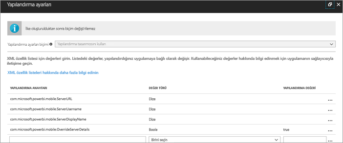
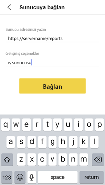
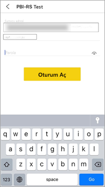

# Uzaktan bir rapora Power BI iOS mobil uygulama erişimini yapılandırma

Bu makalede, kuruluşunuzun MDM aracını kullanarak bir rapor sunucusuna Power BI iOS mobil uygulama erişimini yapılandırma hakkında bilgi edineceksiniz. Bunu ayarlamak için IT yöneticileri, uygulamaya gönderilecek gerekli bilgilerle birlikte bir uygulama yapılandırma ilkesi oluşturur. 

 Daha sonra, rapor sunucusu bağlantısı zaten yapılandırıldığı için Power BI iOS mobil uygulama kullanıcıları kuruluşlarının rapor sunucusuna daha kolay bir şekilde bağlanabilir. 

## MDM aracında uygulama yapılandırma ilkesi oluşturma 

Yönetici olarak, Microsoft Intune’da uygulama yapılandırma ilkesi oluşturmak için aşağıdaki adımları izlemeniz gerekir. Uygulama yapılandırma ilkesi oluşturma adımları ve deneyimi diğer MDM araçlarında farklı olabilir. 

1. MDM aracınızı bağlayın. 
2. Yeni bir uygulama yapılandırma ilkesi oluşturun ve adlandırın. 
3. Bu uygulama yapılandırma ilkesinin dağıtılacağı kullanıcıları seçin. 
4. Anahtar-değer çiftleri oluşturun. 

Aşağıdaki tabloda çiftler açıklanmıştır.

|Anahtar  |Tür  |Açıklama  |
|---------|---------|---------|
| com.microsoft.powerbi.mobile.ServerURL | Dize | Rapor Sunucusu URL'si   Http/https ile başlamalıdır |
| com.microsoft.powerbi.mobile.ServerUsername | Dize | [isteğe bağlı]   Sunucuya bağlanmak için kullanılacak kullanıcı adı.   Bir tane yoksa, uygulama kullanıcıdan bağlantı için kullanıcı adı girmesini ister.| 
| com.microsoft.powerbi.mobile.ServerDisplayName | Dize | [isteğe bağlı]   Varsayılan değer “Rapor sunucusu” şeklindedir   Sunucuyu temsil etmek üzere uygulamada kullanılan kolay ad | 
| com.microsoft.powerbi.mobile.OverrideServerDetails | Boole | True varsayılan değerdir   “True” olarak ayarlanırsa mobil cihazda zaten mevcut olan tüm Rapor Sunucusu tanımlarını geçersiz kılar (zaten yapılandırılmış mevcut sunucular silinir).   Geçersiz Kılma ayarının True olarak belirlenmesi de kullanıcının bu yapılandırmayı kaldırmasını engeller.   “False” olarak ayarlandığında mevcut tüm ayarlar tutulurken gönderilen değerler eklenir.   Mobil uygulamada aynı sunucu URL’si zaten yapılandırılmışsa, uygulama bu yapılandırmayı olduğu gibi bırakır ve kullanıcıdan aynı sunucu için yeniden kimlik doğrulamasını istemez. |

Intune kullanarak yapılandırma ilkesini ayarlama örneği aşağıda verilmiştir.

## Bir rapor sunucusuna bağlanan son kullanıcılar

Uygulama yapılandırma ilkesini yayımladıktan sonra, bu ilke için tanımlanmış dağıtım listesine ait olan kullanıcılar ve cihazlar, Power BI iOS mobil uygulamasını başlattıklarında aşağıdaki deneyimi yaşarlar. 

1. Mobil uygulamalarının bir rapor sunucusu ile yapılandırıldığına dair bir ileti görürler ve **Oturum aç**’a dokunurlar.

    

2.  **Sunucuya bağlan** sayfasında rapor sunucusu ayrıntıları zaten doldurulmuştur. **Bağlan**’a dokunurlar.

    

3. Kimlik doğrulaması için bir parola girip **Oturum aç**’a dokunurlar. 

    

Artık KPI’leri ve rapor sunucusunda depolanmış Power BI raporlarını görüntüleyebilir ve etkileşimde bulunabilirler.

## Sonraki adımlar
[Yönetici genel bakışı](admin-handbook-overview.md)  
[Power BI Rapor Sunucusu'nu yükleme](install-report-server.md)  

Başka bir sorunuz mu var? [Power BI Topluluğu'na sorun](https://community.powerbi.com/)

