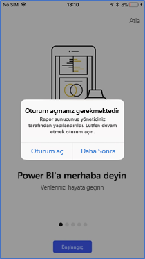

# Power BI mobil uygulamasının Rapor Sunucusu’na erişimini uzaktan yapılandırma

Aşağıdakiler için geçerlidir:

|  |  |
|:--- |:--- |
| iOS |Android |

Bu makalede, kuruluşunuzun MDM aracını kullanarak Rapor Sunucusuna Power BI mobil uygulama erişimini yapılandırma hakkında bilgi edineceksiniz. IT yöneticileri, bunu yapılandırmak için uygulamaya gönderilecek gerekli bilgilerle birlikte bir uygulama yapılandırma ilkesi oluşturur. 

 Rapor Sunucusu bağlantısı zaten yapılandırıldığından Power BI mobil uygulama kullanıcıları kuruluşlarının Rapor Sunucusuna daha kolay bir şekilde bağlanabilir. 

## MDM aracında uygulama yapılandırma ilkesi oluşturma 

Yönetici olarak, Microsoft Intune’da uygulama yapılandırma ilkesi oluşturmak için aşağıdaki adımları izlemeniz gerekir. Uygulama yapılandırma ilkesi oluşturma adımları ve deneyimi diğer MDM araçlarında farklı olabilir. 

1. MDM aracınızı bağlayın. 
2. Yeni bir uygulama yapılandırma ilkesi oluşturun ve adlandırın. 
3. Bu uygulama yapılandırma ilkesinin dağıtılacağı kullanıcıları seçin. 
4. Anahtar-değer çiftleri oluşturun. 

Aşağıdaki tabloda çiftler açıklanmıştır.

|Anahtar  |Tür  |Açıklama  |
|---------|---------|---------|
| com.microsoft.powerbi.mobile.ServerURL | Dize | Rapor Sunucusu URL'si   Http/https ile başlamalıdır |
| com.microsoft.powerbi.mobile.ServerUsername | Dize | [isteğe bağlı]   Sunucuya bağlanmak için kullanılacak kullanıcı adı.   Bir tane yoksa, uygulama kullanıcıdan bağlantı için kullanıcı adı girmesini ister.| 
| com.microsoft.powerbi.mobile.ServerDisplayName | Dize | [isteğe bağlı]   Varsayılan değer “Rapor sunucusu” şeklindedir   Sunucuyu temsil etmek üzere uygulamada kullanılan kolay ad | 
| com.microsoft.powerbi.mobile.OverrideServerDetails | Boole | True varsayılan değerdir  “True” olarak ayarlanırsa mobil cihazda zaten mevcut olan tüm Rapor Sunucusu tanımlarını geçersiz kılar. Önceden yapılandırılmış olan sunucular silinir.   Geçersiz Kılma ayarının True olarak belirlenmesi de kullanıcının bu yapılandırmayı kaldırmasını engeller.   “False” olarak ayarlandığında mevcut tüm ayarlar tutulurken gönderilen değerler eklenir.   Mobil uygulamada aynı sunucu URL’si zaten yapılandırılmışsa, uygulama bu yapılandırmayı olduğu gibi bırakır. Uygulama, kullanıcıdan aynı sunucu için yeniden kimlik doğrulamasını istemez. |

Intune kullanarak yapılandırma ilkesini ayarlama örneği aşağıda verilmiştir.

## Rapor Sunucusuna bağlanan son kullanıcılar

 Uygulama yapılandırma ilkesini bir dağıtım listesi için yayımladığınızı düşünelim. Bu dağıtım listesine ait olan kullanıcılar ve cihazlar, mobil uygulamasını başlattıklarında aşağıdaki deneyimi yaşarlar. 

1. Mobil uygulamalarının Rapor Sunucusu ile yapılandırıldığına dair bir ileti görürler ve **Oturum aç**’a dokunurlar.

    

2.  **Sunucuya bağlan** sayfasında rapor sunucusu ayrıntıları zaten doldurulmuştur. **Bağlan**’a dokunurlar.

    

3. Kimlik doğrulaması için bir parola girip **Oturum aç**’a dokunurlar. 

    

Artık KPI’leri ve Rapor Sunucusunda depolanmış Power BI raporlarını görüntüleyebilir ve etkileşimde bulunabilirler.

## Sonraki adımlar

- [Azure AD Uygulama Ara Sunucusu ile Power BI Mobil’e uzaktan erişimi etkinleştirme](https://docs.microsoft.com/azure/active-directory/manage-apps/application-proxy-integrate-with-power-bi)
- [Yönetici genel bakışı](admin-handbook-overview.md)  
- [Power BI Rapor Sunucusu'nu yükleme](install-report-server.md)  

Başka bir sorunuz mu var? [Power BI Topluluğu'na sorun](https://community.powerbi.com/)

