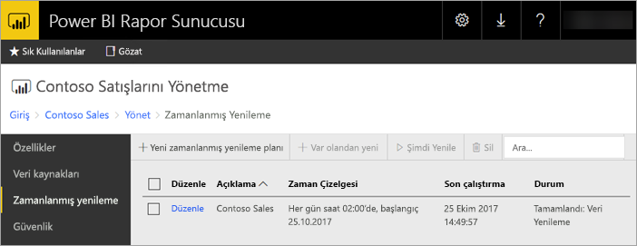
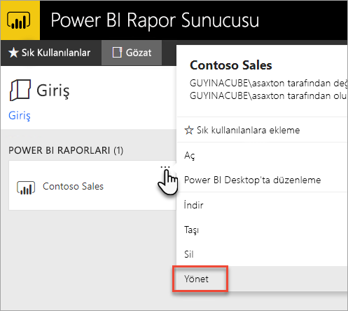
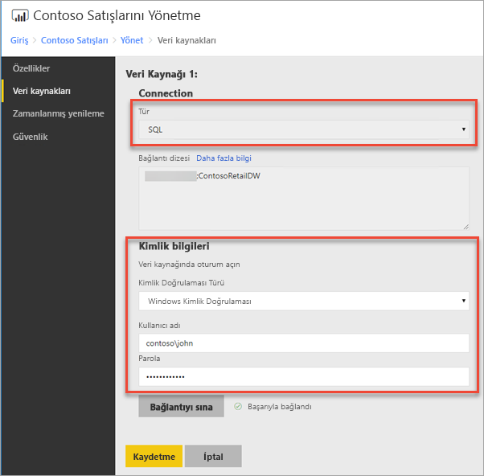
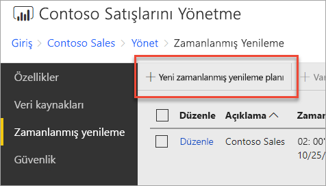
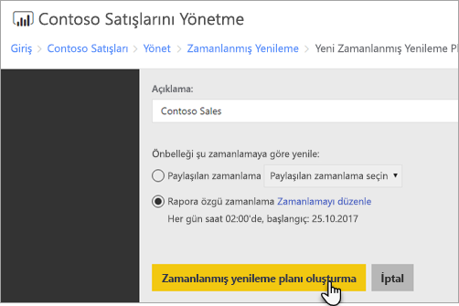
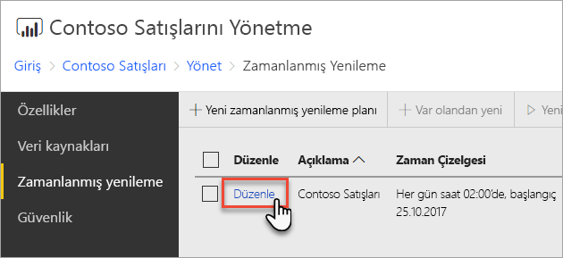
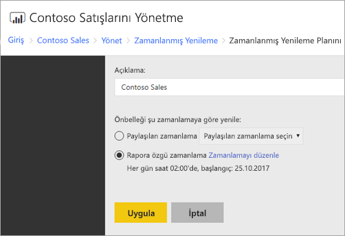

# Power BI raporlarında zamanlanmış yenilemeyi yapılandırma
Power BI raporunuzdaki verilerin yenilenmesi için zamanlanmış yenileme planı oluşturmanız gerekir. Bu işlem Power BI raporunun *Yönet* bölümünden gerçekleştirilir.

## Veri kaynağı kimlik bilgilerini yapılandırma
Zamanlanmış veri yenileme planı oluşturmadan önce Power BI raporunuzda kullanılan **tüm veri kaynaklarının** kimlik bilgilerini ayarlamanız gerekir.

1. Web portalında Power BI raporuna sağ tıklayıp **Yönet**'i seçin.
   
    
2. Soldaki menüde **Veri kaynakları** sekmesini seçin.
3. Görüntülenen her bir veri kaynağı için bağlantı sırasında kullanılacak kimlik doğrulaması türünü belirleyin. Gerekli kimlik bilgilerini girin.
   
    

## Zamanlanmış Yenileme Planı oluşturma
Zamanlanmış yenileme planı oluşturmak için aşağıdaki adımları izleyin.

1. Web portalında Power BI raporuna sağ tıklayıp **Yönet**'i seçin.
   
    
2. Sol taraftaki menüde **Zamanlanmış yenileme** sekmesini seçin.
3. **Zamanlanmış yenileme** sayfasında **Yeni zamanlanmış yenileme planı**'nı seçin.
   
    
4. **Yeni Zamanlanmış Yenileme Planı** sayfasında bir açıklama girin ve veri modelinizin yenilenmesini istediğiniz zamanı ayarlayın.
5. Ardından **Zamanlanmış yenileme planı oluştur**'u seçin.
   
    

## Zamanlanmış Yenileme Planını değiştirme
Zamanlanan yenileme planını değiştirmek, yeni plan oluşturma ile benzerdir.

1. Web portalında Power BI raporuna sağ tıklayıp **Yönet**'i seçin.
   
    
2. Sol taraftaki menüde **Zamanlanmış yenileme** sekmesini seçin.
3. **Zamanlanmış yenileme** sayfasında yönetmek istediğiniz yenileme planının yanındaki **Düzenle** bağlantısını seçin.
   
    
4. **Zamanlanmış Yenileme Planını Düzenle** sayfasında bir açıklama girin ve veri modelinizin yenilenmesini istediğiniz zamanı ayarlayın.
5. Ardından **Uygula**'yı seçin.
   
    

## Zamanlanmış Yenileme Planının durumunu görüntüleme
Zamanlanmış yenileme planının durumunu Web portalında görüntüleyebilirsiniz.

1. Web portalında Power BI raporuna sağ tıklayıp **Yönet**'i seçin.
   
    
2. Sol taraftaki menüde **Zamanlanmış yenileme** sekmesini seçin.
3. **Zamanlanmış yenileme** sayfasında en sağdaki sütunda planın durumu görüntülenir.
   
   | **Durum** | **Açıklama** |
   | --- | --- |
   | Yeni Zamanlanmış Yenileme Planı |Plan oluşturuldu ancak çalıştırılmadı. |
   | Yenileniyor |Yenileme işlemi başlatıldı. |
   | Model Analysis Server'a aktarılıyor |Model rapor sunucusu katalog veritabanından barındırılan Analysis Services örneğine kopyalanıyor. |
   | Veriler yenileniyor |Model içindeki veriler yenileniyor. |
   | Modeldeki kimlik bilgileri kaldırılıyor |Modelden veri kaynağına bağlanmak için kullanılan kimlik bilgileri kaldırıldı. |
   | Model kataloğa kaydediliyor |Veri yenileme işlemi tamamlandı ve yenilenen model rapor sunucusu katalog veritabanına geri kaydediliyor. |
   | Tamamlandı: Veri Yenileme |Yenileme tamamlandı. |
   | Hata: |Yenileme sırasında bir hata oluştu ve görüntülendi. |

Geçerli durumu görmek için web sayfasının yenilenmesi gerekiyor. Durum otomatik olarak değişmez.

## Sonraki adımlar
Zamanlama oluşturma ve değiştirme hakkında daha fazla bilgi edinmek için bkz. [Zamanlama oluşturma, değiştirme ve silme](https://docs.microsoft.com/sql/reporting-services/subscriptions/create-modify-and-delete-schedules).

Zamanlanmış yenilemeyle ilgili sorunları gidermek için bkz. [Power BI Rapor Sunucusu'nda zamanlanmış yenileme ile ilgili sorunları giderme](scheduled-refresh-troubleshoot.md).

Başka bir sorunuz mu var? [Power BI Topluluğu'na sorun](https://community.powerbi.com/)

