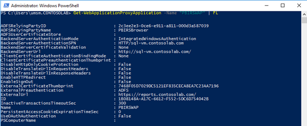

# <a name="use-web-application-proxy-and-active-directory-federated-services---power-bi-report-server"></a>Web Uygulaması Ara Sunucusu’nu ve Active Directory Federasyon Hizmetleri’ni Kullanma - Power BI Rapor Sunucusu

Bu makalede Web Uygulaması Ara Sunucusu’nu (WAP) ve Active Directory Federasyon Hizmetleri’ni (AD FS) kullanarak Power BI Rapor Sunucusu’na ve SQL Server Reporting Services (SSRS) 2016 ve üstüne nasıl bağlanabileceğiniz açıklanır. Bu tümleştirme aracılığıyla, şirket ağından uzak olan kullanıcılar istemci tarayıcılarından Power BI Rapor Sunucusu ve Reporting Services raporlarına erişebilir ve AD FS ön kimlik doğrulamasından yararlanabilir. Power BI mobil uygulamalarında [Power BI Rapor Sunucusu’na ve SSRS’ye bağlanmak için OAuth’ı da yapılandırmanız](../consumer/mobile/mobile-oauth-ssrs.md) gerekir.

## <a name="prerequisites"></a>Önkoşullar

### <a name="domain-name-services-dns-configuration"></a>Etki Alanı Hizmetleri (DNS) yapılandırması

- Kullanıcının bağlanacağı genel URL’yi belirleyin. Şu örneğe benzer olabilir: `https://reports.contosolab.com`.
- Web Uygulama Ara Sunucusu’nun (WAP) genel IP adresine işaret edecek şekilde DNS kaydınızı örneğin `reports.contosolab.com` konak adı için yapılandırın.
- AD FS sunucunuz için bir genel DNS kaydı yapılandırın. Örneğin, AD FS sunucusunu şu URL ile yapılandırmış olabilirsiniz: `https://adfs.contosolab.com`.
- Web Uygulama Ara Sunucusu’nun (WAP) genel IP adresine (örneğin `adfs.contosolab.com`) işaret edecek şekilde DNS kaydınızı yapılandırın. WAP uygulamasının bir parçası olarak yayımlanır.

### <a name="certificates"></a>Sertifikalar

Hem WAP uygulaması hem de AD FS sunucusu için sertifikalar yapılandırmanız gerekir. Her iki sertifika da makineleriniz tarafından tanınan geçerli bir sertifikanın parçası olmalıdır.

## <a name="1-configure-the-report-server"></a>1. Rapor sunucusunu yapılandırma

Geçerli bir Hizmet Asıl Adımız (SPN) olduğundan emin olmalıyız. Geçerli SPN, düzgün bir Kerberos kimlik doğrulamasının yapılmasını ve rapor sunucusunun kimlik doğrulamasında anlaşmasını sağlar.

### <a name="service-principal-name-spn"></a>Hizmet Asıl Adı (SPN)

SPN, Kerberos kimlik doğrulaması kullanan bir hizmet için benzersiz bir tanımlayıcıdır. Rapor sunucunuz için doğru bir HTTP SPN'sine sahip olduğunuzdan emin olun.

Rapor sunucunuz için doğru Hizmet Asıl Adı'nı (SPN) yapılandırma hakkında bilgi almak isterseniz bkz. [Register a Service Principal Name (SPN) for a Report Server (Rapor Sunucusu için bir Hizmet Asıl Adı (SPN) kaydı yapma)](/sql/reporting-services/report-server/register-a-service-principal-name-spn-for-a-report-server).

### <a name="enabling-negotiate-authentication"></a>Anlaşma kimlik doğrulamasını etkinleştirme

Kerberos kimlik doğrulamasını kullanmak üzere bir rapor sunucusunu etkinleştirmek için rapor sunucusunun Kimlik Doğrulaması Türü'nü RSWindowsNegotiate olacak şekilde yapılandırmanız gerekir. Bunu rsreportserver.config dosyasında yapılandırırsınız.

```
<AuthenticationTypes>

    <RSWindowsNegotiate />

    <RSWindowsNTLM />

</AuthenticationTypes>
```

Daha fazla bilgi için bkz. [Modify a Reporting Services Configuration File (Bir Reporting Services Yapılandırma Dosyasını değiştirme)](/sql/reporting-services/report-server/modify-a-reporting-services-configuration-file-rsreportserver-config) ve [Configure Windows Authentication on a Report Server (Bir Rapor Sunucusunda Windows Kimlik Doğrulamasını yapılandırma)](/sql/reporting-services/security/configure-windows-authentication-on-the-report-server).

## <a name="2-configure-active-directory-federation-services-ad-fs"></a>2. Active Directory Federasyon Hizmetleri'ni (ADFS) yapılandırma

AD FS'yi ortamınızdaki bir Windows 2016 sunucusunda yapılandırmanız gerekir. Bu yapılandırma, Sunucu Yöneticisi aracılığıyla ve Yönet bölümündeki Rol ve Özellik Ekle seçeneği belirlenerek gerçekleştirilebilir. Daha fazla bilgi için bkz. [Active Directory Federasyon Hizmetleri](/windows-server/identity/active-directory-federation-services).

AD FS sunucusunda AD FS Yönetim Uygulaması’nı kullanarak bu adımları tamamlayın.

1. **Bağlı Taraf Güvenleri** > **Bağlı Taraf Güveni Ekle**’ye sağ tıklayın.

    

2. **Bağlı Taraf Güveni Ekle** sihirbazının adımlarını izleyin.

    Kimlik doğrulama mekanizması olarak Windows Tümleşik güvenliğini kullanmak için **Beyan kullanmayan** seçeneğini belirtin.

    

    **Görünen Ad Belirtin** alanına tercih ettiğiniz bir ad girin ve **İleri**’yi seçin.
    Bağlı taraf güveni kimliği ekleyin: `<ADFS\_URL>/adfs/services/trust`

    Örnek: `https://adfs.contosolab.com/adfs/services/trust`

    

    Kuruluşunuzun gereksinimlerine uyan **Erişim Denetimi İlkesi**'ni ve sonra da **İleri**’yi seçin.

    
    
    **İleri**’yi seçin ve ardından **Son**’u seçerek **Bağlı Taraf Güveni Ekle** sihirbazını tamamlayın.

    Sihirbaz tamamlandığında Bağlı Taraf Güvenlerinin özellikleri aşağıdaki gibi görünmelidir.

    

## <a name="3-configure-web-application-proxy-wap"></a>3. Web Uygulaması Ara Sunucusu’nu (WAP) yapılandırma

Ortamınızdaki bir sunucuda Web Uygulaması Ara Sunucusu (Rol) Windows Rolünü etkinleştirmeniz gerekir. Bir Windows 2016 sunucusu üzerinde olmalıdır. Daha fazla bilgi için bkz. [Web Application Proxy in Windows Server 2016 (Windows Server 2016'daki Web Uygulaması Ara Sunucusu)](/windows-server/remote/remote-access/web-application-proxy/web-application-proxy-windows-server) ve [Publishing Applications using AD FS Preauthentication (AD FS Ön Kimlik Doğrulaması ile Uygulama Yayımlama)](/windows-server/remote/remote-access/web-application-proxy/Publishing-Applications-using-AD-FS-Preauthentication).

### <a name="configure-constrained-delegation"></a>Kısıtlanmış temsilciyi yapılandırma

Forms kimlik doğrulamasından Windows kimlik doğrulamasına geçmek için protokol geçişi ile kısıtlanmış temsil kullanmamız gerekir. Bu adım Kerberos yapılandırmasının bir parçasıdır. Rapor sunucusu yapılandırmasının içinde rapor sunucusu SPN’sini zaten tanımlamıştık.

Active Directory'deki WAP Sunucusu makine hesabında kısıtlanmış temsil yapılandırması gerçekleştirmemiz gerekir. Active Directory'ye yönelik haklara sahip değilseniz bir etki alanı yöneticisiyle birlikte çalışmanız gerekebilir.

Kısıtlanmış temsilciyi yapılandırmak için şu adımları izleyin.

1. Active Directory araçlarının yüklü olduğu bir makinede **Active Directory Kullanıcıları ve Bilgisayarları**'nı başlatın.
2. WAP sunucunuzun makine hesabını bulun. Varsayılan olarak **Bilgisayarlar** kapsayıcısında yer alacaktır.
3. WAP sunucusuna sağ tıklayıp **Özellikler** seçeneğine gidin.
4. **Temsilci** sekmesinde **Bu bilgisayara yalnızca belirtilen hizmetlere temsilci seçmek için güven**’i ve ardından **Herhangi bir kimlik doğrulama protokolünü kullan**’ı seçin.

    

1. Bu seçenek bu WAP Sunucusu makine hesabı için kısıtlanmış temsili ayarlar. Ardından, bu makinenin temsilci olarak seçebileceği hizmetleri belirtmemiz gerekir.
2. Hizmetler kutusunun altında **Ekle**’yi seçin.

    

1. **Kullanıcılar veya Bilgisayarlar**’ı seçin.
2. Rapor sunucusu için kullandığınız hizmet hesabını girin. Bu hesap, önceki [rapor sunucusu yapılandırması](#1-configure-the-report-server) bölümünde HTTP SPN’si eklemek için kullandığınız hesaptır. 

3. Rapor sunucusu için HTTP SPN’si seçin ve ardından **Tamam**’ı seçin.

    > [!NOTE]
    > Yalnızca NetBIOS SPN'sini görebilirsiniz. Aslında her ikisi de varsa hem NetBIOS hem de FQDN SPN'si seçilir.

1. **Genişletilmiş** onay kutusunu seçtiğinizde sonuç aşağıdaki örneğe benzer olmalıdır.

    

### <a name="add-wap-application"></a>WAP Uygulaması ekleme

1. Web Uygulaması Ara Sunucusu’nda **Uzaktan Erişim Yönetimi** konsolunu açın ve Gezinti bölmesinde **Web Uygulaması Ara Sunucusu**’nu seçin. 

2. **Görevler** bölmesinde **Yayımla**’yı seçin.

2. Hoş Geldiniz sayfasında **İleri**’yi seçin.

    

3. **Ön Kimlik Doğrulaması** sayfasında **Active Directory Federasyon Hizmetleri (AD FS)** öğesini ve sonra da **İleri**’yi seçin.

    

4. Rapor sunucusuna yalnızca Tarayıcı erişimi ayarlayacağımız ve mobil uygulama erişimi ayarlamayacağımız için, **Web ve MSOFBA** ön kimlik doğrulamasını seçin.

    

5. Aşağıda gösterildiği gibi AD FS sunucusunda oluşturduğumuz **Bağlı Olan Taraf**’ı ekleyin ve **İleri**’yi seçin.

    

6. **Dış URL** bölümüne WAP sunucusunda yapılandırılmış, genel olarak erişilebilen URL’yi ekleyin. **Arka Uç Sunucu URL’si** bölümüne aşağıda gösterildiği gibi rapor sunucusuyla (Rapor Sunucusu Yapılandırma Yöneticisi) yapılandırılmış URL’yi ekleyin. Rapor sunucusunun SPN’sini **Arka uç sunucu SPN’si** bölümüne ekleyin.

    

7. **İleri**’yi ve **Yayımla**’yı seçin.
8. Aşağıdaki PowerShell komutunu çalıştırarak WAP yapılandırmasını doğrulayın.

    ```
    Get-WebApplicationProxyApplication "PBIRSBrowser" | FL
    ```

    

## <a name="connect-to-the-report-server-through-the-browser"></a>Tarayıcı üzerinden rapor sunucusuna bağlanma

Bundan sonra tarayıcıdan Genel WAP URL’sine, örneğin web hizmeti için `https://reports.contosolab.com/ReportServer` ve web portalı için `https://reports.contosolab.com/Reports` bağlantısına erişebilirsiniz. Kimliğiniz başarıyla doğrulandıktan sonra raporları görüntüleyebilirsiniz.


## <a name="next-steps"></a>Sonraki adımlar

* [Power BI Rapor Sunucusu’na ve SSRS’ye bağlanmak için OAuth’ı yapılandırma](../consumer/mobile/mobile-oauth-ssrs.md)
*[Power BI Rapor Sunucusu nedir?](get-started.md)  

Başka bir sorunuz mu var? [Power BI Topluluğu'na sorun](https://community.powerbi.com/)