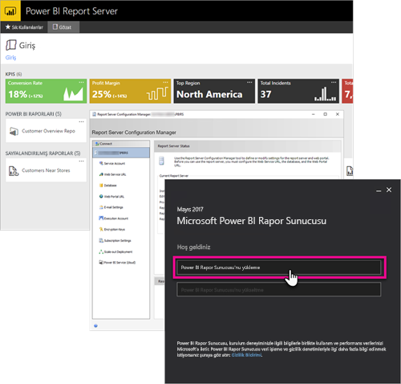

# Power BI Rapor Sunucusu'na yönelik geliştirici el kitabına genel bakış

Power BI, mobil ve sayfalandırılmış raporlarınızı depolayabileceğiniz ve yönetebileceğiniz bir şirket içi konum olan Power BI Rapor Sunucusu'na yönelik geliştirici el kitabına hoş geldiniz.

Bu el kitabında bir geliştirici olarak Power BI Rapor Sunucusu üzerinde çalışırken sahip olduğunuz seçenekler vurgulanır.

## Ekleme

Power BI Rapor Sunucusu'ndaki tüm raporları URL'ye sorgu dizesi parametresini `?rs:Embed=true` ekleyerek bir iFrame içine ekleyebilirsiniz. Bu teknik Power BI raporlarının yanı sıra diğer rapor türleriyle de kullanılabilir.

### Rapor Görüntüleyicisi Denetimi

Sayfalandırılmış raporlarda Rapor Görüntüleyicisi Denetimi özelliğinden faydalanabilirsiniz. Bu özellikle, denetimi bir .NET Windows veya Web uygulamasına yerleştirebilirsiniz. Daha fazla bilgi için bkz. [Rapor Görüntüleyicisi Denetimi ile çalışmaya başlama](https://docs.microsoft.com/sql/reporting-services/application-integration/integrating-reporting-services-using-reportviewer-controls-get-started).

## API'ler

Power BI Rapor Sunucusu ile etkileşim kurmak için kullanabileceğiniz birçok API vardır. B teknik aşağıdakileri içerir.

* [REST API'leri](rest-api.md)
* [URL Erişimi](https://docs.microsoft.com/sql/reporting-services/url-access-ssrs)
* [WMI Sağlayıcısı](https://docs.microsoft.com/sql/reporting-services/wmi-provider-library-reference/reporting-services-wmi-provider-library-reference-ssrs)

Rapor sunucunuzu yönetmek için açık kaynak [PowerShell yardımcı programlarını](https://github.com/Microsoft/ReportingServicesTools) da kullanabilirsiniz.

> [!NOTE]
> PowerShell yardımcı programları şu anda Power BI Desktop dosyalarını (.pbix) desteklememektedir.

## Özel uzantılar

Uzantı Kitaplığı, Power BI Rapor Sunucusu'nda bulunan sınıfları, arabirimleri ve değer türlerini içerir. Sistem işlevlerine erişim imkanı sunan bu kitaplık, Microsoft .NET Framework uygulamalarının Power BI Rapor Sunucusu bileşenlerinin özelliklerini geliştirmek amacıyla kullanabileceği temel bileşen olmak üzere tasarlanmıştır.

Oluşturabileceğiniz birçok uzantı türü vardır.

* Veri işleme uzantıları
* Teslim uzantıları
* Sayfalandırılmış raporlar için oluşturma uzantıları
* Güvenlik uzantıları

Daha fazla bilgi için bkz. [Uzantı kitaplığı](https://docs.microsoft.com/sql/reporting-services/extensions/reporting-services-extension-library).

## Sonraki adımlar

[Rapor Görüntüleyicisi Denetimi ile çalışmaya başlama](https://docs.microsoft.com/sql/reporting-services/application-integration/integrating-reporting-services-using-reportviewer-controls-get-started)  
[Building Applications Using the Web Service and the .NET Framework (Web Hizmeti ve .NET Framework Kullanarak Uygulama Oluşturma)](https://docs.microsoft.com/sql/reporting-services/report-server-web-service/net-framework/building-applications-using-the-web-service-and-the-net-framework)  
[URL Erişimi](https://docs.microsoft.com/sql/reporting-services/url-access-ssrs)  
[Uzantı kitaplığı](https://docs.microsoft.com/sql/reporting-services/extensions/reporting-services-extension-library)  
[WMI Sağlayıcısı](https://docs.microsoft.com/sql/reporting-services/wmi-provider-library-reference/reporting-services-wmi-provider-library-reference-ssrs)

Başka bir sorunuz mu var? [Power BI Topluluğu'na sorun](https://community.powerbi.com/)