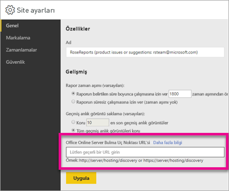

# <a name="configure-your-report-server-to-host-excel-workbooks-using-office-online-server-oos"></a>Office Online Server (OOS) uygulamasını kullanarak rapor sunucunuzu Excel çalışma kitaplarını barındıracak şekilde yapılandırma

Power BI raporlarını web portalında görüntülemenin yanı sıra Power BI Rapor Sunucusu da [Office Online Server](https://docs.microsoft.com/officeonlineserver/office-online-server-overview) (OOS) uygulamasını kullanarak Excel çalışma kitaplarını barındırabilir. Rapor sunucunuz, self servis Microsoft BI içeriklerini yayımlayacak ve görüntüleyecek tek bir konum haline gelir.


## <a name="prepare-server-to-run-office-online-server"></a>Sunucuyu Office Online Server uygulamasını çalıştırmak üzere hazırlama

Bu yordamları Office Online Server uygulamasının çalıştırılacağı sunucuda gerçekleştirin. Bu sunucunun Windows Server 2012 R2 veya Windows Server 2016 olması gerekir. Windows Server 2016 için Office Online Server Nisan 2017 veya sonraki bir sürüm gerekir.

### <a name="install-prerequisite-software-for-office-online-server"></a>Office Online Server için önkoşul yazılımlarını yükleme

1. Gerekli rolleri ve hizmetleri yüklemek için Windows PowerShell istemini yönetici olarak açıp bu komutu çalıştırın.

    **Windows Server 2012 R2:**

    ```powershell
    Add-WindowsFeature Web-Server,Web-Mgmt-Tools,Web-Mgmt-Console,Web-WebServer,Web-Common-Http,Web-Default-Doc,Web-Static-Content,Web-Performance,Web-Stat-Compression,Web-Dyn-Compression,Web-Security,Web-Filtering,Web-Windows-Auth,Web-App-Dev,Web-Net-Ext45,Web-Asp-Net45,Web-ISAPI-Ext,Web-ISAPI-Filter,Web-Includes,InkandHandwritingServices,NET-Framework-Features,NET-Framework-Core,NET-HTTP-Activation,NET-Non-HTTP-Activ,NET-WCF-HTTP-Activation45,Windows-Identity-Foundation,Server-Media-Foundation
    ```

    **Windows Server 2016:**

    ```powershell
    Add-WindowsFeature Web-Server,Web-Mgmt-Tools,Web-Mgmt-Console,Web-WebServer,Web-Common-Http,Web-Default-Doc,Web-Static-Content,Web-Performance,Web-Stat-Compression,Web-Dyn-Compression,Web-Security,Web-Filtering,Web-Windows-Auth,Web-App-Dev,Web-Net-Ext45,Web-Asp-Net45,Web-ISAPI-Ext,Web-ISAPI-Filter,Web-Includes,NET-Framework-Features,NET-Framework-45-Features,NET-Framework-Core,NET-Framework-45-Core,NET-HTTP-Activation,NET-Non-HTTP-Activ,NET-WCF-HTTP-Activation45,Windows-Identity-Foundation,Server-Media-Foundation
    ```

    İstenirse sunucuyu yeniden başlatın.
2. Aşağıdaki yazılımları yükleyin:

   * [.NET Framework 4.5.2](https://go.microsoft.com/fwlink/p/?LinkId=510096)
   * [Visual C++ Redistributable Packages for Visual Studio 2013](https://www.microsoft.com/download/details.aspx?id=40784)
   * [Visual C++ Redistributable for Visual Studio 2015](https://go.microsoft.com/fwlink/p/?LinkId=620071)
   * [Microsoft.IdentityModel.Extention.dll](https://go.microsoft.com/fwlink/p/?LinkId=620072)

### <a name="install-office-online-server"></a>Office Online Server'ı yükleme

Dış veri erişimi kullanan Excel Online özelliklerini kullanmayı planlıyorsanız (Power Pivot gibi) Office Online Server'ın kullanıcılarla ve Windows tabanlı kimlik doğrulaması kullanarak erişmeyi planladığınız dış veri kaynaklarıyla aynı Active Directory ormanında olması gerektiğini unutmayın.

1. Office Online Server'ı [Toplu Lisanslama Hizmeti Merkezi (VLSC)](http://go.microsoft.com/fwlink/p/?LinkId=256561) sayfasından indirin. İndirilecek dosya VLSC portalında Office ürünlerinin altında bulunur. Geliştirme amacıyla OOS uygulamasını MSDN aboneliği indirme sayfasından indirebilirsiniz.
2. Setup.exe dosyasını çalıştırın.
3. **Microsoft Yazılım Lisansı Koşulları'nı okuyun** sayfasında **Bu sözleşmenin koşullarını kabul ediyorum**'u ve ardından **Devam**'ı seçin.
4. **Dosya konumu seçin** sayfasında Office Online Server dosyalarının yüklenmesini istediğiniz klasörü belirleyin (örneğin,C:\Program Files\Microsoft Office Web Apps\*) ve ardından **Şimdi Yükle**'yi seçin. Belirttiğiniz klasör yoksa Kurulum sırasında oluşturulur.

    Office Online Server uygulamasını sistem sürücüsüne yüklemenizi öneririz.

5. Kurulum Office Online Server yüklemesini tamamladıktan sonra **Kapat**'ı seçin.

### <a name="install-language-packs-for-office-web-apps-server-optional"></a>Office Web Apps Sunucusu dil paketlerini yükleme (isteğe bağlı)

Office Online Server Dil Paketleri, kullanıcıların web tabanlı Office dosyalarını birden fazla dilde görüntülemesini sağlar.

Dil paketlerini yüklemek için bu adımları uygulayın.

1. Office Online Server Dil Paketleri'ni [Microsoft İndirme Merkezi](http://go.microsoft.com/fwlink/p/?LinkId=798136)'nden indirebilirsiniz.
2. **wacserverlanguagepack.exe** dosyasını çalıştırın.
3. Office Online Server Dil Paketi Sihirbazı'nın **Microsoft Yazılım Lisansı Koşulları'nı okuyun** sayfasında **Bu sözleşmenin koşullarını kabul ediyorum**'u ve ardından **Devam**'ı seçin.
4. Kurulum Office Online Server yüklemesini tamamladıktan sonra **Kapat**'ı seçin.

## <a name="deploy-office-online-server"></a>Office Online Server'ı dağıtma

### <a name="create-the-office-online-server-farm-https"></a>Office Online Server grubunu oluşturma (HTTPS)

Aşağıdaki örnekte gösterilen şekilde tek bir sunucudan oluşan yeni bir Office Online Server grubu oluşturmak için New-OfficeWebAppsFarm komutunu kullanın.

```powershell
New-OfficeWebAppsFarm -InternalUrl "https://server.contoso.com" -ExternalUrl "https://wacweb01.contoso.com" -CertificateName "OfficeWebApps Certificate"
```

**Parametreler**

* **–InternalURL**: Office Online Server uygulamasını çalıştıran sunucunun tam etki alanı adıdır (FQDN), örneğin: `http://servername.contoso.com`.
* **–ExternalURL**: İnternet'ten erişilebilen FQDN bilgisidir.
* **–CertificateName**: Sertifikanın kolay adıdır.

### <a name="create-the-office-online-server-farm-http"></a>Office Online Server grubunu oluşturma (HTTP)

Aşağıdaki örnekte gösterilen şekilde tek bir sunucudan oluşan yeni bir Office Online Server grubu oluşturmak için New-OfficeWebAppsFarm komutunu kullanın.

```powershell
New-OfficeWebAppsFarm -InternalURL "http://servername" -AllowHttp
```

**Parametreler**

* **–InternalURL**: Office Online Server uygulamasını çalıştıran sunucunun adıdır, örneğin: `http://servername`.
* **–AllowHttp**: Grubu HTTP kullanacak şekilde yapılandırır.

### <a name="verify-that-the-office-online-server-farm-was-created-successfully"></a>Office Online Server grubunun başarıyla oluşturulduğunu doğrulama

Grup oluşturulduktan sonra grupla ilgili ayrıntılar Windows PowerShell isteminde görüntülenir. Office Online Server'ın doğru şekilde yüklendiğini ve yapılandırıldığını doğrulamak için aşağıdaki örnekte gösterilen şekilde bir web tarayıcısı kullanarak Office Online Server keşif URL'sine erişin. Keşif URL'si, Office Online Server grubunuzu yapılandırırken belirlediğiniz *InternalUrl* parametresine */hosting/discovery* eklenerek elde edilir, örneğin:

```
<InternalUrl>/hosting/discovery
```

Office Online Server beklenen şekilde çalışıyorsa web tarayıcınızda bir Web Uygulaması Açık Platform Arabirim Protokolü (WOPI)-keşif XML dosyası görmeniz gerekir. Bu dosyanın ilk birkaç satırı aşağıdaki örneğe benzer olmalıdır:

```xml
<?xml version="1.0" encoding="utf-8" ?> 
<wopi-discovery>
<net-zone name="internal-http">
<app name="Excel" favIconUrl="<InternalUrl>/x/_layouts/images/FavIcon_Excel.ico" checkLicense="true">
<action name="view" ext="ods" default="true" urlsrc="<InternalUrl>/x/_layouts/xlviewerinternal.aspx?<ui=UI_LLCC&><rs=DC_LLCC&>" /> 
<action name="view" ext="xls" default="true" urlsrc="<InternalUrl>/x/_layouts/xlviewerinternal.aspx?<ui=UI_LLCC&><rs=DC_LLCC&>" /> 
<action name="view" ext="xlsb" default="true" urlsrc="<InternalUrl>/x/_layouts/xlviewerinternal.aspx?<ui=UI_LLCC&><rs=DC_LLCC&>" /> 
<action name="view" ext="xlsm" default="true" urlsrc="<InternalUrl>/x/_layouts/xlviewerinternal.aspx?<ui=UI_LLCC&><rs=DC_LLCC&>" /> 
```

### <a name="configure-excel-workbook-maximum-size"></a>Excel çalışma kitabı maksimum boyutunu yapılandırma

Power BI Rapor Sunucusu'ndaki tüm dosyalar için maksimum dosya boyutu 100 MB olarak belirlenmiştir. Bu sınıra uymak için bu ayarı OOS içinde el ile ayarlamanız gerekir.

```powershell
Set-OfficeWebAppsFarm -ExcelWorkbookSizeMax 100
```

## <a name="using-effectiveusername-with-analysis-services"></a>EffectiveUserName özelliğini Analysis Services ile birlikte kullanma

Analysis Services canlı bağlantılarına olanak sağlamak amacıyla, bir Excel çalışma kitabı içinde EffectiveUserName kullanan bağlantılar için. OOS uygulamasının EffectiveUserName özelliğini kullanabilmesi için OOS sunucusunun makine hesabını Analysis Services örneğine yönetici olarak eklemeniz gerekir. Bunu yapmak için Management Studio for SQL Server 2016 veya sonraki bir sürüm gereklidir.

Şu an için Excel çalışma kitaplarında yalnızca ekli Analysis Services bağlantıları desteklenmektedir. Kullanıcı vekilliğini yapmak mümkün olmadığı için kullanıcı hesabının Analysis Services'e bağlanma iznine sahip olması gerekir.

OOS Sunucusunda aşağıdaki PowerShell komutlarını çalıştırın.

```powershell
Set-OfficeWebAppsFarm -ExcelUseEffectiveUserName:$true
Set-OfficeWebAppsFarm -ExcelAllowExternalData:$true
Set-OfficeWebAppsFarm -ExcelWarnOnDataRefresh:$false
```

## <a name="configure-a-power-pivot-instance-for-data-models"></a>Veri modelleri için Power Pivot örneği yapılandırma

Analysis Services Power Pivot modu örneği yükleyerek Power Pivot kullanan Excel çalışma kitaplarıyla çalışabilirsiniz. Örneğin adının *POWERPIVOT* olduğundan emin olun. Analysis Services Power Pivot modu örneği için OOS sunucusunun makine hesabını yönetici olarak ekleyin. Bunu yapmak için Management Studio for SQL Server 2016 veya sonraki bir sürüm gereklidir.

OOS uygulamasının Power Pivot modu örneğini kullanabilmesi için aşağıdaki komutu çalıştırın.

```powershell
New-OfficeWebAppsExcelBIServer -ServerId <server_name>\POWERPIVOT
```

Dış verilere önceden izin vermediyseniz yukarıdaki Analysis Services adımında aşağıdaki komutu çalıştırın.

```powershell
Set-OfficeWebAppsFarm -ExcelAllowExternalData:$true
```

### <a name="firewall-considerations"></a>Güvenlik duvarı ile ilgili önemli noktalar

Güvenlik duvarı sorunlarıyla karşılaşmamak için 2382 ve 2383 numaralı bağlantı noktalarını açmanız gerekebilir. Ayrıca Power Pivot örneği için *msmdsrv.exe* dosyasını uygulama güvenlik duvarı ilkesi olarak ekleyebilirsiniz.

## <a name="configure-power-bi-report-server-to-use-the-oos-server"></a>Power BI Rapor Sunucusu'nu OOS sunucusunu kullanacak şekilde yapılandırma

**Site ayarları**'nın **Genel** sayfasına OOS bulma URL'sini girin. OOS keşif URL'si, OOS sunucusu dağıtılırken kullanılan *InternalUrl* parametresine */hosting/discovery* eklenerek elde edilir. Örneğin, HTTP için `http://servername/hosting/discovery`. HTTPS içinse `https://server.contoso.com/hosting/discovery`.

**Site ayarları** sayfasına ulaşmak için sağ üst köşedeki **dişli simgesini** ve ardından **Site ayarları**'nı seçin.

Yalnızca **Sistem Yöneticisi** rolüne sahip kullanıcılar Office Online Server keşif URL'si ayarını görebilir.



Keşif URL'sini girip **Uygula**'yı belirledikten ve web portalında bir Excel çalışma kitabını seçtikten sonra çalışma kitabının web portalında görüntülenmesi gerekir.

## <a name="limitations-and-considerations"></a>Sınırlamalar ve önemli noktalar

* Çalışma kitaplarında salt okunur erişime sahip olursunuz.

## <a name="next-steps"></a>Sonraki adımlar

[Yönetici genel bakışı](admin-handbook-overview.md)  
[Power BI Rapor Sunucusu'nu yükleme](install-report-server.md)  
[Rapor Oluşturucusu’nu indirme](https://www.microsoft.com/download/details.aspx?id=53613)  
[Download SQL Server Data Tools (SSDT) (SQL Server Veri Araçlarını (SSDT) indirme)](http://go.microsoft.com/fwlink/?LinkID=616714)

Başka bir sorunuz mu var? [Power BI Topluluğu'na sorun](https://community.powerbi.com/)
