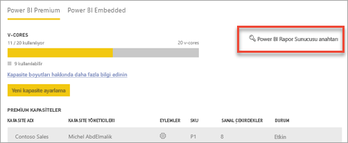
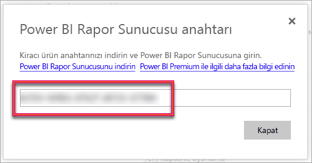
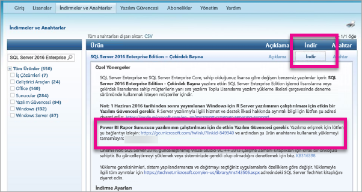

# Rapor sunucusu ürün anahtarınızı bulma
Sunucunuzu üretim ortamına yüklemek için Power BI Rapor Sunucusu ürün anahtarınızı nasıl bulabileceğinizi öğrenin.

<iframe width="640" height="360" src="https://www.youtube.com/embed/6CQnf-NGtpU?rel=0&amp;showinfo=0" frameborder="0" allowfullscreen></iframe>

Power BI Rapor Sunucusu'nu yüklediniz ve SQL Server Enterprise Yazılım Güvencesi anlaşmanız var. Power BI Premium'u satın almış da olabilirsiniz. Sunucuyu üretim ortamına yüklemek istiyorsunuz ancak bunu yapabilmek için ürün anahtarına ihtiyacınız var. Ürün anahtarı nerede? 

Ürün anahtarı, satın aldığınız ürüne göre iki farklı yerden birinde olabilir.

## Power BI Premium'u satın aldınız
Power BI Premium'u satın aldıysanız Power BI yönetici portalının **Kapasite ayarları** sekmesine giderek Power BI Rapor Sunucusu ürün anahtarınıza erişebilirsiniz. Bu yalnızca Power BI hizmeti yönetici rolüne atanan kullanıcılar veya Genel Yöneticiler tarafından kullanılabilir.

**Power BI Rapor Sunucusu anahtarı**'nı seçtiğinizde ürün anahtarınızı içeren bir iletişim kutusu görüntülenir. Ürün anahtarınızı kopyalayıp yükleme esnasında kullanabilirsiniz.

## Yazılım Güvencesi anlaşması satın aldınız
SQL Server Enterprise YG sözleşmeniz varsa ürün anahtarınızı [Toplu Lisanslama Hizmeti Merkezi](https://www.microsoft.com/Licensing/servicecenter/)'nden edinebilirsiniz. SQL Server'ın en son sürümü için en son hizmet paketine bakın. Burada göremiyorsanız en son SQL Server sürümünün RTM sürümü altına bakın.

> [!NOTE]
> İndirme bölümüne bakmanız gerekir. Anahtarlar bölümüne değil.
> 
> 

## Sonraki adımlar
[Power BI Rapor Sunucusu'nu yükleme](install-report-server.md)  
[Power BI Rapor Sunucusu için en iyi duruma getirilmiş Power BI Desktop uygulamasını yükleme](install-powerbi-desktop.md)  
[Install Report Builder (Rapor Oluşturucusu'nu yükleme)](https://docs.microsoft.com/sql/reporting-services/install-windows/install-report-builder)  
[Download SQL Server Data Tools (SSDT) (SQL Server Veri Araçlarını (SSDT) indirme)](http://go.microsoft.com/fwlink/?LinkID=616714)

Başka bir sorunuz mu var? [Power BI Topluluğu'na sorun](https://community.powerbi.com/)

