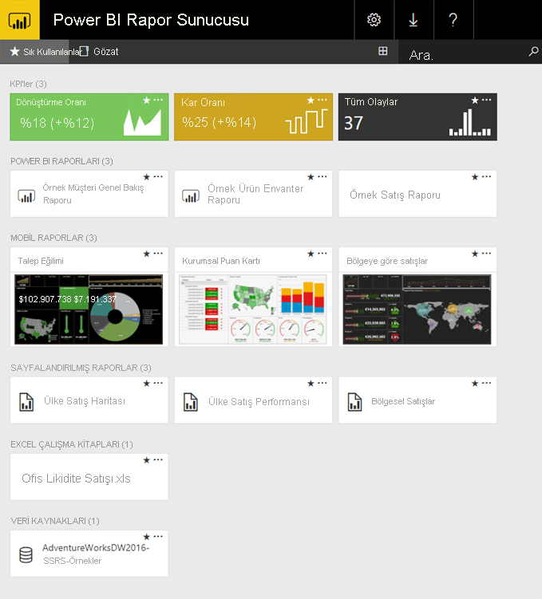

# Power BI Rapor Sunucusu nedir?

Power BI Rapor Sunucusu, içinde rapor ve KPI’ları görüntüleyip yönettiğiniz bir web portalı olan, şirket içi bir rapor sunucusudur. Bu sunucuyla birlikte Power BI raporları, sayfalandırılmış raporlar, mobil raporlar ve KPI’lar oluşturan araçlar gelir. Kullanıcılarınız bu raporlara farklı yöntemlerle erişebilir: bir web tarayıcısı ya da mobil cihazdan veya gelen kutularında e-posta olarak görüntüleyerek.

## Power BI Rapor Sunucusunu karşılaştırma 
Power BI Rapor Sunucusu hem SQL Server Reporting Services hem de Power BI çevrimiçi hizmetiyle benzerdir, ancak bu benzerlik farklı şekillerde görülür. Power BI hizmeti gibi Power BI Rapor Sunucusu da Power BI raporlarını (.PBIX), Excel dosyalarını ve sayfalandırılmış raporları (.RDL) barındırır. Power BI Rapor Sunucusu, Reporting Services gibi şirket içidir. Power BI Rapor Sunucusu'nun özellikleri Reporting Services’in bir üst kümesidir: Reporting Services'de yapabileceğiniz her şeyi ve Power BI raporları desteğiyle birlikte daha fazlasını Power BI Rapor Sunucusu ile de yapabilirsiniz. Ayrıntılar için bkz. [Power BI Rapor Sunucusu ile Power BI hizmetini karşılaştırma](compare-report-server-service.md).

## Power BI Rapor Sunucusunu lisanslama
Power BI Rapor Sunucusu iki farklı lisansla sağlanır: [Power BI Premium](../service-premium-what-is.md) ve Yazılım Güvencesi ile [SQL Server Enterprise Edition](https://www.microsoft.com/sql-server/sql-server-2017-editions). Bir Power BI Premium lisansı ile bir karma dağıtım bulut ve şirket içi karışımı oluşturabilirsiniz.  

> [!NOTE]
> Power BI Premium için Power BI Rapor Sunucusu yalnızca P SKU’ları ile birlikte sunulur. EM SKU’larına dahil değildir.

## Web portalı
Power BI Rapor Sunucusu'nun giriş noktası, tüm güncel tarayıcılarda görüntüleyebileceğiniz güvenli bir web portalıdır. Buradan tüm raporlarınıza ve KPI'larınıza erişirsiniz. Web portalındaki içerik, geleneksel bir klasör hiyerarşisi halinde düzenlenir. Klasörlerinizde, içerik türe göre gruplandırılır: Power BI raporları, mobil raporlar, sayfalandırılmış raporlar, KPI’lar ve Excel çalışma kitapları. Paylaşılan veri kümeleri ve paylaşılan veri kaynakları raporlarınızın yapı taşı olarak kullanılmak üzere kendi klasörlerinde yer alır. Sık kullanılanları tek bir klasörde görüntülemek üzere etiketlersiniz. Ayrıca doğrudan web portalında KPI'lar oluşturursunuz. 

İzinlerinize bağlı olarak, web portalındaki içeriği yönetebilirsiniz. Rapor işleme zamanlaması oluşturabilir, isteğe bağlı olarak raporlara erişebilir ve yayımlanan raporlara abone olabilirsiniz. Ayrıca, web portalınıza kendi özel [markalamanızı](https://docs.microsoft.com/sql/reporting-services/branding-the-web-portal) uygulayabilirsiniz. 

[Power BI Rapor Sunucusu web portalı](https://docs.microsoft.com/sql/reporting-services/web-portal-ssrs-native-mode) hakkında daha fazla bilgi.

## Power BI raporları
Rapor sunucusu için en iyi duruma getirilmiş Power BI Desktop sürümü ile Power BI raporları (.PBIX) oluşturabilirsiniz. Sonra bu raporları kendi ortamınızdaki web portalında yayımlayıp görüntüleyebilirsiniz.

Power BI raporları, bir veri modelinden edinilen farklı bulguları ve öngörüleri temsil eden görselleştirmeler yardımıyla bu veri modeline ilişkin çok yönlü bir yaklaşım sunar.  Bir raporda tek bir görselleştirme olabilir veya rapor, görselleştirmelerle dolu sayfalardan oluşabilir. Rolünüze bağlı olarak, raporları okuyup keşfedebilir veya başkaları için raporlar oluşturabilirsiniz.

[Microsoft Power BI Desktop'ı yükleme](install-powerbi-desktop.md) hakkındaki yazıyı okuyun.

## Sayfalandırılmış raporlar
Sayfalandırılmış raporlar (.RDL), görseller içeren ve içindeki tabloların tüm verileri göstermek üzere yatay ve dikey yönde genişlediği, gerektiğinde sayfalara yayıldığı belge stili raporlardır. Bu raporlar, PDF ve Word dosyaları gibi yazdırma işlemi için en iyi duruma getirilmiş sabit düzenli, kusursuz kalitede belgeler oluşturmak için idealdir. 

[SQL Server Veri Araçları'nda (SSDT)](https://docs.microsoft.com/sql/reporting-services/tools/reporting-services-in-sql-server-data-tools-ssdt) [Rapor Oluşturucusu](https://docs.microsoft.com/sql/reporting-services/report-builder/report-builder-in-sql-server-2016)'nu veya Rapor Tasarımcısı'nı kullanarak sayfalandırılmış raporlar oluşturabilirsiniz.

## Reporting Services mobil raporları
Mobil raporlar şirket içi verilere bağlanır ve farklı cihazlara ve cihazları nasıl tuttuğunuza göre uyum sağlayan farklı yöntemlere uyum sağlayan esnek bir düzene sahiptir. Bu raporları SQL Server Mobil Rapor Yayımcısı ile oluşturabilirsiniz.

[Reporting Services mobil raporları](https://docs.microsoft.com/sql/reporting-services/mobile-reports/create-mobile-reports-with-sql-server-mobile-report-publisher) hakkında daha fazla bilgi. 

## Rapor Sunucusu programlama özellikleri
Özel uygulamalardaki veri ve rapor işleme süreçlerini tümleştirmeye veya genişletmeye yönelik API'lerle raporlarınızı genişletmek ve özelleştirmek için Power BI Rapor Sunucusu programlama özelliklerinden yararlanın.

Diğer [Rapor Sunucusu geliştirici belgeleri](https://docs.microsoft.com/sql/reporting-services/reporting-services-developer-documentation).

## Sonraki adımlar
[Power BI Rapor Sunucusu'nu yükleme](install-report-server.md)  
[Rapor Oluşturucusu’nu indirme](https://www.microsoft.com/download/details.aspx?id=53613)  

Başka bir sorunuz mu var? [Power BI Topluluğu'na sorun](https://community.powerbi.com/)

