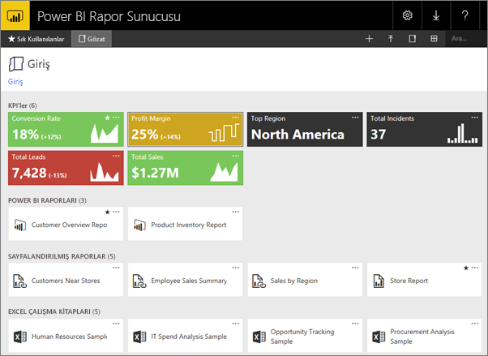
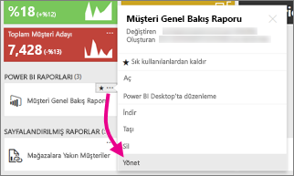
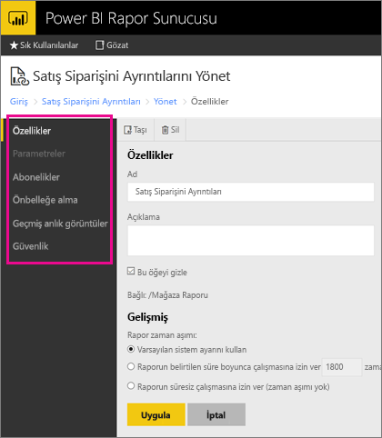

# Web portalında içeriği yönetme 
Power BI Rapor Sunucusu web portalı, Power BI, mobil ve sayfalandırılmış raporlarınızın yanı sıra KPI'lerinizi yönetebileceğiniz şirket içi bir konumdur.

Web portalını herhangi bir modern tarayıcıda görüntüleyebilirsiniz. Web portalında raporlar ve KPI'ler klasörler halinde düzenlenir ve bunları sık kullanılan olarak işaretleyebilirsiniz. Burada Excel çalışma kitaplarını da depolayabilirsiniz. Web portalından rapor oluşturmak için ihtiyacınız olan araçları başlatabilirsiniz:

* Power BI Desktop ile oluşturulan **Power BI raporları**: Bunları web portalında ve Power BI mobil uygulamalarında görüntüleyin.
* Rapor Oluşturucusu'nda oluşturulmuş **sayfalandırılmış raporlar**: Yazdırma için iyileştirilmiş modern görünümlü, sabit düzenli belgeler.
* Doğrudan web portalında oluşturulan **KPI'ler**.

Web portalında rapor sunucusu klasörlerine göz atabilir veya belirli raporları arayabilirsiniz. Rapor geçmişinde bir raporu, raporun genel özelliklerini ve eski kopyalarını görüntüleyebilirsiniz. Ayrıca izinlerinize bağlı olarak, e-posta gelen kutusuna veya dosya sistemindeki paylaşılan bir klasöre dağıtım amacıyla raporlara abone olabilirsiniz.

## Web portalı rolleri ve izinleri
Web portalı uygulaması bir tarayıcıda çalışır. Web portalını başlattığınızda gördüğünüz sayfalar, bağlantılar ve seçenekler rapor sunucusunda sahip olduğunuz izinlere bağlı olarak değişiklik gösterir. Tam izinleri olan bir role atanırsanız bir rapor sunucusunu yönetmek için uygulama menülerinin ve sayfaların tamamına erişim sahibi olursunuz. Raporları görüntüleme ve çalıştırma izinlerini içeren bir role atanırsanız yalnızca söz konusu etkinlikler için ihtiyacınız olan menüleri ve sayfaları görürsünüz. Farklı rapor sunucuları için, hatta tek bir rapor sunucusu üzerindeki çeşitli raporlar ve klasörler için farklı rol atamalarına sahip olabilirsiniz.

## Web portalını başlatma
1. Web tarayıcınızı açın.
   
    [Desteklenen web tarayıcıları ve sürümleri](browser-support.md) listesine göz atın.
2. Adres çubuğuna web portalı URL'sini yazın.
   
    Varsayılan olarak, URL*http://[BilgisayarAdı]/reports* şeklindedir.
   
    Rapor sunucusu belirli bir bağlantı noktasını kullanacak şekilde yapılandırılmış olabilir. Örneğin, *http://[BilgisayarAdı]:80/reports* veya *http://[BilgisayarAdı]:8080/reports*
   
    Web portalının, öğeleri şu kategorilerde gruplandırdığını görürsünüz:
   
   * KPI'ler
   * Mobil raporlar
   * Sayfalandırılmış raporlar
   * Power BI Desktop raporları
   * Excel çalışma kitapları
   * Veri kümeleri
   * Veri kaynakları
   * Kaynaklar

## Web portalındaki öğeleri yönetme
Power BI Rapor Sunucusu, web portalında depoladığınız öğeler üzerinde ayrıntılı denetim sağlar. Örneğin, her sayfalandırılmış rapor üzerinde abonelik, önbelleğe alma, anlık görüntü ve güvenlik ayarları yapabilirsiniz.

1. Bir öğenin sağ üst köşesindeki üç nokta (...) simgesini seçin ve ardından **Manage** (Yönet) seçeneğini belirleyin.
   
    
2. Ayarlamak istediğiniz özelliği seçin.
   
    
3. **Apply** (Uygula) seçeneğini belirleyin.

[Working with subscriptions in the web portal (Web portalında aboneliklerle çalışma)](https://docs.microsoft.com/sql/reporting-services/working-with-subscriptions-web-portal) hakkında daha fazla bilgi edinin.

## Sonraki adımlar
[Kullanıcı el kitabı](user-handbook-overview.md)  
[Sayfalandırılmış raporlar](quickstart-create-paginated-report.md)  
[Power BI raporları](quickstart-create-powerbi-report.md)

Başka bir sorunuz mu var? [Power BI Topluluğu'na sorun](https://community.powerbi.com/)

