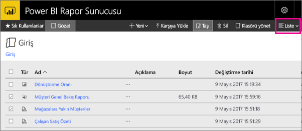

# Power BI Rapor Sunucusu web portalında gezinme
Power BI Rapor Sunucusu web portalı, Power BI, mobil ve sayfalandırılmış raporlarınızın yanı sıra KPI'lerinizi yönetebileceğiniz şirket içi bir konumdur.

Web portalını herhangi bir modern tarayıcıda görüntüleyebilirsiniz. Web portalında raporlar ve KPI'ler klasörler halinde düzenlenir ve bunları sık kullanılan olarak işaretleyebilirsiniz. Burada Excel çalışma kitaplarını da depolayabilirsiniz. Web portalından rapor oluşturmak için ihtiyacınız olan araçları başlatabilirsiniz:

* Power BI Desktop ile oluşturulan **Power BI raporları**: Bunları web portalında ve Power BI mobil uygulamalarında görüntüleyin.
* Rapor Oluşturucusu'nda oluşturulmuş **sayfalandırılmış raporlar**: Yazdırma için iyileştirilmiş modern görünümlü, sabit düzenli belgeler.
* Doğrudan web portalında oluşturulan **KPI'ler**.

Web portalında rapor sunucusu klasörlerine göz atabilir veya belirli raporları arayabilirsiniz. Rapor geçmişinde bir raporu, raporun genel özelliklerini ve eski kopyalarını görüntüleyebilirsiniz. Ayrıca izinlerinize bağlı olarak, e-posta gelen kutusuna veya dosya sistemindeki paylaşılan bir klasöre dağıtım amacıyla raporlara abone olabilirsiniz.

## Web portalı görevleri
Web portalını şunlar da dahil olmak üzere çeşitli görevler için kullanabilirsiniz:

* Raporları görüntüleme, arama, yazdırma ve raporlara abone olma.
* Sunucudaki öğeleri düzenlemek için klasör hiyerarşisi oluşturma, hiyerarşinin güvenliğini sağlama ve hiyerarşiyi koruma.
* Rapor yürütme özelliklerini, rapor geçmişini ve rapor parametrelerini yapılandırma.
* Zamanlamaları ve veri kaynağı bağlantılarını daha yönetilebilir hale getirmek için paylaşılan zamanlamalar ve paylaşılan veri kaynakları oluşturma.
* Raporları geniş bir alıcı listesinin kullanımına sunmak için veri temelli abonelikler oluşturma.
* Mevcut bir raporu farklı şekillerde yeniden kullanmak ve raporun amacını değiştirmek için bağlı raporlar oluşturma.
* Power BI Desktop (Rapor Sunucusu), Rapor Oluşturucusu ve Mobil Rapor Yayımcısı gibi yaygın olarak kullanılan araçları indirme ve açma.
* [KPI oluşturma](https://docs.microsoft.com/sql/reporting-services/working-with-kpis-in-reporting-services).
* Geri bildirim veya özellik istekleri gönderme.
* [Branding the web portal (Web portalını markalama)](https://docs.microsoft.com/sql/reporting-services/branding-the-web-portal)
* [KPI'lerle çalışma](https://docs.microsoft.com/sql/reporting-services/working-with-kpis-in-reporting-services)
* [Working with shared datasets (Paylaşılan veri kümeleriyle çalışma)](https://docs.microsoft.com/sql/reporting-services/work-with-shared-datasets-web-portal)

## Web portalı rolleri ve izinleri
Web portalı, tarayıcıda çalışan bir web uygulamasıdır. Web portalını başlattığınızda gördüğünüz sayfalar, bağlantılar ve seçenekler rapor sunucusunda sahip olduğunuz izinlere bağlı olarak değişiklik gösterir. Tam izinleri olan bir role atanırsanız bir rapor sunucusunu yönetmek için uygulama menülerinin ve sayfaların tamamına erişim sahibi olursunuz. Raporları görüntüleme ve çalıştırma izinlerini içeren bir role atanırsanız yalnızca söz konusu etkinlikler için ihtiyacınız olan menüleri ve sayfaları görürsünüz. Farklı rapor sunucuları için, hatta tek bir rapor sunucusu üzerindeki çeşitli raporlar ve klasörler için farklı rol atamalarına sahip olabilirsiniz.

## Web portalını başlatma
1. Web tarayıcınızı açın.
   
    [Desteklenen web tarayıcıları ve sürümleri](browser-support.md) listesine göz atın.
2. Adres çubuğuna web portalı URL'sini yazın.
   
    Varsayılan olarak, URL*http://[BilgisayarAdı]/reports* şeklindedir.
   
    Rapor sunucusu belirli bir bağlantı noktasını kullanacak şekilde yapılandırılmış olabilir. Örneğin, *http://[BilgisayarAdı]:80/reports* veya *http://[BilgisayarAdı]:8080/reports*
   
    Web portalının, öğeleri şu kategorilerde gruplandırdığını görürsünüz:
   
   * KPI'ler
   * Mobil raporlar
   * Sayfalandırılmış raporlar
   * Power BI Desktop raporları
   * Excel çalışma kitapları
   * Veri kümeleri
   * Veri kaynakları
   * Kaynaklar

## Power BI Desktop raporları (.pbix dosyaları) oluşturma ve bunları düzenleme
Web portalında Power BI Desktop raporlarına ilişkin izinleri görüntüleyebilir, karşıya yükleyebilir, oluşturabilir, düzenleyebilir ve yönetebilirsiniz.

### Power BI Desktop raporu oluşturma
1. **New** > **Power BI Report** (Yeni > Power BI Raporu) seçeneğini belirleyin.
   
    
   
    Power BI Desktop uygulaması açılır.
   
    
2. Power BI raporunuzu oluşturun. Ayrıntılı bilgi için bkz. [Hızlı Başlangıç: Power BI raporları](quickstart-create-powerbi-report.md).
3. Raporunuzu rapor sunucusuna yükleyin.

### Mevcut bir Power BI Desktop raporunu düzenleme
1. Rapor kutucuğunun sağ üst köşesindeki üç nokta (**...**) simgesini seçin ve ardından **Edit in Power BI Desktop** (Power BI Desktop'ta düzenle) seçeneğini belirleyin.
   
    
   
    Power BI Desktop uygulaması açılır.
2. Değişikliklerinizi yapın ve kaydedin... [nasıl yapılır?]

## Sayfalandırılmış raporlar (.rdl dosyaları) oluşturma ve bunları düzenleme
Web portalında sayfalandırılmış rapor oluşturabilir, görüntüleyebilir, düzenleyebilir ve ilgili izinleri yönetebilirsiniz.

### Sayfalandırılmış rapor oluşturma
1. **New** > **Paginated Report** (Yeni > Sayfalandırılmış Rapor) seçeneğini belirleyin.
   
    Rapor Oluşturucusu uygulaması açılır.
   
    
2. Sayfalandırılmış raporunuzu oluşturun. Ayrıntılı bilgi için bkz. [Hızlı Başlangıç: Sayfalandırılmış raporlar](quickstart-create-paginated-report.md).
3. Raporunuzu rapor sunucusuna yükleyin.

### Mevcut bir sayfalandırılmış raporu düzenleme
1. Rapor kutucuğunun sağ üst köşesindeki üç nokta (...) simgesini seçin ve ardından **Edit in Report Builder** (Rapor Oluşturucusu'nda Düzenle) seçeneğini belirleyin.
   
    
   
    Rapor Oluşturucusu uygulaması açılır.
2. Değişikliklerinizi yapın ve kaydedin.

## Excel çalışma kitaplarını karşıya yükleme ve düzenleme
Power BI Desktop raporlarına ve Excel çalışma kitaplarına ilişkin izinleri karşıya yükleyebilir, düzenleyebilir ve yönetebilirsiniz. Bunlar web portalında bir arada gruplandırılır.

Çalışma kitapları, diğer kaynak dosyalarla benzer şekilde Power BI Rapor Sunucusu'nda depolanır. Çalışma kitaplarından birinin seçilmesi, çalışma kitabını yerel olarak masaüstünüze indirir. Yaptığınız değişiklikleri rapor sunucusuna tekrar yükleyerek bunları kaydedebilirsiniz.

## Web portalındaki öğeleri yönetme
Power BI Rapor Sunucusu, web portalında depoladığınız öğeler üzerinde ayrıntılı denetim sağlar. Örneğin, her sayfalandırılmış rapor üzerinde abonelik, önbelleğe alma, anlık görüntü ve güvenlik ayarları yapabilirsiniz.

1. Bir öğenin sağ üst köşesindeki üç nokta (...) simgesini seçin ve ardından **Manage** (Yönet) seçeneğini belirleyin.
   
    
2. Ayarlamak istediğiniz özelliği seçin.
   
    
3. **Apply** (Uygula) seçeneğini belirleyin.

[Working with subscriptions in the web portal (Web portalında aboneliklerle çalışma)](https://docs.microsoft.com/sql/reporting-services/working-with-subscriptions-web-portal) hakkında daha fazla bilgi edinin.

## Sık kullanılan raporlarınızı ve KPI'leri etiketleme
Sık kullanılan olmasını istediğiniz raporları ve KPI'leri etiketleyebilirsiniz. Hem web portalında hem de Power BI mobil uygulamalarında tek bir Sık Kullanılanlar klasöründe toplandıklarından bulunmaları daha kolaydır. 

1. Sık kullanılan olarak işaretlemek istediğiniz KPI'nin veya raporun sağ üst köşesindeki üç nokta (**...**) simgesini seçin ve **Add to Favorites** (Sık Kullanılanlara Ekle) seçeneğini belirleyin.
   
    
2. Söz konusu öğeyi web portalındaki Favorites (Sık Kullanılanlar) sayfasında diğer öğelerle birlikte görmek için web portalı şeridindeki **Favorites** (Sık Kullanılanlar) seçeneğini belirleyin.
   
    
   
    Artık Power BI mobil uygulamalarında bu sık kullanılanları Power BI hizmetindeki sık kullanılan panolarla birlikte görürsünüz.
   
    

## Web portalında öğeleri gizleme veya görüntüleme
Web portalında öğeleri gizleyebilir ve gizli öğeleri görüntülemeyi seçebilirsiniz.

### Bir öğeyi gizleme
1. Bir öğenin sağ üst köşesindeki üç nokta (...) simgesini seçin ve ardından **Manage** (Yönet) seçeneğini belirleyin.
   
    
2. **Hide this item** (Bu öğeyi gizle) seçeneğini belirleyin.
   
    
3. **Apply** (Uygula) seçeneğini belirleyin.

### Gizli öğeleri görüntüleme
1. Sap üst köşedeki **Tiles** (Hide this item) seçeneğini (veya **List** (Liste) seçeneğini) belirleyin ve ardından **Show hidden items**'ı (Gizli öğeleri göster) seçin.
   
    Öğeler görüntülenir. Renkleri gridir ancak yine de bunları açabilir ve düzenleyebilirsiniz.
   
    

## Öğe arama
Bir arama terimi girdiğinizde, erişebileceğiniz tüm içeriği görürsünüz. Sonuçlar KPI'ler, raporlar, veri kümeleri ve diğer öğeler halinde kategorilere ayrılmıştır. Böylece sonuçlarla etkileşime geçebilir ve bunları sık kullanılanlarınıza ekleyebilirsiniz.  

## Öğeleri Liste görünümünde taşıma veya silme
Varsayılan olarak web portalı, içeriklerini Kutucuk görünümünde görüntüler.

Aynı anda birden fazla öğenin kolayca taşınabildiği veya silinebildiği Liste görünümüne geçiş yapabilirsiniz. 

1. **Tiles** > **List** (Kutucuklar > Liste) seçeneğini belirleyin.
   
    
2. Öğeleri seçin ve ardından **Move** (Taşı) veya **Delete** (Sil) seçeneğini belirleyin.

## Sonraki adımlar
[Kullanıcı el kitabı](user-handbook-overview.md)  
[Hızlı Başlangıç: Sayfalandırılmış raporlar](quickstart-create-paginated-report.md)  
[Hızlı Başlangıç: Power BI raporları](quickstart-create-powerbi-report.md)

Başka bir sorunuz mu var? [Power BI Topluluğu'na sorun](https://community.powerbi.com/)

