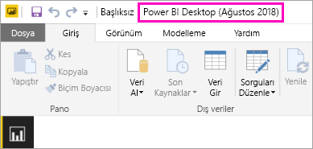

# Power BI Rapor Sunucusu için en iyi duruma getirilmiş Power BI Desktop uygulamasını yükleme
Power BI Rapor Sunucusu için en iyi duruma getirilmiş Power BI Desktop uygulamasını yüklemeyi öğrenin.

Power BI Rapor Sunucusu için Power BI raporları oluşturmak istiyorsanız Power BI Rapor Sunucusu için en iyi duruma getirilmiş Power BI Desktop'ı indirip yüklemeniz gerekir. Bu, Power BI hizmetiyle kullanılan Power BI Desktop'tan farklı bir sürümdür. Örneğin, Power BI hizmetine yönelik Power BI Desktop sürümü, yayımlanana kadar Power BI Rapor Sunucusu sürümünde kullanılamayan önizleme özellikleri içerir. Bu sürümün kullanılması, rapor sunucusunun; raporların ve modelin bilinen bir sürümüyle etkileşim kurabilmesini sağlar. 

İyi haber şu: Power BI Desktop ile Power BI Rapor Sunucusu için en iyi duruma getirilmiş Power BI Desktop uygulamaları aynı bilgisayarda yan yana yüklü olabilir.

## Power BI Desktop uygulamasını indirme ve yükleme

Power BI Rapor Sunucusu için en iyi duruma getirilmiş Power BI Desktop'ın en güncel sürümüne sahip olduğunuzdan emin olmanın en kolay yolu rapor sunucunuzun web portalına gitmektir.

1. Rapor sunucusu web portalında, **İndir** okunu ve ardından **Power BI Desktop**'ı seçin.

    

    Alternatif olarak, Microsoft İndirme Merkezi'nde doğrudan [Microsoft Power BI Desktop](https://www.microsoft.com/download/details.aspx?id=57271) (Power BI Rapor Sunucusu için en iyi duruma getirilmiş - Ocak 2019) sayfasına da gidebilirsiniz.

2. İndirme Merkezi sayfasında, **İndir** seçeneğini belirleyin.

3. Bilgisayarınıza bağlı olarak, şu seçeneklerden birini belirleyin: 

    - **PBIDesktopRS.msi** (32 bit sürümü) veya

    - **PBIDesktopRS_x64.msi** (64 bit sürümü).

1. Yükleyiciyi indirdikten sonra, Power BI Desktop (Ocak 2019) Kurulum Sihirbazını çalıştırın.

2. Yüklemenin sonunda **Start Power BI Desktop now** (Power BI Desktop'ı şimdi başlat) onay kutusunu işaretleyin.
   
    Uygulama otomatik olarak başlatılır ve kullanımınıza hazır hale gelir.

## Doğru sürümü kullandığınızdan emin olma
Power BI Desktop uygulamasının doğru sürümünü kullandığınızdan emin olmak için açılış ekranına veya Power BI Desktop'taki başlık çubuğuna bakabilirsiniz. Başlık çubuğunda sürümün ay ve yıl bilgileri gösterilir.

Başlık çubuğunda Power BI hizmeti için Power BI Desktop sürümüne ilişkin ay ve yıl bilgisi görüntülenmez.

## Dosya uzantısı ilişkilendirme
Aynı makineye hem Power BI Desktop hem de Power BI Rapor Sunucusu için en iyi duruma getirilmiş Power BI Desktop uygulamasını yüklediyseniz .pbix dosyası en son yüklenmiş olan Power BI Desktop ile ilişkilendirilir. Bu da bir pbix dosyasına çift tıkladığınızda en son yüklenen Power BI Desktop uygulamasının açılacağı anlamına gelir.

Power BI Desktop uygulaması yüklüyken Power BI Rapor Sunucusu için en iyi duruma getirilmiş Power BI Desktop uygulamasını yüklediyseniz tüm pbix dosyaları varsayılan olarak Power BI Rapor Sunucusu için en iyi duruma getirilmiş Power BI Desktop uygulamasıyla açılır. Power BI Desktop uygulamasının pbix dosyaları için varsayılan seçenek olmasını istiyorsanız Power BI Desktop uygulamasını Power BI hizmetinden yeniden yükleyin.

Öncelikli olarak kullanmak istediğiniz Power BI Desktop sürümünü kendiniz açabilirsiniz. Ardından dosyayı Power BI Desktop'tan açabilirsiniz.

Power BI Rapor Sunucusu'nda Power BI raporunu düzenlediğinizde veya web portalında yeni bir Power BI raporu oluşturduğunuzda her zaman doğru Power BI Destop sürümü açılır.

## Önemli noktalar ve sınırlamalar
Power BI mobil uygulamalarında ve Power BI hizmetinde yer alan Power BI Rapor Sunucusu Power BI raporları (http://app.powerbi.com), birkaç farklı özellik dışında hemen hemen aynı görevi görür.

### Tarayıcıda
Power BI Rapor Sunucusu raporları aşağıdakiler de dahil olmak üzere tüm görselleştirmeleri destekler:

* Özel görseller

Power BI Rapor Sunucusu raporları aşağıdakileri desteklemez:

* R görselleri
* ArcGIS haritaları
* İçerik haritaları
* Power BI Desktop önizleme özellikleri

### Power BI mobil uygulamalarında
Power BI Rapor Sunucusu raporları, [Power BI mobil uygulamalarında](../consumer/mobile/mobile-apps-for-mobile-devices.md) aşağıdakiler de dahil olmak üzere tüm temel işlevleri destekler:

* [Telefon raporu düzeni](../desktop-create-phone-report.md): Bir raporu Power BI mobil uygulamaları için en iyi duruma getirebilirsiniz. En iyi duruma getirilmiş raporlar cep telefonunuzda özel bir simge () ve düzenle gösterilir.
  
    

Power BI Rapor Sunucusu, Power BI mobil uygulamalarında şu özellikleri desteklemez:

* R görselleri
* ArcGIS haritaları
* Özel görseller
* İçerik haritaları
* Coğrafi filtreleme veya barkodlar

## Önceki Power BI Rapor Sunucusu sürümleri için Power BI Desktop

Rapor sunucunuz önceki bir sürümse, ilgili Power BI Desktop sürümü gerekir. Önceki iki sürüm şunlardır.

- Microsoft Power BI Desktop ([Power BI Rapor Sunucusu için en iyi duruma getirilmiş - Ekim 2017](https://www.microsoft.com/download/details.aspx?id=56136))
- Microsoft Power BI Desktop ([Power BI Rapor Sunucusu için en iyi duruma getirilmiş - Haziran 2017](https://www.microsoft.com/download/details.aspx?id=55330))

## Sonraki adımlar
Power BI Desktop uygulamasını yüklediğinizde göre Power BI raporu oluşturmaya başlayabilirsiniz.

[Power BI Rapor Sunucusu için Power BI raporu oluşturma](quickstart-create-powerbi-report.md)  
[Power BI Rapor Sunucusu nedir?](get-started.md)

Başka bir sorunuz mu var? [Power BI Topluluğu'na sorun](https://community.powerbi.com/)

