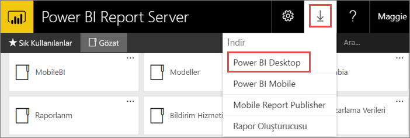

# Power BI Rapor Sunucusu için en iyi duruma getirilmiş Power BI Desktop uygulamasını yükleme
Power BI Rapor Sunucusu için en iyi duruma getirilmiş Power BI Desktop uygulamasını yüklemeyi öğrenin.

Power BI Rapor Sunucusu için Power BI raporları oluşturmak istiyorsanız Power BI Rapor Sunucusu için en iyi duruma getirilmiş Power BI Desktop'ı indirip yüklemeniz gerekir. Bu, Power BI hizmetiyle kullanılan Power BI Desktop'tan farklı bir sürümdür. Örneğin, Power BI hizmetine yönelik Power BI Desktop sürümü, yayımlandıktan sonra Power BI Rapor Sunucusu sürümünde kullanılabilecek olan önizleme özelliklerini içerir. Bu sürümün kullanılması, rapor sunucusunun; raporların ve modelin bilinen bir sürümüyle etkileşim kurabilmesini sağlar. 

> [!NOTE]
> Power BI Desktop ile Power BI Rapor Sunucusu için en iyi duruma getirilmiş Power BI Desktop uygulamaları aynı bilgisayarda yan yana yüklü olabilir.

## Power BI Desktop uygulamasını indirme ve yükleme

Power BI Rapor Sunucusu için en iyi duruma getirilmiş Power BI Desktop'ın en güncel sürümüne sahip olduğunuzdan emin olmanın en kolay yolu rapor sunucunuzun web portalına gitmektir.

1. Rapor sunucusu web portalında, **İndir** okunu ve ardından **Power BI Desktop**'ı seçin.

    

    Alternatif olarak, Microsoft İndirme Merkezi'nde doğrudan [Microsoft Power BI Desktop](https://go.microsoft.com/fwlink/?linkid=861076) (Power BI Rapor Sunucusu için iyileştirilmiş - Ekim 2017) sayfasına da gidebilirsiniz.

2. İndirme Merkezi sayfasında, **İndir** seçeneğini belirleyin.

3. Bilgisayarınıza bağlı olarak, şu seçeneklerden birini belirleyin: 

    - **PBIDesktopRS.msi** (32 bit sürümü) veya

    - **PBIDesktopRS_x64.msi** (64 bit sürümü).

1. Yükleyiciyi indirdikten sonra, Power BI Desktop (Ekim 2017) Kurulum Sihirbazını çalıştırın.
2. Yüklemenin sonunda **Start Power BI Desktop now** (Power BI Desktop'ı şimdi başlat) onay kutusunu işaretleyin.
   
    Uygulama otomatik olarak başlatılır ve kullanımınıza hazır hale gelir.

## Doğru sürümü kullandığınızdan emin olma
Power BI Desktop uygulamasının doğru sürümünü kullandığınızdan emin olmak için açılış ekranına veya Power BI Desktop'taki başlık çubuğuna bakabilirsiniz. Başlık çubuğunda sürüme ilişkin ay ve yıl bilgileri gösterilir.

Başlık çubuğunda Power BI hizmeti için Power BI Desktop sürümüne ilişkin ay ve yıl bilgisi görüntülenmez.

## Dosya uzantısı ilişkilendirme
Aynı makineye hem Power BI Desktop hem de Power BI Rapor Sunucusu için en iyi duruma getirilmiş Power BI Desktop uygulamasını yüklediyseniz .pbix dosyası en son yüklenmiş olan Power BI Desktop ile ilişkilendirilir. Bu da bir pbix dosyasına çift tıkladığınızda en son yüklenen Power BI Desktop uygulamasının açılacağı anlamına gelir.

Power BI Desktop uygulaması yüklüyken Power BI Rapor Sunucusu için en iyi duruma getirilmiş Power BI Desktop uygulamasını yüklediyseniz tüm pbix dosyaları varsayılan olarak Power BI Rapor Sunucusu için en iyi duruma getirilmiş Power BI Desktop uygulamasıyla açılır. Power BI Desktop uygulamasının pbix dosyaları için varsayılan seçenek olmasını istiyorsanız Power BI Desktop uygulamasını Power BI hizmetinden yeniden yükleyin.

Öncelikli olarak kullanmak istediğiniz Power BI Desktop sürümünü kendiniz açabilirsiniz. Ardından dosyayı Power BI Desktop'tan açabilirsiniz.

Power BI Rapor Sunucusu'nda Power BI raporunu düzenlediğinizde veya web portalında yeni bir Power BI raporu oluşturduğunuzda her zaman doğru Power BI Destop sürümü açılır.

## Sonraki adımlar
Power BI Desktop uygulamasını yüklediğinizde göre Power BI raporu oluşturmaya başlayabilirsiniz.

[Hızlı Başlangıç: Power BI Rapor Sunucusu için Power BI raporu oluşturma](quickstart-create-powerbi-report.md)  
[Power BI Desktop ile çalışmaya başlama](../desktop-getting-started.md)  
Destekli öğrenme: [Power BI Desktop ile çalışmaya başlama](../guided-learning/gettingdata.yml#step-2)  
[Power BI Rapor Sunucusu'na yönelik kullanıcı el kitabına genel bakış](user-handbook-overview.md)

Başka bir sorunuz mu var? [Power BI Topluluğu'na sorun](https://community.powerbi.com/)

