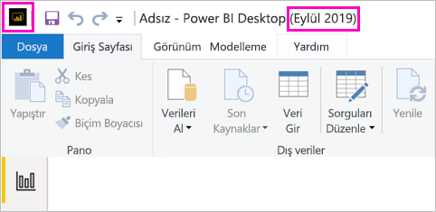

# Power BI Rapor Sunucusu için en iyi duruma getirilmiş Power BI Desktop uygulamasını yükleme

Power BI Rapor Sunucusu için Power BI raporları oluşturmak istiyorsanız Power BI Rapor Sunucusu için en iyi duruma getirilmiş Power BI Desktop sürümünü indirip yüklemeniz gerekir. Bu, Power BI hizmetiyle kullanılan Power BI Desktop'tan farklı bir sürümdür. Örneğin, Power BI hizmetine yönelik Power BI Desktop sürümü, genel kullanıma sunulana kadar Power BI Rapor Sunucusu sürümünde yer almayan önizleme özellikleri içerir. Bu sürümün kullanılması, rapor sunucusunun; raporların ve modelin bilinen bir sürümüyle etkileşim kurabilmesini sağlar. 

İyi haber şu: Power BI Desktop ile Power BI Rapor Sunucusu için en iyi duruma getirilmiş Power BI Desktop uygulamaları aynı bilgisayarda yan yana yüklü olabilir.

## Power BI Desktop uygulamasını indirme ve yükleme

Power BI Rapor Sunucusu için en iyi duruma getirilmiş Power BI Desktop'ın en güncel sürümüne sahip olduğunuzdan emin olmanın en kolay yolu rapor sunucunuzun web portalına gitmektir.

1. Rapor sunucusu web portalında, **İndir** okunu ve ardından **Power BI Desktop**'ı seçin.

    

    Veya [Power BI Rapor Sunucusu](https://powerbi.microsoft.com/report-server/) giriş sayfasına giderek **Gelişmiş indirme seçenekleri**’ni belirleyin.

2. İndirme Merkezi sayfasında bir dil seçin, ardından **İndir** seçeneğini belirtin.

3. Bilgisayarınıza bağlı olarak, şu seçeneklerden birini belirleyin: 

    - **PBIDesktopRS.msi** (32 bit sürümü) veya
    - **PBIDesktopRS_x64.msi** (64 bit sürümü).

1. Yükleyiciyi indirdikten sonra, Power BI Desktop (Eylül 2019) Kurulum Sihirbazını çalıştırın.

2. Yüklemenin sonunda **Power BI Desktop’ı Başlat**’ı seçin.

    Uygulama otomatik olarak başlatılır ve kullanımınıza hazır hale gelir.

## Doğru sürümü kullandığınızdan emin olma
Doğru Power BI Desktop'ı kullandığınızdan kolayca emin olabilirsiniz: Power BI Desktop'taki başlatma ekranına veya başlık çubuğuna bakın. Başlık çubuğundaki **Power BI Desktop (Eylül 2019)** ifadesi, doğru sürüme sahip olduğunuzu gösterir. Ayrıca Power BI logo renkleri de ters çevrilmiştir; artık sarı üstüne siyah değil siyah üstüne sarıdır.

Başlık çubuğunda Power BI hizmeti için Power BI Desktop sürümüne ilişkin ay ve yıl bilgisi görüntülenmez.

## Dosya uzantısı ilişkilendirme
Aynı makineye hem Power BI Desktop hem de Power BI Rapor Sunucusu için en iyi duruma getirilmiş Power BI Desktop uygulamasını yüklediyseniz, Power BI Desktop'ın en son yüklemesi .pbix dosyalarıyla ilişkilendirilir. Dolayısıyla, .pbix dosyasına çift tıkladığınızda en son yüklediğiniz Power BI Desktop'ı başlatır.

Power BI Desktop uygulaması yüklüyken Power BI Rapor Sunucusu için en iyi duruma getirilmiş Power BI Desktop uygulamasını yüklediyseniz, tüm .pbix dosyaları varsayılan olarak Power BI Rapor Sunucusu için en iyi duruma getirilmiş Power BI Desktop uygulamasıyla açılır. Power BI Desktop uygulamasının .pbix dosyaları için varsayılan seçenek olmasını istiyorsanız, [Power BI Desktop'ı Microsoft Store'dan](https://aka.ms/pbidesktopstore) yeniden yükleyin.

Öncelikli olarak kullanmak istediğiniz Power BI Desktop sürümünü kendiniz açabilirsiniz. Ardından dosyayı Power BI Desktop'tan açabilirsiniz.

Power BI Rapor Sunucusu’nda Power BI raporunu düzenlediğinizde veya web portalında yeni bir Power BI raporu oluşturduğunuzda her zaman doğru Power BI Desktop sürümü açılır.

## Önemli noktalar ve sınırlamalar

Power BI mobil uygulamalarında ve Power BI hizmetinde yer alan Power BI Rapor Sunucusu Power BI raporları (https://app.powerbi.com), birkaç farklı özellik dışında hemen hemen aynı görevi görür.

### Dil seçme

Power BI Rapor Sunucusu için iyileştirilmiş Power BI Desktop'ta uygulamayı yüklerken dili seçersiniz. Bunu daha sonra değiştiremezsiniz ama başka dildeki bir sürümü yükleyebilirsiniz.

### Tarayıcıda rapor görselleri

Power BI Rapor Sunucusu raporları özel görseller de dahil olmak üzere neredeyse tüm görselleştirmeleri destekler. Power BI Rapor Sunucusu raporları aşağıdakileri desteklemez:

* R görselleri
* ArcGIS haritaları
* İçerik haritaları
* Power BI Desktop önizleme özellikleri

### Power BI mobil uygulamalarında raporlar

Power BI Rapor Sunucusu raporları, [Power BI mobil uygulamalarında](../consumer/mobile/mobile-apps-for-mobile-devices.md) aşağıdakiler de dahil olmak üzere tüm temel işlevleri destekler:

* [Telefon raporu düzeni](../desktop-create-phone-report.md): Bir raporu Power BI mobil uygulamaları için en iyi duruma getirebilirsiniz. En iyi duruma getirilmiş raporlar cep telefonunuzda özel bir simge () ve düzenle gösterilir.
  
    

Power BI Rapor Sunucusu, Power BI mobil uygulamalarında şu özellikleri desteklemez:

* R görselleri
* ArcGIS haritaları
* Özel görseller
* İçerik haritaları
* Coğrafi filtreleme veya barkodlar

### Özel Güvenlik

Power BI Rapor Sunucusu için iyileştirilmiş Power BI Desktop, özel güvenlik desteği sunmaz. Power BI Rapor Sunucunuzun özel güvenlik uzantısıyla yapılandırılmış olması halinde Power BI Desktop'tan (Power BI Rapor Sunucusu için iyileştirilmiş) Power BI Rapor Sunucusu örneğine Power BI raporu kaydedemezsiniz. Rapor dosyasını Power BI Desktop'tan .pbix biçiminde kaydetmeniz ve Power BI Rapor Sunucusu portalına yüklemeniz gerekir.

## Önceki Power BI Rapor Sunucusu sürümleri için Power BI Desktop

Rapor sunucunuz önceki bir sürümse, ilgili Power BI Desktop sürümü gerekir. Önceki sürümü indirme bağlantısı aşağıda verilmiştir.

- Microsoft Power BI Desktop ([Power BI Rapor Sunucusu için en iyi duruma getirilmiş - Eylül 2019](https://go.microsoft.com/fwlink/?linkid=2103723))

## Sonraki adımlar

Power BI Desktop uygulamasını yüklediğinizde göre Power BI raporu oluşturmaya başlayabilirsiniz.

[Power BI Rapor Sunucusu için Power BI raporu oluşturma](quickstart-create-powerbi-report.md)  
[Power BI Rapor Sunucusu nedir?](get-started.md)

Başka bir sorunuz mu var? [Power BI Topluluğu'na sorun](https://community.powerbi.com/)
