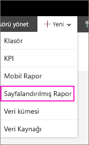

# Report Builder'ı yükleme - Power BI Rapor Sunucusu

Report Builder, kullanıcıların veya yöneticilerin bilgisayarına yükleyebileceği tek başına çalışan bir uygulamadır. Uygulamayı Microsoft İndirme Merkezi'nden veya Power BI Rapor Sunucusu'ndan yükleyebilirsiniz.  

Power BI hizmeti için Report Builder'ı yükleme konusunda yardım almak mı istiyorsunuz? [Power BI Report Builder](../paginated-reports/report-builder-power-bi.md) makalesine bakın.
  
Genellikle bir yönetici, Power BI Rapor Sunucusu'nu yükleyip yapılandırır, Report Builder'ın web portalından indirilmesine izin verir ve rapor sunucusunda bulunan rapor klasörlerini, izinleri ve paylaşılan veri kümelerini yönetir. Power BI Rapor Sunucusu'nu yönetme hakkında daha fazla bilgi için bkz. [Yönetici genel bakışı, Power BI Rapor Sunucusu](admin-handbook-overview.md).  
  
## Sistem Gereksinimleri
  
 Microsoft İndirme Merkezi'ndeki [Report Builder indirme sayfasının](https://go.microsoft.com/fwlink/?LinkID=734968)**Sistem gereksinimleri** bölümünü inceleyin.
 
## Report Builder'ı web portalından yükleme
  
Report Builder'ı Power BI Rapor Sunucusu web portalından yükleyebilirsiniz. Bir SSRS sunucusu için rapor oluşturmak üzere Rapor Oluşturucusu'nu zaten yüklemiş olabilirsiniz. Power BI Rapor Sunucusu için rapor oluşturmak üzere aynı sürümü veya Rapor Oluşturucusu'nu kullanabilirsiniz. Rapor Oluşturucu'sunu henüz yüklemediyseniz bunu kolayca yapabilirsiniz.

1. Power BI Rapor Sunucusu web portalında **Yeni** > **Sayfalandırılmış Rapor** seçeneğini belirleyin.
   
    
   
    Report Builder yüklü değilse Microsoft Report Builder Sihirbazı açılır.  
  
3.  Lisans sözleşmesinin koşullarını kabul edin ve **İleri**'yi seçin.  
 
5.  Rapor Builder yüklemesini tamamlamak için **Yükle**'yi seçin.  

2. Rapor Oluşturucusu yüklendikten sonra **Yeni Rapor veya Veri Kümesi**  ekranıyla açılır.
   
    
 

##   Report Builder'ı İndirme Merkezi'nden yükleme  
  
1.  [Microsoft İndirme Merkezi'ndeki Report Builder sayfasında](https://go.microsoft.com/fwlink/?LinkID=734968) **İndir**'i seçin.  
  
2.  Report Builder indirildikten sonra **Çalıştır**'ı seçin.  
  
     Microsoft Report Builder Sihirbazı açılır.  
  
3.  Lisans sözleşmesinin koşullarını kabul edin ve **İleri**'yi seçin.  
 
5.  Rapor Builder yüklemesini tamamlamak için **Yükle**'yi seçin.  
 

## Sonraki adımlar

[Power BI Rapor Sunucusu nedir?](get-started.md)
