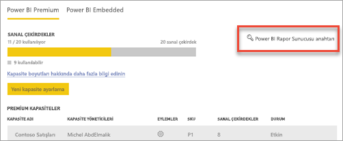
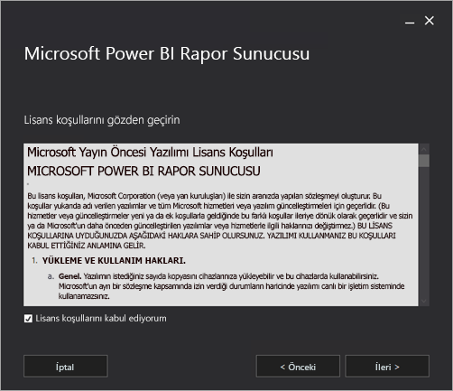

# Power BI Rapor Sunucusu'nu yükleme

Power BI Rapor Sunucusu'nu nasıl yükleyeceğinizi öğrenin.

## Power BI Rapor Sunucusunu indirin

Microsoft İndirme Merkezi'nden [Power BI Rapor Sunucusu'nu indirin](https://www.microsoft.com/download/details.aspx?id=56722).

Ücretsiz bir deneme sürümü de vardır. [Power BI Rapor Sunucusu ile şirket içi raporlama](https://powerbi.microsoft.com/report-server/) sayfasında **Ücretsiz denemeyi indirin** öğesini seçin.

## Yüklemeden önce

Power BI Rapor Sunucusu'nu yüklemeden önce [Power BI Rapor Sunucusu'nu yüklemeye ilişkin Donanım ve Yazılım Gereksinimleri](system-requirements.md) sayfasını incelemenizi öneririz.

 > [!IMPORTANT]
 > Power BI Rapor Sunucusu, Salt Okunur Etki Alanı Denetleyicisine (RODC) sahip bir ortama yüklenebilse de Power BI Rapor Sunucusu, düzgün şekilde çalışmak için bir Okuma-Yazma Etki Alanı Denetleyicisi erişimine ihtiyaç duyar. Power BI Rapor Sunucusu yalnızca RODC erişimine sahipse hizmeti yönetmeye çalışırken hatalarla karşılaşabilirsiniz.

### Power BI Rapor Sunucusu ürün anahtarı

Power BI Rapor Sunucusu için ürün anahtarını iki farklı kaynaktan alabilirsiniz:

- Power BI Premium
- SQL Server Enterprise Yazılım Güvencesi (YG)

Ayrıntılar için okumaya devam edin.

#### Power BI Premium

Power BI Premium'u satın aldıysanız Power BI yönetici portalının **Premium ayarları** sekmesine giderek Power BI Rapor Sunucusu ürün anahtarınıza erişebilirsiniz. Bu yalnızca Power BI hizmeti yönetici rolüne atanan kullanıcılar veya Genel Yöneticiler tarafından kullanılabilir.

**Power BI Rapor Sunucusu anahtarı**'nı seçtiğinizde ürün anahtarınızı içeren bir iletişim kutusu görüntülenir. Ürün anahtarınızı kopyalayıp yükleme esnasında kullanabilirsiniz.

#### SQL Server Enterprise Yazılım Güvencesi (YG)

SQL Server Enterprise YG sözleşmeniz varsa ürün anahtarınızı [Toplu Lisanslama Hizmeti Merkezi](https://www.microsoft.com/Licensing/servicecenter/)'nden edinebilirsiniz.

## Rapor sunucunuzu yükleme

Power BI Rapor Sunucusu'nu yükleme adımları oldukça kolaydır. Dosyaları yüklemek için uygulamanız gereken yalnızca birkaç adım vardır.

Yükleme sırasında SQL Server Veritabanı Altyapısı sunucusuna ihtiyacınız yoktur. Yükleme sonrasında Reporting Services'i yapılandırmak için bu sunucuya ihtiyacınız olacaktır.

1. PowerBIReportServer.exe dosyasını bulun ve yükleyiciyi başlatın.

2. **Power BI Rapor Sunucusu'nu yükle**'yi seçin.

    
3. Yüklenecek sürümü belirleyip **İleri**'yi seçin.

    

    Açılan menüde bulunan Değerlendirme veya Geliştirici sürümünü seçebilirsiniz.

    

    Alternatif olarak, Power BI hizmetinden veya Toplu Lisans Hizmeti Merkezi'nden aldığınız ürün anahtarını girin. Ürün anahtarınızı alma hakkında daha fazla bilgi için yukarıdaki [Yüklemeden önce](#before-you-install) bölümüne bakın.
4. Lisans hüküm ve koşullarını okuyup kabul ettikten sonra **İleri**'yi seçin.

    
5. Rapor sunucusu veritabanını depolamak için bir Veritabanı Altyapısı sunucusuna ihtiyacınız yoktur. Yalnızca rapor sunucusunu yüklemek için **İleri**'yi seçin.

    
6. Rapor sunucusunun yükleneceği konumu belirtin. Devam etmek için **Yükle**'yi seçin.

    

    Varsayılan yol: C:\Program Files\Microsoft Power BI Report Server.

7. Kurulum başarılı olduktan sonra Reporting Services Yapılandırma Yöneticisi'ni başlatmak için **Rapor Sunucusunu Yapılandır**'ı seçin.

    

## Rapor sunucunuzu yapılandırma

Kurulumda **Rapor Sunucusunu Yapılandır**'ı seçtiğinizde Reporting Services Yapılandırma Yöneticisi açılır. Daha fazla bilgi için bkz. [Reporting Services Yapılandırma Yöneticisi](https://docs.microsoft.com/sql/reporting-services/install-windows/reporting-services-configuration-manager-native-mode).

Reporting Services'in ilk yapılandırmasını tamamlamak için [rapor sunucusu veritabanı oluşturmanız](https://docs.microsoft.com/sql/reporting-services/install-windows/ssrs-report-server-create-a-report-server-database) gerekir. Bu adımı tamamlamak için bir SQL Server Veritabanı sunucusu gerekir.

### Farklı bir sunucuda veritabanı oluşturma

Rapor sunucusu veritabanını farklı bir makinedeki veritabanı sunucusunda oluşturuyorsanız rapor sunucusuna ilişkin hizmet hesabını, veritabanı sunucusunda tanınan bir hesap olarak değiştirmeniz gerekir. 

Rapor sunucusu varsayılan olarak sanal hizmet hesabını kullanır. Farklı bir sunucuda veritabanı oluşturmaya çalışırsanız Bağlantı hakları uygulanıyor adımında aşağıdaki hatayı alabilirsiniz.

`System.Data.SqlClient.SqlException (0x80131904): Windows NT user or group '(null)' not found. Check the name again.`

Geçici çözüm için, hizmet hesabını Ağ Hizmeti veya etki alanı hesabı olarak değiştirebilirsiniz. Hizmet hesabını Ağ Hizmeti olarak değiştirdiğinizde, rapor sunucusuna ilişkin makine hesabı bağlamındaki haklar uygulanır.

Daha fazla bilgi için bkz. [Rapor sunucusu hizmet hesabını yapılandırma](https://docs.microsoft.com/sql/reporting-services/install-windows/configure-the-report-server-service-account-ssrs-configuration-manager).

## Windows Hizmeti

Yükleme sırasında bir Windows hizmeti oluşturulur. Bu hizmet, **Power BI Rapor Sunucusu** olarak görüntülenir. Hizmetin adı **PowerBIReportServer** şeklindedir.

## Varsayılan URL ayırmaları

URL ayırmaları ön ek, ana bilgisayar adı, bağlantı noktası ve sanal dizinden oluşur:

| Bölüm | Açıklama |
| --- | --- |
| Ön ek |Varsayılan ön ek HTTP'dir. Daha önce bir Güvenli Yuva Katmanı (SSL) sertifikası yüklediyseniz kurulum, HTTPS ön ekini kullanan URL ayırmaları oluşturmaya çalışır. |
| Ana bilgisayar adı |Varsayılan ana bilgisayar adı güçlü bir joker karakterdir (+). Rapor sunucusunun, belirtilen bağlantı noktasında ilgili bilgisayara çözümlenen tüm ana bilgisayar adlarına ait HTTP isteklerini (`http://<computername>/reportserver`, `http://localhost/reportserver` veya `http://<IPAddress>/reportserver.` dahil) kabul ettiğini belirtir |
| Bağlantı noktası |Varsayılan bağlantı noktası 80'dir. 80 haricinde bir bağlantı noktası kullanacaksanız web portalını tarayıcı penceresinde açtığınızda bunu URL'ye açıkça eklemeniz gerekir. |
| Sanal dizin |Varsayılan olarak, Rapor Sunucusu Web hizmetiniz ve web portalı Raporları için sanal dizinler ReportServer biçiminde oluşturulur. **reportserver**, Rapor Sunucusu Web hizmeti için varsayılan sanal dizindir. Web portalı için varsayılan sanal dizin ise **reports** dizinidir. |

Eksiksiz bir URL dizesi örneği şu şekildedir:

* `http://+:80/reportserver`, rapor sunucusuna erişim sağlar.
* `http://+:80/reports`, web portalına erişim sağlar.

## Güvenlik duvarı

Rapor sunucusuna uzak makineden erişiyorsanız gerekli güvenlik duvarı (varsa) kurallarını yapılandırdığınızdan emin olmanız gerekir.

Web Hizmeti URL'niz ve Web Portalı URL'niz için yapılandırmış olduğunuz TCP bağlantı noktasını açmanız gerekir. Varsayılan olarak, bu URL'ler 80 numaralı TCP bağlantı noktası üzerinde yapılandırılır.

## Ek yapılandırma

* Power BI panolarına rapor öğeleri sabitleyebilmek için Power BI hizmeti ile tümleştirme yapılandırmak isterseniz bkz. [Power BI hizmetiyle tümleştirme](https://docs.microsoft.com/sql/reporting-services/install-windows/power-bi-report-server-integration-configuration-manager).
* Abonelik işlemleri için e-posta yapılandırması gerçekleştirmek isterseniz bkz. [E-posta ayarları](https://docs.microsoft.com/sql/reporting-services/install-windows/e-mail-settings-reporting-services-native-mode-configuration-manager) ve [Rapor sunucusunda e-posta teslimi](https://docs.microsoft.com/sql/reporting-services/subscriptions/e-mail-delivery-in-reporting-services).
* Web portalını, raporları görüntülemek ve yönetmek için bir rapor bilgisayarından erişilebilecek şekilde yapılandırmak isterseniz bkz. [Configure a firewall for report server access (Rapor sunucusu erişimi için güvenlik duvarını yapılandırma)](https://docs.microsoft.com/sql/reporting-services/report-server/configure-a-firewall-for-report-server-access) ve [Configure a report server for remote administration (Rapor sunucusunu uzaktan yönetim için yapılandırma)](https://docs.microsoft.com/sql/reporting-services/report-server/configure-a-report-server-for-remote-administration).

## Sonraki adımlar

[Yönetici genel bakışı](admin-handbook-overview.md)  
[Rapor sunucusu ürün anahtarınızı bulma](find-product-key.md)  
[Power BI Rapor Sunucusu için en iyi duruma getirilmiş Power BI Desktop uygulamasını yükleme](install-powerbi-desktop.md)  
[Reporting Services yüklemesini doğrulama](https://docs.microsoft.com/sql/reporting-services/install-windows/verify-a-reporting-services-installation)  
[Rapor sunucusu hizmet hesabını yapılandırma](https://docs.microsoft.com/sql/reporting-services/install-windows/configure-the-report-server-service-account-ssrs-configuration-manager)  
[Rapor sunucusu URL'lerini yapılandırma](https://docs.microsoft.com/sql/reporting-services/install-windows/configure-report-server-urls-ssrs-configuration-manager)  
[Rapor sunucusu veritabanı bağlantısını yapılandırma](https://docs.microsoft.com/sql/reporting-services/install-windows/configure-a-report-server-database-connection-ssrs-configuration-manager)  
[Bir rapor sunucusunu başlatma](https://docs.microsoft.com/sql/reporting-services/install-windows/ssrs-encryption-keys-initialize-a-report-server)  
[Rapor sunucusunda SSL bağlantılarını yapılandırma](https://docs.microsoft.com/sql/reporting-services/security/configure-ssl-connections-on-a-native-mode-report-server)  
[Configure windows service accounts and permissions (Windows hizmet hesaplarını ve izinleri yapılandırma)](https://docs.microsoft.com/sql/database-engine/configure-windows/configure-windows-service-accounts-and-permissions)  
[Power BI Rapor Sunucusu için tarayıcı desteği](browser-support.md)

Başka bir sorunuz mu var? [Power BI Topluluğu'na sorun](https://community.powerbi.com/)