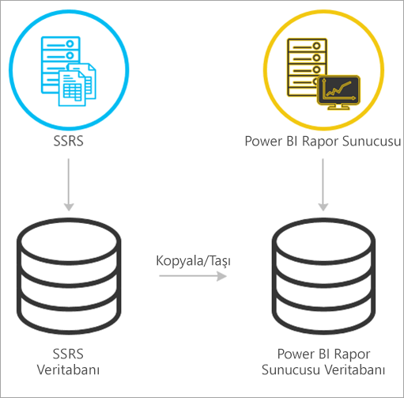
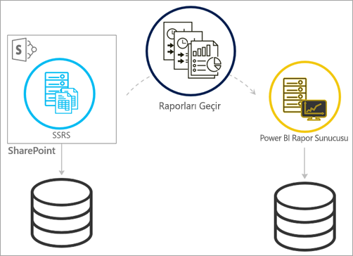
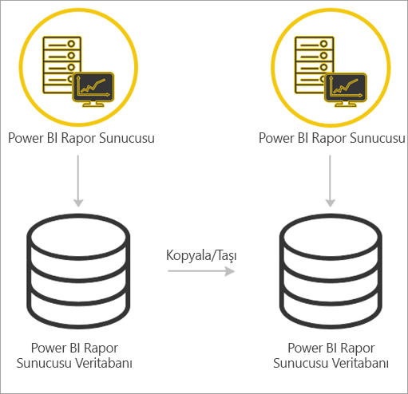

# <a name="migrate-a-report-server-installation"></a>Bir rapor sunucusu yüklemesini geçirme

Bir Power BI Rapor Sunucusu örneğine mevcut SQL Server Reporting Services (SSRS) örneğinizi geçirmeyi öğrenin.

Geçiş, uygulama verisi dosyalarını yeni bir Power BI Rapor Sunucusu örneğine taşımak olarak tanımlanır. Şu nedenlerden yüklemenizi geçirmek isteyebilirsiniz:

* SQL Server Reporting Services'den Power BI Rapor Sunucusu'na geçmek istiyorsunuz
  
  > [!NOTE]
  > SQL Server Reporting Services'den Power BI Rapor Sunucusu'na geçiş için yerleşik bir yükseltme seçeneği mevcut değildir. Geçiş gereklidir.

* Büyük bir ölçek dağıtımına veya güncelleştirmeye ilişkin gereksinimleriniz var
* Yüklemenizin donanımını veya topolojisini değiştiriyorsunuz
* Yükseltmeyi engelleyen bir sorunla karşılaşıyorsunuz

## <a name="migrating-to-power-bi-report-server-from-ssrs-native-mode"></a>SSRS'den (Yerel mod) Power BI Rapor Sunucusu'na geçiş

Bir SSRS (Yerel mod) örneğinden Power BI Rapor Sunucusu'na geçiş birkaç adımdan oluşur.



> [!NOTE]
> SQL Server 2008 Reporting Services ve sonraki sürümleri geçiş için desteklenmektedir.

* Veritabanı, uygulama ve yapılandırma dosyalarını yedekleme
* Şifreleme anahtarını yedekleme
* Raporlarınızı barındıran rapor sunucusu veritabanınızı kopyalama
* Power BI Rapor Sunucusu'nu yükleyin. Aynı donanımı kullanıyorsanız Power BI Rapor Sunucusu'nu SSRS örneğinin bulunduğu sunucuya yükleyebilirsiniz. Power BI Rapor Sunucusu'nu yükleme hakkında daha fazla bilgi için bkz. [Power BI Rapor Sunucusu'nu yükleme](install-report-server.md).

> [!NOTE]
> Power BI Rapor Sunucusu örneği *PBIRS* olarak adlandırılır.

* Rapor Sunucusu Yapılandırma Yöneticisi'ni kullanarak rapor sunucusunu yapılandırın ve kopyalanan veritabanına bağlanın.
* SSRS (Yerel mod) örneği için gereken tüm temizleme işlemlerini gerçekleştirme

## <a name="migration-to-power-bi-report-server-from-ssrs-sharepoint-integrated-mode"></a>SSRS'den (SharePoint ile tümleşik modu) Power BI Rapor Sunucusu'na geçiş

Bir SSRS'den (SharePoint ile tümleşik modu) Power BI Rapor Sunucusu'na geçiş yerel moddaki kadar basit değildir. Bu adımlar bazı konularda yol gösterici olsa da SharePoint'te bu adımların dışında yönetilmesi gereken başka dosyalarınız ve varlıklarınız olabilir.



SharePoint'teki belirli rapor sunucusu içeriklerinizi Power BI Rapor Sunucunuza geçirmeniz gerekir. Power BI Rapor Sunucusu'nun ortamınızdaki herhangi bir konumda zaten yüklü olması gerekir. Power BI Rapor Sunucusu'nu yükleme hakkında daha fazla bilgi için bkz. [Power BI Rapor Sunucusu'nu yükleme](install-report-server.md).

SharePoint ortamınızdaki rapor sunucusu içeriğini Power BI Rapor Sunucusu'na kopyalamak istiyorsanız içeriği kopyalamak için **rs.exe** gibi araçları kullanmanız gerekir. Aşağıda, SharePoint'teki rapor sunucusu içeriğini Power BI Rapor Sunucusu'na kopyalamaya yönelik betiğin nasıl görüneceğine ilişkin bir örnek verilmiştir.

> [!NOTE]
> Örnek betik, SharePoint 2010 ve sonraki sürümlerine ve SQL Server 2008 Reporting Services ve sonraki sürümlerine yönelik olarak çalışır.

### <a name="sample-script"></a>Örnek betik

```
Sample Script
rs.exe
-i ssrs_migration.rss -e Mgmt2010
-s http://SourceServer/_vti_bin/reportserver
-v st="sites/bi" -v f="Shared Documents“
-u Domain\User1 -p Password
-v ts=http://TargetServer/reportserver
-v tu="Domain\User" -v tp="Password"
```

## <a name="migrating-from-one-power-bi-report-server-to-another"></a>Bir Power BI Rapor Sunucusu'ndan başka bir Power BI Rapor Sunucusu'na geçiş

Bir Power BI Rapor Sunucusu'ndan geçiş yaparken izlenen süreç, SSRS'den (yerel mod) geçiş yapılırken izlenen süreçle aynıdır.



* Veritabanı, uygulama ve yapılandırma dosyalarını yedekleme
* Şifreleme anahtarını yedekleme
* Raporlarınızı barındıran rapor sunucusu veritabanınızı kopyalama
* Power BI Rapor Sunucusu'nu yükleyin. Power BI Rapor Sunucusu'nu, geçişi yapmak istediğiniz kaynak sunucuya *yükleyemezsiniz*. Power BI Rapor Sunucusu'nu yükleme hakkında daha fazla bilgi için bkz. [Power BI Rapor Sunucusu'nu yükleme](install-report-server.md).

> [!NOTE]
> Power BI Rapor Sunucusu örneği *PBIRS* olarak adlandırılır.

* Rapor Sunucusu Yapılandırma Yöneticisi'ni kullanarak rapor sunucusunu yapılandırın ve kopyalanan veritabanına bağlanın.
* Eski Power BI Rapor Sunucusu yüklemesi için gerekli tüm temizleme işlemlerini gerçekleştirin.

## <a name="next-steps"></a>Sonraki adımlar

[Yönetici genel bakışı](admin-handbook-overview.md)  
[Power BI Rapor Sunucusu'nu yükleme](install-report-server.md)  
[Script with the rs.exe Utility and the Web Service (rs.exe Yardımcı Programı ve Web Hizmeti ile kullanılan betik)](https://docs.microsoft.com/sql/reporting-services/tools/script-with-the-rs-exe-utility-and-the-web-service)

Başka bir sorunuz mu var? [Power BI Topluluğu'na sorun](https://community.powerbi.com/)