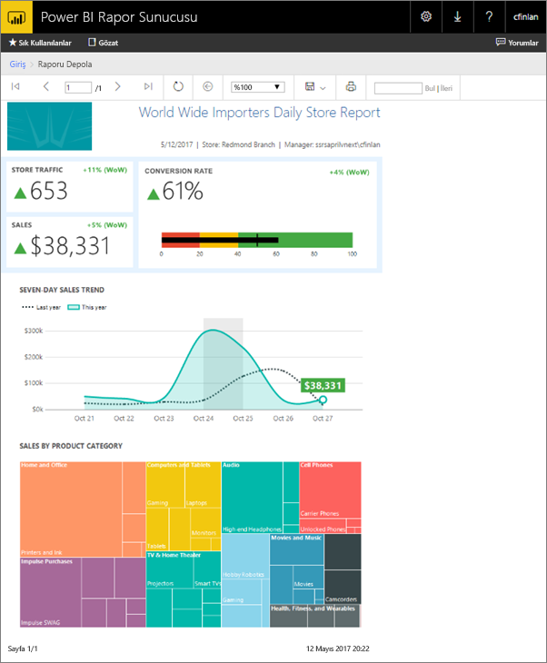
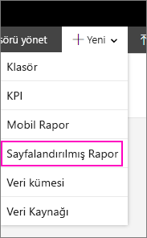
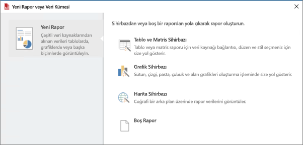
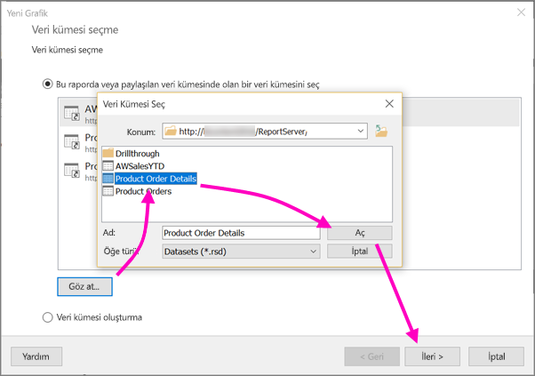
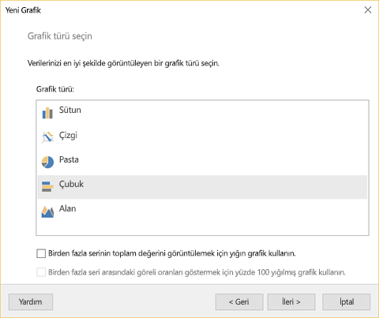
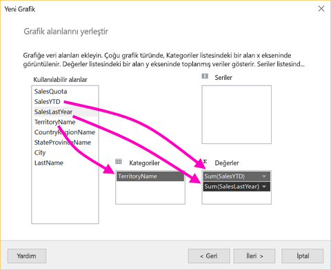
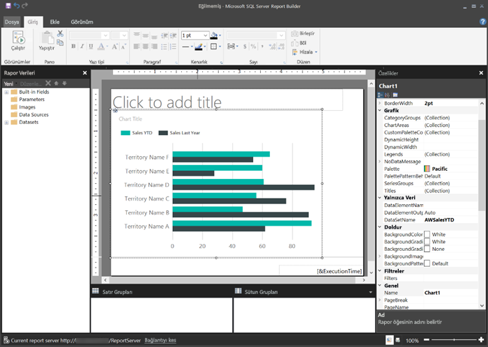
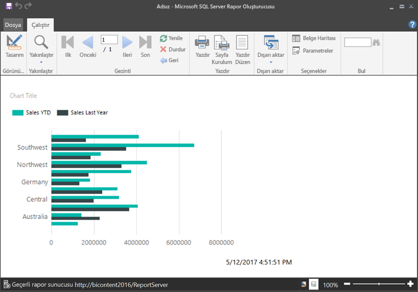
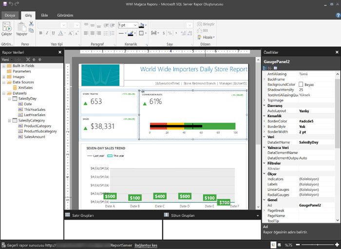

# Power BI Rapor Sunucusu için sayfalandırılmış rapor oluşturma
Adından da anlaşılacağı gibi sayfalandırılmış raporlar birçok sayfayı çalıştırabilir. Bunlar, sabit bir biçimde düzenlenmiştir ve tam özelleştirme sunar. Sayfalandırılmış raporlar .rdl dosyalarıdır.

Tıpkı SQL Server Reporting Services (SSRS) web portalında yaptığınız gibi, sayfalandırılmış raporları Power BI Rapor Sunucusu web portalında depolayabilir ve yönetebilirsiniz. Sayfalandırılmış raporları SQL Server Veri Araçları'ndaki (SSDT) Rapor Oluşturucusu'nu veya Rapor Tasarımcısı'nı kullanarak oluşturur ve düzenler, ardından da bu iki web portalından birinde yayımlarsınız. Böylece kuruluşunuzdaki rapor okuyucular raporları bir tarayıcıda veya mobil cihazlarındaki Power BI mobil uygulamasında görüntüleyebilir.

Rapor Oluşturucusu'nda veya Rapor Tasarımcısı'nda zaten sayfalandırılmış raporlar oluşturduysanız Power BI Rapor Sunucusu için sayfalandırılmış raporlar oluşturmaya hazırsınız demektir. Aksi halde, bu hızlı adımlar sayesinde işe koyulabilirsiniz.

## 1\. Adım: Rapor Oluşturucusu'nu yükleme ve başlatma
Bir SSRS sunucusu için rapor oluşturmak üzere Rapor Oluşturucusu'nu zaten yüklemiş olabilirsiniz. Power BI Rapor Sunucusu için rapor oluşturmak üzere aynı sürümü veya Rapor Oluşturucusu'nu kullanabilirsiniz. Rapor Oluşturucu'sunu henüz yüklemediyseniz bunu kolayca yapabilirsiniz.

1. Power BI Rapor Sunucusu web portalında **Yeni** > **Sayfalandırılmış Rapor** seçeneğini belirleyin.
   
    
   
    Rapor Oluşturucusu yüklü değilse bu seçeneği belirlemenizin ardından yükleme işlemini gerçekleştirmek üzere yönlendirilirsiniz.
2. Rapor Oluşturucusu yüklendikten sonra **Yeni Rapor veya Veri Kümesi**  ekranıyla açılır.
   
    
3. Oluşturmak istediğiniz rapor türüne ilişkin sihirbazı seçin:
   
   * Tablo veya matris
   * Grafik
   * Harita
   * Boş
4. Grafik sihirbazını kullanarak başlayalım.
   
    Grafik sihirbazı bir raporda temel bir grafik oluşturmaya yönelik adımlar boyunca sizi yönlendirir. Buradan, raporunuzu hemen hemen sınırsız sayıda yöntemle özelleştirebilirsiniz.

## 2\. Adım: Grafik sihirbazını kullanma
Grafik sihirbazı bir raporda görselleştirme oluşturmaya yönelik temel adımlar boyunca sizi yönlendirir.

Sayfalandırılmış raporlar Microsoft SQL Server ve Microsoft Azure SQL Veritabanı'ndan tutun da Oracle, Hyperion ve çok daha fazlasına kadar çok çeşitli veri kaynaklarına bağlanabilir. [Sayfalandırılmış raporlar tarafından desteklenen veri kaynakları](connect-data-sources.md) hakkında bilgi edinin.

Grafik sihirbazının **Veri kümesi seçin** adlı ilk sayfasında veri kümesi oluşturabilir veya bir sunucuda paylaşılan bir veri kümesini seçebilirsiniz. *Veri kümeleri*, dış veri kaynağındaki bir sorgudan rapor verileri döndürür.

1. **Gözat** seçeneğini belirleyin, bir sunucuda paylaşılan bir veri kümesini seçin ve ardından **Aç** > **Sonraki** seçeneğini belirleyin.
   
    
   
     Veri kümesi oluşturmanız mı gerekiyor? Bkz. [Paylaşılan veya eklenen bir veri kümesi oluşturma](https://docs.microsoft.com/sql/reporting-services/report-data/create-a-shared-dataset-or-embedded-dataset-report-builder-and-ssrs).
2. Bir grafik türü (bu örnekte, çubuk grafik) seçin.
   
    
3. Alanları **Kategoriler**, **Seriler** ve **Değerler** kutularına sürükleyerek düzenleyin.
   
    
4. **Sonraki** > **Son** seçeneğini belirleyin.

## 3\. Adım: Raporunuzu tasarlama
Şimdi Rapor Tasarım görünümündesiniz. Verilerin kendi verileriniz değil yer tutucu veriler olduğuna dikkat edin.

* Verilerinizi görüntülemek için **Çalıştır**'ı seçin.
  
     
* Tasarım görünümüne geri dönmek için **Tasarım**'ı seçin.

Düzeni, değerleri veya açıklamayı değiştirerek (hemen hemen istediğiniz her değişikliği yaparak), oluşturduğunuz grafiği değiştirebilirsiniz.

Ayrıca diğer her türlü görselleştirmeyi ekleyebilirsiniz: ölçerler, tablolar, matrisler, haritalar ve daha fazlası... Birden fazla sayfa için üst bilgi ve altbilgi ekleyebilirsiniz. Bu işlemleri kendi başınıza denemek için bkz. [Report Builder tutorials (Rapor Oluşturucusu eğitimleri)](https://docs.microsoft.com/sql/reporting-services/report-builder-tutorials).

## 4\. Adım: Raporunuzu rapor sunucusuna kaydetme
Raporunuz hazır olduğunda bu raporu Power BI Rapor Sunucusu'na kaydedin.

1. **Dosya** menüsünde **Farklı kaydet** seçeneğini belirleyin ve raporu rapor sunucusuna kaydedin. 
2. Artık raporu tarayıcıda görüntüleyebilirsiniz.
   
    

## Sonraki adımlar
SQL Server Veri Araçları'nı kullanarak Rapor Oluşturucusu'nda ve Rapor Tasarımcısı'nda rapor oluşturmaya yönelik çok sayıda harika kaynak mevcuttur. Rapor Oluşturucusu eğitimleri başlangıç yapmak için idealdir.

* [Report Builder tutorials (Rapor Oluşturucusu eğitimleri)](https://docs.microsoft.com/sql/reporting-services/report-builder-tutorials)
* [Power BI Rapor Sunucusu nedir?](get-started.md)  

Başka bir sorunuz mu var? [Power BI Topluluğu'na sorun](https://community.powerbi.com/)

