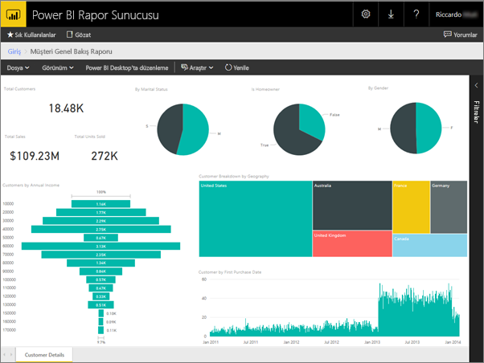
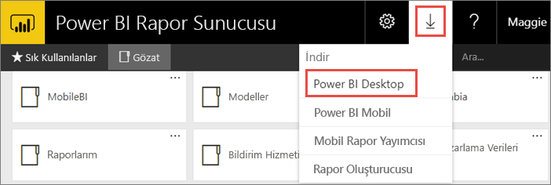
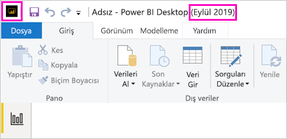
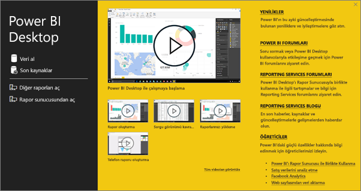
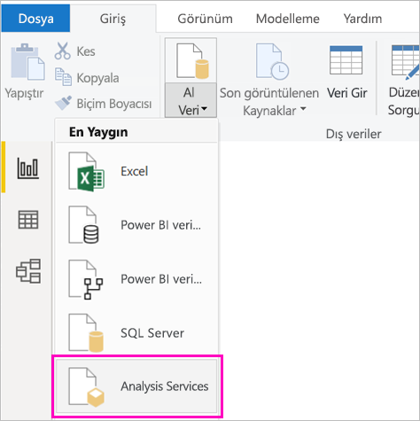
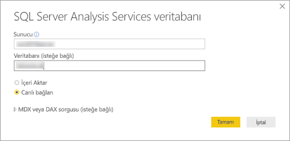
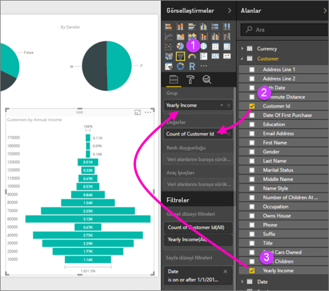
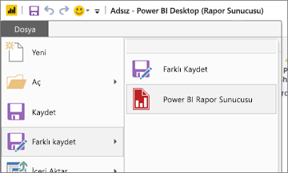

# Power BI Rapor Sunucusu için Power BI raporu oluşturma
Power BI raporlarını, bulut üzerindeki Power BI hizmetinde (https://powerbi.com) ) depoladığınız gibi şirket içi Power BI Rapor Sunucusu web portalında da depolayabilir ve yönetebilirsiniz. Raporları Power BI Desktop uygulamasında oluşturup düzenledikten sonra web portalında yayımlarsınız. Ardından kuruluşunuzdaki rapor okuyucuları bu raporları bir tarayıcıda veya mobil cihazlarındaki Power BI mobil uygulamasında görüntüleyebilir.

Hemen başlamanızı sağlayacak 4 adım:

## 1\. Adım: Power BI Rapor Sunucusu için en iyi duruma getirilmiş Power BI Desktop uygulamasını yükleme

Power BI Desktop uygulamasında Power BI raporları oluşturduysanız Power BI Rapor Sunucusu için Power BI raporları oluşturmaya neredeyse hazırsınız demektir. Sunucunun ve uygulamanın her zaman eşitlenmesini sağlamak üzere, Power BI Rapor Sunucusu için en iyi duruma getirilmiş Power BI Desktop sürümünü yüklemenizi öneririz. Power BI Desktop uygulamasının iki sürümünü de aynı bilgisayarda kullanabilirsiniz.

1. Rapor sunucusu web portalında, **İndir** okunu ve ardından **Power BI Desktop**'ı seçin.

    

    Veya [Power BI Rapor Sunucusu](https://powerbi.microsoft.com/report-server/) giriş sayfasına giderek **Gelişmiş indirme seçenekleri**’ni belirleyin.

2. İndirme Merkezi sayfasında, **İndir** seçeneğini belirleyin.

3. Bilgisayarınıza bağlı olarak, şu seçeneklerden birini belirleyin:

    - **PBIDesktopRS.msi** (32 bit sürümü) veya

    - **PBIDesktopRS_x64.msi** (64 bit sürümü).

4. Yükleyiciyi indirdikten sonra, Power BI Desktop (Eylül 2019) Kurulum Sihirbazını çalıştırın.

2. Yüklemenin sonunda **Start Power BI Desktop now** (Power BI Desktop'ı şimdi başlat) onay kutusunu işaretleyin.
   
    Uygulama otomatik olarak başlatılır ve kullanımınıza hazır hale gelir. Başlık çubuğundaki **Power BI Desktop (Eylül 2019)** ifadesi, doğru sürüme sahip olduğunuzu gösterir.

    

3. Power BI Desktop uygulamasını daha önceden kullanmadıysanız karşılama ekranındaki videoları izlemek isteyebilirsiniz.
   
    

## 2\. Adım: Veri kaynağı seçme
Çok çeşitli veri kaynaklarına bağlanabilirsiniz. [Veri kaynaklarına bağlanma](connect-data-sources.md) hakkında daha fazla bilgi edinin.

1. Karşılama ekranında **Veri Al**'ı seçin.
   
    Alternatif olarak, **Giriş** sekmesindeki **Veri Al** seçeneğini de belirleyebilirsiniz.
2. Veri kaynağınızı seçin. Bu örnekte **Analysis Services** kullanılmıştır.
   
    
3. **Sunucu** alanını ve isterseniz **Veritabanı** alanını doldurun. **Canlı bağlan**'ın seçili olduğundan emin olun ve **Tamam**'ı seçin.
   
    
4. Raporlarınızı kaydedeceğiniz rapor sunucusunu seçin.
   
    

## 3\. Adım: Raporunuzu tasarlama
İşte işin eğlenceli bölümüne geldik: Verilerinizi gösteren görselleştirmeler oluşturabilirsiniz.

Örneğin müşterilerinizi içeren bir huni grafik oluşturup değerleri yıllık gelire göre gruplandırabilirsiniz.

1. **Görsel Öğeler** bölümünde **Huni grafiği**'ni seçin.
2. Sayılacak alanı **Değerler** kutusuna sürükleyin. Söz konusu alan sayısal değilse Power BI Desktop bu alanı, otomatik olarak alanın *sayımına* dönüştürür.
3. Alanı **Grup** kutusundaki gruba sürükleyin.

[Power BI raporu tasarlama](../desktop-report-view.md) hakkında daha fazla bilgi edinin.

## 4\. Adım: Raporunuzu rapor sunucusuna kaydetme
Hazırladığınız raporu, 2. Adımda seçtiğiniz Power BI Rapor Sunucusu'na kaydedebilirsiniz.

1. **Dosya** menüsünde, **Farklı kaydet** > **Power BI Rapor Sunucusu**'nu seçin.
   
    
2. Artık bu raporu web portalında görüntüleyebilirsiniz.
   
    
    
> [!NOTE]
> Raporu daha sonra düzenlemek isterseniz, masaüstünde gördüğünüz rapor verileri rapor ilk oluşturulduğunda önbelleğe alınan verileri içerir.  Raporu düzenlerken en son verileri görmek için Power BI Desktop uygulamanızdaki verileri yenilemeniz gerekir.

## Sonraki adımlar
### Power BI Desktop
Power BI Desktop'ta rapor oluşturmak için faydalanabileceğiniz birçok harika kaynak vardır. Bu bağlantıyı iyi bir başlangıç noktasıdır.

* [Power BI Desktop ile çalışmaya başlama](../desktop-getting-started.md)
* Destekli öğrenim: [Power BI Desktop’ı keşfetme](/learn/modules/get-data-power-bi/2-getting-started-power-bi-desktop)

### Power BI Rapor Sunucusu
* [Power BI Rapor Sunucusu için en iyi duruma getirilmiş Power BI Desktop uygulamasını yükleme](install-powerbi-desktop.md)  
* [Power BI Rapor Sunucusu nedir?](get-started.md)  

Başka bir sorunuz mu var? [Power BI Topluluğu'na sorun](https://community.powerbi.com/)
