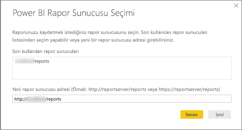

# Hızlı Başlangıç: Power BI Rapor Sunucusu için Power BI raporu oluşturma
Power BI raporlarını, bulut üzerindeki Power BI hizmetinde (https://powerbi.com) depoladığınız gibi şirket içi Power BI Rapor Sunucusu web portalında da depolayabilir ve yönetebilirsiniz. Raporları Power BI Desktop uygulamasında oluşturup düzenledikten sonra web portalında yayımlarsınız. Ardından kuruluşunuzdaki rapor okuyucuları bu raporları bir tarayıcıda veya mobil cihazlarındaki Power BI mobil uygulamasında görüntüleyebilir.

Hemen başlamanızı sağlayacak 4 adım:

## 1. Adım: Power BI Rapor Sunucusu için en iyi duruma getirilmiş Power BI Desktop uygulamasını yükleme

Power BI Desktop uygulamasında Power BI raporları oluşturduysanız Power BI Rapor Sunucusu için Power BI raporları oluşturmaya neredeyse hazırsınız demektir. Sunucunun ve uygulamanın her zaman eşitlenmesini sağlamak üzere, Power BI Rapor Sunucusu için en iyi duruma getirilmiş Power BI Desktop sürümünü yüklemenizi öneririz. Power BI Desktop uygulamasının iki sürümünü de aynı bilgisayarda kullanabilirsiniz.

1. Rapor sunucusu web portalında, **İndir** okunu ve ardından **Power BI Desktop**'ı seçin.

    

    Alternatif olarak, Microsoft İndirme Merkezi'nde doğrudan [Microsoft Power BI Desktop](https://go.microsoft.com/fwlink/?linkid=861076) (Power BI Rapor Sunucusu için iyileştirilmiş - Ekim 2017) sayfasına da gidebilirsiniz.

2. İndirme Merkezi sayfasında, **İndir** seçeneğini belirleyin.

3. Bilgisayarınıza bağlı olarak, şu seçeneklerden birini belirleyin:

    - **PBIDesktopRS.msi** (32 bit sürümü) veya

    - **PBIDesktopRS_x64.msi** (64 bit sürümü).

4. Yükleyiciyi indirdikten sonra, Power BI Desktop (Ekim 2017) Kurulum Sihirbazını çalıştırın.

2. Yüklemenin sonunda **Start Power BI Desktop now** (Power BI Desktop'ı şimdi başlat) onay kutusunu işaretleyin.
   
    Uygulama otomatik olarak başlatılır ve kullanımınıza hazır hale gelir. Başlık çubuğundaki "Power BI Desktop (Ekim 2017)" ifadesi, doğru sürüme sahip olduğunuzu gösterir.

    

3. Power BI Desktop uygulamasını daha önceden kullanmadıysanız karşılama ekranındaki videoları izlemek isteyebilirsiniz.
   
    

## 2. Adım: Veri kaynağı seçme
Çok çeşitli veri kaynaklarına bağlanabilirsiniz. [Veri kaynaklarına bağlanma](connect-data-sources.md) hakkında daha fazla bilgi edinin.

1. Karşılama ekranında **Veri Al**'ı seçin.
   
    Alternatif olarak, **Giriş** sekmesindeki **Veri Al** seçeneğini de belirleyebilirsiniz.
2. Veri kaynağınızı seçin. Bu örnekte **Analysis Services** kullanılmıştır.
   
    
3. **Sunucu** alanını ve isterseniz **Veritabanı** alanını doldurun. **Canlı bağlan**'ın seçili olduğundan emin olun ve **Tamam**'ı seçin.
   
    
4. Raporlarınızı kaydedeceğiniz rapor sunucusunu seçin.
   
    

## 3. Adım: Raporunuzu tasarlama
İşin eğlenceli kısmı: Verilerinizi gösteren görselleştirmeler oluşturabilirsiniz.

Örneğin müşterilerinizi içeren bir huni grafik oluşturup değerleri yıllık gelire göre gruplandırabilirsiniz.

1. **Görsel Öğeler** bölümünde **Huni grafiği**'ni seçin.
2. Sayılacak alanı **Değerler** kutusuna sürükleyin. Söz konusu alan sayısal değilse Power BI Desktop bu alanı, otomatik olarak alanın *sayımına* dönüştürür.
3. Alanı **Grup** kutusundaki gruba sürükleyin.

[Power BI raporu tasarlama](../desktop-report-view.md) hakkında daha fazla bilgi edinin.

## 4. Adım: Raporunuzu rapor sunucusuna kaydetme
Hazırladığınız raporu, 2. Adımda seçtiğiniz Power BI Rapor Sunucusu'na kaydedebilirsiniz.

1. **Dosya** menüsünde, **Farklı kaydet** > **Power BI Rapor Sunucusu**'nu seçin.
   
    
2. Artık bu raporu web portalında görüntüleyebilirsiniz.
   
    

## Önemli noktalar ve sınırlamalar
Power BI Rapor Sunucusu ve Power BI hizmetindeki (http://powerbi.com) raporlar, birkaç farklı özellik dışında neredeyse aynıdır.

### Tarayıcıda
Power BI Rapor Sunucusu raporları aşağıdakiler de dahil olmak üzere tüm görselleştirmeleri destekler:

* Özel görseller

Power BI Rapor Sunucusu raporları aşağıdakileri desteklemez:

* R görselleri
* ArcGIS haritaları
* İçerik haritaları

### Power BI mobil uygulamalarında
Power BI Rapor Sunucusu raporları, [Power BI mobil uygulamalarında](../mobile-apps-for-mobile-devices.md) aşağıdakiler de dahil olmak üzere tüm temel işlevleri destekler:

* [Telefon rapor düzeni](../desktop-create-phone-report.md): Bir raporu Power BI mobil uygulamaları için en iyi duruma getirebilirsiniz. En iyi duruma getirilmiş raporlar cep telefonunuzda özel bir simge () ve düzenle gösterilir.
  
    

Power BI Rapor Sunucusu, Power BI mobil uygulamalarında şu özellikleri desteklemez:

* R görselleri
* ArcGIS haritaları
* Özel görseller
* İçerik haritaları
* Coğrafi filtreleme veya barkodlar

## Sonraki adımlar
### Power BI Desktop
Power BI Desktop'ta rapor oluşturmak için faydalanabileceğiniz birçok harika kaynak vardır. Bu bağlantılar iyi birer başlangıç noktasıdır.

* [Power BI Desktop ile çalışmaya başlama](../desktop-getting-started.md)
* Destekli öğrenme: [Power BI Desktop ile çalışmaya başlama](../guided-learning/gettingdata.yml#step-2)

### Power BI Rapor Sunucusu
* [Install Power BI Desktop optimized for Power BI Report Server (Power BI Rapor Sunucusu için en iyi duruma getirilmiş Power BI Desktop uygulamasını yükleme)](install-powerbi-desktop.md)  
* [Power BI Rapor Sunucusu kullanıcı el kitabı](user-handbook-overview.md)  

Başka bir sorunuz mu var? [Power BI Topluluğu'na sorun](https://community.powerbi.com/)