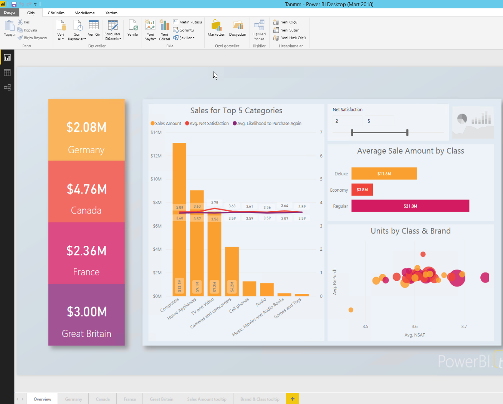

# <a name="embed-a-power-bi-report-server-report-using-an-iframe-in-sharepoint-server"></a>Power BI Rapor Sunucusu raporunu SharePoint Server’da bir iFrame kullanarak ekleme

Bu makalede, bir SharePoint sayfasında iFrame kullanarak bir Power BI Rapor Sunucusu raporunu eklemeyi öğreneceksiniz. SharePoint Online ile çalışıyorsanız, Power BI Rapor Sunucusu genel erişime açık olmalıdır. SharePoint Online’da Power BI hizmeti ile çalışan Power BI Web bölümü, Power BI Rapor Sunucusu ile birlikte çalışmaz.  


## <a name="prerequisites"></a>Önkoşullar
* [Power BI Rapor Sunucusu](https://powerbi.microsoft.com/report-server/) yüklü ve yapılandırılmış.
* [Power BI Rapor Sunucusu için en iyi duruma getirilmiş Power BI Desktop uygulaması](install-powerbi-desktop.md) yüklü.
* [SharePoint](https://docs.microsoft.com/sharepoint/install/install) ortamı yüklü ve yapılandırılmış.
* Internet Explorer 11 yalnızca SharePoint Online kullanılırken desteklenir.  İki senaryoda da desteklenen diğer tarayıcıları kullanabilirsiniz.

## <a name="create-the-power-bi-report-url"></a>Power BI rapor URL’si oluşturma

1. Github'dan örneği indirin: [Blog Tanıtımı](https://github.com/Microsoft/powerbi-desktop-samples). **Kopyala veya indir**’i, ardından **ZIP indir**’i seçin.

    

2. Zip dosyasını açın ve Power BI Rapor Sunucusu için en iyi duruma getirilmiş Power BI Desktop uygulamasında örnek .pbix dosyasını açın.

    

3. Raporu **Power BI Rapor Sunucusu**’na kaydedin. 

    

4. Power BI Rapor Sunucusu web portalında içeriği görüntüleyin.

    

### <a name="capture-the-url-parameter"></a>URL parametresini yakalama

URL'nizi edindikten sonra, raporun barındırılması için bir SharePoint sayfasında iFrame oluşturabilirsiniz. Herhangi bir Power BI Rapor Sunucusu rapor URL’si için, raporunuzu bir SharePoint iFrame'e eklemek üzere şu sorgu dizesi parametresini ekleyin: `?rs:embed=true`.

   Örnek:
    ``` 
    https://myserver/reports/powerbi/Sales?rs:embed=true
    ```
## <a name="embed-the-report-in-a-sharepoint-iframe"></a>Raporu bir SharePoint iFrame'e ekleme

1. SharePoint **Site İçeriği** sayfasına gidin.

    

2. Raporunuzu eklemek istediğiniz sayfayı seçin.

    

3. Sağ üst kısımdaki dişli simgesini ve sonra **Sayfayı düzenle**’yi seçin.

    

4. **Web Bölümü Ekle**’yi seçin.

5. **Kategoriler** altında **Medya ve İçerik**’i seçin. **Bölümler** altında **İçerik Düzenleyicisi**’ni ve **Ekle**’yi seçin.

    

6. **Yeni içerik eklemek için buraya tıklayın** öğesini seçin.

7. Üstteki menüden **Metin Biçimlendir**’i ve ardından **Kaynağı Düzenle**’yi seçin.

     

8. **Kaynağı Düzenle** penceresinde iFrame kodunuzu **HTML Kaynağı** içine yapıştırıp **Tamam**’ı seçin.

    

     Örnek:
     ```html
     <iframe width="800" height="600" src="https://myserver/reports/powerbi/Sales?rs:embed=true" frameborder="0" allowFullScreen="true"></iframe>
     ```

9. Üstteki menüde **Sayfa**’yı ve sonra **Düzenlemeyi Durdur**’u seçin.

    

    Rapor, sayfada görüntülenir.

    

## <a name="next-steps"></a>Sonraki adımlar

- [Power BI Rapor Sunucusu için Power BI raporu oluşturma](quickstart-create-powerbi-report.md).  
- [Power BI Rapor Sunucusu için sayfalandırılmış rapor oluşturma](quickstart-create-paginated-report.md).  

Başka bir sorunuz mu var? [Power BI Topluluğu'na başvurun](https://community.powerbi.com/). 
