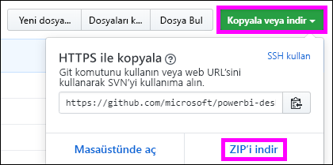

# <a name="quickstart-embed-a-power-bi-report-server-report-using-an-iframe-in-sharepoint-server"></a>Hızlı Başlangıç: Power BI Rapor Sunucusu raporunu SharePoint Server’da bir iFrame kullanarak ekleme

Bu hızlı başlangıçta, bir SharePoint sayfasında iFrame kullanarak bir Power BI Rapor Sunucusu raporunu eklemeyi öğreneceksiniz. SharePoint Online ile çalışıyorsanız, Power BI Rapor Sunucusu genel erişime açık olmalıdır. SharePoint Online’da Power BI hizmeti ile çalışan Power BI Web Bölümü, Power BI Rapor Sunucusu ile birlikte çalışmaz. 


## <a name="prerequisites"></a>Önkoşullar
* [Power BI Rapor Sunucusu](https://powerbi.microsoft.com/en-us/report-server/) yüklü ve yapılandırılmış olmalıdır.
* [Power BI Rapor Sunucusu için en iyi duruma getirilmiş Power BI Desktop](install-powerbi-desktop.md) uygulaması yüklü olmalıdır.
* Bir [SharePoint](https://docs.microsoft.com/en-us/sharepoint/install/install) ortamı yüklü ve yapılandırılmış olmalıdır.

## <a name="creating-the-power-bi-report-server-report-url"></a>Power BI Rapor Sunucusu rapor URL'si oluşturma

1. Github'dan örneği indirin - [Blog Tanıtımı](https://github.com/Microsoft/powerbi-desktop-samples).

    

2. **Power BI Rapor Sunucusu için en iyi duruma getirilmiş Power BI Desktop** uygulamasında GitHub’dan örnek PBIX dosyasını açın.

    

3. Raporu **Power BI Rapor Sunucusu**’na kaydedin. 

    

4. Raporu **Web Portalında** görüntüleyin.

    

### <a name="capturing-the-url-parameter"></a>URL parametresini yakalama

URL'nizi edindikten sonra, raporun barındırılması için bir SharePoint sayfasında iFrame oluşturabilirsiniz. Herhangi bir Power BI Rapor Sunucusu rapor URL’si için raporunuzu bir iFrame’e eklemek üzere bir `?rs:embed=true` sorgu dizesi parametresi ekleyebilirsiniz. 

   Örnek:
    ``` 
    http://myserver/reports/powerbi/Sales?rs:embed=true
    ```
## <a name="embedding-a-power-bi-report-server-report-in-a-sharepoint-iframe"></a>Power BI Rapor Sunucusu raporunu SharePoint iFrame’e ekleme

1. SharePoint **Site İçeriği** sayfasına gidin.

    

2. Raporunuzu eklemek istediğiniz sayfayı seçin.

    

3. Sağ üst kısımdaki dişli simgesini ve **Sayfayı Düzenle**’yi seçin.

    

4. **Web Bölümü Ekle**’yi seçin.

    

5. **Kategoriler** altında **Medya ve İçerik**’i seçin, **Bölümler** altında **İçerik Düzenleyicisi**’ni ve sonra **Ekle**’yi seçin.

     

6. **Yeni içerik eklemek için buraya tıklayın** öğesini seçin.

    

7. Şeritte **Metni Biçimlendir** sekmesini ve sonra **Kaynağı Düzenle**’yi seçin.

     

8. Kaynağı Düzenle penceresinde iFrame kodunuzu yapıştırıp Tamam’ı seçin.

    

     Örnek:
     ```
     <iframe width="800" height="600" src="http://myserver/reports/powerbi/Sales?rs:embed=true" frameborder="0" allowFullScreen="true"></iframe>
     ```

9. Şeritte **Sayfa** sekmesini ve **Düzenlemeyi Durdur**’u seçin.

    

10. Şimdi raporu sayfada görmeniz gerekir.

    

## <a name="next-steps"></a>Sonraki adımlar

[Hızlı Başlangıç: Power BI Rapor Sunucusu için Power BI raporu oluşturma](quickstart-create-powerbi-report.md)  
[Hızlı Başlangıç: Power BI Rapor Sunucusu için sayfalandırılmış rapor oluşturma](quickstart-create-paginated-report.md)  

Başka bir sorunuz mu var? [Power BI Topluluğu'na sorun](https://community.powerbi.com/) 