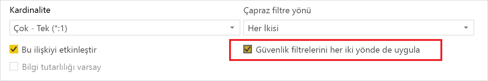
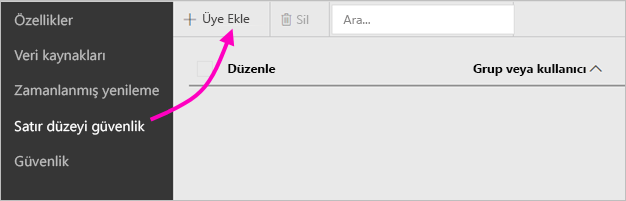
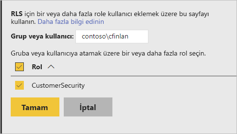
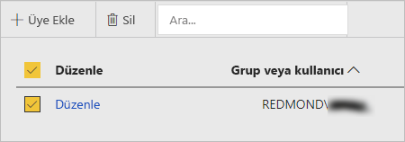

# Power BI Rapor Sunucusu'nda satır düzeyi güvenlik (RLS)

Power BI Rapor Sunucusu ile satır düzeyi güvenlik (RLS) ayarlandığında, belirli kullanıcıların veri erişimi kısıtlanabilir. Filtreler, veri erişimini satır düzeyinde sınırlar ve rollerin içinde filtre tanımlayabilirsiniz.  Power BI Rapor Sunucusu'nda varsayılan izinleri kullanıyorsanız, Power BI raporu üzerinde Yayımcı veya İçerik Yöneticisi izinlerine sahip olan her kullanıcı söz konusu rapora yönelik rollere üye atayabilir.    

Power BI Desktop ile Power BI'a aktarılan raporlar için RLS'yi yapılandırırsınız. Ayrıca, DirectQuery'yi kullanan SQL Server gibi raporlarda da RLS'yi yapılandırabilirsiniz.  DirectQuery bağlantınızın rapor okuyucuları için tümleşik kimlik doğrulamasını kullandığı durumlarda RLS'ye uyulmadığını unutmayın. Analysis Services canlı bağlantılarında satır düzeyi güvenliği şirket içi model üzerinde yapılandırırsınız. Güvenlik seçeneği, canlı bağlantı veri kümeleri için gösterilmez. 

[!INCLUDE [rls-desktop-define-roles](../includes/rls-desktop-define-roles.md)]

## Çift yönlü çapraz filtreleme

Varsayılan olarak, ilişkilerin tek yönlü veya çift yönlü olarak ayarlanmış olması fark etmeksizin satır düzeyi güvenlik filtrelemesi için tek yönlü filtreler kullanılır. Satır düzeyi güvenlikle çift yönlü çapraz filtreyi el ile etkinleştirebilirsiniz.

- İlişkiyi seçin ve **Güvenlik filtrelerini her iki yönde de uygula** onay kutusunu işaretleyin. 

    

Kullanıcı adı veya oturum açma kimliğine dayalı [dinamik satır düzeyi güvenlik](https://docs.microsoft.com/analysis-services/tutorial-tabular-1200/supplemental-lesson-implement-dynamic-security-by-using-row-filters) uyguladığınızda bu kutuyu işaretleyin. 

Daha fazla bilgi edinmek için [Power BI Desktop'ta DirectQuery'yi kullanarak çift yönlü çapraz filtreleme](../transform-model/desktop-bidirectional-filtering.md) makalesine ve [Tablolu BI Anlam Modelinin Güvenliğini Sağlama](https://download.microsoft.com/download/D/2/0/D20E1C5F-72EA-4505-9F26-FEF9550EFD44/Securing%20the%20Tabular%20BI%20Semantic%20Model.docx) başlıklı teknik incelemeye bakın.

[!INCLUDE [rls-desktop-view-as-roles](../includes/rls-desktop-view-as-roles.md)]

## Rollere üye ekleme 

Raporunuzu Power BI Rapor Sunucusu'nda kaydettikten sonra, güvenliği yönetir ve sunucuya üyeleri ekler veya kaldırırsınız. Yalnızca rapor üzerinde Yayımcı veya İçerik Yöneticisi izinleri olan kullanıcılara satır düzeyi güvenlik seçeneği sağlanır (seçenek soluk görüntülenmez).

 Raporda gerekli roller yoksa raporu Power BI Desktop'ta açmanız, rolleri eklemeniz veya değiştirmeniz, sonra da yeniden Power BI Rapor Sunucusu'na kaydetmeniz gerekir. 

1. Power BI Desktop'ta raporu Power BI Rapor Sunucusu'na kaydedin. Power BI Rapor Sunucusu için en iyi duruma getirilmiş Power BI Desktop sürümünü kullanmalısınız.
2. Power BI Rapor Hizmeti’nde raporun yanındaki üç noktayı ( **…** ) seçin. 

3. **Yönet** > **Satır düzeyi güvenlik** öğesini seçin. 

     

    **Satır düzeyi güvenlik** sayfasında, Power BI Desktop'ta oluşturduğunuz role üyeleri eklersiniz.

5. Üye eklemek için **Üye Ekle**'yi seçin.

1. Kutuya kullanıcıyı veya grubu Kullanıcı adı biçiminde (ETKİALANI\kullanıcı) girin ve ona atamak istediğiniz rolleri seçin. Üyenin kuruluşunuzun içinde gerekir.   

    

    Active Directory'yi nasıl yapılandırdığınıza bağlı olarak, buraya Kullanıcı Asıl Adını da girebilirsiniz. Bu durumda, Rapor Sunucusu buna karşılık gelen kullanıcı adını listede gösterir.

1. Uygulamak için **Tamam**'a tıklayın.   

8. Üyeleri kaldırmak için adlarının yanındaki kutuyu işaretleyin ve **Sil**'i seçin.  Bir kerede birden çok üyeyi silebilirsiniz. 

    

## username() ve userprincipalname()

Veri kümenizde username() veya userprincipalname() DAX işlevlerinden yararlanabilirsiniz. Bunları Power BI Desktop'taki ifadelerde kullanabilirsiniz. Modelinizi yayımladığınızda, Power BI Rapor Sunucusu bunları kullanır.

Power BI Desktop'ta username(), ETKİALANI\Kullanıcı biçiminde bir kullanıcı ve userprincipalname() de user@contoso.com biçiminde bir kullanıcı döndürür.

Power BI Rapor Sunucusu'nda username() ve userprincipalname() işlevlerinin her ikisi de kullanıcının bir e-posta adresine benzeyen Kullanıcı Asıl Adını (UPN) döndürür.

Power BI Rapor Sunucusu'nda özel kimlik doğrulaması kullanıyorsanız, kullanıcılar için ayarlamış olduğunuz kullanıcı adı biçimini döndürür.  

## Sınırlamalar 

Burada, Power BI modellerindeki satır düzeyi güvenlikle ilgili geçerli sınırlamaları bulabilirsiniz. 

username() DAX işlevinin kullanıldığı raporları olan kullanıcılar, tümleşik güvenlikle DirectQuery'nin kullanıldığı durumlar DIŞINDA Kullanıcı Asıl Adının (UPN) döndürülmesine neden olan yeni davranışı fark edeceklerdir.  Bu senaryoda RLS'ye uyulmadığından, senaryodaki davranış da değişmez.

RLS özelliğini yalnızca Power BI Desktop ile oluşturulan veri kümelerinde tanımlayabilirsiniz. RLS özelliğini Excel ile oluşturulmuş olan veri kümelerinde etkinleştirmek için, önce dosyalarınızı Power BI Desktop (PBIX) biçimine dönüştürmeniz gerekir. [Excel dosyalarını dönüştürme](../connect-data/desktop-import-excel-workbooks.md) hakkında daha fazla bilgi edinin.

Yalnızca depolanmış kimlik bilgilerinin kullanıldığı Ayıklama, Dönüştürme, Yükleme (ETL) ve DirectQuery bağlantıları desteklenir. Analysis Services'e yönelik canlı bağlantılar ve tümleşik kimlik doğrulamasının kullanıldığı DirectQuery bağlantıları temel veri kaynağında işlenir. 

DirectQuery ile tümleşik güvenlik kullanıyorsanız, kullanıcılarınız şunları fark edebilir:
- RLS devre dışı bırakılır ve tüm veriler döndürülür.
- Kullanıcılar rol atamalarını güncelleştiremez ve RLS Yönetme sayfasında hata alır.
- DAX username işlevi için, kullanıcı adını ETKİ ALANI\KULLANICI biçiminde almaya devam edersiniz. 

Rapor yazarları, raporu karşıya yükledikten sonra kendilerine uygun rolleri atayana kadar Power BI Rapor Sunucusu'nda rapor verilerini görüntüleme erişimine sahip olmazlar. 

 

## SSS 

### Bu rolleri Analysis Services veri kaynakları için oluşturabilir miyim? 

Verileri Power BI Desktop'a aktardıysanız oluşturabilirsiniz. Canlı bağlantı kullanıyorsanız Power BI hizmetinin içinden RLS'yi yapılandıramazsınız. RLS şirket içi Analysis Services modelinin içinde tanımlanır. 

### Kullanıcılarımın erişebileceği sütunları veya ölçüleri sınırlamak için RLS kullanabilir miyim? 

Hayır. Belirli bir veri satırına erişimi olan kullanıcılar, ilgili satırdaki tüm veri sütunlarını görebilir. 

### RLS, ayrıntılı verileri gizlerken görsellerde özetlenmiş verilere erişim vermemi sağlar mı? 

Hayır. Belirli veri satırlarının güvenliğini sağlayabilirsiniz, ama kullanıcılar ayrıntıları veya özetlenmiş verileri her zaman görebilir. 

### Mevcut rollerim ve üyelerim zaten atanmış durumdayken Power BI Desktop'a yeni roller ekleyebilir miyim? 

Evet. Power BI Rapor Sunucusu'nda zaten mevcut rolleriniz tanımlanmış ve üyeleriniz atanmışsa, ek roller oluşturabilir ve geçerli atamalarınızı etkilemeden raporunuzu yeniden yayımlayabilirsiniz. 
 

## Sonraki adımlar

[Power BI Rapor Sunucusu nedir?](get-started.md) 
[Yönetici el kitabı](admin-handbook-overview.md)  

Başka bir sorunuz mu var? [Power BI Topluluğu'na sorun](https://community.powerbi.com/)

