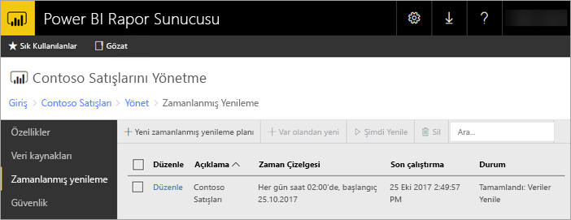

# Power BI Rapor Sunucusu'nda Power BI raporu zamanlanmış yenilemesi
Power BI raporları için zamanlanmış yenileme, bir rapora ilişkin verilerin güncel kalmasını sağlar.

Zamanlanmış yenileme, katıştırılmış modele sahip Power BI raporlarına özeldir. Bu, canlı bağlantı veya DirectQuery kullanmak yerine verileri rapora aktardığınız anlamına gelir. İçeri aktardığınız verilerin, özgün veri kaynağı ile olan bağlantısı kesilir ve verilerin güncel kalması için güncelleştirilmesi gerekir. Zamanlanmış yenileme, verilerinizi güncel tutmanızı sağlar.

Zamanlanmış yenileme, raporun yönetim bölümünden yapılandırılır. Zamanlanmış yenileme yapılandırması hakkında daha fazla bilgi için bkz. [How to configure Power BI report scheduled refresh (Power BI raporlarına ilişkin zamanlanmış yenilemeyi yapılandırma)](configure-scheduled-refresh.md).

## Nasıl çalışır?
Power BI raporlarınız için zamanlanmış yenileme özelliğini kullanırken birçok bileşenden faydalanırsınız.

* SQL Server Agent, zamanlanmış olaylar oluşturmak için zamanlayıcı görevi görür.
* Zamanlanmış işler, rapor sunucusu veritabanındaki etkinlik ve bildirim kuyruğuna eklenir. Geniş ölçekli bir dağıtımda kuyruk, dağıtımdaki tüm rapor sunucuları arasında paylaştırılır.
* Zamanlanmış olay nedeniyle gerçekleştirilen tüm rapor işlemleri arka planda çalıştırılır.
* Veri modeli bir Analysis Services örneğinde yüklenir.
* Bazı veri kaynakları için, veri kaynaklarıyla bağlantı kurma ve verileri dönüştürme amacıyla Power Query karma altyapısı kullanılır. Diğer veri kaynakları Power BI Rapor Sunucusu veri modellerini barındırmak için kullanılan bir Analysis Services hizmetinden doğrudan bağlanabilir.
* Yeni veriler Analysis Services'deki veri modeline yüklenir.
* Bir ölçek genişletme yapılandırması, veri modeli düğümler arasında çoğaltılabilir.
* Analysis Services, verileri işler ve gerekli hesaplamaları gerçekleştirir.

Power BI Rapor Sunucusu zamanlanmış tüm işlemler için bir olay kuyruğu oluşturur. Kuyruğu düzenli aralıklarla sorgulayarak yeni olayları denetler. Kuyruk varsayılan olarak 10 saniyelik aralıklarla taranır. RSReportServer.config dosyasındaki **PollingInterval**, **IsNotificationService** ve **IsEventService** yapılandırma ayarlarını düzenleyerek aralık değerini değiştirebilirsiniz. **IsDataModelRefreshService**, rapor sunucusunun zamanlanmış olayları işleyeceği zamanı belirlemek için de kullanılabilir.

### Analysis Services
Power BI raporu oluşturmak ve zamanlanmış yenileme gerçekleştirmek için Power BI raporu verilerinin Analysis Services'e yüklenmesi gerekir. Power BI Rapor Sunucusu ile birlikte çalışan bir Analysis Services işlemi mevcuttur.

## Önemli noktalar ve sınırlamalar
### Zamanlanmış yenilemenin kullanılamayacağı durumlar
Tüm Power BI raporlarında zamanlanmış yenileme planı oluşturulamaz. Zamanlanmış yenileme planı oluşturamayacağınız Power BI raporlarının listesi aşağıda verilmiştir.

* Raporunuzda canlı bağlantı kullanan bir veya daha fazla Analysis Services veri kaynağı mevcuttur.
* Raporunuzda DirectQuery kullanan bir veya daha fazla veri kaynağı mevcuttur.
* Raporunuzda hiç veri kaynağı yoktur. Örneğin, veriler *Verileri Girin* aracılığıyla el ile girilmiştir veya raporda yalnızca görüntü ve metin gibi statik içerikler mevcuttur.

Yukarıdaki listeye ek olarak, *içeri aktarma* modunda yenileme planı oluşturamayacağınız veri senaryoları da bulunur.

* Bir *Dosya* veya *Klasör* veri kaynağı kullanılmışsa ve dosya yolu yerel yolsa (C:\Kullanıcılar\kullanıcı\Belgeler gibi) yenileme planı oluşturulamaz. Yolun, rapor sunucusunun bağlanabileceği bir yol (ağ paylaşımı gibi) olması gerekir. Örneğin, *\\paylaşım\Belgeler*.
* Veri kaynağı bağlantısı yalnızca OAuth kullanarak kurulabiliyorsa (Facebook, Google Analytics, Salesforce vb.) önbellek yenileme planı oluşturulamaz. Şu anda Rapor Sunucusu, sayfalandırılmış ve mobil raporlara veya Power BI raporlarına ilişkin veri kaynakları için OAuth kimlik doğrulamasını desteklememektedir.

### Bellek sınırları
Rapor sunucularında sık görülen iş yükü, web uygulamalarıyla benzerdir. İçeri aktarılan veya DirectQuery ile alınan verileri içeren raporları yüklemek ve zamanlanmış yenileme gerçekleştirmek için rapor sunucusuna ek olarak Analysis Services örneğinin de barındırılması gerekir. Sonuç olarak bu durum, sunucuda beklenmeyen bellek baskısına neden olabilir. Sunucu dağıtımınızı planlarken, Analysis Services'in rapor sunucusuyla birlikte bellek kullanabileceğini göz önünde bulundurun.

Analysis Services örneklerini izleme hakkında bilgi için bkz. [Monitor an Analysis Services Instance (bir Analysis Services örneğini izleme)](https://docs.microsoft.com/sql/analysis-services/instances/monitor-an-analysis-services-instance).

Analysis Services bellek ayarları hakkında bilgi için bkz. [Memory Properties (Bellek Özellikleri)](https://docs.microsoft.com/sql/analysis-services/server-properties/memory-properties).

## Sonraki adımlar
Power BI raporlarında, [zamanlanmış yenilemeyi](configure-scheduled-refresh.md) yapılandırın.

Başka bir sorunuz mu var? [Power BI Topluluğu'na sorun](https://community.powerbi.com/)

