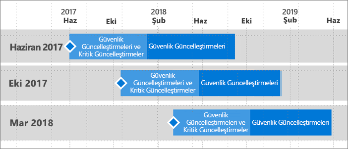

# Power BI Rapor Sunucusu için destek zaman çizelgesi
Power BI Rapor Sunucusu yılda birkaç kez yayımlanacaktır. Bir sonraki sürüm genel kullanıma sunulana kadar güvenlik güncelleştirmeleri ve kritik güncelleştirmeler sağlanır. Sonraki sürümün yayımlanmasının ardından önceki sürüm, 12 aylık kullanım süresinin geri kalan dönemi boyunca güvenlik güncelleştirmeleri almaya devam eder.

Bu destek politikası sayesinde müşterilerimize hızlı bir şekilde yenilikler sunarken, aynı zamanda da onlara bu yenilikleri kendi hızlarında benimseme esnekliğini sağlarız.

* Güvenlik Güncelleştirmeleri ve Kritik Güncelleştirmeler sunma aşaması - Power BI Rapor Sunucusu'nun en son sürümünü çalıştırırken hem Güvenlik Güncelleştirmelerini hem de Kritik Güncelleştirmeleri alırsınız.
* Güvenlik Güncelleştirmeleri (Yalnızca) sunma aşaması - Yeni bir sürüm yayımlandıktan sonra, eski sürümlere yönelik destek, on iki (12) aylık destek yaşam döngüsünün yalnızca geri kalan dönemi (şekil 1'de gösterilmiştir) boyunca sağlanacak Güvenlik güncelleştirmeleriyle sınırlanır.

    

## Sürüm geçmişi

| **Sürüm** | **Kullanıma sunulma tarihi** | **Destek bitiş tarihi** |
| --- | --- | --- |
| Haziran 2017 |12 Haziran 2017 |12 Haziran 2018 |
| Ekim 2017 |31 Ekim 2017 |31 Ekim 2018 |
| Mart 2018 | 19 Mart 2018 | 19 Mart 2019 |

Power BI Rapor Sunucusu'nu ve Power BI Rapor Sunucusu için en iyi duruma getirilmiş Power BI Desktop'ı indirmek için [On-premises reporting with Power BI Report Server (Power BI Rapor Sunucusu ile şirket içi raporlama)](https://powerbi.microsoft.com/report-server/) sayfasına gidin.

## Sonraki adımlar
[Power BI Rapor Sunucusu'ndaki yenilikler](whats-new.md)  
[Power BI Rapor Sunucusu nedir?](get-started.md)
[Yönetici genel bakışı](admin-handbook-overview.md)  
[Power BI Rapor Sunucusu'nu yükleme](install-report-server.md)  

Başka bir sorunuz mu var? [Power BI Topluluğu'na sorun](https://community.powerbi.com/)

