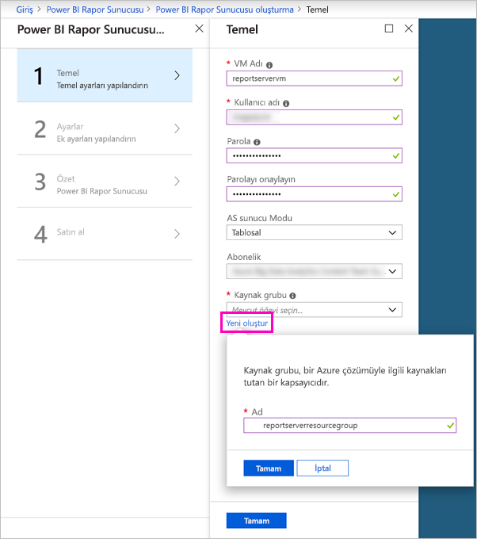
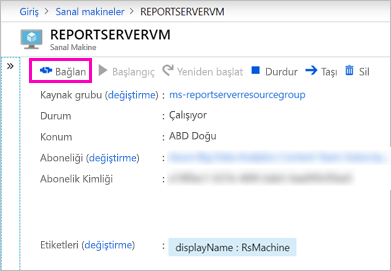

# Öğretici: Bir VM’de Power BI Rapor Sunucusu web portalını keşfetme
Bu öğreticide, örnek Power BI ve sayfalandırılmış raporları görüntüleme, düzenleme ve yönetme işlemlerini yapabilmek için Power BI Rapor Sunucusu zaten yüklüyken bir Azure sanal makinesi oluşturacaksınız.

Bu öğreticide gerçekleştireceğiniz görevler şunlardır:

> [!div class="checklist"]
> * VM oluşturma ve bağlanma
> * Power BI Rapor Sunucusu web portalını başlatma ve keşfetme
> * Sık kullanılan öğeyi etiketleme
> * Power BI raporunu görüntüleme ve düzenleme
> * Sayfalandırılmış bir raporu görüntüleme, yönetme ve düzenleme
> * Excel Online’da bir Excel çalışma kitabını görüntüleme

Bu öğreticide, bir Azure aboneliği gerekir. Aboneliğiniz yoksa, başlamadan önce [ücretsiz bir hesap](https://azure.microsoft.com/free/?WT.mc_id=A261C142F) oluşturun.

## Power BI Rapor Sunucusu sanal makinesi oluşturma

Neyse ki, Power BI ekibi Power BI Rapor Sunucusunun zaten yüklü olduğu bir VM oluşturmuştur.

1. Azure Market’te [Power BI Rapor Sunucusu](https://azuremarketplace.microsoft.com/marketplace/apps/reportingservices.technical-preview?tab=Overview)’nu açın.  

2. **Şimdi al**’ı seçin.
3. Sağlayıcının kullanım koşulları ve gizlilik ilkesini kabul etmek için **Devam**’ı seçin.

    

4. **1. Adım Temel Bilgiler**, **VM Adı** için **reportservervm** girin.

5. Bir kullanıcı adı ve parola oluşturun.

6. **Kaynak grubu** için **Yeni oluştur**’u seçin **reportserverresourcegroup** olarak adlandırın.

    Öğreticiyi bir kereden fazla uygularsanız, kaynak grubuna ilk denemenizde kullandığınız addan farklı bir ad vermeniz gerekir. Bir kaynak grubu adını aynı abonelik içinde ikinci kez kullanamazsınız. 

7. Diğer varsayılanları tutun > **Tamam**’ı seçin.

    

8. **2. Adım Ayarlar**, varsayılanları tutun > **Tamam**’ı seçin.

9. **3. Adım Özet** > **Tamam**.

10. **4. Adım**, Kullanım koşullarını ve gizlilik ilkesini gözden geçirin > **Oluştur**’u seçin.

    **Power BI Rapor Sunucusu için dağıtım gönderiliyor** işlemi birkaç dakika sürer.

## Sanal makinenize bağlanma

1. Azure sol gezinti bölmesinde **Sanal makineler**’i seçin. 

2. **Ada göre filtrele** kutusuna "report" yazın. 

3. **REPORTSERVERVM** adlı VM’yi seçin.

    

4. REPORTSERVERVM sanal makinesi altında **Bağlan**’ı seçin.

    

5. Uzak Masaüstü Bağlantısı iletişim kutusunda **Bağlan**’ı seçin.

6. VM için oluşturduğunuz parola ve adı girin > **Tamam**’ı seçin.

7. Sonraki iletişim kutusunda, uzak bilgisayar kimliğinin tanımlanamadığı söylenir. **Evet**’i seçin.

   Yeni sanal makineniz açılır.

## VM üzerinde Power BI Rapor Sunucusu

Sanal makineniz açıldığında masaüstünde aşağıdaki öğeleri görürsünüz.

|Sayı  |Nedir  |
|---------|---------|
| | Sayfalandırılmış (.RDL) raporlar oluşturmak için SQL Server Veri Araçları’nı başlatır |
| | Örnek Power BI (.PBIX) raporları  |
| | Power BI Rapor Sunucusu belgelerinin bağlantıları   |
| | Power BI Rapor Sunucusu için en iyi duruma getirilmiş Power BI Desktop uygulamasını başlatır (Mart 2018)  |
| | Power BI Rapor Sunucusu web portalını tarayıcıda açar   |

**Rapor Sunucusu Web Portalı** simgesine çift tıklayın. Tarayıcıda `http://localhost/reports/browse` sayfası açılır. Web portalında türe göre gruplandırılmış çeşitli dosyalar görürsünüz. 

|Sayı  |Nedir  |
|---------|---------|
| | Web portalında oluşturulan KPI’ler |
| |  Power BI (.PBIX) raporları  |
| | SQL Server Mobil Rapor Yayımcısında oluşturulan mobil raporlar  |
| |  Rapor Oluşturucusu veya SQL Server Veri Araçları’nda oluşturulan sayfalandırılmış raporlar  |
| | Excel çalışma kitapları   | 
| | Sayfalandırılmış raporlar için veri kaynakları | 

## Sık kullanılanları etiketleme
Sık kullanılan olmasını istediğiniz raporları ve KPI'leri etiketleyebilirsiniz. Hem web portalında hem de Power BI mobil uygulamalarında tek bir Sık Kullanılanlar klasöründe toplandıklarından bulunmaları daha kolaydır. 

1. **Kar Marjı** KPI > **Sık Kullanılanlara Ekle** öğesinin sağ üst köşesindeki üç nokta (**…**) simgesini seçin.
   
    
2. Söz konusu öğeyi web portalındaki Favorites (Sık Kullanılanlar) sayfasında diğer öğelerle birlikte görmek için web portalı şeridindeki **Favorites** (Sık Kullanılanlar) seçeneğini belirleyin.
   
    

3. Web portalına geri dönmek için **Göz at**’ı seçin.
   
## Liste görünümünde öğeleri görüntüleme
Varsayılan olarak web portalı, içeriklerini Kutucuk görünümünde görüntüler.

Aynı anda birden fazla öğenin kolayca taşınabildiği veya silinebildiği Liste görünümüne geçiş yapabilirsiniz. 

1. **Tiles** > **List** (Kutucuklar > Liste) seçeneğini belirleyin.
   
    

2. Kutucuklar görünümüne geri dönün: **Liste** > **Kutucuklar**.

## Power BI raporları

Web portalında Power BI raporlarını görüntüleyip etkileşimde bulunabilir ve Power BI Desktop’ı doğrudan web portalından başlatabilirsiniz.

### Power BI raporlarını görüntüleme

1. Web portalındaki **Power BI raporları** altında **Örnek Müşteriye Genel Bakış Raporları**’nı seçin. Rapor, tarayıcıda açılır.

1. Diğer görsellerdeki ilgili değerleri nasıl vurguladığını görmek için, ağaç haritasında Amerika Birleşik Devletleri bloğunu seçin.

    

### Power BI Desktop'ta düzenleme

1. **Power BI Desktop'ta düzenle**’yi seçin.

1. Bu web sitesinin bilgisayarınızda bir programı açmasına izin vermek için **İzin Ver**’i seçin. 

     Rapor Power BI Desktop’ta açılır. Üst çubuktaki "Power BI Desktop (Mart 2018)" adını not edin. Bu sürüm, Power BI Rapor Sunucusu için en iyi duruma getirilmiştir.

    

     VM’de yüklü olan Power BI Desktop sürümünü kullanın. Bir raporu karşıya yüklemek için etki alanları arasında geçiş yapamazsınız.

3. Alanlar bölmesinde, Müşteriler tablosunu genişletin ve Meslek alanını Rapor düzeyi filtrelerine sürükleyin.

    

1. Raporu kaydedin.

1. Tarayıcıda rapora geri dönün ve tarayıcının **Yenile** simgesini seçin.

    

8. Eklediğiniz **Meslek** filtresini görmek için sağ taraftaki **Filtreler** bölmesini genişletin. **Profesyonel**’i seçin.

    

3. Web portalına geri dönmek için **Göz at**’ı seçin.

## Sayfalandırılmış (.RDL) raporlar

Sayfalandırılmış raporları görüntüleyip yönetebilir ve web portalından Rapor Oluşturucu’yu başlatabilirsiniz.

### Sayfalandırılmış rapor yönetme

1. Web portalındaki **Sayfalandırılmış raporlar** altında, **Satış Siparişi** > **Yönet** öğesinin yanında bulunan üç noktayı (...) seçin.

1. **Parametreler**’i seçin, **SalesOrderNumber** varsayılan değerini değiştirin: **SO50689** > **Uygula**’yı seçin.

   

3. Web portalına geri dönmek için **Göz at**’ı seçin.

### Sayfalandırılmış rapor görüntüleme

1. Web portalında **Satış Siparişi**’ni seçin.
 
3.  Ayarladığınız **Sipariş** parametresi **SO50689** ile açıldığını görürsünüz. 

    

    Burada, varsayılan ayarları değiştirmeden diğer parametrelerle birlikte söz konusu parametreyi değiştirebilirsiniz.

1. **Sipariş** **SO48339** > **Raporu Görüntüle**’yi seçin.

4. Bunun 1/2 numaralı sayfa olduğunu görürsünüz. İkinci sayfayı görmek için sağ oku seçin. Tablo bu sayfadan devam eder.

    

5. Web portalına geri dönmek için **Göz at**’ı seçin.

### Sayfalandırılmış raporu düzenleme

Rapor Oluşturucusu’nda sayfalandırılmış raporları düzenleyebilir ve Rapor Oluşturucusu’nu doğrudan tarayıcıdan başlatabilirsiniz.

1. Web portalında, **Satış Siparişi** > **Rapor Oluşturucusu’nda Düzenle** öğesinin yanında bulunan üç nokta (...) simgesini seçin.

1. Bu web sitesinin bilgisayarınızda bir programı açmasına izin vermek için **İzin Ver**’i seçin.

1. Satış Siparişi raporu, Rapor Oluşturucusu’nun Tasarım Görünümünde açılır.

    

1. Raporun önizlemesini görmek için **Çalıştır**’ı seçin.

    

5. Rapor Oluşturucu'yu kapatın ve tarayıcıya geri dönün.

## Excel çalışma kitaplarını görüntüleme

Excel çalışma kitaplarını Power BI Rapor Sunucusu’ndaki Excel Online'da görüntüleyip etkileşimde bulunabilirsiniz. 

1. **Office Liquidation Sale.xlsx** adlı Excel çalışma kitabını seçin. Kimlik bilgileri istenebilir. **İptal**’i seçin. 
    Web portalında açılır.
1. Dilimleyicide **Alet**’i seçin.

    

1. Web portalına geri dönmek için **Göz at**’ı seçin.

## Kaynakları temizleme

Bu öğreticiyi bitirdikten sonra kaynak grubunu, sanal makineyi ve tüm ilişkili kaynakları silin. 

- Bunu yapmak için VM kaynak grubunu ve **Sil** öğesini seçin.

## Sonraki adımlar

Bu öğreticide, Power BI Rapor Sunucusu ile bir VM oluşturdunuz. Web portalının bazı işlevlerini denediniz ve bir Power BI raporu ile sayfalandırılmış bir raporu ilgili düzenleyicilerde açtınız. Bu VM’de SQL Server Analysis Services veri kaynakları yüklü olduğundan, bu veri kaynaklarını kullanarak kendi Power BI raporlarınızı ve sayfalandırılmış raporlarınızı oluşturmayı deneyebilirsiniz. 

Power BI Rapor Sunucusuna yönelik raporlar oluşturma hakkında daha fazla bilgi için devam edin.

> [!div class="nextstepaction"]
> [Power BI Rapor Sunucusu için Power BI raporu oluşturma](./quickstart-create-powerbi-report.md)

