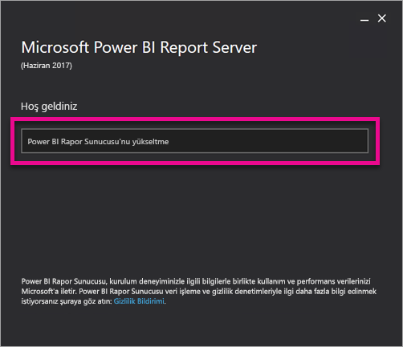
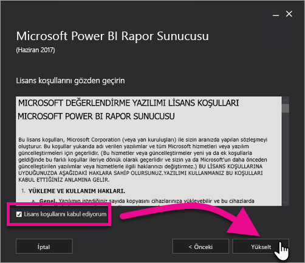
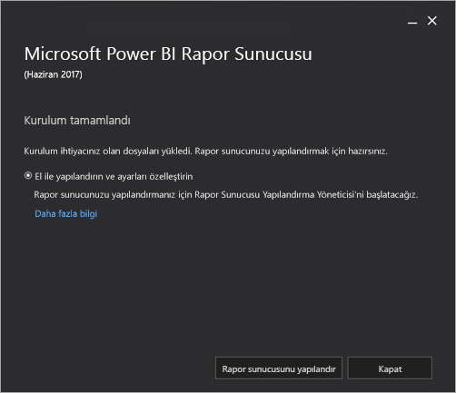

# Power BI Rapor Sunucusu'nu yükseltme
Power BI Rapor Sunucusu'nu yükseltmeyi öğrenin.

 **İndir** 

Power BI Rapor Sunucusu'nu ve Power BI Rapor Sunucusu için en iyi duruma getirilmiş Power BI Desktop'ı indirmek için [On-premises reporting with Power BI Report Server (Power BI Rapor Sunucusu ile şirket içi raporlama)](https://powerbi.microsoft.com/report-server/) sayfasına gidin.

## Başlamadan önce
Bir rapor sunucusunu yükseltmeden önce rapor sunucunuzu yedeklemek için aşağıdaki adımları uygulamanız önerilir.

### Şifreleme anahtarlarını yedekleme
Bir rapor sunucusu yüklemesini ilk kez yapılandırırken, şifreleme anahtarlarını yedeklemeniz gerekir. Ayrıca hizmet hesaplarının kimliklerini her değiştirdiğinizde veya bilgisayarı her yeniden adlandırdığınızda da anahtarları yedeklemeniz gerekir. Daha fazla bilgi için bkz. [Reporting Services Şifreleme Anahtarlarını Yedekleme ve Geri Yükleme](https://docs.microsoft.com/sql/reporting-services/install-windows/ssrs-encryption-keys-back-up-and-restore-encryption-keys).

### Rapor sunucusu veritabanlarını yedekleme
Rapor sunucusu durum bilgisi olmayan bir sunucu olduğundan, tüm uygulama verileri bir SQL Server Veritabanı Altyapısı örneğinde çalışan **reportserver** ve **reportservertempdb** veritabanlarında depolanır. SQL Server veritabanlarını yedeklemek için desteklenen yöntemlerden birini kullanarak **reportserver** ve **reportservertempdb** veritabanlarını yedekleyebilirsiniz. Aşağıda, rapor sunucusu veritabanlarına özel bazı öneriler sunulmuştur:

* **reportserver** veritabanını yedeklemek için tam kurtarma modelini kullanın.
* **reportservertempdb** veritabanını yedeklemek için basit kurtarma modelini kullanın.
* Her veritabanı için farklı yedekleme zamanlamaları kullanabilirsiniz. **reportservertempdb** veritabanının yedeklenmesinin tek nedeni, bir donanım arızası durumunda yeniden oluşturmak zorunda kalmamaktır. Donanım arızası durumunda **reportservertempdb** veritabanındaki verilerin kurtarılması gerekmez ancak tablo yapısının kurtarılması önemlidir. **reportservertempdb** veritabanını kaybetmeniz durumunda geri almanın tek yolu, rapor sunucusu veritabanını yeniden oluşturmaktır. **reportservertempdb** veritabanının yeniden oluşturulacak olması durumunda, birincil rapor sunucusu veritabanıyla aynı ada sahip olması önemlidir.

SQL Server ilişkisel veritabanlarının yedeklenmesi ve kurtarılması hakkında daha fazla bilgi için bkz. [Back Up and Restore of SQL Server Databases (SQL Server Veritabanlarının Yedeklenmesi ve Geri Yüklenmesi)](https://docs.microsoft.com/sql/relational-databases/backup-restore/back-up-and-restore-of-sql-server-databases).

### Yapılandırma dosyalarını yedekleme
Power BI Rapor Sunucusu, uygulama ayarlarını depolamak için yapılandırma dosyalarını kullanır. Sunucuyu ilk kez yapılandırırken ve herhangi bir özel uzantıyı dağıtmanızın ardından dosyaları yedeklemeniz gerekir. Yedeklenecek dosyalar şunlardır:

* config.json
* RSHostingService.exe.config
* Rsreportserver.config
* Rssvrpolicy.config
* Reportingservicesservice.exe.config
* Rapor Sunucusu ASP.NET uygulamaları için web.config
* ASP.NET için machine.config

## Rapor sunucusunu yükseltme
Power BI Rapor Sunucusu'nu yükseltmek oldukça kolaydır. Dosyaları yüklemek için uygulamanız gereken yalnızca birkaç adım vardır.

1. PowerBIReportServer.exe dosyasının konumunu bulun ve yükleyiciyi başlatın.
2. **Upgrade Power BI Report Server** (Power BI Rapor Sunucusu'nu Yükselt) seçeneğini belirleyin.
   
    
3. Lisans hüküm ve koşullarını okuyup kabul ettikten sonra **Yükselt** seçeneğini belirleyin.
   
    
4. Yükseltme başarılı olduktan sonra Reporting Services Yapılandırma Yöneticisi'ni başlatmak için **Rapor Sunucusunu Yapılandır**'ı veya yükleyiciden çıkmak için **Kapat**'ı seçebilirsiniz.
   
    

## Power BI Desktop'ı yükseltme
Rapor sunucusu yükseltildikten sonra tüm Power BI Rapor yazarlarının Power BI Rapor Sunucusu için en iyi duruma getirilmiş olan ve sunucuyla eşleşen Power BI Desktop sürümüne yükseltme yaptığından emin olmanızda yarar vardır.

## Sonraki adımlar
[Yönetici el kitabı](admin-handbook-overview.md)  
[Power BI Rapor Sunucusu için en iyi duruma getirilmiş Power BI Desktop uygulamasını yükleme](install-powerbi-desktop.md)  
[Verify a reporting services installation (Bir raporlama hizmeti yüklemesini doğrulama)](https://docs.microsoft.com/sql/reporting-services/install-windows/verify-a-reporting-services-installation)  
[Rapor sunucusu hizmet hesabını yapılandırma](https://docs.microsoft.com/sql/reporting-services/install-windows/configure-the-report-server-service-account-ssrs-configuration-manager)  
[Rapor sunucusu URL'lerini yapılandırma](https://docs.microsoft.com/sql/reporting-services/install-windows/configure-report-server-urls-ssrs-configuration-manager)  
[Rapor sunucusu veritabanı bağlantısını yapılandırma](https://docs.microsoft.com/sql/reporting-services/install-windows/configure-a-report-server-database-connection-ssrs-configuration-manager)  
[Bir rapor sunucusunu başlatma](https://docs.microsoft.com/sql/reporting-services/install-windows/ssrs-encryption-keys-initialize-a-report-server)  
[Rapor sunucusunda SSL bağlantılarını yapılandırma](https://docs.microsoft.com/sql/reporting-services/security/configure-ssl-connections-on-a-native-mode-report-server)  
[Configure windows service accounts and permissions (Windows hizmet hesaplarını ve izinleri yapılandırma)](https://docs.microsoft.com/sql/database-engine/configure-windows/configure-windows-service-accounts-and-permissions)  
[Power BI Rapor Sunucusu için tarayıcı desteği](browser-support.md)

Başka bir sorunuz mu var? [Power BI Topluluğu'na sorun](https://community.powerbi.com/)

