# Power BI için Müşteri Kârlılığı Örneği: Tura katılın

Müşteri Karlılığı örneği içerik paketinde, pazarlama malzemeleri üreten bir şirkete ilişkin pano, rapor ve veri kümesi bulunmaktadır. Bu pano, mali işlerden sorumlu bir genel müdür (CFO) tarafından, beş departman yöneticisi (idareciler), ürünler, müşteriler ve brüt kâr ile ilgili ana ölçümleri görme amacıyla oluşturulmuştur. Bu kişiler, kârlılığı etkileyen faktörleri bir bakışta görebilir.

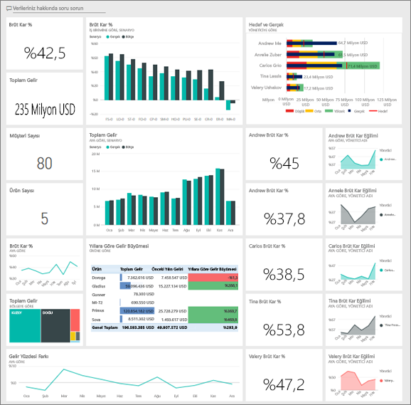

Bu örnek, Power BI'ı işle ilgili veriler, raporlar ve panolarla birlikte nasıl kullanabileceğinizi gösteren serinin bir parçasıdır. Örnek, [obviEnce](http://www.obvience.com/) öğesinden alınan, anonimleştirilmiş gerçek verilerle oluşturulmuştur. Veriler çeşitli biçimlerde sunulur: içerik paketi, .pbix Power BI Desktop dosyası veya Excel çalışma kitabı. Bkz. [Power BI Örnekleri](sample-datasets.md). 

Bu öğreticide, Power BI hizmetinde Müşteri Karlılığı örneği içerik paketi incelenir. Power BI Desktop ile hizmette rapor deneyimleri benzer olduğundan, Power BI Desktop'ta örnek .pbix dosyasını kullanarak da örneği takip edebilirsiniz. 

Power BI Desktop'ta örnekleri incelemek için Power BI lisansına ihtiyacınız yoktur. Power BI Pro lisansınız yoksa örneği Power BI hizmetinde Çalışma Alanım alanınıza kaydedebilirsiniz. 

## Örneği alma

Örneği kullanabilmeniz için bir [içerik paketi](#get-the-content-pack-for-this-sample), [.pbix dosyası](#get-the-pbix-file-for-this-sample) veya [Excel çalışma kitabı](#get-the-excel-workbook-for-this-sample) olarak indirmeniz gerekir.

### Bu örneğe ilişkin içerik paketini edinme

1. Power BI hizmetini açın (app.powerbi.com), oturum açın ve örneği kaydetmek istediğiniz çalışma alanını açın.

   Power BI Pro lisansınız yoksa örneği Çalışma Alanım alanınıza kaydedebilirsiniz.

2. Sol alt köşedeki **Veri Al**'ı seçin.

   
3. Görüntülenen **Veri Al** sayfasında **Örnekler**'i seçin.

4. **Müşteri Kârlılığı Örneği**'ni ve ardından **Bağlan**'ı seçin.  

    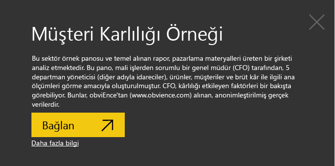
5. Power BI, içerik paketini içeri aktarır ve ardından geçerli çalışma alanınıza yeni bir pano, rapor ve veri kümesi ekler.

    

### Bu örneğe ilişkin .pbix dosyasını edinme

Alternatif olarak, Müşteri Karlılığı örneğini bir [.pbix](https://download.microsoft.com/download/6/A/9/6A93FD6E-CBA5-40BD-B42E-4DCAE8CDD059/Customer%20Profitability%20Sample%20PBIX.pbix) dosyası olarak indirebilirsiniz. Bu dosya biçimi, Power BI Desktop ile kullanım için tasarlanmıştır.

### Bu örneğe ilişkin Excel çalışma kitabını edinme

Bu örnekte kullanılan veri kaynağını görüntülemek isterseniz, [Excel çalışma kitabı](https://go.microsoft.com/fwlink/?LinkId=529781) olarak da bulabilirsiniz. Çalışma kitabı, görüntüleyebileceğiniz ve değiştirebileceğiniz Power View sayfaları içerir. Ham verileri görmek için Veri Çözümlemesi eklentilerini etkinleştirip **Power Pivot > Yönet**'i seçin. Power View ve Power Pivot eklentilerini etkinleştirmek için bkz. [Excel’de Excel örneklerini bulma](sample-datasets.md#explore-excel-samples-inside-excel).

## Panomuz bize ne anlatıyor?

Örneği kaydettiğiniz çalışma alanında Müşteri Kârlılığı panosunu bulun ve seçin:

### Genel şirket durumu ile ilgili pano kutucukları
1. Power BI hizmetinde panoyu açın. Bu pano kutucukları CFO'muza, önem verdiği üst düzey şirket ölçümlerine yönelik bir bakış sağlar. İlginç bir bulguyla karşılaştıklarında bir kutucuğu seçip söz konusu verileri inceleyebilirler.

2. Panonun sol tarafındaki kutucukları gözden geçirin.

    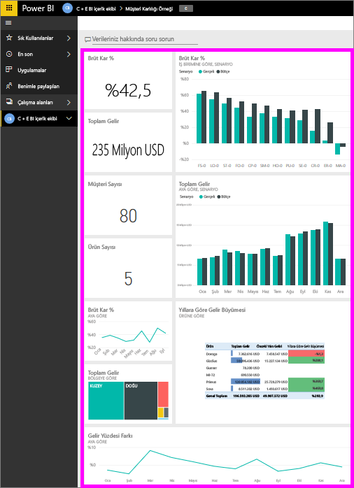

   Aşağıdaki bilgileri unutmayın:
   - Şirketin brüt kârı %42,5.
   - 80 müşterisi var.
   - Beş farklı ürün satıyor.
   - Bütçesindeki gelir varyansının (yüzde cinsinden) en düşük olduğu ayın Şubat, en yüksek olduğu ayın ise Mart olduğu görülüyor.
   - Gelirimizin çoğunu doğu ve kuzey bölgelerden elde ediyoruz. Brüt kâr bütçeyi hiçbir zaman aşmıyor ve ER-0 ile MA-0 iş birimleri için biraz daha inceleme yapılması gerekiyor.
   - Yıl için toplam gelir bütçeye yakın.

### Yöneticiye özgü pano kutucukları
Panonun sağ tarafındaki kutucuklar ise bir ekip puan kartı sağlar. CFO'nun, yöneticilerini takip etmesi gerekiyor ve bu kutucuklar, brüt kâr yüzdesini kullanarak ona kâr ile ilgili üst düzey bir genel bakış sağlıyor. Herhangi bir yönetici için brüt kâr yüzdesi eğilimi beklentinin altındaysa CFO, söz konusu durumu daha ayrıntılı olarak inceleyebilir.

Yöneticiye özgü pano kutucuklarını analiz ederek aşağıdaki gözlemleri yapabiliriz:

- Carlos dışındaki tüm yöneticiler, satış hedeflerini zaten aştı. Öte yandan en fazla gerçek satışı Carlos yapmıştır.
- Brüt kar yüzdesi en düşük yönetici Annelie ancak onun da Mart ayından bu yana istikrarlı bir artış yakaladığını görüyoruz.
- Diğer taraftan, Valery'nin brüt kâr yüzdesinde önemli ölçüde bir düşüş görülüyor.
- Andrew istikrarsız bir yıl geçirmiş.

## Panodaki temel alınan verileri keşfedin
Bu panoda bir raporun ve bir Excel çalışma kitabının bağlantısını içeren kutucuklara sahiptir.

### Excel Online veri kaynağını açma
Bu panodaki **Hedef ve Gerçek** ile **Yıllara Göre Gelir Büyümesi** adlı iki kutucuk bir Excel çalışma kitabından sabitlenmiştir. Bu kutucuklardan birini seçtiğinizde Power BI veri kaynağını (bu durumda, Excel Online) açar.

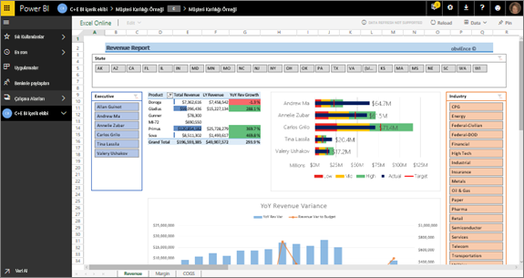

1. Excel'den sabitlenmiş kutucuklardan birini seçin. Excel Online, Power BI hizmetinde açılır.
2. Çalışma kitabında üç sekme değerinde veri olduğuna dikkat edin. **Gelir** bölümünü açın.
3. Carlos’un neden henüz hedefine ulaşamadığına bakalım:  

    a. **Yönetici** kaydırıcısından **Carlos Grilo**’yu seçin.   

    b. Birinci PivotTable, Carlos’un en popüler ürünü Primus için gelir artışının geçen yıla göre %152 gerilediğini göstermektedir. **YoY Revenue Variance** (Yıllara Göre Gelir Varyansı) grafiği ise ayların birçoğunda bütçe altında kaldığını göstermektedir.  

    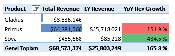

    

4. Keşfetmeye devam edin. İlgi çekici bir şeyler bulursanız sağ üst köşeden **Sabitle**  öğesini seçerek bunu [panoya sabitleyin](service-dashboard-pin-tile-from-excel.md).

5. Panoya geri dönmek için tarayıcınızın geri okunu kullanın.

### Temel alınan Power BI raporunu açın
Müşteri Kârlılığı örnek panosundaki kutucuklarının birçoğu, temel alınan Müşteri Kârlılığı örnek raporundan sabitlenmiştir.

1. Raporu Okuma görünümünde açmak için bu kutucuklardan birini seçin.

   Kutucuk Soru-Cevap içinde oluşturulduysa, kutucuğun seçilmesi Soru-Cevap penceresini açar. Panoya dönmek için **Soru-Cevap'tan Çık**'ı seçin ve farklı bir kutucuk deneyin.

2. Raporun üç sayfası vardır. Raporun en altındaki her sekme farklı bir sayfaya karşılık gelir.

    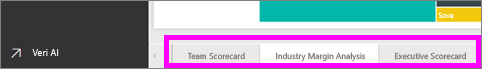

    * **Team Scorecard** sayfasında 5 yöneticinin performansına ve müşterilerine odaklanılmaktadır.
    * **Industry Margin Analysis** sayfasında kârlılık durumunu, sektörün tamamı ile karşılaştırmalı bir şekilde çözümlememizi sağlayacak bir yöntem sunulur.
    * **Executive Scorecard**, her yöneticiye ilişkin özel sayfa boyutu biçiminde bir görünüm sağlar.

### Team Scorecard sayfası

Ekip üyelerinden ikisine ayrıntılı olarak göz atıp ne gibi içgörüler elde edebileceğimize bakalım: 

1. Rapor sayfasını yalnızca Andrew ile ilgili veriler görüntülenecek şekilde filtrelemek için soldaki **Executive** (Yönetici) dilimleyicisinden Andrew'un adını seçin:

   * Hızlı bir KPI için Andrew’un **Revenue Status (Total Year)** değerine bakın; yeşil renkte olması iyi performans gösterdiği anlamına gelir.
   * **Revenue % Variance to Budget by Month and Executive** grafiğinde, Şubat'ta yaşanan düşüş dışında Andrew'un iyi performans sergilediği gösteriliyor. Andrew’ın en baskın olduğu bölge doğu bölgesidir. Andrew’ın burada 49 müşterisi var ve toplam yedi üründen beşiyle ilgileniyor. Andrew’ın brüt kâr yüzdesi en yüksek veya en düşük yüzde değil.
   * **RevenueTY and Revenue % Var to Budget by Month** grafiği kararlı düzgün bir kâr gösteriyor. Öte yandan, bölge ağaç haritasında **Central** karesini seçip filtrelerseniz Andrew'un yalnızca Mart ayında ve Indiana'da gelir elde ettiğini fark edeceksiniz. Amaçlanan eğilim bu muydu yoksa bu incelenmesi gereken bir durum mu?

2. Şimdi Valery'ye geçelim. Rapor sayfasını yalnızca Valery ile ilgili veriler görüntülenecek şekilde filtrelemek için **Executive** (Yönetici) dilimleyicisinde Valery’nin adını seçin. 

   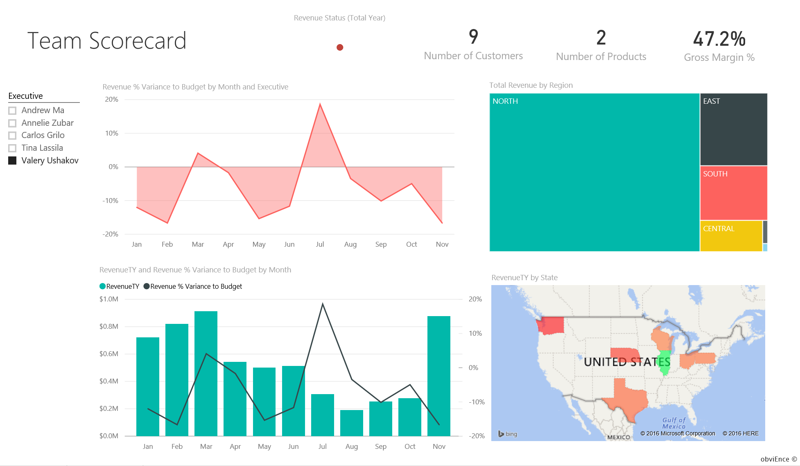

   * **Revenue Status (Total Year)** KPI'sinin kırmızı olduğuna dikkat edin. Bu öğenin kesinlikle biraz daha incelenmesi gerekiyor.
   * Valery’nin gelir varyansına baktığımızda da endişe verici bir tabloyla karşılaşıyoruz. Valery, belirlenen gelir marjlarını karşılamıyor.
   * Valery'nin yalnızca dokuz müşterisi var, iki ürünle ilgileniyor ve neredeyse yalnızca kuzey bölgesindeki müşterilerle çalışıyor. Ölçümlerinde görülen büyük dalgalanmalar tek bir bölgeyle çalışıyor olması ile açıklanabilir.
   * Ağaç haritasında **North** karesini seçerseniz Valery’nin kuzey bölgesindeki brüt karının toplam marjıyla tutarlı olduğu görülüyor.
   * Diğer tüm **Total Revenue by Region** (Bölgeye Göre Toplam Kar) karelerinin seçilmesi ilginç bir durum ortaya koyuyor: Brüt Kar oranı %23 ile %79 arasında değişiyor. Valery’nin Kuzey bölgesi dışındaki tüm bölgelerde gelir rakamları son derece mevsimsel.

3. Valery’nin düşük performansının altında yatan nedenleri bulmak için araştırmaya devam edin. Bölgelere, diğer departmanlara ve rapordaki bir sonraki sayfaya bakın: **Sektör Marjı Analizi**.

### Sektör Marjı Analizi
Bu rapor sayfasında verilerin farklı bir dilimi sunulur. Burada sektörün tamamına ilişkin brüt kârı, segmentlere göre ayrılmış şekilde görüyoruz. CFO, eğilimler ve kârlılık ile ilgili çıkarımlar yapmasına yardımcı olması için şirket ve departman ölçümlerini sektör ölçümleriyle karşılaştırmak üzere bu sayfayı kullanır. **Gross Margin % by Month and Executive** (Aya ve Yöneticiye Göre Brüt Kar Yüzdesi) grafiği ekibe özgü bir grafik olduğundan bu sayfada neden bulunduğunu merak etmiş olabilirsiniz. Bu grafik ile sayfayı departman yöneticisine göre filtreleyebiliyoruz.  

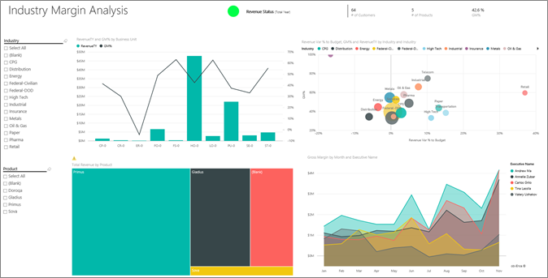

1. Kârlılık, sektörden sektöre nasıl bir değişiklik gösteriyor? Sektörlere göre ürün ve müşteri dağılımı nasıl gerçekleşiyor? Bu soruları yanıtlamak için sol üst kısımdan bir veya birden çok sektör seçin (CPG sektörüyle başlayın). Filtreyi temizlemek için silgi simgesini seçin.

2. **Revenue Var % to Budget, GM%, and RevenueTY by Industry** kabarcık grafiğinde, gelir üzerinde en büyük etkiye sahip oldukları için CFO en büyük kabarcıklara bakıyor. Sektör segmentine göre her yöneticinin etkisini kolayca görmek için alan grafiğini teslim et seçeneğinde her yöneticinin adını seçerek sayfayı filtreleyin.

3. Grafikte bulunan her yöneticinin adını seçerken şu ayrıntıları unutmayın:
   * Andrew'un etki alanının birçok farklı sektör segmentine yayıldığını ve brüt kâr yüzdesi (çoğunlukla olumlu anlamda) ile varyans yüzdesinin geniş çapta değişiklik gösterdiğini görüyoruz.
   * Federal segmentine ve Gladius ürününe daha fazla odaklanmış olup yalnızca az sayıda sektör segmentine yönelmiş olması dışında, Annelie'nin grafiğinde de benzer bir durumla karşılaşıyoruz.
   * Carlos'un Services segmentine net bir şekilde yöneldiğini ve iyi bir kâr yüzdesi yakaladığını görüyoruz. Carlos da High Tech segmenti için varyans yüzdesini büyük oranda iyileştirmiş yeni bir sektör olan Industrial segmentinde bütçeye kıyasla olağanüstü bir başarı göstermiş.
   * Tina az sayıda segment ile çalışıyor ve en yüksek brüt kâr yüzdesine sahip ancak balonlarının genel olarak küçük boyutta olması, Tina’nın şirketin nihai kâr-zarar dengesi üzerindeki etkisinin minimum düzeyde olduğunu gösteriyor.
   * Tek bir üründen sorumlu olan Valery, yalnızca beş sektör segmentinde çalışıyor. Valery’nin sektör etkisi mevsimsel ancak balon boyutu her zaman büyük ve bu da şirketin nihai kar-zarar dengesi üzerinde çok büyük bir etkiye sahip olduğunu gösteriyor. Sektör segmentleri onun bu olumsuz performansını nasıl etkiliyor?

### Yönetim Puan Kartı
Bu sayfanın özel bir sayfa boyutu biçimi vardır.

## Soru-Cevap ile sorular sorarak verilerle ilgili ayrıntılara ulaşma
Bizim analizimiz için bu özellik, Valery'nin en çok hangi sektörden gelir elde ettiğini belirlememize yardımcı olabilir. Soru-Cevap’ı kullanalım.

1. **Raporu düzenle**'yi seçerek raporu Düzenleme görünümünde açın. Düzenleme görünümü ancak raporun sahibi olduğunuzda kullanılabilir. Bu görünüm bazen *oluşturucu* modu olarak da adlandırılır. Bunun yerine bu rapor yalnızca sizinle paylaşıldıysa raporu Düzenleme görünümünde açamazsınız.

2.  Panonun üstünden **Soru sorun**’u seçerek Soru-Cevap soru kutusunu açın.

    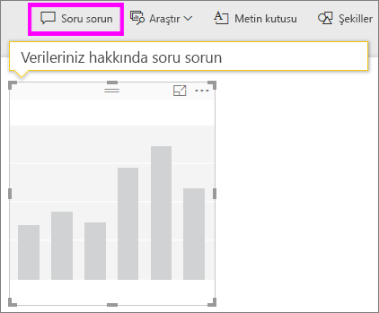

3. Soru kutusuna *Valery için sektörlere göre toplam gelir* yazın. Siz sorunuzu yazdıkça görselleştirmenin nasıl güncelleştirildiğine dikkat edin.

    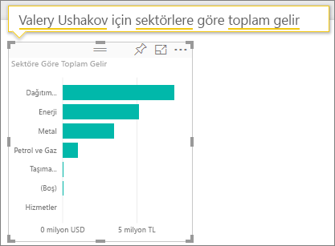

   Gördüğünüz gibi, Valery'nin en yüksek gelir alanı Distribution sektörüdür.

### Filtreler ekleyerek daha fazla ayrıntıya ulaşma
Şimdi Distribution sektörünü yakından inceleyelim.  

1. **Sektör Marjı Analizi** rapor sayfasını açın.
2. Rapor sayfasında herhangi bir görselleştirmeyi seçmeden sağdaki filtre bölmesini genişletin (henüz genişletilmemişse). **Filtreler** bölmesinde yalnızca **Sayfa düzeyi filtreleri** görüntülenmelidir.  

   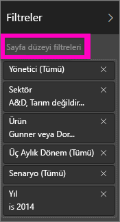
3. **Industry** filtresini bulun ve listeyi genişletmek için oku seçin. Şimdi Distribution sektörü için bir sayfa filtresi ekleyelim. Öncelikle **Tümünü Seç** onay kutusunu temizleyerek tüm seçimleri kaldırın. Ardından, sadece **Distribution**'ı (Dağıtım) seçin.  

   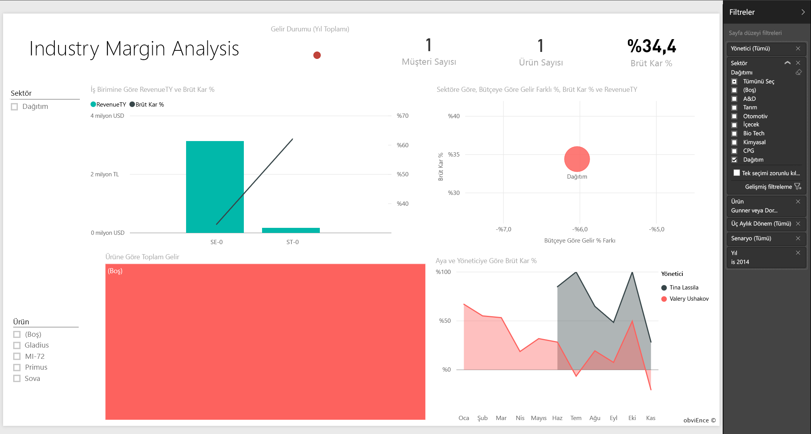
4. **Gross Margin % by Month and Executive** grafiğinde, yalnızca Valery ve Tina'nın bu sektörden müşterilerinin olduğunu ve Valery'nin bu sektör ile yalnızca Haziran ayından Kasım ayına kadar çalıştığını görüyoruz.   
5. **Gross Margin by Month and Executive** grafiğinin göstergesinde **Tina**'yı ve ardından **Valery**'yi seçin. Tina'nın **Total Revenue by Product** grafiğindeki yüzdesinin Valery'ye kıyasla gerçekten çok düşük olduğuna dikkat edin.
6. Mevcut geliri görmek için, panoda Soru-Cevap kutusunu seçin ve *total revenue by executive for distribution by scenario* (yöneticiye ve senaryoya göre dağıtım sektörü için toplam gelir) yazın.  

     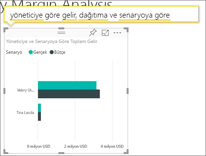

    Valery'nin performansını etkileyen unsurları anlamak için benzer şekilde diğer sektörleri de inceleyebilir ve hatta müşterileri de görsellerimize ekleyebiliriz.

## Sonraki adımlar: Verilerinize bağlanma
Değişikliklerinizi kaydetmek zorunda olmadığınızdan, bu ortamda güvenle farklı şeyler deneyebilirsiniz. Değişikliklerinizi kaydetseniz bile, dilediğiniz zaman **Veri Al**'ı seçip bu örneğin yeni bir kopyasını oluşturabilirsiniz.

Power BI panolarının, Soru-Cevap özelliğinin ve raporların örnek veriler için nasıl içgörüler sağlayacağını gösterme konusunda etkili bir tur deneyimi yaşadığınızı umuyoruz. Artık siz de kendi verilerinize bağlanarak çalışmaya başlayabilirsiniz. Power BI ile çok çeşitli veri kaynaklarına bağlanabilirsiniz. Daha fazla bilgi edinmek için bkz. [Power BI hizmeti ile çalışmaya başlama](service-get-started.md).

