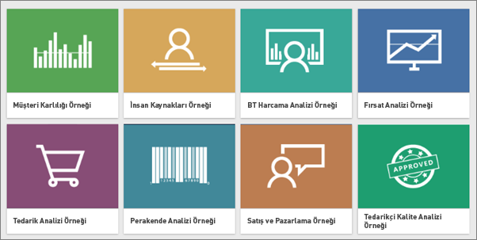
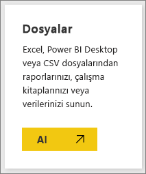
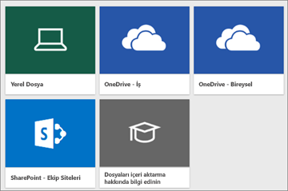
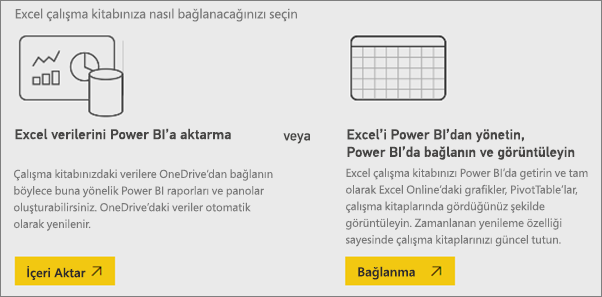
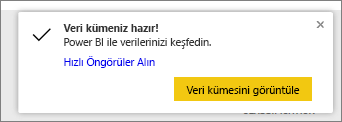
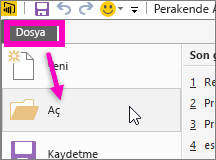

# Power BI ile hangi örnek veriler kullanılabilir?
Power BI'da yeni olduğunuzu, hizmeti denemek istediğinizi ancak hiç verinizin olmadığını varsayalım.  Bir veri kümeniz olsa da (henüz) Power BI'ın nasıl çalıştığını bilmediğinizden veri kümenize bir şekilde zarar verebileceğinizden endişeleniyor olabilirsiniz.

Paniğe kapılmayın! obviEnce ([www.obvience.com](http://www.obvience.com/)) ve Microsoft, Power BI kullanımıyla ilgili olarak kendinizi daha rahat hissedene kadar kullanabileceğiniz örnekler oluşturmuştur.  Veriler anonimleştirilmiştir ve farklı sektörleri temsil eder: finans, İK, satış ve daha fazlası. Ayrıca çevrimiçi belgelerimizi okudukça aynı örneklerin kullanıldığı eğitimler ve durumlarla karşılaşırsınız. Bu, sizin de aynı adımları uygulayabileceğiniz anlamına gelir.      

   

Bu örneklerden her biri çeşitli biçimlerde kullanılabilir: içerik paketi, tek bir Excel çalışma kitabı ve .pbix dosyası. Bunların ne olduğunu veya nasıl kullanıldıklarını bilmiyorsanız endişelenmeyin. Bu makalenin ilerleyen bölümlerinde buna değineceğiz. Ayrıca her örnek için, örneğin arka planındaki hikayeyi anlatacak ve farklı senaryolarla size yol gösterecek bir makale türü olan *turları* oluşturduk. Senaryolardan biri, yöneticinizin sorularını cevaplamak; diğeri ise rekabete dayalı öngörüler aramak veya paylaşılacak raporlar ve panolar oluşturmak ya da işle ilgili bir değişimi açıklamak olabilir.   

Her durumda, başlamadan önce lütfen örneklerin kullanılmasına ilişkin bu yasal yönergeleri inceleyin. İncelemenizi tamamladıktan sonra örnekleri sunacak ve nasıl kullanacağınızı göstereceğiz.   

## Power BI örnek Excel çalışma kitapları için kullanım yönergeleri
Lütfen Power BI örneklerini kullanmadan önce bu bilgileri okuyun.

©2015 Microsoft Corporation. Tüm hakları saklıdır. Belgeler ve çalışma kitapları "olduğu gibi" sunulmuştur. URL ve diğer İnternet Web sitesi başvuruları dahil olmak üzere çalışma kitaplarında gösterilen bilgiler ve görünümler bildirim verilmeksizin değiştirilebilir. Kullanımlardan doğacak riskler size aittir. Bazı örnekler yalnızca gösterim amaçlı ve kurgusaldır. Gerçek bir ilişkilendirme amaçlanmamıştır veya böyle bir sonuç çıkarılmamalıdır. Burada verilen bilgilerle ilgili olarak Microsoft açık veya zımni hiçbir garanti vermez.

Çalışma kitapları size Microsoft ürünlerindeki herhangi bir fikri mülkiyete ilişkin yasal hak vermez. Bu çalışma kitabını, daha sonra başvurmak üzere kopyalayabilir ve dahili amaçlarınız doğrultusunda kullanabilirsiniz.

Çalışma kitapları ve ilgili veriler obviEnce tarafından sağlanmıştır. [www.obvience.com](http://www.obvience.com)

ObviEnce, Microsoft Business Intelligence'a yönelik bir ISV ve Fikri Mülkiyet (IP) Kuluçka Merkezidir. ObviEnce Microsoft Business Intelligence çözümlerinin dağıtılması ve hızlıca kullanılmaya başlanmasının sağlanması için en iyi uygulamalar ve düşünce liderliği geliştirmek üzere Microsoft ile yakın bir şekilde çalışmaktadır.

Çalışma kitapları ve veriler obviEnce, LLC'nin mülkiyetinde olup yalnızca örnek sektör verileriyle Power BI işlevlerinin tanıtılması amacıyla paylaşılmıştır.

Çalışma kitaplarının ve/veya verilerin her kullanımına yukarıdaki açıklama (her bir çalışma kitabının Info çalışma sayfasında da bulunur) eklenmelidir. Çalışma kitabında ve tüm görselleştirmelerde şu telif hakkı bildirimi bulunmalıdır: obviEnce ©.

Excel çalışma kitabı dosyalarını veya .pbix dosyalarını indirmek için aşağıdaki bağlantılardan herhangi birine tıklayarak yukarıdaki koşulları kabul etmiş olursunuz.

## Kullanılabilir örnekler
Kullanabileceğiniz sekiz örnek mevcuttur.  Her biri farklı bir sektörü temsil eder.

### Müşteri Kârlılığı örneği  
[Müşteri Kârlılığı örneğine ilişkin tura katılın](sample-customer-profitability.md)

Bu sektör örneğinde, bir CFO'nun, yöneticilerine, ürünlerine ve müşterilerine ilişkin ana ölçümleri çözümlenmektedir. Şirketin kârlılığını hangi faktörlerin etkilediğini araştırabilirsiniz.

### İnsan Kaynakları örneği  
[İK örneğine ilişkin tura katılın](sample-human-resources.md)

Bu sektör örneğinde, yeni işe alımlar, etkin çalışanlar ve işten ayrılan çalışanlar çözümlenerek bir şirkete yönelik işe alım stratejisine odaklanılır.  Verileri araştırarak, gönüllü ayrılık eğilimlerine ve işe alım stratejisinde gözlemlenen önyargılara ulaşabilirsiniz.

### BT Harcama Analizi örneği 
[BT Harcama Analizi örneğine ilişkin tura katılın](sample-it-spend.md)

Bu sektör örneğinde, bir şirketin BT departmanının planlanmış maliyetleriyle gerçek maliyetlerini karşılaştırmalı olarak çözümleriz. Bu karşılaştırma şirketin yıl için ne kadar iyi planlama yaptığını anlamamıza yardımcı olur ve plana göre büyük sapmalar görülen alanları araştırmamıza olanak tanır. Bu örnekteki şirket yıllık bir planlama döngüsünden geçer ve ardından finansal yılda BT'ye yapılan harcamalardaki değişiklikleri çözümlemelerine yardımcı olması için üç ayda bir yeni En Yeni Tahmin (LE) oluşturur.

### Fırsat Analizi örneği  
[Fırsat Analizi örneğine ilişkin tura katılın](sample-opportunity-analysis.md)

Bu sektör örneği bir yazılım şirketinin satış kanalını araştırır. Satış yöneticileri, fırsatları ve geliri bölgeye, anlaşma boyutuna ve kanala göre izleyerek doğrudan ve iş ortağı satış kanallarını izler.

### Tedarik Analizi örneği 
[Tedarik Analizi örneğine ilişkin tura katılın](sample-procurement.md)

Bu sektör örneğinde, bir CFO'nun, yöneticilerine, ürünlerine ve müşterilerine ilişkin ana ölçümleri çözümlenmektedir. Şirketin kârlılığını hangi faktörlerin etkilediğini araştırabilirsiniz

### Perakende Analizi örneği 
[Perakende Analizi örneğine ilişkin tura katılın](sample-retail-analysis.md)

Bu sektör örneğinde, birden fazla mağazada ve bölgede satışı yapılan ürünlere ilişkin perakende satış verileri çözümlenir. Ölçümler şu alanlarda bu yılın performansını geçtiğimiz yılın performansıyla karşılaştırır: yeni mağaza analizinin yanı sıra satış, birimler, brüt marj ve varyans.

### Satış ve Pazarlama örneği 
[Satış ve Pazarlama örneğine ilişkin tura katılın](sample-sales-and-marketing.md)

Bu sektör örneğinde, VanArsdel Ltd. adlı bir üretim şirketi çözümlenir. Pazarlama Müdürünün VanArsdel için sektörü ve pazar payını izlemesine olanak tanır.  Örneği araştırarak şirketin pazar payına, ürün hacmine, satışlarına ve yaklaşım bilgilerine ulaşabilirsiniz.

### Tedarikçi Kalitesi örneği 
[Tedarikçi Kalitesi örneğine ilişkin tura katılın](sample-supplier-quality.md)

Bu sektör örneğinde, genel olarak karşılaşılan tedarik zinciri zorluklarından biri olan tedarikçi kalite analizine odaklanılır. Bu analizde iki birincil ölçüm ön plandadır: toplam hata sayısı ve bu hataların neden olduğu toplam çalışmama süresi. Bu örneğin iki ana hedefi vardır: kalite açısından en iyi ve en kötü tedarikçileri belirlemek ve çalışmama süresini en aza indirmek için hataları bulma ve reddetme konusunda hangi tesislerin daha iyi bir iş çıkardığını öğrenmek.

Artık neleri kullanabileceğinizi biliyorsunuz. Şimdi bu örneklerin nasıl edinileceğini öğrenelim.  

## Örnekleri alma
Yukarıda da belirtildiği gibi, örnekler çeşitli biçimlerde kullanılabilir: içerik paketleri, Excel çalışma kitapları ve .pbix dosyaları. İçerik paketleriyle başlayarak bunların her birinin nasıl kullanılacağını açıklayacağız.

## İçerik paketleri olarak sunulan Power BI örnekleri
İçerik paketi, Power BI'ın içinde kullanılabilen tek örnek biçimidir; içerik paketlerine ulaşmak için Power BI'dan ayrılmanız gerekmez. Bir veya daha fazla panodan, veri kümesinden ve rapordan oluşan içerik paketleri temel olarak, Power BI hizmetiyle birlikte kullanılmak üzere birisi tarafından oluşturulmuş paketlerdir. Kullanıcılar iş arkadaşlarıyla paylaşmak üzere için içerik paketleri oluşturur. Tüm Power BI örneği içerik paketleri bir veri kümesi, rapor ve pano içerir.  İçerik paketleri Power BI Desktop'ta kullanılamaz. İçerik paketleri hakkında daha fazla bilgi edinmek istiyorsanız [Power BI'daki içerik paketlerine giriş](service-organizational-content-pack-introduction.md) makalesini okuyun.

### Power BI hizmetinde örnek içerik paketlerini edinme ve açma
1. Power BI hizmetine (app.powerbi.com) gidin ve oturum açın.
2. Sol alt köşedeki **Veri Al** seçeneğini belirleyin.

    
3. Görüntülenen Veri Al sayfasında **Örnekler** simgesini seçin.

   
4. Açıklamasını görmek üzere örneklerden birini açın. Ardından, **Bağlan** seçeneğini belirleyin.  

   
5. Power BI, içerik paketini içeri aktarır ve geçerli çalışma alanınıza yeni bir pano, rapor ve veri kümesi ekler. Yeni içerik sarı yıldızla işaretlenir. Power BI'da test çalıştırması gerçekleştirmek için örnekleri kullanın.  

   

Artık verileriniz olduğuna göre devam edebilirsiniz.  Örnek içerik paketlerini kullanarak eğitimlerimizden bazılarını deneyin veya Power BI hizmetini açıp dilediğiniz gibi araştırma yapın.

## Excel dosyaları olarak sunulan Power BI örnekleri
Örnek içerik paketlerinden her biri aynı zamanda Excel çalışma kitabı olarak da kullanılabilir. Excel çalışma kitapları, Power BI hizmetiyle kullanılacak şekilde tasarlanmıştır.  

1. Aşağıdaki bağlantıları kullanarak dosyaları tek tek veya [tüm örnek dosyalarını içeren bir zip dosyası halinde indirin](http://go.microsoft.com/fwlink/?LinkId=535020). İleri düzeyde bir kullanıcıysanız veri modellerini araştırmak veya düzenlemek için Excel çalışma kitaplarını indirmeyi tercih edebilirsiniz.

   * [Perakende Analizi Örneği](http://go.microsoft.com/fwlink/?LinkId=529778)
   * [Tedarikçi Kalite Analizi Örneği](http://go.microsoft.com/fwlink/?LinkId=529779)
   * [İnsan Kaynakları Örneği](http://go.microsoft.com/fwlink/?LinkId=529780)
   * [Müşteri Kârlılığı Örneği](http://go.microsoft.com/fwlink/?LinkId=529781)
   * [Fırsat İzleme Örneği](http://go.microsoft.com/fwlink/?LinkId=529782)
   * [BT Harcama Analizi Örneği](http://go.microsoft.com/fwlink/?LinkId=529783)
   * [Tedarik Analizi Örneği](http://go.microsoft.com/fwlink/?LinkId=529784)
   * [Satış ve Pazarlama Örneği](http://go.microsoft.com/fwlink/?LinkId=529785)
2. İndirdiğiniz dosyayı kaydedin. Dosyayı kaydettiğiniz yer önemlidir.

   *   **Yerel**: Dosyanızı bilgisayarınızdaki bir yerel sürücüye veya kuruluşunuzdaki diğer bir konuma kaydederseniz Power BI'ı kullanarak dosyanızı Power BI'a aktarabilirsiniz. Dosyanız gerçekte yerel sürücünüzde kalır. Böylece, dosyanın tamamı Power BI'a aktarılmamış olur. Burada gerçekleştirilen asıl işlem, Power BI sitenizde yeni bir veri kümesinin oluşturulması ve verilerin (bazı durumlarda ise veri modelinin) bu veri kümesine yüklenmesidir. Dosyanızın içerdiği raporlar, Power BI sitenizdeki Raporlar bölümünde görünür.
   *  **OneDrive - İş**: OneDrive İş kullanıyorsanız ve OneDrive İş'te oturum açarken, Power BI'a bağlandığınız hesabı kullanıyorsanız bu, Excel'deki, Power BI'daki veya bir .CSV dosyasındaki çalışmanızı veri kümeniz, raporlarınız ve panolarınız ile Power BI'da eşitlenmiş durumda tutmanın açık ara en etkili yoludur. Hem Power BI hem de OneDrive bulutta olduğundan Power BI, OneDrive'daki dosyanıza hemen hemen her saatte bir bağlanır. Herhangi bir değişiklik bulunması durumunda veri kümeniz, raporlarınız ve panolarınız Power BI'da da otomatik olarak güncelleştirilir.
   *  **OneDrive - Bireysel**: Dosyalarınızı kendi OneDrive hesabınıza kaydederseniz OneDrive İş'te sahip olduğunuz avantajların pek çoğundan yararlanabilirsiniz. En büyük fark şudur: Dosyanıza ilk kez bağlanırken (Veri Al > Dosyalar > OneDrive – Bireysel adımlarını kullanarak) OneDrive oturumunuzu Microsoft hesabınızla açmanız gerekir. Bu hesap genellikle, Power BI'da oturum açarken kullandığınızdan farklı bir hesaptır. OneDrive'da Microsoft hesabınız ile oturum açarken Oturumumu açık bırak seçeneğini belirlediğinizden emin olun. Bu şekilde Power BI, yaklaşık olarak her saatte bir dosyanıza bağlanabilir ve Power BI'daki veri kümenizin eşitlenmiş durumda kalmasını sağlayabilir.
   *  **SharePoint - Ekip Siteleri**: Power BI dosyalarınızı SharePoint - Ekip Siteleri'ne kaydetme, OneDrive İş'e kaydetme işlemiyle oldukça benzerdir. En büyük fark, Power BI'dan dosyaya bağlanma şeklinizdir. Bir URL belirtebilir veya kök klasöre bağlanabilirsiniz.
3. Power BI hizmetine (app.powerbi.com) gidin ve oturum açın.

   > [!TIP]
   > Bu noktada yeni bir pano oluşturup bu panoya, içeri aktarmayı planladığınız dosyanın adını vermenizde yarar vardır.  Aksi halde, Excel veri kümesini içeri aktardığınızda Power BI, örneğin adının verildiği yeni bir pano oluşturmaz; bunun yerine o sırada açık olan panoya bir kutucuk ekler. Bu kutucuğu seçtiğinizde veri kümesinin raporuna yönlendirilirsiniz. Daha sonra dilediğiniz zaman yeni bir pano oluşturabileceğiniz için bu büyük bir sorun değildir ancak yeni bir panoyla başlamak size birkaç adım kazandırır.
   >
   >
4. Sol alt köşedeki **Veri Al** seçeneğini belirleyin.

    
5. Görünen Veri Al sayfasında **Dosyalar > Al** seçeneğini belirleyin.

     
6. Örneği indirip kaydettiğiniz konuma gidin.

   
7. OneDrive İş'e kaydedilen dosyayı (bu örnekte **Procurement Analysis Sample.xlsx**) seçin ve **Bağlan** seçeneğini belirleyin.

   
8. Verileri içeri aktarma ile çalışma kitabını Power BI'a aktarıp tam olarak Excel Online'da göründüğü şekilde görüntüleme arasında bir seçim yapın.

    
9. **İçeri aktar** seçeneğini belirlemeniz durumunda Power BI, örnek çalışma kitabını içeri aktarır **Tedarik Analizi Örneği** adında yeni bir veri kümesi olarak ekler.  Çalışma kitabında herhangi bir Power View sayfası, tablo veya aralık ya da veri modeli varsa Power BI bir rapor (aynı ada sahip) da oluşturur. Ayrıca, açık bir panoya sahip olmamanız halinde Power BI tarafından yeni bir pano oluşturulur. (**Veri Al** seçeneğine tıkladığınız sırada bir panonuz açıksa bu panoda yeni bir boş kutucuk görürsünüz.  Bu kutucuğa tıkladığınızda, yeni eklediğiniz veri kümesine ilişkin rapora yönlendirilirsiniz.) Yeni içerik örneğin adını alır ve sarı yıldızla işaretlenir.
10. **Veri kümeniz hazır!** ekranı göründüğünde, **Veri kümesini görüntüle** veya **Hızlı Öngörüler Alın** seçeneğini belirleyin ya da Power BI'daki sol gezinti çubuğunuzu kullanarak ilişkili raporu ya da panoyu bulup açın.  

     

### (İsteğe bağlı) Doğrudan Excel üzerinden Excel örneklerine göz atın
Bir Excel çalışma kitabındaki verilerin Power BI veri kümelerine ve raporlarına nasıl dönüştürüldüğünü öğrenmek mi istiyorsunuz? Excel örneklerinin ***Excel'de*** açılması ve çalışma sayfalarının incelenmesi sizi bazı cevaplara ulaştıracaktır.

* Bir örnek çalışma kitabını Excel'de ilk kez açtığınızda iki uyarı görebilirsiniz. İlk uyarı, çalışma kitabının Korumalı Görünüm'de olduğunu belirtir. **Düzenlemeyi Etkinleştir** seçeneğini belirleyin. İkinci uyarı, çalışma kitabında dış veri bağlantıları olduğunu bildirebilir. **İçeriği Etkinleştir** seçeneğini belirleyin.
* Her çalışma kitabında çeşitli sayfalar bulunur. Excel örneklerinin tümünde görselleştirmeler içeren en az bir Power View sayfası bulunduğundan, Excel dosyasını Power BI'a aktardığınızda bir veri kümesi **ve** rapor elde edersiniz.

   [Power View eklentisini etkinleştirmeniz](https://support.office.com/article/Create-a-Power-View-sheet-in-Excel-2013-B23D768D-7586-47FE-97BD-89B80967A405#__toc328591957) gerekebilir.
* Peki gerçek veriler nerededir? Gerçek veriler Power Pivot veri modelinde yer alır. Verileri görmek için **PowerPivot** sekmesinde **Veri Modelini Yönet** seçeneğini belirleyin.

    PowerPivot sekmesini göremiyor musunuz? [Power Pivot eklentisini etkinleştirin](https://support.office.com/article/Start-Power-Pivot-in-Microsoft-Excel-2013-add-in-A891A66D-36E3-43FC-81E8-FC4798F39EA8).
* Info sekmesi, örneği oluşturan şirket olan obviEnce ile ilgili bilgiler verir.

## .pbix dosyaları olarak sunulan Power BI örnekleri
Örnek içerik paketlerinden her biri Power BI .pbix dosyası olarak da kullanılabilir. .pbix dosyaları Power BI Desktop ile kullanılmak üzere tasarlanmıştır.  

1. Aşağıdaki bağlantıları kullanarak dosyaları tek tek indirebilirsiniz. Bu bağlantıların seçilmesi dosyayı otomatik olarak İndirilenler klasörünüze kaydeder. 

   * [Perakende Analizi Örneği PBIX](http://download.microsoft.com/download/9/6/D/96DDC2FF-2568-491D-AAFA-AFDD6F763AE3/Retail%20Analysis%20Sample%20PBIX.pbix)
   * [Tedarikçi Kalite Analizi Örneği PBIX](http://download.microsoft.com/download/8/C/6/8C661638-C102-4C04-992E-9EA56A5D319B/Supplier%20Quality%20Analysis%20Sample%20PBIX.pbix)
   * [İnsan Kaynakları Örneği PBIX](http://download.microsoft.com/download/6/9/5/69503155-05A5-483E-829A-F7B5F3DD5D27/Human%20Resources%20Sample%20PBIX.pbix)
   * [Müşteri Kârlılığı Örneği PBIX](http://download.microsoft.com/download/6/A/9/6A93FD6E-CBA5-40BD-B42E-4DCAE8CDD059/Customer%20Profitability%20Sample%20PBIX.pbix)
   * [Fırsat İzleme Örneği PBIX](http://download.microsoft.com/download/9/1/5/915ABCFA-7125-4D85-A7BD-05645BD95BD8/Opportunity%20Analysis%20Sample%20PBIX.pbix)
   * [BT Harcama Analizi Örneği PBIX](http://download.microsoft.com/download/E/9/8/E98CEB6D-CEBB-41CF-BA2B-1A1D61B27D87/IT%20Spend%20Analysis%20Sample%20PBIX.pbix)
   * [Tedarik Analizi Örneği PBIX](http://download.microsoft.com/download/D/5/3/D5390069-F723-413B-8D27-5888500516EB/Procurement%20Analysis%20Sample%20PBIX.pbix)
   * [Satış ve Pazarlama Örneği PBIX](http://download.microsoft.com/download/9/7/6/9767913A-29DB-40CF-8944-9AC2BC940C53/Sales%20and%20Marketing%20Sample%20PBIX.pbix)

1. Power BI Desktop'ta **Dosya > Aç** seçeneğini belirleyin ve örnek .pbix dosyasını kaydettiğiniz konuma gidin.

   
4. Power BI Desktop'ta açmak için .pbix dosyasını seçin.

## Sonraki adımlar
[Power BI temel kavramları](service-basic-concepts.md)

[Eğitim: Power BI örneklerine bağlanma](sample-tutorial-connect-to-the-samples.md)

[Power BI için veri kaynakları](service-get-data.md)

Başka bir sorunuz mu var? [Power BI Topluluğu'na başvurun](http://community.powerbi.com/)
