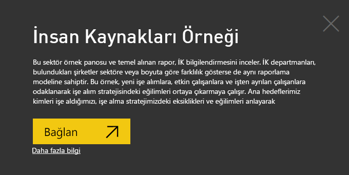
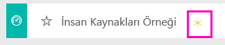
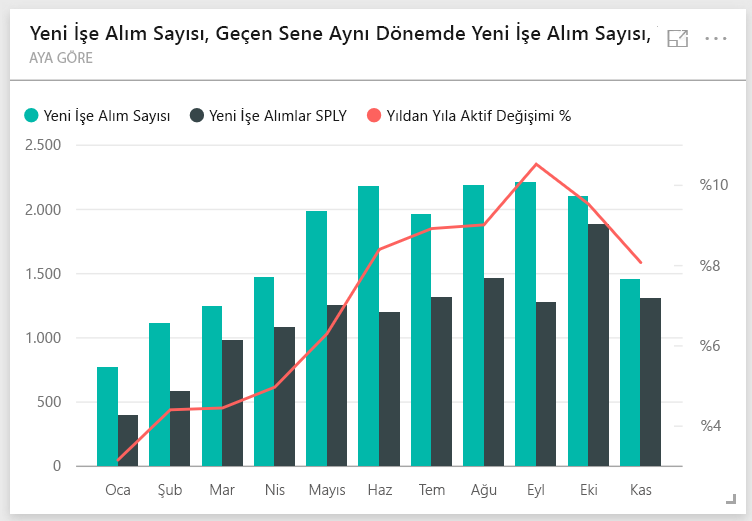
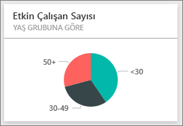
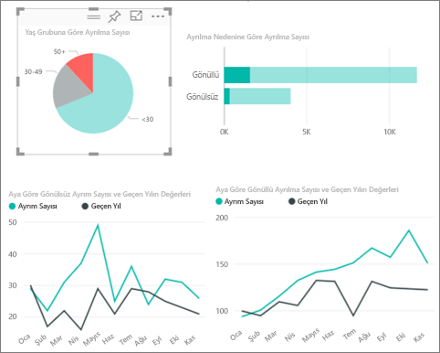
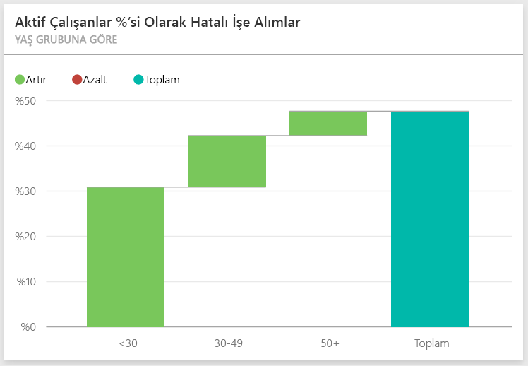
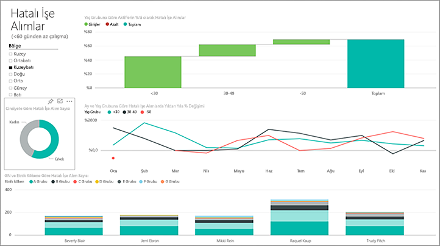
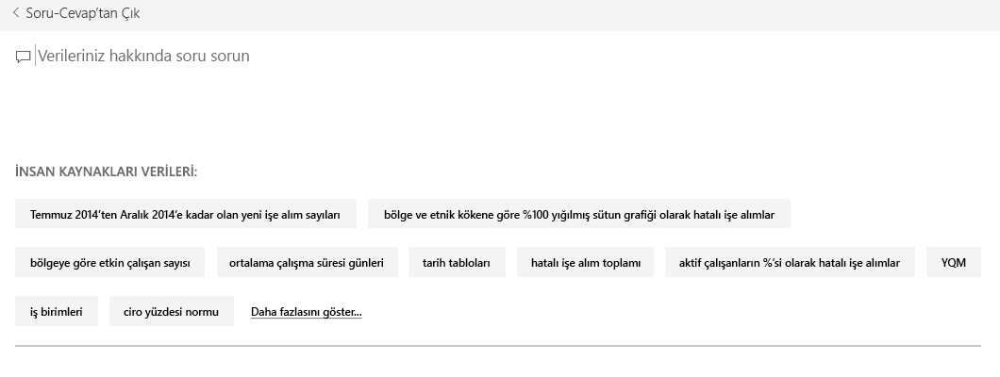

# Power BI için İnsan Kaynakları örneği: Tura katılın

## İnsan Kaynakları örneğine genel bakış
İK departmanları, bulundukları şirketler sektöre veya boyuta göre farklılık gösterse de aynı raporlama modeline sahiptir. Bu örnek, yeni işe alımlara, etkin çalışanlara ve işten ayrılan çalışanlara odaklanarak işe alım stratejisindeki eğilimleri ortaya çıkarmaya çalışır. Ana hedeflerimiz aşağıdaki noktaları kavramaktır:

* İşe aldığımız kişiler
* İşe alım stratejimizdeki eğilimler
* Gönüllü ayrılma konusundaki eğilimler

Bu örnek, Power BI'ı işle ilgili veriler, raporlar ve panolarla birlikte nasıl kullanabileceğinizi gösteren serinin bir parçasıdır. Bunlar, obviEnce'tan ([www.obvience.com](http://www.obvience.com/)) alınan anonimleştirilmiş gerçek verilerdir. Veriler çeşitli biçimlerde sunulur: içerik paketi/uygulama, Excel çalışma kitabı veya .pbix Power BI Desktop dosyası. Daha fazla bilgi için bkz. [Örnek veri kümeleri](sample-datasets.md).

## Önkoşullar

 Örneği kullanabilmeniz için öncelikle bunu bir [içerik paketi](https://docs.microsoft.com/power-bi/sample-human-resources#get-the-content-pack-for-this-sample), [pbix dosyası](http://download.microsoft.com/download/6/9/5/69503155-05A5-483E-829A-F7B5F3DD5D27/Human-Resources-Sample-PBIX.pbix) veya [Excel çalışma kitabı](http://go.microsoft.com/fwlink/?LinkId=529780) olarak indirmeniz gerekir.

### Bu örneğe ilişkin içerik paketini edinme

1. Power BI hizmeti (app.powerbi.com) sayfasına gidin ve oturum açın.
2. Sol alt köşedeki **Veri Al** seçeneğini belirleyin.
   
    
3. Görüntülenen Veri Al sayfasında **Örnekler** simgesini seçin.
   
   
4. **İnsan Kaynakları Örneği**'ni ve ardından **Bağlan**'ı seçin.  
   
   
5. Power BI, içerik paketini içeri aktarır ve geçerli çalışma alanınıza yeni bir pano, rapor ve veri kümesi ekler. Yeni içerik sarı yıldızla işaretlenir. 
   
   
  
### Bu örneğe ilişkin .pbix dosyasını edinme

Alternatif olarak, örneği bir .pbix dosyası olarak indirebilirsiniz. Bu dosya biçimi, Power BI Desktop ile kullanım için tasarlanmıştır. 

 * [İnsan Kaynakları Örneği](http://download.microsoft.com/download/6/9/5/69503155-05A5-483E-829A-F7B5F3DD5D27/Human Resources Sample PBIX.pbix)

### Bu örneğe ilişkin Excel çalışma kitabını edinme
Ayrıca bu örnek için [ yalnızca veri kümesini de (Excel çalışma kitabı) indirebilirsiniz](http://go.microsoft.com/fwlink/?LinkId=529780). Çalışma kitabı, görüntüleyebileceğiniz ve değiştirebileceğiniz Power View sayfaları içerir. Ham verileri görmek için **Power Pivot > Yönet** seçeneğini belirleyin.

## Yeni işe alımlar
Önce yeni işe alımları inceleyelim.

1. Çalışma alanınızda **Panolar** sekmesini seçin ve İnsan Kaynakları panosunu açın.
2. Panoda **New Hire Count, Hire Count, New Hires Same Period Last Year, Actives YoY % Change** **By Month** seçeneğini belirleyin.  
     

   İnsan Kaynakları Örneği raporu **New Hires** sayfası ile açılır.  

   

Aşağıdakilere dikkat edin:

* **Month tarafından düzenlenen New Hire Count, New Hires SPLY ve Actives YoY % Change** birleşik haritası, geçen yılla karşılaştırıldığında her ay daha fazla çalışan (bazı aylarda çok daha fazla sayıda çalışan) işe aldığımızı gösteriyor.
* **Region ve Ethnicity tarafından düzenlenen New Hire Count ve Active Employee Count** birleşik haritasında, **East** bölgesinde daha az sayıda çalışan işe aldığımızı görebilirsiniz.
* **Age Group tarafından düzenlenen New Hires YoY Var** şelale grafiği çoğunlukla genç çalışanları işe aldığımızı gösteriyor. Neden olarak, işlerin genel olarak yarı zamanlı olması gösterilebilir.
* **Gender tarafından düzenlenen New Hire Count** pasta grafiğinde oldukça eşit bir dağılım gözlemleniyor.

Cinsiyet dağılımının ayrımının eşit olmadığı bir bölge gibi daha fazla öngörüye ulaşabilir misiniz? Yaş, cinsiyet, bölge ve etnik köken arasındaki ilişkileri araştırmak için grafiklerdeki farklı yaş gruplarını ve cinsiyetleri seçin.

Panoya geri dönmek için üst gezinti çubuğundan panonun adını seçin.

## Geçerli etkin ve eski çalışanları karşılaştırma
Geçerli etkin çalışanlara ve artık şirket için çalışmayan kişilere ilişkin verileri araştıralım.

Panoda, **Age Group tarafından düzenlenen Active Employee** kutucuğunu seçin.  

İnsan Kaynakları Örneği raporu **Actives and Separations** sayfasıyla açılır.  

**Dikkat çekilmesi gereken öğeler**:

* Sol taraftaki birleşik haritalarda, etkin çalışan ve ayrılan sayılarında yıldan yıla gözlemlenen değişiklik gösterilir. Bu yıl yüksek bir işe alım oranıyla birlikte daha fazla etkin çalışana sahibiz ancak ayrılan sayısında da geçen yıla göre bir artış gözlemliyoruz.
* Ağustos'ta diğer aylara kıyasla daha fazla ayrılma gerçekleşmiş. Herhangi bir aykırı değer bulup bulamayacağınızı öğrenmek için farklı yaş gruplarını, cinsiyetleri veya bölgeleri seçin.
* Pasta grafiklerine baktığımızda cinsiyet ve yaş gruplarına göre etkin çalışanlarımızda oldukça eşit bir dağılım görüyoruz. Yaşa göre cinsiyet dağılımı farklılıklarını görüntülemek için farklı yaş gruplarını seçin. Her yaş grubunda eşit bir cinsiyet dağılımına mı sahibiz?

## Ayrılma nedenleri
Rapora, Düzenleme Görünümü'nde göz atalım. Sol üst köşedeki **Raporu düzenle** seçeneğini belirleyin.

Pasta grafiklerini Etkin çalışanlar yerine Ayrılan verilerini gösterecek şekilde değiştirin.

1. **Age Group tarafından düzenlenen Active Employee Count** pasta grafiğini seçin.
2. **Alanlar**'da Employees tablosunu genişletmek için **Employees**'in yanındaki oku seçin. **Active Employee Count**'un yanındaki onay kutusunu temizleyerek söz konusu alanı kaldırın.
3. Employees tablosundaki **Separation Count**'un yanındaki onay kutusunu seçerek bu alanı, alan kutusundaki **Values** kutusuna ekleyin.
4. Rapor tuvaline geri döndüğünüzde, **Separation Reason tarafından düzenlenen Separation Count** çubuk grafiğindeki **Voluntary** çubuğunu seçin. Bu, rapordaki diğer görsellerde, gönüllü olarak ayrılan kişileri vurgular.
5. Age Group tarafından düzenlenen Separation Count pasta grafiğinin 50+ adlı dilimine tıklayın.

   Sağ alt köşedeki Separations by Reason çizgi grafiğine bakın. Bu grafik, gönüllü ayrılmaları gösterecek şekilde filtrelenmiştir.  
   

   50 ve üzeri yaş grubundaki eğilimi fark ettiniz mi? Yılın ikinci yarısında 50 yaşın üstünde daha fazla çalışan gönüllü olarak ayrılıyor. Bu, daha fazla veriyle daha ayrıntılı bir şekilde incelenebilecek bir alan.
6. **Gender tarafından düzenlenen Active Employee Count** pasta grafiği için de aynı adımları izleyebilir ve grafiği, etkin çalışanlar yerine ayrılanları gösterecek şekilde değiştirebilirsiniz. Başka herhangi bir öngörü bulup bulamayacağınızı öğrenmek için cinsiyete göre gönüllü ayrılma verilerini gözden geçirin.
7. Panoya geri dönmek için üst gezinti çubuğunda **Power BI**'a tıklayın. Raporda yapmış olduğunuz değişiklikleri kaydedip kaydetmemek size kalmıştır.

## Hatalı işe alımlar
Araştırılacak son alan hatalı işe alımlardır. Hatalı işe alımlar, en fazla 60 gün çalışan kişiler olarak tanımlanır. Yüksek oranda işe alım gerçekleştiriyoruz. İyi adayları mı işe alıyoruz?

1. **Age Group tarafından düzenlenen Bad Hires as % of Actives** pano kutucuğunu seçin. Bu kutucuk, raporun "Bad Hires" başlıklı 3. sayfasını açar.

     
2. Sol taraftaki Bölge dilimleyicisinde **Northwest** onay kutusunu ve Gender tarafından düzenlenen Bad Hire Count halka grafiğindeki **male** dilimini seçin.  "Bad Hires" sayfasındaki diğer grafiklere bakın. Kadınlara göre daha fazla erkeğin hatalı olarak işe alındığını ve Group A'da çok sayıda hatalı işe alımın bulunduğunu görüyoruz.
     
3. **Gender tarafından düzenlenen Bad Hires** halka grafiğine baktığımızda ve **Region** dilimleyicisine tıkladığımızda Doğu'nun erkeklere göre daha çok kadının hatalı olarak işe alındığı tek bölge olduğunu görüyoruz.  
4. Panoya geri dönmek için üst gezinti çubuğundan panonun adını seçin.

## Soru-Cevap kutusunda soru sorma
[Soru-Cevap soru kutusu](power-bi-tutorial-q-and-a.md), doğal dil kullanarak soru yazdığınız yerdir. Soru-Cevap, yazdığınız kelimeleri tanıyarak cevabı veri kümesinin neresinde bulabileceğini belirler.

1. Soru-Cevap soru kutusuna tıklayın. Yazmaya başlamadan önce bile Soru-Cevap kutusunun öneriler içerdiğini göreceksiniz:

   
2. Bu önerilerden birini seçebilir veya şunu yazabilirsiniz: **show age group, gender and bad hires SPLY where region is east** (Doğu bölgesinde geçen yıl aynı dönem yaş grubunu, cinsiyeti ve hatalı işe alımları göster.)  

   

   Hatalı olarak işe alınan kadınların birçoğunun 30 yaşın altında olduğuna dikkat edin.

Bu ortamda istediğiniz değişikliği gerçekleştirebilirsiniz. Değişikliklerinizi kaydetmemeyi seçme konusunda her zaman özgürsünüz. Değişiklikleri kaydederseniz istediğiniz zaman **Veri Al** bölümüne giderek bu örneğin yeni bir kopyasını edinebilirsiniz.

## Sonraki adımlar: Verilerinize bağlanma
Bu turda Power BI panolarının, Soru-Cevap özelliğinin ve raporların insan kaynakları verileriyle ilgili olarak nasıl öngörüler sağlayabileceğini kavradığınızı umuyoruz. Şimdi kendi verilerinize bağlanma sırası sizde. Power BI ile çok çeşitli veri kaynaklarına bağlanabilirsiniz. [Power BI ile çalışmaya başlama](service-get-started.md) hakkında daha fazla bilgi edinin.  
