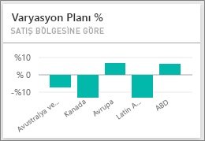
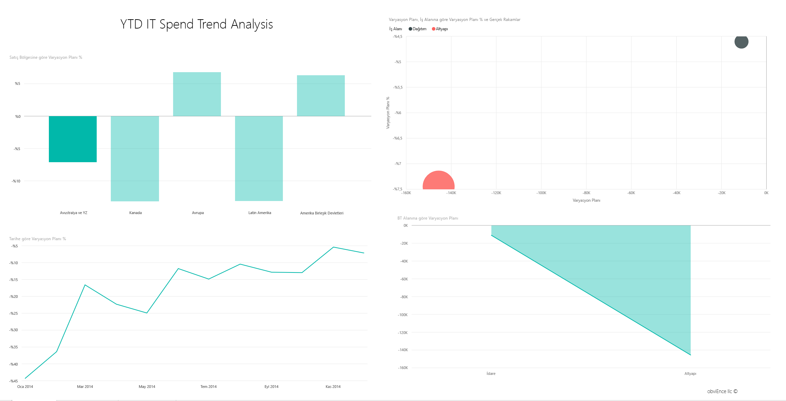
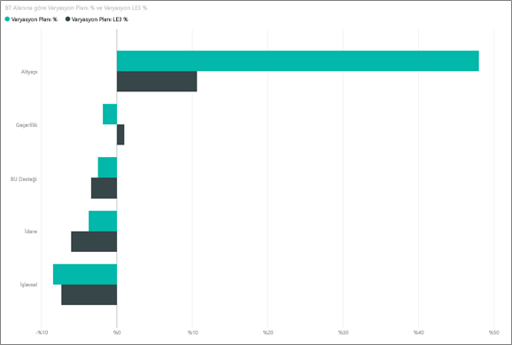
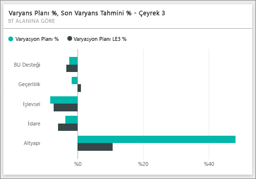
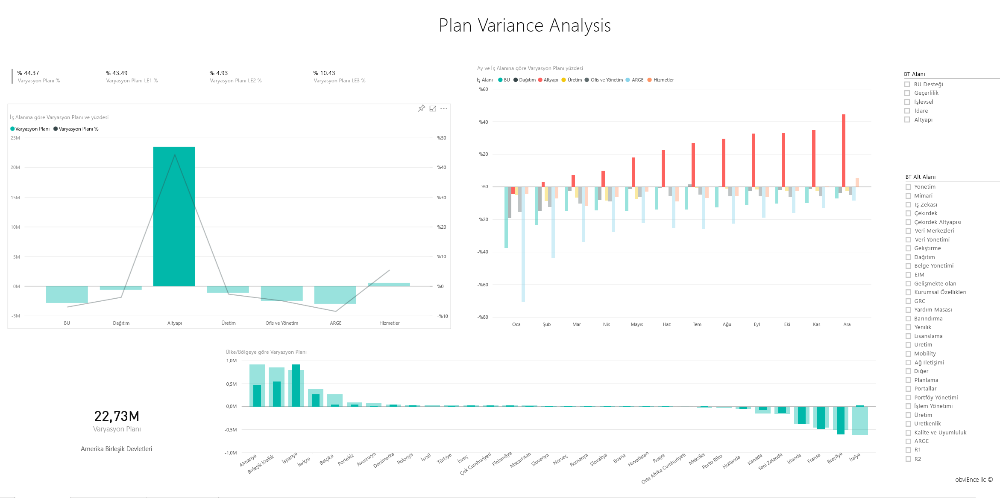

# Power BI için BT Harcama Analizi örneği: Tura katılın
BT Harcama Analizi [içerik paketinde](service-organizational-content-pack-introduction.md) (pano, rapor ve veri kümesi), bir BT departmanının planlanan maliyetleriyle gerçek maliyetleri karşılaştırmalı olarak çözümlenir. Bu karşılaştırma şirketin yıl için ne kadar iyi planlama yaptığını anlamamıza yardımcı olur ve plana göre büyük sapmalar görülen alanları araştırmamıza olanak tanır. Bu örnekteki şirket yıllık bir planlama döngüsünden geçer ve ardından finansal yılda BT'ye yapılan harcamalardaki değişiklikleri çözümlemelerine yardımcı olması için üç ayda bir yeni En Yeni Tahmin (LE) oluşturur.

Bu örnek, Power BI'ı işle ilgili veriler, raporlar ve panolarla birlikte nasıl kullanabileceğinizi gösteren serinin bir parçasıdır. Bunlar, obviEnce'tan (<http://obvience.com/>) alınan anonimleştirilmiş gerçek verilerdir.

* [BT Harcama Analizi içerik paketini edinin](sample-tutorial-connect-to-the-samples.md)
* [bu örnek için yalnızca veri kümesini (Excel çalışma kitabı) indirin](http://go.microsoft.com/fwlink/?LinkId=529783).

## BT Harcama Analizi Örneği panosu
Panoda bulunan, **Var Plan %** ve **Variance Latest Estimate % Quarter 3** adlı iki sayı kutucuğu, plana göre ve En Yeni Üç Aylık Dönem tahminine (LE3 = Latest Estimate Quarter 3) göre nasıl bir ilerleme kaydettiğimize ilişkin bir genel bakış sunar. Genel olarak bakıldığında, planın yaklaşık %6 oranında gerisindeyiz. Şimdi bu varyansın nedenini (ne zaman, nerede ve hangi kategori) araştıralım.

## "YTD IT Spend Trend Analysis" sayfası
**Var Plan % by Sales Region** pano kutucuğunu seçmeniz halinde, BT Harcama Analizi Örneği raporunun "IT Spend Trend Analysis" sayfasına yönlendirilirsiniz. Sayfaya göz attığımızda, ABD'de ve Avrupa'da pozitif bir varyansa; Kanada, Latin Amerika ve Avustralya'da negatif bir varyansa sahip olduğumuzu görüyoruz. ABD yaklaşık olarak %6 +LE varyansa, Avustralya ise yaklaşık olarak %7-LE varyansa sahip.

Ancak yalnızca bu grafiğe bakıp çıkarım yapmak yanıltıcı olabilir. Kapsamlı bir değerlendirme yapmak için dolar cinsinden gerçek tutarlara bakmamız gerekir.

1. Sales Region tarafından düzenlenen Var Plan % grafiğinde **Aus and NZ** seçeneğini belirleyip IT Area tarafından düzenlenen Var Plan grafiğini gözlemleyin. 
   
   
2. Şimdi **USA** seçeneğini belirleyin. Sizin de anladığınız gibi Avustralya, ABD ile kıyaslandığında toplam harcamalarımızda oldukça küçük bir paya sahip.
   
    Bu nedenle ABD'ye yönelik bir filtre uyguladık. Peki şimdi sırada ne var? ABD'de varyansa neden olan kategorinin hangisi olduğunu araştıralım.

## Veriler hakkında soru sorma
1. Panolar'a geri dönmek için üst gezinti çubuğunda **IT Spend Analysis Sample** seçeneğini belirleyin.
2. Soru kutusuna "show IT areas, var plan % and var le3 % bar chart" (BT alanları, varyans planı yüzdesi ve varyans le3 yüzdesi çubuk grafiği) yazın.
   
    
   
   **Infrastructure** adlı ilk BT alanında, ilk varyans planı ile varyans planı en yeni tahmini yüzde değerleri önemli ölçüde değişiklik gösterir.

## "YTD Spend by Cost Elements" sayfası
Panoya geri dönün ve **Var Plan %, Var LE3%** pano kutucuğuna bakın.

Altyapı, plana ilişkin büyük bir pozitif varyansla yükseliyor.

1. BT Harcama Analizi Örneği raporunun "YTD Spend by Cost Elements" sayfasına gitmek için bu kutucuğa tıklayın.
2. Sol alttaki "IT Area tarafından düzenlenen Var Plan % and Var LE3 %" grafiğinde bulunan **Infrastructure** çubuğuna tıklayın ve sol taraftaki "Sales Region tarafından düzenlenen Var Plan %" grafiğinde plana ilişkin varyansı gözlemleyin.
   
    
3. Büyük bir varyansa sahip maliyet öğesini bulmak için dilimleyicideki her bir Cost Element Group öğesinin adına tıklayın.
4. **Other** seçiliyken BT Alanında **Infrastructure** seçeneğine tıklayın ve en büyük varyansa sahip alt alanı bulmak için IT Sub Area dilimleyicisindeki alt alanlara tıklayın.  
   
   **Networking** için oldukça büyük bir varyans gözlemliyoruz.
   
   Şirketin, çalışanlarına kazanç olarak telefon hizmetleri sunmaya karar verdiği ancak bunun plan dahilinde olmadığı anlaşılıyor. 

## "Plan Variance Analysis" sayfası
Rapordayken, raporun 3. sayfasına gitmek için raporun alt tarafındaki "Plan Variance Analysis" sekmesine tıklayın.

Sol taraftaki "Business Area tarafından düzenlenen Var Plan ve Var Plan % " birleşik haritasında, sayfanın geri kalanındaki altyapı değerlerini vurgulamak için Infrastructure sütununa tıklayın.

"Month ve Business Area tarafından düzenlenen Var Plan %" grafiğinde, altyapının Şubat ayında pozitif bir varyansa sahip olmaya başladığını, ardından artmaya devam ettiğini görürsünüz. Ayrıca altyapı için plana yönelik varyans değerinin, tüm iş alanlarına ilişkin değerle karşılaştırıldığında ülkelere göre nasıl değişiklik gösterdiğine de dikkat edin. Sayfanın geri kalan kısmındaki değerleri vurgulamak yerine filtrelemek için, sağ taraftaki "IT Area" ve "IT Sub Areas" dilimleyicilerini kullanın. Verileri farklı bir şekilde araştırmak için sağ taraftaki farklı IT Area seçeneklerine tıklayın. Ayrıca IT Sub Area seçeneklerine tıklayarak söz konusu düzeylerde varyansı da görebilirsiniz.

## Raporu düzenleme
Sol üst köşedeki **Raporu düzenle** seçeneğine tıklayıp Düzenleme Görünümü'nde araştırma yapın.

* Sayfaların (her grafikteki alanların ve sayfalardaki filtrelerin) nasıl oluşturulduğuna bakın
* Aynı verileri temel alan sayfalar ve grafikler ekleyin
* Her bir grafik için görselleştirme türünü değiştirin
* Bunları panonuza sabitleyin

Bu ortamda istediğiniz değişikliği gerçekleştirebilirsiniz. Değişikliklerinizi kaydetmemeyi seçme konusunda her zaman özgürsünüz. Değişikliklerinizi kaydetseniz bile, dilediğiniz zaman Veri Al sayfasına giderek bu örneğin yeni bir kopyasını oluşturabilirsiniz.

## Sonraki adımlar: Verilerinize bağlanma
Power BI panolarının, Soru-Cevap özelliğinin ve raporların BT harcama verileri için nasıl öngörüler sağlayacağını gösterme konusunda etkili bir tur deneyimi edindiğinizi umuyoruz. Şimdi kendi verilerinize bağlanma sırası sizde. Power BI ile çok çeşitli veri kaynaklarına bağlanabilirsiniz. [Power BI ile çalışmaya başlama](service-get-started.md) hakkında daha fazla bilgi edinin.

