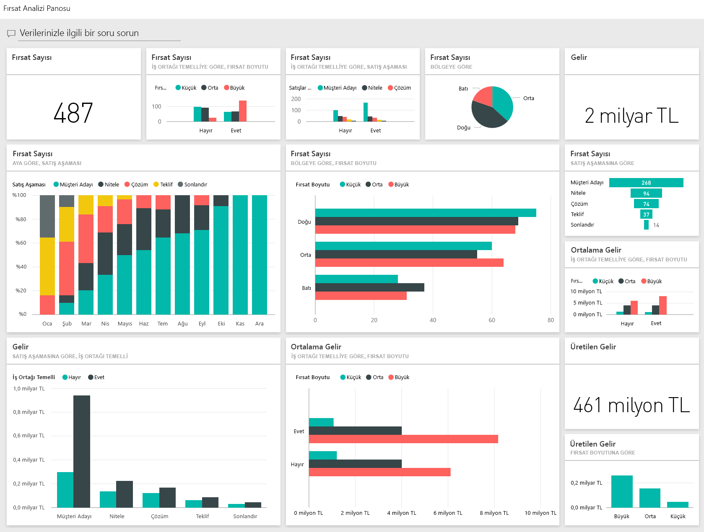
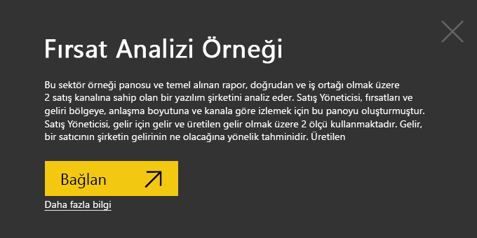
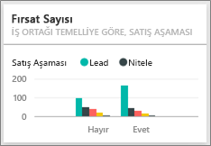

# Power BI için Fırsat Analizi Örneği: Tura katılın

Fırsat Analizi örneği içerik paketinde iki satış kanalı (*doğrudan* ve *iş ortağı*)olan bir yazılım şirketiyle ilgili pano, rapor ve veri kümesi vardır. Satış yöneticisi, fırsatları ve geliri bölgeye, anlaşma boyutuna ve kanala göre izlemek için bu panoyu oluşturmuştur.

Örnekte gelir için iki ölçü kullanılmaktadır:

* Revenue: Bir satıcının, gelirin ne olacağına yönelik tahmini.
* Factored revenue: Gelir X olasılık % şeklinde hesaplanır ve gerçek satış gelirinin daha doğru bir göstergesi olduğu düşünülür. Olasılık, fırsatın geçerli *sales stage* (satış aşaması) verilerine göre belirlenir:
  * Lead (müşteri adayı): %10  
  * Qualify (uygunluk): %20  
  * Çözüm: %40  
  * Proposal (teklif): %60  
  * Finalize (sonlandırma): %80

Bu örnek, Power BI'ı işle ilgili veriler, raporlar ve panolarla birlikte nasıl kullanabileceğinizi gösteren serinin bir parçasıdır. Örnek, [obviEnce](http://www.obvience.com/) öğesinden alınan, anonimleştirilmiş gerçek verilerle oluşturulmuştur. Veriler çeşitli biçimlerde sunulur: içerik paketi, .pbix Power BI Desktop dosyası veya Excel çalışma kitabı. Bkz. [Power BI Örnekleri](sample-datasets.md). 

Bu öğreticide, Power BI hizmetinde Fırsat Analizi örneği içerik paketi incelenir. Power BI Desktop ile hizmette rapor deneyimleri benzer olduğundan, Power BI Desktop'ta örnek .pbix dosyasını kullanarak da örneği takip edebilirsiniz. 

Power BI Desktop'ta örnekleri incelemek için Power BI lisansına ihtiyacınız yoktur. Power BI Pro lisansınız yoksa örneği Power BI hizmetinde Çalışma Alanım alanınıza kaydedebilirsiniz. 

## Örneği alma

Örneği kullanabilmeniz için bir [içerik paketi](#get-the-content-pack-for-this-sample), [.pbix dosyası](#get-the-pbix-file-for-this-sample) veya [Excel çalışma kitabı](#get-the-excel-workbook-for-this-sample) olarak indirmeniz gerekir.

### Bu örneğe ilişkin içerik paketini edinme

1. Power BI hizmetini açın (app.powerbi.com), oturum açın ve örneği kaydetmek istediğiniz çalışma alanını açın. 

    Power BI Pro lisansınız yoksa örneği Çalışma Alanım alanınıza kaydedebilirsiniz.

2. Sol alt köşedeki **Veri Al**'ı seçin.

    
3. Görüntülenen **Veri Al** sayfasında **Örnekler**'i seçin.

4. **Fırsat Analizi Örneği**'ni ve ardından **Bağlan**'ı seçin.  

   
5. Power BI, içerik paketini içeri aktarır ve ardından geçerli çalışma alanınıza yeni bir pano, rapor ve veri kümesi ekler.

   

### Bu örneğe ilişkin .pbix dosyasını edinme

Alternatif olarak, Fırsat Analizi örneğini bir [.pbix dosyası](http://download.microsoft.com/download/9/1/5/915ABCFA-7125-4D85-A7BD-05645BD95BD8/Opportunity%20Analysis%20Sample%20PBIX.pbix) olarak indirebilirsiniz. Bu dosya biçimi, Power BI Desktop ile kullanım için tasarlanmıştır.

### Bu örneğe ilişkin Excel çalışma kitabını edinme

Bu örnekte kullanılan veri kaynağını görüntülemek isterseniz, [Excel çalışma kitabı](http://go.microsoft.com/fwlink/?LinkId=529782) olarak da bulabilirsiniz. Çalışma kitabı, görüntüleyebileceğiniz ve değiştirebileceğiniz Power View sayfaları içerir. Ham verileri görmek için Veri Çözümlemesi eklentilerini etkinleştirip **Power Pivot > Yönet**'i seçin. Power View ve Power Pivot eklentilerini etkinleştirme ayrıntıları için bkz. [Excel'in içinden Excel örneklerini gözden geçirme](sample-datasets.md#optional-take-a-look-at-the-excel-samples-from-inside-excel-itself).

## Panomuz bize ne anlatıyor?
Satış yöneticimiz, onlar için en önemli olduğunu düşündüğü ölçümleri izlemek için bir pano oluşturmuştur. İlginç bir bulguyla karşılaştıklarında bir kutucuğu seçip söz konusu verileri inceleyebilirler:

- Şirket geliri 2 milyar ABD doları, faktörlere göre gelir ise 461 milyon ABD doları seviyesindedir.
- Fırsat sayısı ve gelir, toplam rakamların ilerleyen aşamalarda azaldığı bilindik bir huni desenini takip etmektedir.
- Fırsatlarımızın çoğu Doğu bölgesindedir.
- Büyük çaplı fırsatlar orta veya küçük çaplı fırsatlardan daha fazla gelir getirmektedir.
- Büyük iş ortağı anlaşmaları, 6 milyon dolar seviyesindeki doğrudan satışlara göre 8 milyon ABD doları ile daha fazla gelir getirmektedir.

Büyük, orta veya küçük ölçekli anlaşmaları gerçekleştirmek için aynı ölçüde çaba harcandığından şirketimiz verileri analiz ederek büyük fırsatlar hakkında daha fazla bilgi edinmelidir.

1. Örneği kaydettiğiniz çalışma alanında **Panolar** sekmesini açın, sonra **Fırsat Analizi Örneği** panosunu bulun ve bu panoyu seçin.

2. Fırsat Analizi Örneği raporunun ilk sayfasını açmak için **Opportunity Count by Partner Driven, Sales Stage** kutucuğunu seçin. 

    

## Rapordaki sayfaları inceleme

Alttaki sayfa sekmelerini seçerek raporun tüm sayfalarını görüntüleyin.

### Opportunity Count Overview sayfası

Aşağıdaki bilgileri unutmayın:
* Fırsat sayısı bakımından en büyük bölge Doğu olmuştur.  
* **Opportunity Count by Region** pasta grafiğinde sırayla her bölgeyi seçerek sayfayı bölgeye göre filtreleyin. Her bölgede iş ortaklarının daha büyük fırsatları kovaladığına dikkat edin.   
* **Opportunity Count by Partner Driven and Opportunity Size** sütun grafiği, büyük fırsatların çoğunun iş ortakları tarafından yaratıldığını ve küçük veya orta düzey fırsatların böyle olmadığını göstermektedir.
* **Opportunity Count by Sales Stage** çubuk grafiğinde sırayla her **Sales Stage** öğesini seçerek bölgesel sayılardaki farkı görün. Doğu (East) bölgesi en büyük fırsat sayısına sahip olsa da diğer üç bölgenin Solution, Proposal ve Finalize satış aşamalarındaki sayılarının birbirine yakın olduğuna dikkat edin. Bu sonuç da Orta (Central) ve Batı (West) bölgelerinde fırsat yüzdesinin daha yüksek olduğu anlamına gelmektedir.

### Revenue Analysis sayfası
Bu sayfada veriler benzer şekilde incelenmektedir ancak sayı yerine gelir açısından ele alınmaktadır.  

Aşağıdaki bilgileri unutmayın:
* Doğu yalnızca fırsat sayısı değil gelir açısından da en büyük bölgedir.  
* **Partner Driven** için **Yes** değerini seçerek **Revenue by Sales Stage and Partner Driven** grafiğini filtrelerseniz, 1,5 milyar ABD doları gelir ve 294 milyon ABD doları üretilen gelir görürsünüz. Bu tutarları iş ortakları tarafından yaratılmamış 644 milyon ABD doları ve 166 milyon ABD doları gelirle karşılaştırın. 
* Büyük müşterilere ilişkin ortalama gelir, iş ortakları tarafından sağlanan fırsatlarda (8 milyon), iş ortağı harici fırsatlara (6 milyon) kıyasla daha fazladır.  
* İş ortakları tarafından sağlanan işlerde büyük boyutlu fırsatlar için ortalama gelir, orta çaplı fırsatların neredeyse iki katıdır.  
* Küçük ve orta çaplı işletmelerin ortalama geliri ise hem iş ortakları tarafından sağlanan hem de sağlanmayan işler için karşılaştırılabilir.   

İş ortaklarımızın müşterilere satış yapma konusunda iş ortağı olmayanlardan daha iyi bir iş çıkardığını rahatça söyleyebiliriz. Anlaşmaları iş ortaklarımız aracılığıyla yapmak daha mantıklı olacaktır.

### Opportunity Count by Region and Stage
Raporun bu sayfası önceki sayfadakilere benzer verilere bakar ama bunları bölgeye ve aşamaya göre ayırır. 

Aşağıdaki bilgileri unutmayın:
* Doğu bölgesine göre filtrelemek için **Opportunity Count by Region** pasta grafiğinde **East** bölgesini seçerseniz, bu bölgedeki fırsatların iş ortağı tarafından yaratılanlarla diğerleri arasında neredeyse eşit bölündüğünü görürsünüz.
* Büyük çaplı fırsatlar en çok Orta bölgesinde, küçük çaplı fırsatlar en çok Doğu bölgesinde, orta çaplı fırsatlar ise en çok Batı bölgesinde yer almaktadır.

### Upcoming Opportunities by Month sayfası
Bu sayfada benzer faktörlere, ama tarih ve saat açısından bakıyoruz. 
 

CFO'muz bu sayfayı iş yükünü yönetmek için kullanmaktadır. Satış aşamasına ve aya göre gelir fırsatlarına bakarak uygun planları yapabilirler.

Aşağıdaki bilgileri unutmayın:
* En yüksek ortalama gelir Finalize satış aşamasına aittir. Bu anlaşmaları sonlandırmak en yüksek önceliğe sahiptir.
* Aya göre filtreleme yaparsanız (**Month** dilimleyicisinde bir ay seçerek) Ocak ayının 75 milyon ABD doları üretilen gelirle Finalize satış aşamasında en yüksek büyük fırsat oranına sahip olduğunu görürsünüz. Diğer taraftan Şubat ayı Solution ve Proposal satış aşamalarında en fazla orta çaplı fırsata sahiptir.
* Genel olarak, faktöre bağlı gelir rakamları; satış aşamasına, fırsat sayısına ve anlaşma boyutuna göre dalgalanmaktadır. Başka içgörüler keşfetmek için sağ taraftaki **Filter** bölmesini kullanarak bu faktörlere yönelik filtrelere ekleyin.

## Sonraki adımlar: Verilerinize bağlanma
Değişikliklerinizi kaydetmek zorunda olmadığınızdan, bu ortamda güvenle farklı şeyler deneyebilirsiniz. Değişikliklerinizi kaydetseniz bile, dilediğiniz zaman **Veri Al**'ı seçip bu örneğin yeni bir kopyasını oluşturabilirsiniz.

Power BI panolarının, Soru-Cevap özelliğinin ve raporların örnek veriler için nasıl içgörüler sağlayacağını gösterme konusunda etkili bir tur deneyimi yaşadığınızı umuyoruz. Artık siz de kendi verilerinize bağlanarak çalışmaya başlayabilirsiniz. Power BI ile çok çeşitli veri kaynaklarına bağlanabilirsiniz. Daha fazla bilgi edinmek için bkz. [Power BI hizmeti ile çalışmaya başlama](service-get-started.md).

