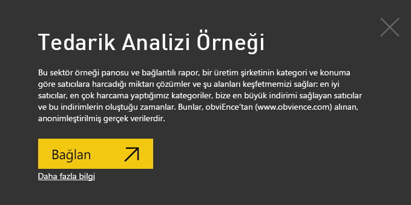

# Power BI için Tedarik Analizi örneği: Tura katılın

Tedarik Analizi örneği içerik paketinde üretim şirketinin satıcılara yaptığı harcamayı kategoriye ve konuma göre analiz eden bir pano, rapor ve veri kümesi vardır. Bu örnekte şu alanları araştıracağız:

* En iyi satıcılar
* En çok harcama yaptığımız kategoriler
* Bize en yüksek indirimi sunan satıcılar ve bu indirimlerin ne zaman yapıldığı

Bu örnek, Power BI'ı işle ilgili veriler, raporlar ve panolarla birlikte nasıl kullanabileceğinizi gösteren serinin bir parçasıdır. Örnek, [obviEnce](http://www.obvience.com/)'ten alınan, anonimleştirilmiş gerçek verilerle oluşturulmuştur. Veriler çeşitli biçimlerde sunulur: içerik paketi, .pbix Power BI Desktop dosyası veya Excel çalışma kitabı. Bkz. [Power BI Örnekleri](sample-datasets.md). 

Bu öğreticide, Power BI hizmetinde Tedarik Analizi örneği içerik paketi incelenir. Power BI Desktop ile hizmette rapor deneyimleri benzer olduğundan, Power BI Desktop'ta örnek .pbix dosyasını kullanarak da örneği takip edebilirsiniz. 

Power BI Desktop'ta örnekleri incelemek için Power BI lisansına ihtiyacınız yoktur. Power BI Pro lisansınız yoksa örneği Power BI hizmetinde Çalışma Alanım alanınıza kaydedebilirsiniz. 

## Örneği alma

Örneği kullanabilmeniz için bir [içerik paketi](#get-the-content-pack-for-this-sample), [.pbix dosyası](#get-the-pbix-file-for-this-sample) veya [Excel çalışma kitabı](#get-the-excel-workbook-for-this-sample) olarak indirmeniz gerekir.

### Bu örneğe ilişkin içerik paketini edinme

1. Power BI hizmetini açın (app.powerbi.com), oturum açın ve örneği kaydetmek istediğiniz çalışma alanını açın. 

    Power BI Pro lisansınız yoksa örneği Çalışma Alanım alanınıza kaydedebilirsiniz.

2. Sol alt köşedeki **Veri Al**'ı seçin.

    
3. Görüntülenen **Veri Al** sayfasında **Örnekler**'i seçin.

4. **Tedarik Analizi Örneği**'ni ve ardından **Bağlan**'ı seçin.  
  
   
   
5. Power BI, içerik paketini içeri aktarır ve ardından geçerli çalışma alanınıza yeni bir pano, rapor ve veri kümesi ekler.
   
   
  
### Bu örneğe ilişkin .pbix dosyasını edinme

Alternatif olarak, Tedarik Analizi örneğini bir [.pbix dosyası](http://download.microsoft.com/download/D/5/3/D5390069-F723-413B-8D27-5888500516EB/Procurement%20Analysis%20Sample%20PBIX.pbix) olarak indirebilirsiniz. Bu dosya biçimi, Power BI Desktop ile kullanım için tasarlanmıştır. 

### Bu örneğe ilişkin Excel çalışma kitabını edinme

Bu örnekte kullanılan veri kaynağını görüntülemek isterseniz, [Excel çalışma kitabı](http://go.microsoft.com/fwlink/?LinkId=529784) olarak da bulabilirsiniz. Çalışma kitabı, görüntüleyebileceğiniz ve değiştirebileceğiniz Power View sayfaları içerir. Ham verileri görmek için Veri Çözümlemesi eklentilerini etkinleştirip **Power Pivot > Yönet**'i seçin. Power View ve Power Pivot eklentilerini etkinleştirme ayrıntıları için bkz. [Excel'in içinden Excel örneklerini gözden geçirme](sample-datasets.md#optional-take-a-look-at-the-excel-samples-from-inside-excel-itself).

## Harcama eğilimleri
İlk olarak kategoriye ve konuma göre harcama eğilimlerine göz atalım.  

1. Örneği kaydettiğiniz çalışma alanında **Panolar** sekmesini açın, sonra **Tedarik Analizi Örneği** panosunu bulun ve bu panoyu seçin. 
2. Panoda **Total Invoice by Country/Region** kutucuğunu seçin. Bu kutucuk **Procurement Analysis Sample** raporunun **Spend Overview** sayfasını açar.

    

Aşağıdaki bilgileri unutmayın:

* **Total Invoice by Month and Category** adlı çizgi grafiğinde, **Direct** kategorisinde tutarlı bir harcama söz konusuyken **Logistics** kategorisinde maksimum harcamanın Aralık ayında yapıldığını ve **Other** kategorisi için Şubat ayında ani bir artış yaşandığını görüyoruz.
* **Total Invoice by Country/Region** adlı haritada harcamalarımızın çoğunu ABD'de yaptığımızı görüyoruz.
* **Total Invoice by Sub Category** adlı sütun grafiğinde **Hardware** ve **Indirect Goods & Services** kategorilerinin en fazla harcama yapılan kategoriler olduğu görülüyor.
* **Total Invoice by Tier** adlı çubuk grafiğinde büyük çoğunlukla katman 1'de (ilk 10) yer alan satıcılarımızla çalıştığımızı görüyoruz. Bunu yapmak satıcı ilişkilerini daha iyi yönetmemize olanak sağlıyor.

## Meksika'da yapılan harcamalar
Şimdi de Meksika'daki harcama alanlarını araştıralım.

1. **Total Invoice by Country/Region** haritasında **Mexico** kabarcığını seçin. **Total Invoice by Sub Category** sütun grafiğinde en fazla harcamanın **Indirect Goods & Services** alt kategorisinde yapıldığını görüyoruz.

   
2. **Indirect Goods & Services** sütununda detaya gidin:

   * **Total Invoice by Sub Category** grafiğinde, grafiğin sağ üst köşesindeki detaya gitme okunu  seçin.
   * **Indirect Goods & Services** sütununu seçin.

      Sizin de görebildiğiniz gibi açık arayla en fazla harcama **Sales & Marketing** alt kategorisi için yapılıyor.
   * Haritada tekrar **Meksika**'yı seçin.

      Mexico için, en fazla harcama **Maintenance & Repair** alt kategorisinde.

      
3. Detaydan çıkmak için grafiğin sol üst köşesindeki yukarı oku seçin.
4. Detaya gitme okunu tekrar seçerek detaya gitme özelliğini devre dışı bırakın.  
5. Üst gezinti çubuğunda **Tedarik Analizi Örneği**'ni seçerek panoya dönün.

## Farklı şehirleri değerlendirme
Farklı şehirleri değerlendirmek için vurgulama özelliğini kullanabiliriz.

1. Panoda **Total Invoice, Discount % By Month** kutucuğunu seçin. Bu kutucuk **Procurement Analysis Sample** raporunun **Discount Analysis** sayfasını açar.
2. **Total Invoice by City** ağaç haritasında sırayla her şehri seçerek karşılaştırma yapın. Miami'nin neredeyse tüm faturalarının Katman 1'deki satıcılara ait olduğuna dikkat edin.

   

## Satıcı indirimleri
Şimdi de satıcıların sunduğu indirimleri ve en fazla indirimi aldığımız zaman aralıklarını inceleyelim:
* İndirimler her ay farklı mı yoksa bunlar aynı mı kalıyor?
* Bazı şehirler diğerlerine göre daha fazla indirim alıyor mu?

### Aylara göre indirim
**Total Invoice and Discount % by Month** birleşik haritasına bakarsanız Şubat ayının en yoğun geçen ay olduğunu ve Eylül ayının da en az yoğun ay olduğunu görürsünüz. 

Bu ayların indirim yüzdesine bakın: hacim arttıkça indirim azalıyor ve hacim düştüğünde indirim artıyor. İndirime ne kadar çok ihtiyacımız varsa o kadar kötü anlaşmalar yapıyoruz.

### Şehirlere göre indirim
Araştırılacak başka bir alan ise şehirlere göre yapılan indirimlerdir. Ağaç haritasında sırayla her şehri seçerek diğer grafiklerin nasıl değiştiğine bakın:

* St. Louis'in toplam fatura açısından bakıldığında Şubat ayında büyük bir artış yakaladığını, indirim tasarrufu alanında ise Nisan ayında büyük bir düşüş yaşadığını görüyoruz.
* Mexico City en yüksek indirim yüzdesine (%11,05) sahipken Atlanta en düşük yüzdeye (%0,08) sahip.

### Raporu düzenleme
Sol üst köşedeki **Raporu düzenle**'yi seçin ve Düzenleme görünümünü inceleyin:

* Sayfaların nasıl oluşturulduğuna bakın.
* Aynı verileri temel alan sayfalar ve grafikler ekleyin.
* Bir grafik için görselleştirme türünü değiştirin (örneğin, ağaç haritasını halka grafik olarak değiştirin).
* Grafikleri panonuza sabitleyin.

## Sonraki adımlar: Verilerinize bağlanma
Değişikliklerinizi kaydetmek zorunda olmadığınızdan, bu ortamda güvenle farklı şeyler deneyebilirsiniz. Değişikliklerinizi kaydetseniz bile, dilediğiniz zaman **Veri Al**'ı seçip bu örneğin yeni bir kopyasını oluşturabilirsiniz.

Power BI panolarının, Soru-Cevap özelliğinin ve raporların örnek veriler için nasıl içgörüler sağlayacağını gösterme konusunda etkili bir tur deneyimi yaşadığınızı umuyoruz. Artık siz de kendi verilerinize bağlanarak çalışmaya başlayabilirsiniz. Power BI ile çok çeşitli veri kaynaklarına bağlanabilirsiniz. Daha fazla bilgi edinmek için bkz. [Power BI hizmeti ile çalışmaya başlama](service-get-started.md).

