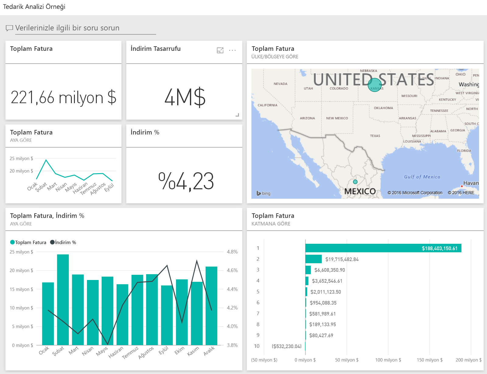
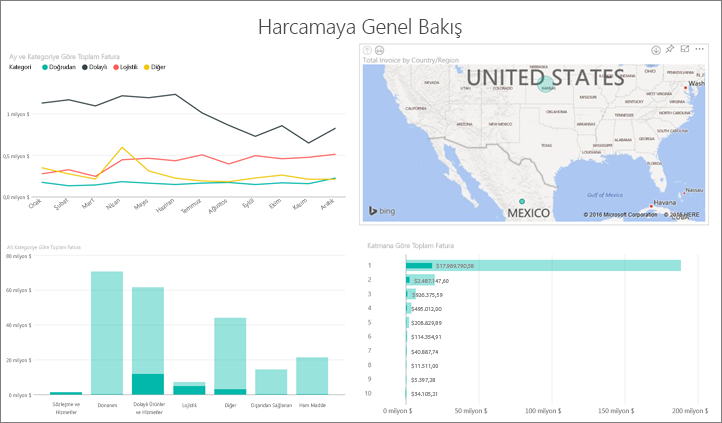
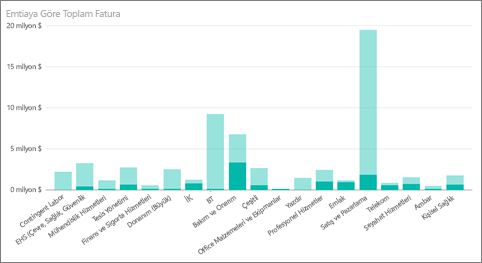
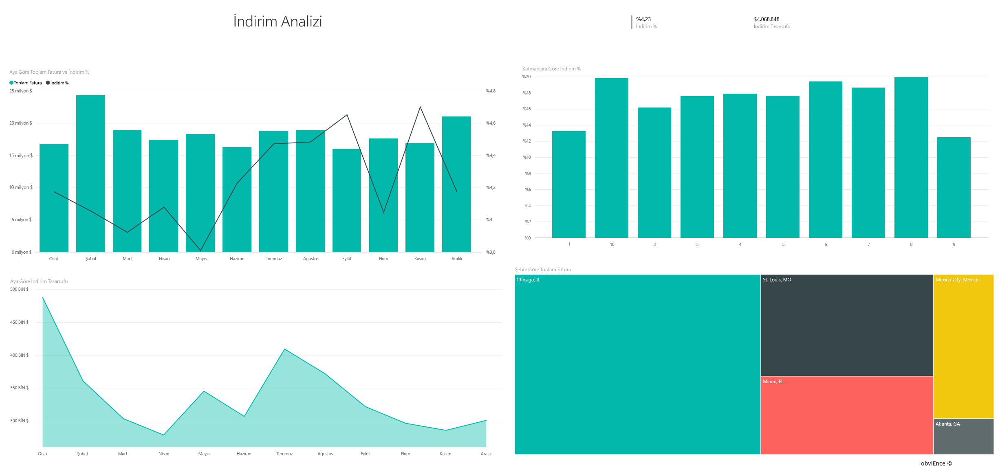
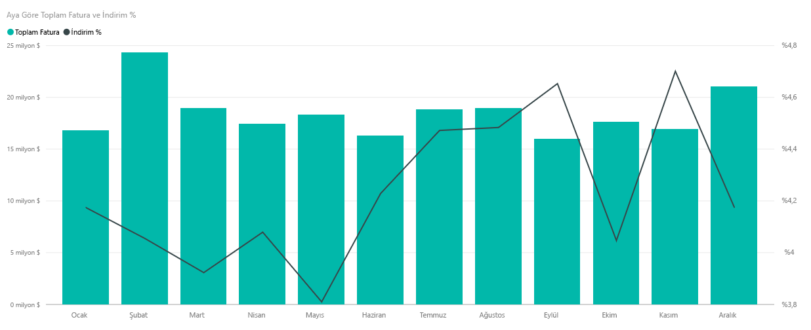
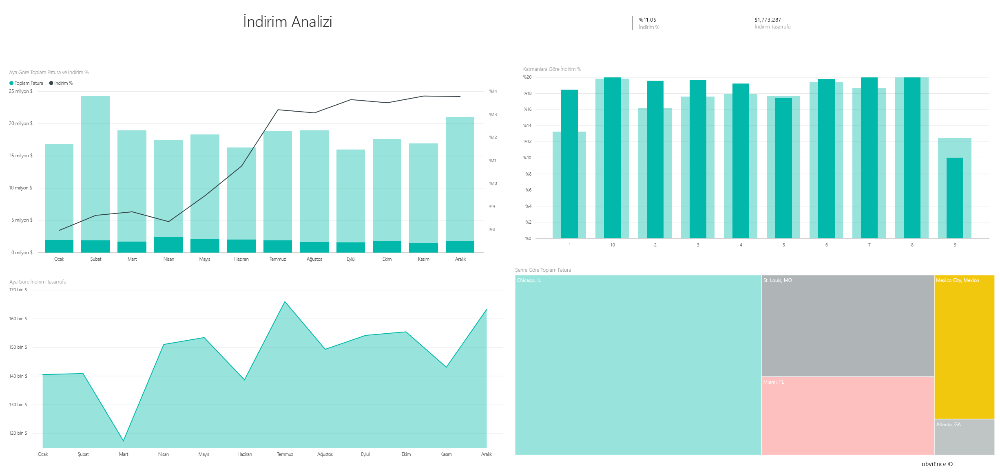

# Power BI için Procurement Analysis Sample: Tura katılın
Bu sektör örneği panosunda ve bağlantılı raporda, bir üretim şirketinin kategori ve konuma göre satıcılar için yaptığı harcamalar çözümlenmiştir. Bu örnekte şu alanları araştıracağız:

* En iyi satıcılar
* En çok harcama yaptığımız kategoriler
* Bize en yüksek indirimi sunan satıcılar ve bu indirimlerin ne zaman yapıldığı

Bu örnek, iş odaklı veriler, raporlar ve panolar ile Power BI'ı nasıl kullanabileceğinizi gösteren serinin bir parçasıdır. Bunlar, obviEnce'tan ([www.obvience.com](http://www.obvience.com/)) alınan anonimleştirilmiş gerçek verilerdir.

Birlikte ilerlemek ister misiniz? [Power BI hizmetinde](https://powerbi.com) **Veri Al > Örnekler > Tedarik Analizi Örneği > Bağlan** yolunu izleyerek örneğin bir kopyasını edinin.

[!Note] Ayrıca bu örnek için [ yalnızca veri kümesini de (Excel çalışma kitabı) indirebilirsiniz](http://go.microsoft.com/fwlink/?LinkId=529784). Çalışma kitabı, görüntüleyebileceğiniz ve değiştirebileceğiniz Power View sayfaları içerir. Ham verileri görmek için **Power Pivot > Yönet** seçeneğini belirleyin.

## Harcama eğilimleri
İlk olarak kategoriye ve konuma göre harcama eğilimlerine göz atalım.  

1. Çalışma alanınızda **Panolar** sekmesini açın ve Procurement Analysis panosunu seçin.
2. **Total Invoice by Country/Region** adlı pano kutucuğunu seçin. Bu işlemin ardından "Procurement Analysis Sample" adlı raporun "Spend Overview" sayfası açılır.
   
    

Aşağıdaki birkaç noktaya dikkat edin:

* **Month ve Category tarafından düzenlenen Total Invoice** adlı çizgi grafiğinde: **Direct** kategorisinde oldukça tutarlı bir harcama söz konusuyken **Logistics** kategorisinde maksimum harcamanın Aralık ayında yapıldığını ve **Other** kategorisi için Şubat ayında ani bir artış yaşandığını görüyoruz.
* **Country/Region tarafından düzenlenen Total Invoice** adlı haritada: Harcamalarımızın çoğunu ABD'de yaptığımızı görüyoruz.
* **Sub Category tarafından düzenlenen Total Invoice** adlı sütun grafiğinde: **Hardware** ve **Indirect Goods & Services** kategorilerinin, en fazla harcama yapılan kategoriler olduğu görülüyor.
* Tier tarafından düzenlenen Total Invoice adlı çubuk grafiğinde: Büyük çoğunlukla, Katman 1'de (ilk 10) yer alan satıcılarımızla çalıştığımızı görüyoruz. Bu, satıcı ilişkilerinin daha iyi yönetilmesine yardımcı olur.

## Meksika'da yapılan harcamalar
Şimdi de Meksika'daki harcama alanlarını araştıralım.

1. Pasta grafiğinde haritadaki **Meksika** balonunu seçin. "Sub Category tarafından düzenlenen Total Invoice" adlı sütun grafiğinde, en fazla harcamanın **Indirect Goods & Services** alt kategorisinde yapıldığını görüyoruz.
   
   
2. **Indirect Goods & Services** sütununda detaya gidin:
   
   * Grafiğin sağ üst köşesinde bulunan, detaya git okunu  seçin.
   * **Indirect Goods & Services** sütununu seçin.
     
      Bu kategoride şu ana kadar en fazla harcamanın Sales & Marketing alanında yapıldığını görüyoruz.
   * Haritada tekrar **Meksika**'yı seçin.
     
      Meksika'da bu kategorideki en fazla harcamanın Maintenance & Repair için yapıldığı görülüyor.
     
      
3. Detaydan çıkmak için grafiğin sol üst köşesindeki yukarı oku seçin.
4. Oku tekrar seçerek detaya gitme özelliğini devre dışı bırakın.  
5. Çalışma alanınıza dönmek için üst kısımdaki gezinti çubuğunda **Power BI**'ı seçin.

## Farklı şehirleri değerlendirme
Farklı şehirleri değerlendirmek için vurgulama özelliğini kullanabiliriz.

1. **Month tarafından düzenlenen Total Invoice ve Discount %** adlı pano kutucuğunu seçin. Bu işlemin ardından raporun "Discount Analysis" sayfası açılır.
2. **City tarafından düzenlenen Total Invoice** adlı ağaç haritasında farklı şehirleri seçerek karşılaştırma yapabilirsiniz. Miami'nin neredeyse tüm faturalarının Katman 1'deki satıcılara ait olduğu görülüyor.
   
   

## Satıcı indirimleri
Şimdi de satıcıların sunduğu indirimleri ve en fazla indirimi aldığımız zaman aralıklarını inceleyelim. 

Özellikle aşağıdaki sorulara cevap arayacağız:

* İndirimler aydan aya değişiklik gösteriyor mu yoksa her ay aynı mı?
* Bazı şehirler diğerlerine göre daha fazla indirim alıyor mu?

### Aylara göre indirim
**Month tarafından düzenlenen Total Invoice ve Discount %** adlı birleşik haritada **Şubat** ayının en yoğun geçen ay olduğunu ve bunu **Eylül** ayının izlediğini görüyoruz. Şimdi bu aylardaki indirim yüzdelerine göz atalım.
Hacim arttıkça indirimin azaldığını ve hacim düştükçe indirimin arttığına dikkat edin. Ne kadar indirim talep edersek o kadar düşük hacimlerle çalıştığımızı görüyoruz.

### Şehirlere göre indirim
Araştırılacak başka bir alan ise şehirlere göre yapılan indirimlerdir. Ağaç haritasında her bir şehri seçerek diğer grafiklerin nasıl değiştiğine göz atın. 

* St. Louis, MO şehrinin toplam fatura açısından bakıldığında Şubat ayında büyük bir artış yakaladığını, indirim tasarrufu alanında ise Nisan ayında büyük bir düşüş yaşadığını görüyoruz.
* Mexico City, Mexico en yüksek indirim yüzdesine (%11,05) sahipken Atlanta, GA en düşük yüzdeye (%0,08) sahip.

### Raporu düzenleme
Sol üst köşedeki **Raporu düzenle** seçeneğine tıklayıp Düzenleme Görünümü'nde araştırma yapın.

* Sayfaların nasıl oluşturulduğuna bakın
* Aynı verileri temel alarak sayfalar ve grafikler ekleyin
* Bir grafik için görselleştirme türünü değiştirin (örneğin, ağaç haritasını halka grafik olarak değiştirin)
* Bu görselleştirmeleri panonuza sabitleyin

Bu ortamda istediğiniz değişikliği gerçekleştirebilirsiniz. Değişikliklerinizi kaydetmemeyi seçme konusunda her zaman özgürsünüz. Değişiklikleri kaydederseniz istediğiniz zaman **Veri Al** bölümüne giderek bu örneğin yeni bir kopyasını edinebilirsiniz.

## Sonraki adımlar: Verilerinize bağlanma
Bu turda Power BI panolarının, perakende verilerine yönelik olarak nasıl öngörüler sağlayabileceğini kavradığınızı umuyoruz. Şimdi sıra sizde, kendi verilerinize bağlanın. Power BI ile çok çeşitli veri kaynaklarına bağlanabilirsiniz. [Power BI ile çalışmaya başlama](service-get-started.md) hakkında daha fazla bilgi edinin.

