# Power BI için Perakende Analizi örneği: Tura katılın

Sektörden alınan örneklerin yer aldığı pano ve bağlantılı raporda, birden fazla mağazada ve bölgede satışı yapılan mallara ilişkin perakende satış verileri çözümlenmektedir. Ölçümler şu alanlarda bu yılın performansını geçen yılın rakamlarıyla karşılaştırmaktadır: satış, birim sayısı, brüt kâr, varyans ve yeni mağaza analizi. Anonim hale getirilmiş bu gerçek veriler, obviEnce'tan ([www.obvience.com](http://www.obvience.com)) alınmıştır.

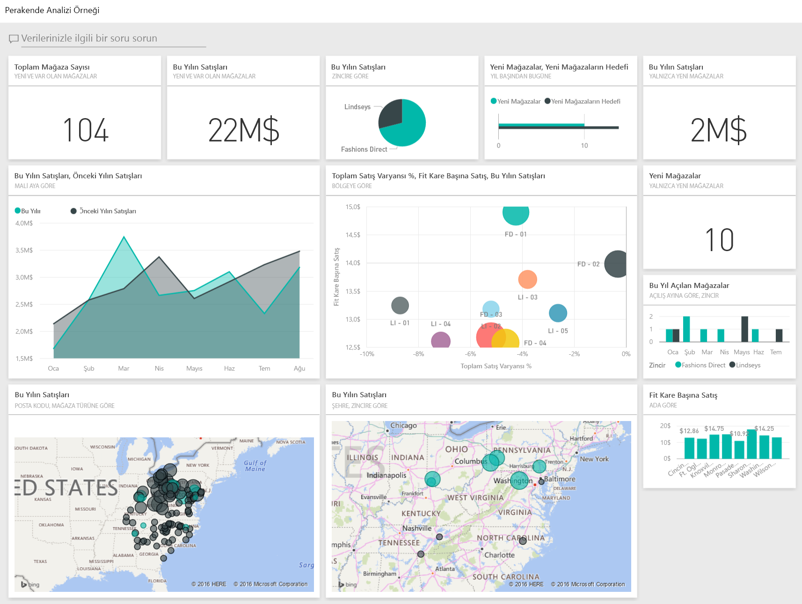

## Önkoşullar

 Örneği kullanabilmeniz için bir [içerik paketi](https://docs.microsoft.com/en-us/power-bi/sample-datasets#get-and-open-a-sample-content-pack-in-power-bi-service), [.pbix dosyası](http://download.microsoft.com/download/9/6/D/96DDC2FF-2568-491D-AAFA-AFDD6F763AE3/Retail%20Analysis%20Sample%20PBIX.pbix) veya [Excel çalışma kitabı](http://go.microsoft.com/fwlink/?LinkId=529778) olarak indirmeniz gerekir.

### Bu örneğe ilişkin içerik paketini edinme

1. Power BI hizmeti (app.powerbi.com) sayfasına gidin ve oturum açın.
2. Sol alt köşedeki **Veri Al** seçeneğini belirleyin.
   
    
3. Görüntülenen Veri Al sayfasında **Örnekler** simgesini seçin.
   
   
4. **Perakende Analizi Örneği**'ni ve ardından **Bağlan**'ı seçin.  
  
   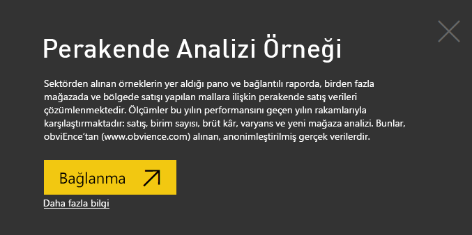
   
5. Power BI, içerik paketini içeri aktarır ve geçerli çalışma alanınıza yeni bir pano, rapor ve veri kümesi ekler. Yeni içerik sarı yıldızla işaretlenir. 
   
   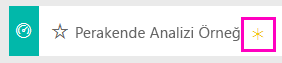
  
### Bu örneğe ilişkin .pbix dosyasını edinme

Alternatif olarak, örneği bir .pbix dosyası olarak indirebilirsiniz. Bu dosya biçimi, Power BI Desktop ile kullanım için tasarlanmıştır. 

 * [Perakende Analizi Örneği](http://download.microsoft.com/download/9/6/D/96DDC2FF-2568-491D-AAFA-AFDD6F763AE3/Retail%20Analysis%20Sample%20PBIX.pbix)

### Bu örneğe ilişkin Excel çalışma kitabını edinme
Ayrıca bu örnek için [ yalnızca veri kümesini de (Excel çalışma kitabı) indirebilirsiniz](http://go.microsoft.com/fwlink/?LinkId=529778). Çalışma kitabı, görüntüleyebileceğiniz ve değiştirebileceğiniz Power View sayfaları içerir. Ham verileri görmek için **Power Pivot > Yönet** seçeneğini belirleyin.

## Panodan başlayın ve raporu açın
1. Panoda, "Total Stores" kutucuğunu seçin:

   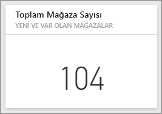  

   Rapordaki "Store Sales Overview" sayfası açılır. Toplamda 104 tane mağaza olduğunu ve bunların 10 tanesinin yeni olduğunu görüyoruz. Fashions Direct ve Lindseys olmak üzere iki zincirimiz var. Fashions Direct mağazaları ortalamaya göre daha büyük.
2. Pasta grafiğinde, **Fashions Direct**'i seçin.

   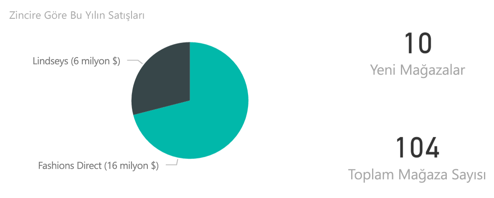  

   Kabarcık grafiğindeki sonuca dikkat edin:

   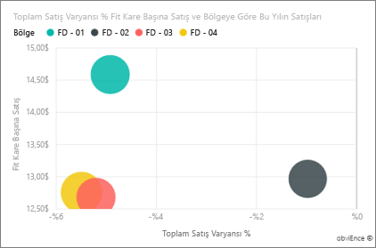  

   FD-01 bölgesi en yüksek Average Sales per Square Foot değerine sahipken FD-02, geçen yılla karşılaştırıldığında en düşük Variance in Sales değerine sahip; FD-03 ve FD-04 ise tüm bölgeler arasında en düşük performansa sahip olanlar.
3. Seçimlerinizin etkisini ortaya çıkaran çapraz vurgulamayı görmek için kabarcıkları veya diğer grafikleri seçin.
4. Panoya dönmek için, üst gezinti çubuğunda (içerik haritaları) panonun adını seçin.

   
5. Panoda, "This Year's Sales" kutucuğunu seçin.

   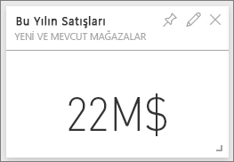

   Bu, soru kutusuna "This year sales" yazmakla eşdeğerdir.

   Şu ekranı görürsünüz:

   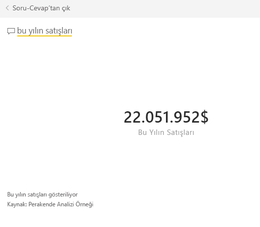

## Power BI Soru-Cevap ile oluşturulmuş olan bir kutucuğu gözden geçirme
Biraz daha ayrıntıya inelim.

1. Soruya "this year sales **by district**" yazın. Sonucu inceleyin: Yanıtı otomatik olarak bir çubuk grafiğe yerleştirir ve başka ifadeler önerir:

   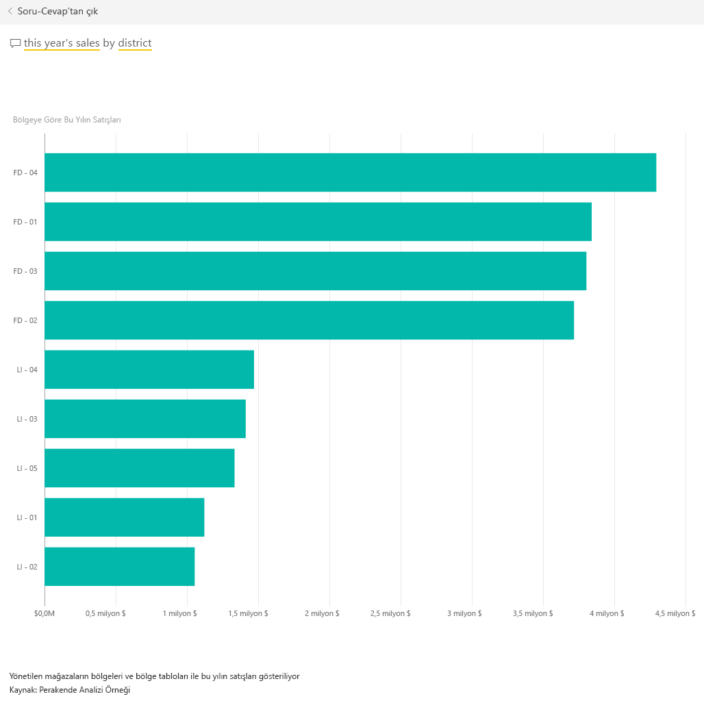
2. Şimdi soruyu "this year sales **by zip and chain**" olarak değiştirelim.

   Siz yazdığınız sırada, sorunuzu uygun grafiklerle nasıl yanıtladığına dikkat edin.
3. Başka sorularla deneme yapın ve elde ettiğiniz sonuçları inceleyin.
4. Hazır olduğunuzda panoya geri dönün.

## Verileri ayrıntılı bir şekilde inceleme
Şimdi bölgelerin performanslarına bakarak verileri daha ayrıntılı bir şekilde araştıralım.

1. Panoda, bu yılın satışlarını geçen yılınkilerle karşılaştıran kutucuğu seçin.

   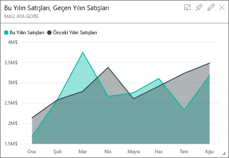

   Geçen yıla göre Variance % değerinde çok fazla dalgalanma olduğuna; Ocak, Nisan ve Temmuz aylarının özellikle kötü geçtiğine dikkat edin.

   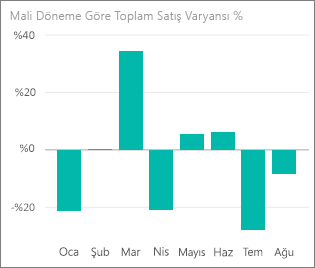

   Şimdi bu sorunların kaynağına inip inemeyeceğimize bir bakalım.
2. Kabarcık grafiğini ve ardından **020-Mens** kabarcığını seçin.

   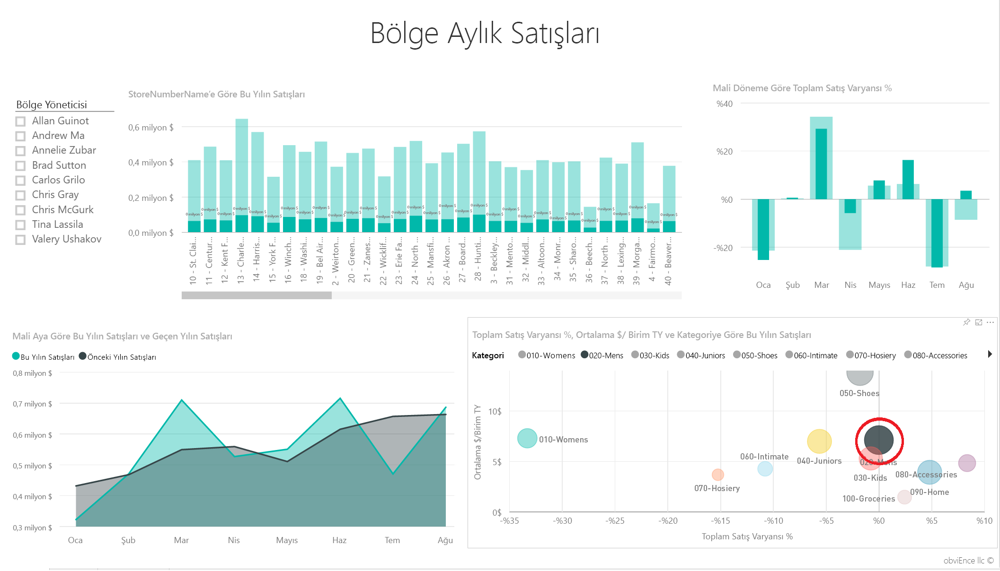  

   Nisan ayında erkek kategorisinin işletmenin geneli kadar ciddi etkilenmediğini ancak Ocak ve Temmuz aylarında sorun yaşandığına dikkat edin.
3. Şimdi **010-Womens** kabarcığını seçin.

   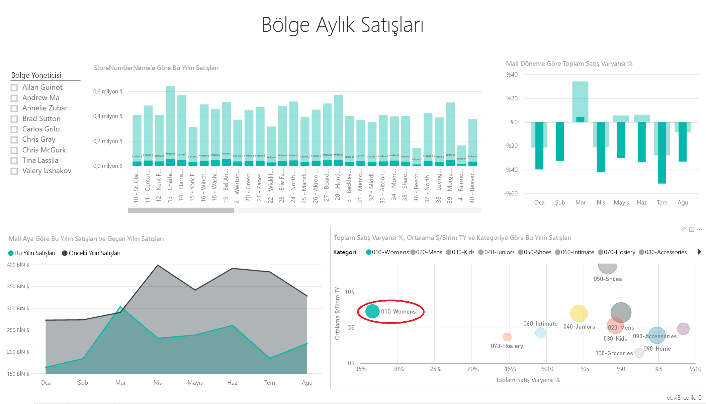

   Kadınlar kategorisinin tüm aylarda işletmenin genelinden çok daha kötü performans gösterdiğine ve önceki yılla karşılaştırıldığında neredeyse tüm aylarda daha kötü bir performans sergilediğine dikkat edin.
4. Kabarcığı tekrar seçerek filtreyi temizleyin.

## Dilimleyiciyi deneyin
Şimdi belirli bölgelerin performanslarına göz atalım.

1. Sol üstteki dilimleyiciden Allan Guinot'ı seçin.

   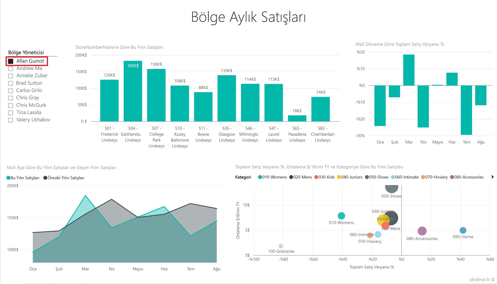

   Allan'ın bölgesinin Mart ve Haziran ayları için geçen yıldan daha iyi bir performans gösterdiğine dikkat edin.
2. Allan seçili durumdayken Women's kabarcığını seçin.

   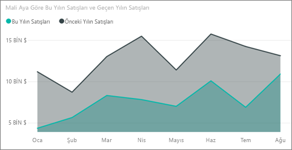

   Women's kategorisi için Allan'ın bölgesi, önceki yılın satış hacmini hiç yakalayamamış.
3. Diğer bölge yöneticilerini ve kategorileri inceleyin. Başka hangi öngörülere ulaşabiliyorsunuz?
4. Hazır olduğunuzda panoya geri dönün.

## Verilerimiz bu yılki satış artışı hakkında neler söylüyor?
İncelemek istediğimiz son nokta büyüme verileri, yani bu yıl açılan mağazalar.

1. "Stores Opened This Year" kutucuğunu seçin.

   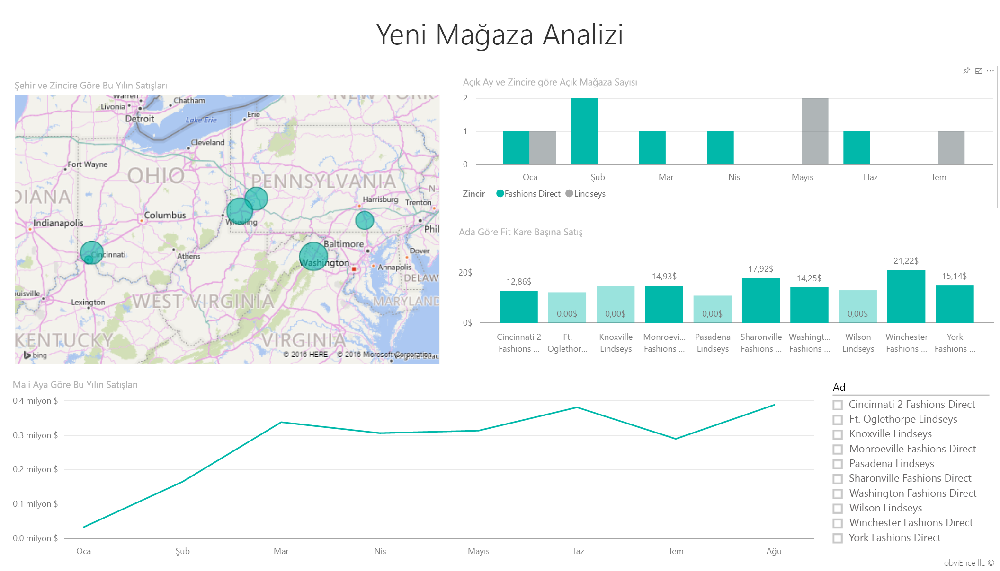

   Kutucuktan kolayca anlaşıldığı üzere bu yıl açılan Fashions Direct mağazalarının sayısı Lindseys mağazalarından fazla.
2. "Sales Per Sq Ft by Name" grafiğini inceleyin:

   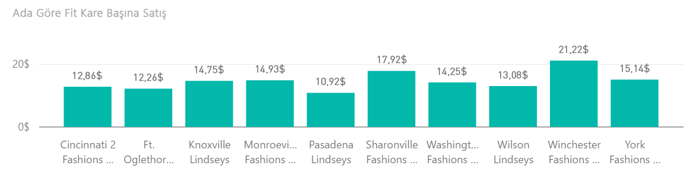

    Yeni mağazaların Average Sales per SQF değerleri arasında oldukça fark var.
3. Sağ üst grafikteki Fashions Direct açıklama öğesine tıklayın. Aynı zincirde bile en iyi mağazanın (Winchester Fashions Direct), $21,22 değerine karşı $12,86 ile, en kötü mağazadan (Cincinnati 2 Fashions Direct) çok daha iyi olduğuna dikkat edin.

   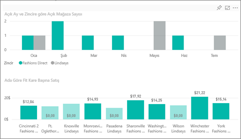
4. Dilimleyicideki Winchester Fashions Direct öğesine tıklayın ve çizgi grafiği inceleyin. İlk satış rakamları Şubat ayında bildirilmiş.
5. Dilimleyicideki Cincinnati 2 Fashions Direct öğesine tıkladığınızda, çizgi grafikte, Haziran ayında açıldığını ve en kötü performansa sahip mağaza olduğunu göreceksiniz.
6. Önceki örneklerde olduğu gibi, grafiklerdeki diğer çubuklara, çizgilere ve kabarcıklara tıklayarak araştırma yapın ve öngörüler keşfedin.

Bu ortamda dilediğiniz işlemi gerçekleştirebilirsiniz. Değişikliklerinizi kaydetmemeyi seçme konusunda her zaman özgürsünüz. Değişikliklerinizi kaydetseniz bile Veri Al sayfasına giderek bu örneğin yeni bir kopyasını oluşturabilirsiniz.

## Verilerinize bağlanma
Power BI panolarının, Soru-Cevap özelliğinin ve raporların perakende verileri için nasıl öngörüler sağlayacağını gösterme konusunda etkili bir tur deneyimi edindiğinizi umuyoruz. Artık siz de kendi verilerinize bağlanarak çalışmaya başlayabilirsiniz. Power BI ile çok çeşitli veri kaynaklarına bağlanabilirsiniz. [Power BI ile çalışmaya başlama](service-get-started.md) hakkında daha fazla bilgi edinin.

## Sonraki adımlar
* [Perakende Analizi örnek içerik paketini indirme](sample-tutorial-connect-to-the-samples.md)
* [Tüm örnek dosyaları bir zip dosyasında indirme](http://go.microsoft.com/fwlink/?LinkId=535020)    
* [Bu Power BI örneğine ilişkin Excel çalışma kitabını indirme](http://go.microsoft.com/fwlink/?LinkId=529778)    
* [Power BI için veri alma](service-get-data.md)    
* [Power BI - Temel Kavramlar](service-basic-concepts.md)    
* Başka bir sorunuz mu var? [Power BI Topluluğu'na başvurun](http://community.powerbi.com/)
