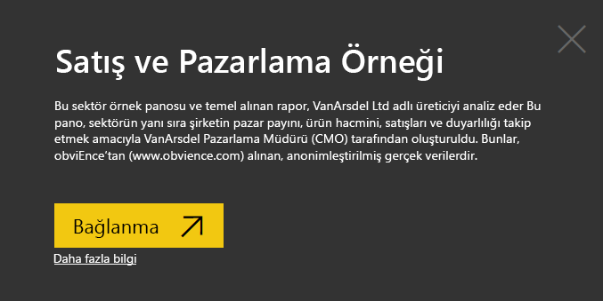
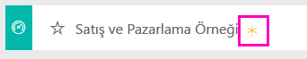
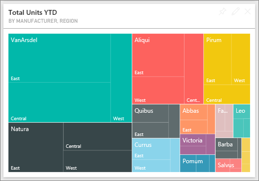
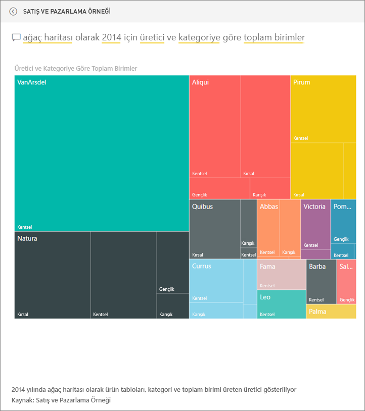
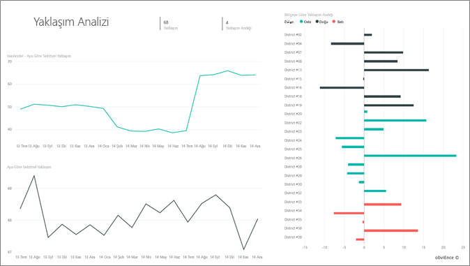
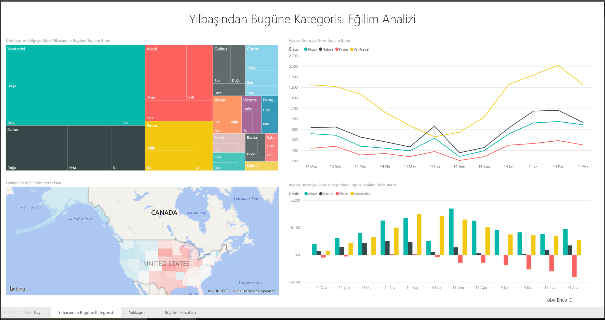
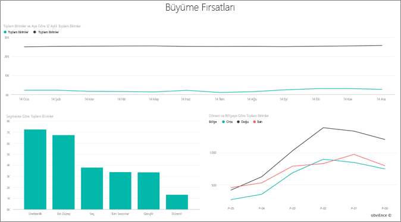

# Power BI için Satış ve Pazarlama örneği: Tura katılın

## Satış ve Pazarlama örneğine genel bakış
**Satış ve Pazarlama Örneği**, VanArsdel Ltd adında kurgusal bir üretim şirketine yönelik bir pano ve rapor içerir. Bu pano, sektörün yanı sıra şirketin pazar payını, ürün hacmini, satışları ve duyarlılığı takip etmek amacıyla VanArsdel Pazarlama Müdürü (CMO) tarafından oluşturuldu.

Çok sayıda rakibi olan VanArsdel kendi sektörünün pazar lideri. CMO, pazar payını artırmak ve büyüme fırsatlarını keşfetmek istiyor. Ancak bir şekilde VanArsdel'in pazar payı, Haziran'da gerçekleşen büyük düşüşlerle küçülmeye başlıyor.

Bu örnek, iş odaklı veriler, raporlar ve panolar ile Power BI'ı nasıl kullanabileceğinizi gösteren serinin bir parçasıdır. Bunlar, obviEnce'tan (www.obvience.com) alınan, anonimleştirilmiş gerçek verilerdir.

## Önkoşullar

 Örneği kullanabilmeniz için bir [içerik paketi](https://docs.microsoft.com/en-us/power-bi/sample-sales-and-marketing#get-the-content-pack-for-this-sample), [.pbix](http://download.microsoft.com/download/9/7/6/9767913A-29DB-40CF-8944-9AC2BC940C53/Sales and Marketing Sample PBIX.pbix) veya [Excel çalışma kitabı](http://go.microsoft.com/fwlink/?LinkId=529785) olarak indirmeniz gerekir.

### Bu örneğe ilişkin içerik paketini edinme

1. Power BI hizmeti (app.powerbi.com) sayfasına gidin ve oturum açın.
2. Sol alt köşedeki **Veri Al** seçeneğini belirleyin.
   
    
3. Görüntülenen Veri Al sayfasında **Örnekler** simgesini seçin.
   
   
4. **Satış ve Pazarlama Örneği**'ni ve ardından **Bağlan**'ı seçin.  
  
   
   
5. Power BI, içerik paketini içeri aktarır ve geçerli çalışma alanınıza yeni bir pano, rapor ve veri kümesi ekler. Yeni içerik sarı yıldızla işaretlenir. 
   
   
  
### Bu örneğe ilişkin .pbix dosyasını edinme

Alternatif olarak, örneği bir .pbix dosyası olarak indirebilirsiniz. Bu dosya biçimi, Power BI Desktop ile kullanım için tasarlanmıştır. 

 * [Satış ve Pazarlama Örneği](http://download.microsoft.com/download/9/7/6/9767913A-29DB-40CF-8944-9AC2BC940C53/Sales%20and%20Marketing%20Sample%20PBIX.pbix)

### Bu örneğe ilişkin Excel çalışma kitabını edinme
Ayrıca bu örnek için [ yalnızca veri kümesini de (Excel çalışma kitabı) indirebilirsiniz](http://go.microsoft.com/fwlink/?LinkId=529785). Çalışma kitabı, görüntüleyebileceğiniz ve değiştirebileceğiniz Power View sayfaları içerir. Ham verileri görmek için **Power Pivot > Yönet** seçeneğini belirleyin.

## Panomuz bize ne anlatıyor?
Şimdi pano turunuza başlayalım ve CMO'nun sabitlemeyi seçtiği kutucuklara göz atalım. Pazar payımız, satışlarımız ve yaklaşım ile ilgili bilgiler görüyoruz. Bu verileri bölgeye, zamana ve rekabete göre ayrılmış şekilde görüyoruz.

* Sol sütundaki sayı kutucukları geçtiğimiz yıla ait sektör satış hacmini (50 B), pazar payını (%32,86), satış hacmini (16 B), yaklaşım puanını (68), yaklaşım farkını (4) ve satışı yapılan toplam birim sayısını (1 M) gösterir.
* Üstteki çizgi grafik, pazar payımızın zaman içinde nasıl dalgalandığını gösterir. Pazar payımız Haziran ayında oldukça küçülüyor. Ayrıca bir süredir artış gösteren R12M (Rolling 12 Months) payımız sabitlenmeye başlıyor.
* En büyük rakibimiz (ortadaki sütun grafiği kutucuğundan da anlaşılacağı gibi) Aliqui.
* İş faaliyetlerimizin büyük bir kısmı Doğu'daki ve Merkezi bölgelerde.
* Alt taraftaki çizgi grafik Haziran'daki düşüşümüzün mevsimsel olmadığını, rakiplerimizden hiçbirinin aynı eğilimi göstermediğini ortaya koyuyor.
* İki "Total Units" (Toplam Birim Sayısı) kutucuğu satışı yapılan birim sayısını segmente ve bölgeye/üreticiye göre gösterir. Sektörümüzde yer alan en büyük pazar segmentleri **Productivity** ve **Convenience**.

### Daha fazla ayrıntıya girmek için Soru-Cevap özelliğini kullanma
#### Hangi segmentler satışlarımızı artırıyor? Bu, sektör eğilimiyle eşleşiyor mu?
1. Soru-Cevap özelliğinin açılmasını sağlayacak olan "Total Units Overall by Segment" seçeneğini belirleyin.
2. Mevcut sorgunun sonuna **for VanArsdel** (VanArsdel için) yazın. Soru-Cevap, soruyu yorumlar ve cevapta güncelleştirilmiş bir grafik görüntüler. Ürün hacmimiz Convenience ve Moderation segmentlerinden geliyor.

   
3. **Moderation** ve **Convenience** segmentlerindeki payımız oldukça yüksek ve bunlar, rekabet içinde olduğumuz segmentler.
4. Üst gezinti çubuğunda (içerik haritası) pano adını seçerek panoya geri dönün.

#### Kategoriye göre (bölgeyle karşılaştırıldığında) toplam birim pazar payı nasıl görünüyor?
1. "Total Units YTD by Manufacturer, Region" kutucuğuna dikkat edin. Toplam birim pazar payının kategoriye göre nasıl göründüğünü merak ediyorum.

   
2. Panonun üst tarafındaki soru kutusuna **total units by manufacturer and category for 2014 as a treemap** (2014 için ağaç haritası olarak üreticiye ve kategoriye göre toplam birim sayısı) sorusunu yazın. Siz sorunuzu yazdıkça görselleştirmenin nasıl güncelleştirildiğine dikkat edin.
   
3. Bulguları karşılaştırmak için grafiği panonuza sabitleyin. 2014 yılında VanArsdel'in yalnızca **Urban** kategorisindeki ürünlerin satışını yapmış olması oldukça ilginç.
4. Panoya geri dönün.

Panolar aynı zamanda raporlar için bir giriş noktası niteliğindedir.  Kutucuk bir bağlantılı rapordan oluşturulduysa bu kutucuğa tıklandığında rapor açılır.

Panomuzdaki R12M (Rolling 12 Months) satırı pazar payımızın artık büyümediğini, hatta biraz küçüldüğünü gösteriyor. Haziran ayında neden pazar payına ilişkin büyük bir düşüş görüyoruz? Daha fazla inceleme yapmak için bu görselleştirmeye tıklayarak, bağlantılı raporu açın.

### Raporumuzda 4 sayfa yer alır
#### 1. sayfası VanArsdel'in pazar payına odaklanır.

1. Alt taraftaki "Total Units by Month and isVanArsdel" adlı sütun grafiğine bakın. Siyah sütun VanArsdel'i (ürünlerimizi), yeşil sütun ise rakibimizi temsil eder. Haziran 2014'te VanArsdel'in yaşadığı düşüş, rakiplerinde gözlemlenmedi.
2. Sağ tarafta ortada bulunan "Segment tarafından düzenlenen Total Category Volume" adlı çubuk grafik, VanArsdel'in en iyi 2 segmentini gösterecek şekilde filtrelenmiştir. Bu filtrenin nasıl oluşturulduğuna bir göz atalım:  

   a.  Sağ taraftaki Filtreler bölmesini genişletin.  
   b.  Görselleştirmeyi seçmek için tıklayın.  
   c.  Görsel düzeyi filtreleri bölümünde, **Segment**'in yalnızca **Convenience** ve **Moderation** segmentlerini içerecek şekilde filtrelenmiş olduğuna dikkat edin.  
   d.  Söz konusu bölümü genişletmek için Segment'i seçerek filtreyi değiştirin ve ardından **Productivity** seçeneğini işaretleyerek bu segmenti de ekleyin.  
3. "Month ve isVanArsdel tarafından düzenlenen Total Units" kutucuğunda, sayfaya VanArsdel'e göre çapraz filtre uygulamak için açıklamadaki siyah renkli "Yes" seçeneğini belirleyin. Productivity segmentinde faaliyet göstermediğimize dikkat edin.
4. Filtreyi kaldırmak için siyah renkli "Yes" seçeneğini tekrar belirleyin.
5. Çizgi grafiğe göz atın. Aylık pazar payımızı ve 12 aylık hareketli düzende pazar paylarımızı gösterir. 12 aylık hareketli düzendeki veriler, aylık dalgalanmaların giderilmesine yardımcı olur ve uzun vadeli eğilimleri gösterir. Her segment için pazar payında ne kadar dalgalanma olduğunu görmek üzere çubuk grafikte Convenience ve ardından Moderation seçeneklerini belirleyin. Moderation segmenti Convenience segmentiyle karşılaştırıldığında pazar payında daha fazla dalgalanma gözlemleniyor.

Hâlâ Haziran'da pazar payında yaşanan büyük düşüşün sebebini öğrenmeye çalışıyoruz. Şimdi Sentiment segmentini kontrol edelim.

#### Raporumuzun 3. sayfası Yaklaşım odaklıdır.

Twitter, Facebook, bloglar, makaleler vb. iki çizgi grafikle gösterilen yaklaşıma katkı sağlar. Sol üst taraftaki yaklaşım grafiği, ürünlerimize yönelik yaklaşımın Şubat ayına kadar son derece nötr olduğunu gösteriyor. Ardından Şubat ayında ciddi bir düşüş başlamış ve Haziran'da en düşük seviyeye ulaşılmıştır. Yaklaşımdaki bu düşüşün sebebi nedir? Dış kaynaklara bakmamız gerekiyor. Şubat ayında birkaç makale ve blog gönderisinde, VanArsdel'in müşteri hizmetleri sektörün en kötüsü olarak değerlendirilmiştir. Basında yer alan bu kötü değerlendirmelerin müşteri yaklaşımı ve satış ile doğrudan bağıntısı olmuştur. VanArsdel, müşteri hizmetlerini geliştirmek için sıkı çalışmış, bu konuda müşterilerin ve sektörün dikkatini çekmiştir. Temmuz ayında pozitif yaklaşım artmaya başlamış ve 60'ları görerek en yüksek seviyesine ulaşmıştır. Yaklaşımdaki bu artışın 1. ve 3. sayfalardaki "Month tarafından düzenlenen Total Units" kutucuklarına da yansıdığını görebiliriz. Belki de bu, Haziran ayındaki pazar payı düşüşünü kısmen açıklıyor.

Duyarlılık uçurumu incelenmesi gereken başka bir alandır: Hangi bölgeler en büyük duyarlılık uçurumuna sahip? Yönetim bunu nasıl faydaya çevirebilir? Diğer bölgelerde de aynısını uygulamak için hangi yöntemlere başvurmak gerekir?

#### Raporumuzun 2. sayfası YTG Kategori Eğilimine odaklanır

* VanArsdel, bu kategorilerdeki tüm şirketlerin en büyüğüdür ve en büyük rakiplerimiz Natura, Aliqui ve Pirium'dur. Onlar için sürekli olarak takipte kalacağız.
* Aliqui büyüyor ancak ürün hacmi bizimle karşılaştırıldığında hâlâ düşük.
* Harita ağacında VanArsdel yeşil olarak gösterilir. Doğuda müşteriler rakibimizi tercih ediyor, Merkezde ise iyi bir durumdayız. Bu, en düşük payımızın Doğuda olduğu anlamına geliyor.
* Coğrafya, satılan birimler üzerinde etkiye sahiptir. Doğu, çoğu üretici için Doğu baskın bölgedir ve VanArsdel'in Merkez bölgede de güçlü bir varlığı mevcuttur.
* Sağ alt taraftaki "Total Units YTD Var % by Month and Manufacturer" (Aya ve Üreticiye Göre Toplam Birim Sayısı Yıl Başından Bu Yana Değişken Yüzdesi) grafiğinde pozitif bir sapma söz konusu ve bu iyiye işaret. Geçen yıla göre performansımız daha iyi ancak rakiplerimizden biri olan Aliqui'nin de öyle.

#### Raporumuzun 4. sayfası rekabete dayalı ürün analizine odaklanır.

* Sol alt taraftaki grafik, VanArsdel'in en güçlü iki segmenti dışında tüm kategori segmentlerini gösterir. Çubuklara tıklayarak kategoriye göre filtrelemeniz, VanArsdel için olası büyüme alanlarını belirlemenize yardımcı olur. **Extreme** ve **Productivity** segmentleri diğerlerine göre daha hızlı bir şekilde büyüme gösteriyor.
* Ancak bu segmentlerde faaliyet göstermiyoruz. Bu alanlarda faaliyet göstermeye başlamak istiyorsak hangi segmentlerin hangi bölgelerde popüler olduğunu görmek üzere verilerimizden yararlanabiliriz. "Hangi bölge daha hızlı büyüyor?" ve "Bu segmentteki en büyük rakibimiz kim olur?" gibi sorulara yanıt bulmak için daha kapsamlı bir inceleme yapabiliriz.
* Haziran ayında pazar payımızda gözlemlenen küçülmeyi hatırlıyor musunuz? Haziran, Productivity segmenti için yoğun bir ay ve bu segmentte hiç faaliyet göstermiyoruz. Bu, Haziran ayında pazar payımızda yaşanan küçülmeye açıklama getirilmesine yardımcı olabilir.

Görselleştirmeleri VanArsdel'e, segmente, aya ve bölgeye göre filtreleyerek VanArsdel için büyüme fırsatlarına ulaşabiliriz.

Bu ortamda istediğiniz değişikliği gerçekleştirebilirsiniz. Değişikliklerinizi kaydetmemeyi seçme konusunda her zaman özgürsünüz. Ancak, değişiklikleri kaydederseniz dilediğiniz zaman **Veri Al** bölümüne giderek bu örneğin yeni bir kopyasını edinebilirsiniz.

## Sonraki adımlar: Verilerinize bağlanma
Bu turun Power BI panolarının, Soru-Cevap özelliğinin ve raporların satış ve pazarlama verileri açısından nasıl öngörü sağlayabileceğini göstermiş olduğunu umuyoruz. Artık siz de kendi verilerinize bağlanarak çalışmaya başlayabilirsiniz. Power BI ile çok çeşitli veri kaynaklarına bağlanabilirsiniz. [Power BI ile çalışmaya başlama](service-get-started.md) hakkında daha fazla bilgi edinin.  
