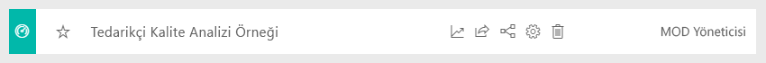
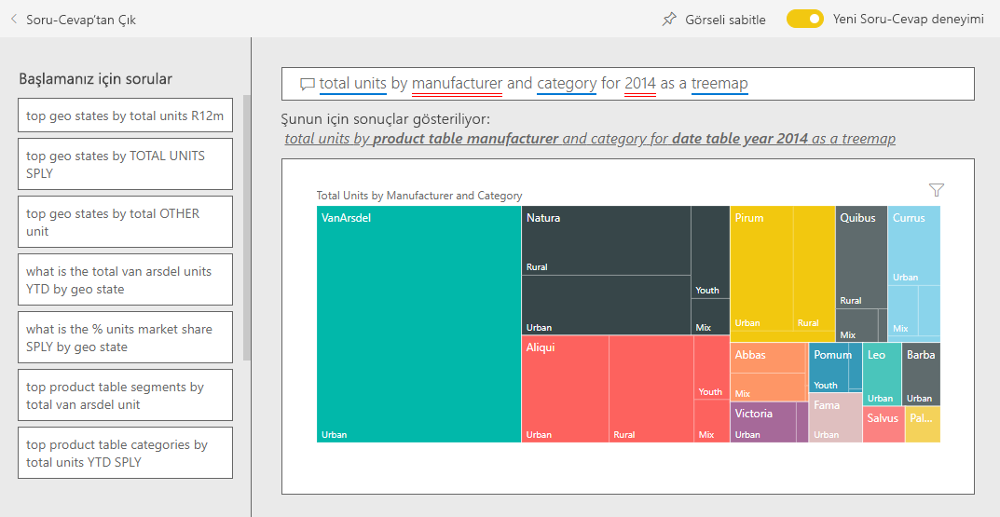

# Power BI için Satış ve Pazarlama örneği: Tura katılın

Satış ve Pazarlama örneği, VanArsdel Ltd adında kurgusal bir üretim şirketine yönelik bir pano ve rapor içerir. VanArsdel Pazarlama Müdürü (CMO), sektörün yanı sıra şirketin pazar payını, ürün hacmini, satışları ve duyarlılığı takip etmek amacıyla bu panoyu oluşturdu.

Çok sayıda rakibi olan VanArsdel kendi sektörünün pazar lideri. CMO, pazar payını artırmak ve büyüme fırsatlarını keşfetmek istiyor. Ancak, bilinmeyen sebeplerden ötürü VanArsdel'in pazar payı, Haziran'da gerçekleşen büyük düşüşlerle küçülmeye başlıyor.

Bu örnek, Power BI'ı işle ilgili veriler, raporlar ve panolarla birlikte nasıl kullanabileceğinizi gösteren serinin bir parçasıdır. Örnek, [obviEnce](http://www.obvience.com/) öğesinden alınan, anonimleştirilmiş gerçek verilerle oluşturulmuştur. Veriler çeşitli biçimlerde sunulur: içerik paketi, .pbix Power BI Desktop dosyası veya Excel çalışma kitabı. Bkz. [Power BI Örnekleri](sample-datasets.md). 

Bu öğreticide, Power BI hizmetinde Satış ve Pazarlama örneği içerik paketi incelenir. Power BI Desktop ile hizmette rapor deneyimleri benzer olduğundan, Power BI Desktop'ta örnek .pbix dosyasını kullanarak da örneği takip edebilirsiniz. 

Power BI Desktop'ta örnekleri incelemek için Power BI lisansına ihtiyacınız yoktur. Power BI Pro lisansınız yoksa örneği Power BI hizmetinde Çalışma Alanım alanınıza kaydedebilirsiniz. 

## Örneği alma

Örneği kullanabilmeniz için bir [içerik paketi](#get-the-content-pack-for-this-sample), [.pbix dosyası](#get-the-pbix-file-for-this-sample) veya [Excel çalışma kitabı](#get-the-excel-workbook-for-this-sample) olarak indirmeniz gerekir.

### Bu örneğe ilişkin içerik paketini edinme

1. Power BI hizmetini açın (app.powerbi.com), oturum açın ve örneği kaydetmek istediğiniz çalışma alanını açın.

   Power BI Pro lisansınız yoksa örneği Çalışma Alanım alanınıza kaydedebilirsiniz.

2. Sol alt köşedeki **Veri Al**'ı seçin.
   
   
3. Görüntülenen **Veri Al** sayfasında **Örnekler**'i seçin.
   
4. **Satış ve Pazarlama Örneği**'ni ve ardından **Bağlan**'ı seçin.   
  
   
   
5. Power BI, içerik paketini içeri aktarır ve ardından geçerli çalışma alanınıza yeni bir pano, rapor ve veri kümesi ekler.
   
   
  
### Bu örneğe ilişkin .pbix dosyasını edinme

Alternatif olarak, Satış ve Pazarlama örneğini bir [.pbix dosyası](http://download.microsoft.com/download/9/7/6/9767913A-29DB-40CF-8944-9AC2BC940C53/Sales%20and%20Marketing%20Sample%20PBIX.pbix) olarak indirebilirsiniz. Bu dosya biçimi, Power BI Desktop ile kullanım için tasarlanmıştır.

### Bu örneğe ilişkin Excel çalışma kitabını edinme

Bu örnekte kullanılan veri kaynağını görüntülemek isterseniz, [Excel çalışma kitabı](http://go.microsoft.com/fwlink/?LinkId=529785) olarak da bulabilirsiniz. Çalışma kitabı, görüntüleyebileceğiniz ve değiştirebileceğiniz Power View sayfaları içerir. Ham verileri görmek için Veri Çözümlemesi eklentilerini etkinleştirip **Power Pivot > Yönet**'i seçin. Power View ve Power Pivot eklentilerini etkinleştirme ayrıntıları için bkz. [Excel'in içinden Excel örneklerini gözden geçirme](sample-datasets.md#optional-take-a-look-at-the-excel-samples-from-inside-excel-itself).

## Panomuz bize ne anlatıyor?
Şimdi pano turunuza başlayalım ve CMO'nun sabitlemeyi seçtiği kutucuklara göz atalım. Pazar payımız, satışlarımız ve yaklaşım ile ilgili bilgiler görüyoruz. Veriler bölgeye, zamana ve rekabete göre ayrılmış.

* Sol sütundaki sayı kutucukları geçtiğimiz yıla ait sektör satış hacmini (50 B), pazar payını (%32,86), satış hacmini (16 B), yaklaşım puanını (68), yaklaşım farkını (4) ve satışı yapılan toplam birim sayısını (1 M) gösterir.
* Üstteki çizgi grafik ( **Birim Pazar Payı % ve Rolling 12 Months Birim Pazar Payı %** ) pazar payımızın zamanla nasıl dalgalandığını gösterir. Haziran’daki büyük düşüşe dikkat edin. Bir süredir artış gösteren Rolling 12-month (R12M) payımız sabitlenmeye başlıyor.
* Ortadaki sütun grafiği kutucuğundan da anlaşılacağı gibi en büyük rakibimiz Aliqui’dir (**Yılbaşından Bugüne Toplam Birimler Varyansı %** ).
* İş faaliyetlerimizin büyük bir kısmı Doğu'daki ve Merkezi bölgelerde.
* Alt taraftaki çizgi grafik (**2014 için Toplam Birim**) Haziran'daki düşüşümüzün mevsimsel olmadığını, rakiplerimizden hiçbirinin aynı eğilimi göstermediğini ortaya koyuyor.
* **Toplam Birim Ortalaması** ve sağdaki **Yılbaşından Bugüne Toplam Birimler** kutucukları segmente ve bölgeye/üreticiye göre satılan birimleri gösterir. Sektörümüzde yer alan en büyük pazar segmentleri **Productivity** ve **Convenience**’dır.

## Daha fazla ayrıntıya girmek için Soru-Cevap özelliğini kullanma

Soru-Cevap’ı kullanarak verilerde daha fazla ayrıntı bulabilirsiniz.

### Hangi segmentler satışlarımızı artırıyor? Bunlar sektör eğilimleriyle eşleşiyor mu?
1. **Segmente göre Toplam Birimler Ortalaması** kutucuğunu seçin. Soru-Cevap açılır ve *segmente göre toplam birimler* sorgusu ile doldurulur.
2. Mevcut sorgunun sonuna şunu ekleyin: *VanArsdel için*. Soru-Cevap, soruyu yorumlar ve cevapta güncelleştirilmiş bir grafik görüntüler. Ürün hacmimizin çoğunlukla **Convenience** ve **Moderation** segmentlerinden oluştuğunu görebilirsiniz.

   
3. **Moderation** ve **Convenience** segmentlerindeki payımız oldukça yüksek ve bunlar, rekabet içinde olduğumuz segmentler.
4. Üst gezinti çubuğundan **Satış ve Pazarlama Örneği**’ni seçerek pano geri dönün.

### Kategoriye göre (bölgeyle karşılaştırıldığında) toplam birim pazar payı nasıl görünüyor?
1. **Total Units YTD by Manufacturer, Region** kutucuğuna dikkat edin. Kategoriye göre toplam birim pazar payı nedir?

   
2. Panonun üst tarafındaki soru kutusunu seçip *total units by manufacturer and category for 2014 as a treemap* (2014 için ağaç haritası olarak üreticiye ve kategoriye göre toplam birim sayısı) sorusunu yazın. Siz sorunuzu yazdıkça görselleştirmenin nasıl güncelleştirildiğine dikkat edin.

   
3. Bulguları karşılaştırmak için grafiği panonuza sabitleyin. Bu ilginç olguyu dikkate alın: 2014’te, VanArsdel sadece **Urban** kategorisinde ürün sattı.
4. Panoya dönün.

## Satış ve Pazarlama Örneği raporu

Panolar raporlar için bir giriş noktası niteliğindedir. Kutucuk bir bağlantılı rapordan oluşturulduysa bu kutucuk seçildiğinde rapor açılır.

Panomuzda, **Birimlerin Pazar Payı ve Birimlerin Pazar Payı Rolling 12 Months karşılaştırması** grafiğindeki **Birim Pazar Payı % R12M** satırı, pazar payımızın artık zamanla artmadığını gösterir. Hatta biraz azalma söz konusu. Haziran ayında neden pazar payına ilişkin büyük bir düşüş görüyoruz? 

Satış ve Pazarlama örneği raporu dört sayfadan oluşur.
 
### VanArsdel - Pazar Payı sayfası
Raporun birinci sayfası VanArsdel'in pazar payına odaklanır.

1. Satış ve Pazarlama Örneği raporunun **VanArsdel - Pazar Payı** sayfasını açmak için panodan **Birimlerin Pazar Payı ve Birimlerin Pazar Payı Rolling 12 Months karşılaştırması** grafiğini seçin.

   

2. Raporun altında yer alan **Total Units by Month and isVanArsdel** adlı sütun grafiğine bakın. Siyah sütun, VanArsdel'i (ürünlerimizi), yeşil sütun ise rakibimizi temsil eder. Haziran 2014'te VanArsdel'in yaşadığı düşüş, rakiplerinde gözlemlenmedi.

3. Sağ tarafta ortada bulunan **Segment tarafından düzenlenen Total Category Volume** adlı çubuk grafik, VanArsdel'in en iyi 2 segmentini gösterecek şekilde filtrelenmiştir. Bu filtrenin nasıl oluşturulduğuna bir göz atalım:  

   a. **Segment tarafından düzenlenen Total Category Volume** adlı grafiği seçin.

   b. Bunu genişletmek için sağ taraftaki **Filtreler** bölmesini genişletin.  

   c. **Görsel düzeyi filtreleri** bölümünde, **Segment**'in yalnızca **Convenience** ve **Moderation** segmentlerini içerecek şekilde filtrelenmiş olduğuna dikkat edin.  

   d. Bunu genişletmek için **Segment**'i seçerek filtreyi değiştirin ve ardından **Productivity** seçeneğini işaretleyerek bu segmenti de ekleyin.  

4. **Month ve isVanArsdel tarafından düzenlenen Total Units** kutucuğunda, sayfaya VanArsdel'e göre çapraz filtre uygulamak için açıklamadaki **Yes** seçeneğini belirleyin. **Segmente göre Total Category Volume** grafiğinde, **Productivity** segmentinde rekabet içinde olmadığımıza dikkat edin.

5. Filtreyi kaldırmak için göstergede **Yes** seçeneğini tekrar belirleyin.

6. **Aylık Birim Pazar Payı % ve Birim Pazar Payı R12M %** çizgi grafiğine bakın. Aylık pazar payımızı ve 12 aylık hareketli düzende pazar paylarımızı gösterir. Aylık hareketli düzendeki veriler, aylık dalgalanmaların giderilmesine yardımcı olur ve uzun vadeli eğilimleri gösterir. Her segment için pazar payındaki dalgalanmaları görmek için **Segmente göre Toplam Kategori Hacmi** çubuk grafiğinde **Convenience**’ı ve ardından **Moderation**’ı seçin. **Moderation** segmentinin pazar payında daha fazla dalgalanma gösterdiğini görebilirsiniz.

Hâlâ Haziran'da pazar payında yaşanan büyük düşüşün sebebini öğrenmeye çalışıyoruz. Ardından, raporun **Yaklaşım Analizi** sayfasına göz atalım.

### Yaklaşım Analizi sayfası
Raporun üçüncü sayfası tüketici yaklaşımına odaklanır.

Tweetler, Facebook, bloglar ve makaleler, sayfanın sol tarafındaki iki çizgi grafiğinde gösterilen tüketici yaklaşımlarına katkıda bulunur. Sol üst köşedeki **VanArsdel - Aya göre Yaklaşım** grafiği, ürünlerimize yönelik yaklaşımın Şubat ayına kadar çoğunlukla nötr olduğunu gösteriyor. Ardından Şubat ayında ciddi bir düşüş başlamış ve Haziran'da en düşük seviyeye ulaşılmıştır. Yaklaşımdaki bu düşüşün sebebi nedir? 

Dış kaynaklara bakalım. Şubat ayında birkaç makale ve blog gönderisinde, VanArsdel'in müşteri hizmetleri sektörün en kötüsü olarak değerlendirilmiştir. Basında yer alan bu kötü değerlendirmelerin müşteri yaklaşımı ve satış ile doğrudan bağıntısı olmuştur. VanArsdel, müşteri hizmetlerini geliştirmek için sıkı çalışmış, bu konuda müşterilerin ve sektörün dikkatini çekmiştir. Temmuz ayında pozitif yaklaşım artmaya başlamış ve 60'ları görerek en yüksek seviyesine ulaşmıştır. Yaklaşımdaki bu yukarı yöneliş, raporun birinci ve ikinci sayfasındaki **Aya göre Toplam Birim** grafiklerine yansıtılmıştır. Belki de bu, Haziran ayındaki pazar payı düşüşünü kısmen açıklıyor.

Yaklaşım aralığı keşfedilmesi gereken başka bir alan olabilir. Hangi bölgeler en yüksek yaklaşım aralığına sahip, yönetim bundan nasıl yararlanabilir ve bunu diğer bölgelerde nasıl çoğaltabilirler?

### Yılbaşından Bugüne Kategorisi Eğilim Analizi sayfası
Raporun ikinci sayfası, yıl-tarih kategorisi eğilimi üzerine odaklanır.

Aşağıdaki bilgileri unutmayın:
* VanArsdel bu kategorideki en büyük şirkettir ve en büyük rakipleri de Natura, Aliqui ve Pirium’dur. Onlar için sürekli olarak takipte kalacağız.
* Aliqui büyüyor ancak ürün hacmi bizimle karşılaştırıldığında hâlâ düşük.
* Harita ağacında VanArsdel yeşil olarak gösterilir. Doğu bölgesinde müşteriler bizi tercih ediyor ve Merkez bölgede de iyi durumdayız. En düşük payımız Doğu bölgesindeki pay.
* Coğrafya, satılan birimler üzerinde etkiye sahiptir. Çoğu üretici için Doğu baskın bölgedir ve VanArsdel'in Merkez bölgede de güçlü bir varlığı mevcuttur.
* Sağ altta yer alan **Aya ve Üreticiye Göre Yılbaşından Bugüne Toplam Birim Var %** grafiği olumlu bir varyansımızın olduğuna dikkat edin. Bu iyi bir işaret. Geçtiğimiz yıla kıyasla daha iyi durumdayız. Ancak bu, rakibimiz Aliqui için de geçerli.

### Büyüme Fırsatları sayfası
Raporun dördüncü sayfası rekabete dayalı ürün analizine odaklanır.

Aşağıdaki bilgileri unutmayın:
* Sol altta yer alan **Segmente göre Toplam Birim** grafiği, VanArsdel’in en güçlü iki segmenti dışında tüm kategori segmentlerini gösterir. VanArsdel için olası genişletme alanlarını belirlemek için her segmenti sırayla seçin. 
* **Extreme** ve **Productivity** segmentlerinin diğerlerine göre daha hızlı bir şekilde büyüdüğünü görebilirsiniz. Ancak, bu segmentlerde rekabet göstermiyoruz. Bu segmentlere geçmek istiyorsak hangi segmentlerin hangi bölgelerde popüler olduğunu görmek için verilerimizden yararlanabiliriz. “Hangi bölgeler daha hızlı büyüyor?” ve "bu segmentteki en büyük rakibimiz kim olur?" gibi sorulara yanıt bulmak için daha kapsamlı bir inceleme yapabiliriz.
* Haziran ayında pazar payımızda gözlemlenen küçülmeyi hatırlıyor musunuz? Haziran, **Productivity** segmenti için yoğun bir ay ve bu segmentte hiç faaliyet göstermiyoruz. Bu ayrıntı, Haziran ayında pazar payımızda yaşanan küçülmeye açıklama getirilmesine yardımcı olabilir.

Görselleştirmeleri VanArsdel'e, segmente, aya ve bölgeye göre filtreleyerek VanArsdel için büyüme fırsatlarına ulaşabiliriz.

## Sonraki adımlar: Verilerinize bağlanma
Değişikliklerinizi kaydetmek zorunda olmadığınızdan, bu ortamda güvenle farklı şeyler deneyebilirsiniz. Değişikliklerinizi kaydetseniz bile, dilediğiniz zaman **Veri Al**'ı seçip bu örneğin yeni bir kopyasını oluşturabilirsiniz.

Bu turda Power BI panolarının, Soru-Cevap özelliğinin ve raporların insan kaynakları verileriyle ilgili olarak nasıl öngörüler sağlayabileceğini kavradığınızı umuyoruz. Artık siz de kendi verilerinize bağlanarak çalışmaya başlayabilirsiniz. Power BI ile çok çeşitli veri kaynaklarına bağlanabilirsiniz. Daha fazla bilgi edinmek için bkz. [Power BI hizmeti ile çalışmaya başlama](service-get-started.md).
