# Power BI için Tedarikçi Kalite Analizi Örneği: Tura katılın

## Tedarikçi Kalite Analizi örneğine kısa bir genel bakış
Bu sektör örneği panosu ve bağlantılı rapor, tipik tedarik zincirinde yaygın olarak karşılaşılan zorluklardan birine odaklanır: tedarikçi kalite analizi.
Bu analizde iki birincil ölçüm ön plandadır: toplam hata sayısı ve bu hataların neden olduğu toplam çalışmama süresi. Bu örnek iki ana hedefe sahiptir:

* Kalite açısından hangi tedarikçilerin en iyi ve en kötü olduğunu anlama
* Çalışmama süresini en aza indirmek için, hangi tesislerin hataları bulma ve reddetme konusunda daha iyi iş çıkardığını belirleme

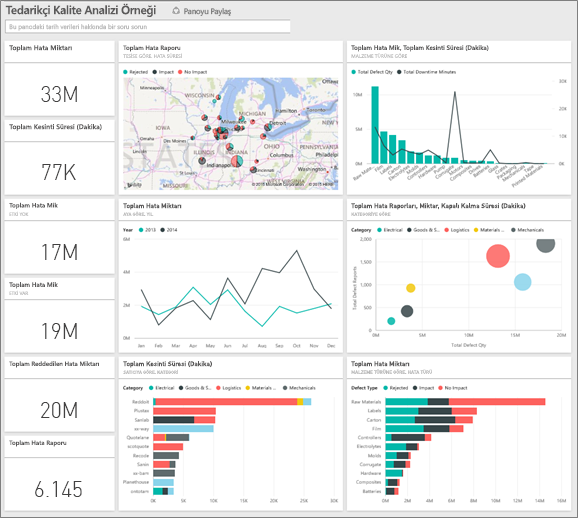

Bu örnek, Power BI'ı işle ilgili veriler, raporlar ve panolarla birlikte nasıl kullanabileceğinizi gösteren serinin bir parçasıdır.
Anonim hale getirilmiş bu gerçek veriler, obviEnce'tan ([www.obvience.com](http://www.obvience.com/)) alınmıştır.

## Önkoşullar

 Örneği kullanabilmeniz için bir [içerik paketi](https://docs.microsoft.com/en-us/power-bi/sample-supplier-quality#get-the-content-pack-for-this-sample), [.pbix dosyası](http://download.microsoft.com/download/8/C/6/8C661638-C102-4C04-992E-9EA56A5D319B/Supplier-Quality-Analysis-Sample-PBIX.pbix) veya [Excel çalışma kitabı](http://go.microsoft.com/fwlink/?LinkId=529779) olarak indirmeniz gerekir.

### Bu örneğe ilişkin içerik paketini edinme

1. Power BI hizmeti (app.powerbi.com) sayfasına gidin ve oturum açın.
2. Sol alt köşedeki **Veri Al** seçeneğini belirleyin.
   
    
3. Görüntülenen Veri Al sayfasında **Örnekler** simgesini seçin.
   
   
4. **Tedarikçi Kalite Analizi Örneği**'ni ve ardından **Bağlan**'ı seçin.  
  
   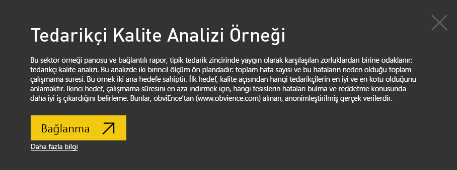
   
5. Power BI, içerik paketini içeri aktarır ve geçerli çalışma alanınıza yeni bir pano, rapor ve veri kümesi ekler. Yeni içerik sarı yıldızla işaretlenir. 
   
   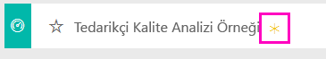
  
### Bu örneğe ilişkin .pbix dosyasını edinme

Alternatif olarak, örneği bir .pbix dosyası olarak indirebilirsiniz. Bu dosya biçimi, Power BI Desktop ile kullanım için tasarlanmıştır. 

 * [Tedarikçi Kalite Analizi Örneği](http://download.microsoft.com/download/8/C/6/8C661638-C102-4C04-992E-9EA56A5D319B/Supplier-Quality-Analysis-Sample-PBIX.pbix)

### Bu örneğe ilişkin Excel çalışma kitabını edinme
Ayrıca bu örnek için [ yalnızca veri kümesini de (Excel çalışma kitabı) indirebilirsiniz](http://go.microsoft.com/fwlink/?LinkId=529779). Çalışma kitabı, görüntüleyebileceğiniz ve değiştirebileceğiniz Power View sayfaları içerir. Ham verileri görmek için **Power Pivot > Yönet** seçeneğini belirleyin.

## Hatalı malzemelerin neden olduğu çalışmama süresi
Hatalı malzemelerin neden olduğu çalışmama süresini çözümleyip hangi satıcıların sorumlu olduğunu bulalım.  

1. Panoda **Total Defect Quantity** sayı kutucuğunu veya **Total Downtime Minutes** sayı kutucuğunu seçin.  

   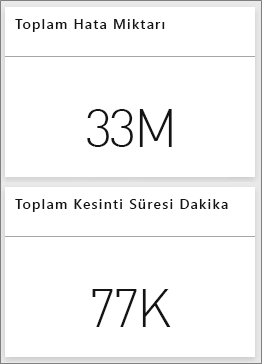  

   "Supplier Quality Analysis Sample" raporu açılarak "Downtime Analysis" sayfası görüntülenir. 33 M toplam hatalı parça ile bu hatalı parçaların neden olduğu toplam 77 B dakikalık çalışmama süresi bulunduğuna dikkat edin. Bazı malzemelerin daha az hatalı parçası vardır ancak bunlar daha uzun çalışmama süresiyle sonuçlanan büyük bir gecikmeye neden olabilir. Rapor sayfasında bu konular üzerinde araştırma yapalım.  
2. **Defects and Downtime (min) by Material Type** birleşik haritasında **Total Downtime Minutes** satırına baktığımızda oluklu malzemelerin en fazla çalışmama süresine neden olduğunu görürüz.  
3. Hangi tesislerin bu hatadan en çok etkilendiğini ve hangi satıcının sorumlu olduğunu görmek için aynı birleşik haritada **Corrugate** sütununu seçin.  

     
4. Söz konusu tesiste çalışmama süresinden sorumlu satıcıyı veya malzemeyi görmek için haritada tesisleri ayrı ayrı seçin.

### En kötü tedarikçiler hangileri?
 En kötü sekiz tedarikçiyi bulmak ve çalışmama süresinin yüzde kaçını oluşturduklarını belirlemek istiyoruz. Bunu, **Downtime (min) by Vendor** alan grafiğini ağaç haritası şeklinde değiştirerek yapabiliriz.  

1. Raporun 3. sayfası olan "Downtime Analysis" kısmında, sol üst köşedeki **Raporu düzenle** seçeneğini belirleyin.  
2. **Downtime (min) by Vendor** alan grafiğini, Görsel Öğeler bölmesinde ise Ağaç Haritası'nı seçin.  

   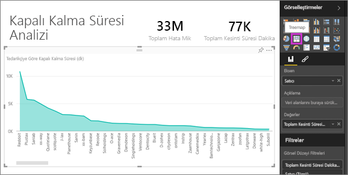  

    Ağaç Haritası, **Grup** için **Vendor** alanını otomatik olarak getirir.  

    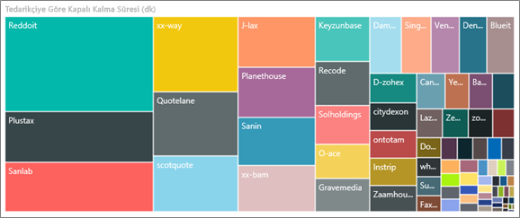  

   Bu ağaç haritasından, en kötü sekiz satıcının ağaç haritasının solundaki sekiz blok olduğunu görürüz. Ayrıca bu satıcıların, dakika cinsinden toplam çalışmama süresinin yaklaşık %50'sini oluşturduğunu da görebiliriz.  
3. Panoya geri dönmek için üst gezinti çubuğunda **Supplier Quality Analysis Sample**'ı seçin.

### Tesisleri karşılaştırma
Şimdi hangi tesisin daha iyi bir iş çıkardığını ve hatalı malzemeyi yöneterek daha az çalışmama süresi sağladığını keşfedelim.  

1. **Plant ve Defect Type tarafından düzenlenen Total Defect Reports** harita kutucuğunu seçin.  

    Rapor açılarak "Supplier Quality" sayfası görüntülenir.  

   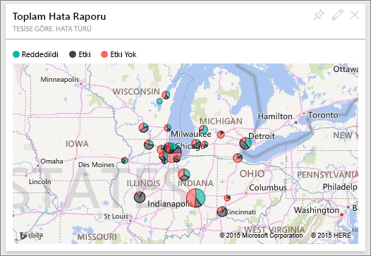  
2. Harita açıklamasında **Impact** dairesini seçin.  

    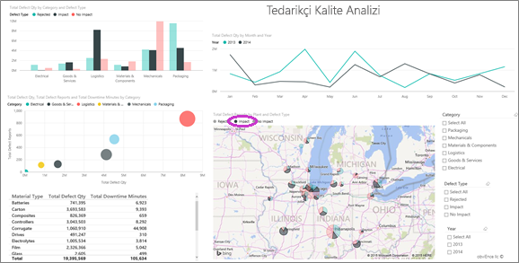  

    Kabarcık grafiğinde **Logistics**'in en çok sorunla karşılaşılan kategori olduğuna dikkat edin. Bu, toplam hata miktarı, toplam hata raporu sayısı ve dakika cinsinden toplam çalışmama süresi açısından en büyük değerlerin bulunduğu kategoridir. Bu kategoriyi biraz daha araştıralım.  
3. Kabarcık grafiğinde Logistics kabarcığını seçin ve Springfield, IL ve Naperville, IL seçeneklerini belirleyin. Naperville, Springfield'in çok sayıdaki etkisiyle karşılaştırıldığında, yüksek reddetme sayısına ve birkaç etkiye sahip olduğundan hatalı tedarikleri yönetme konusunda çok daha iyi bir iş çıkarıyor.  

   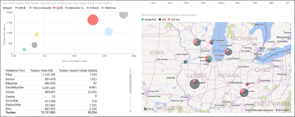  
4. Etkin çalışma alanınıza dönmek için üst gezinti çubuğunda **Supplier Quality Analysis Sample**'ı seçin.

## Hangi malzeme türü en iyi şekilde yönetilmektedir?
En iyi yönetilen malzeme türü, hata miktarına bakılmaksızın en düşük çalışmama süresine sahip olan veya hiçbir etki görmeyendir.

* Panoda, **Total Defect Quantity by Material Type, Defect Type** kutucuğuna bakın.

  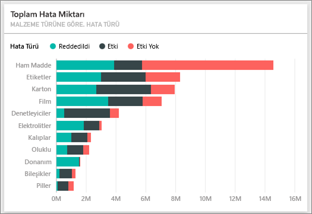

**Raw Materials**'ın toplam hata sayısının fazla olduğuna ancak hataların çoğunun reddedildiğine veya hiçbir etkiye sahip olmadığına dikkat edin.

Ham maddelerin yüksek miktarda hataya rağmen çok fazla çalışmama süresine neden olmadığını doğrulayalım.

* Panoda, **Total Defect Qty, Total Downtime Minutes by Material Type** kutucuğuna bakın.

  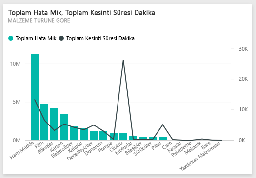

Görünüşe göre ham maddeler iyi yönetiliyor: Daha fazla hata içeriyorlar ancak dakika cinsinden toplam çalışmama süresi daha düşük.

### Yıla göre hataları ve çalışmama süresini karşılaştırma
1. Raporu ilk rapor sayfası olan Supplier Quantity görüntülenecek şekilde açmak için **Total Defect Reports by Plant, Defect Type** harita kutucuğunu seçin.
2. **Defect Qty** değerinin 2014'te 2013'ten daha yüksek olduğuna dikkat edin.  

    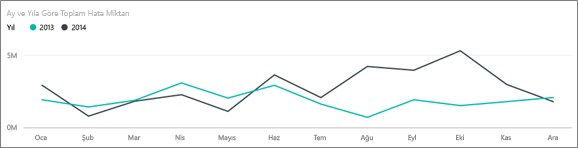  
3. Daha fazla hata daha fazla çalışmama süresi anlamına mı gelir? Bunu öğrenmek için Soru-Cevap kutusunda soru sorabiliriz.  
4. Panoya geri dönmek için üst gezinti çubuğunda **Supplier Quality Analysis Sample**'ı seçin.  
5. Raw Materials'ın en yüksek sayıda hataya sahip olduğunu bildiğimizden soru kutusuna "show material types, year and total defect qty" (malzeme türlerini, yılı ve toplam hata miktarını göster) yazın.  

    2014'te 2013'e göre çok daha fazla ham madde hatası vardı.  

    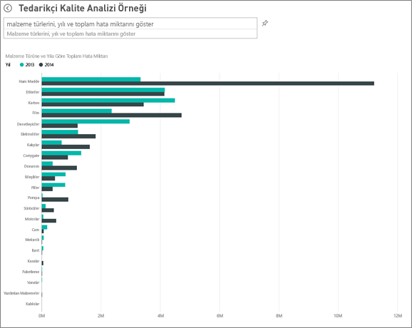  
6. Şimdi soruyu "show material types, year and total downtime minutes" (malzeme türlerini, yılı ve dakika cinsinden toplam çalışmama süresini göster) olarak değiştirin.  

   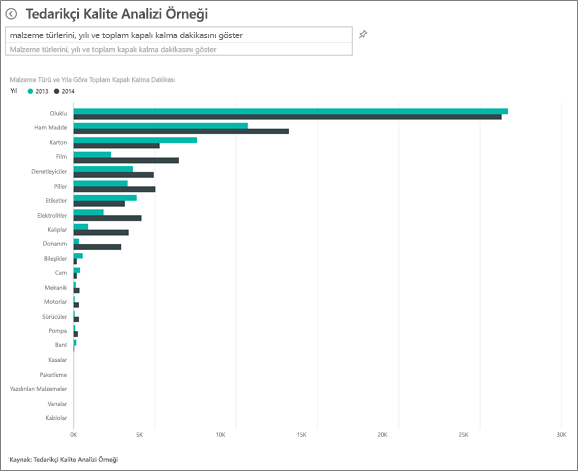

2014'te çok daha fazla ham madde hatası olsa da ham madde çalışmama süresi 2013'te ve 2014'te yaklaşık aynıydı.

2014'te daha fazla ham madde hatası olmasının 2014'te çok daha fazla ham madde çalışmama süresine neden olmadığı anlaşılıyor.

### Aya göre hataları ve çalışmama süresini karşılaştırma
Toplam hata miktarıyla ilgili başka bir pano kutucuğuna bakalım.  

1. Panoya geri dönmek için soru kutusunun yukarısında sol üst köşede bulunan geri okunu  seçin.  

    **Month ve Year tarafından düzenlenen Total Defect Quantity** kutucuğuna daha yakından bakıldığında 2014'ün ilk yarısında 2013'tekine benzer sayıda hata olduğu ancak 2014'ün ikinci yarısında hata sayısının kayda değer oranda arttığı görülür.  

    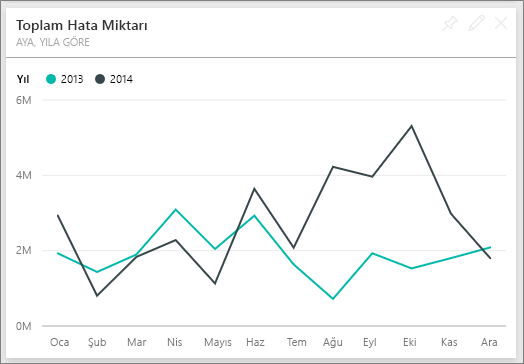  

    Hata miktarındaki bu artışın dakika cinsinden çalışmama süresinde de eşit bir artışa neden olup olmadığına bakalım.  
2. Soru kutusuna "total downtime minutes by month and year as a line chart" (çizgi grafiği olarak ay ve yıla göre dakika cinsinden toplam çalışmama süresi) yazın.  

   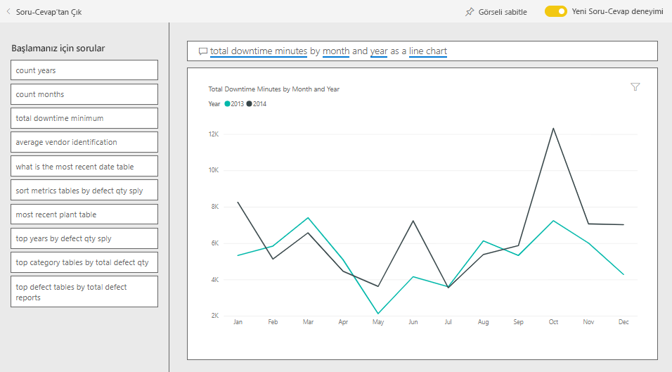

   Haziran ve Ekim'de dakika cinsinden çalışmama süresinde dik bir yükseliş meydana geldiğini, ancak hata sayısındaki dik yükselişin, çalışmama süresinin önemli ölçüde artmasına neden olmadığını görüyoruz. Bu, hataların iyi yönetildiğini gösterir.  
3. Bu grafiği panonuza sabitlemek için soru kutusunun sağındaki raptiye simgesini  seçin.  
4. Aykırı ayları keşfetmek için "total downtime minutes in October by plant" (tesise göre Ekim'deki dakika cinsinden toplam çalışmama süresi) gibi sorular sorarak malzeme türü, tesis konumu, kategori vb. temelinde çalışmama süresi dakika sayısını kontrol edin.    
5. Panoya geri dönmek için soru kutusunun yukarısında sol üst köşede bulunan geri okunu  seçin.

Bu ortamda istediğiniz değişikliği gerçekleştirebilirsiniz. Değişikliklerinizi kaydetmemeyi seçme konusunda her zaman özgürsünüz. Ancak, değişiklikleri kaydederseniz dilediğiniz zaman **Veri Al** bölümüne giderek bu örneğin yeni bir kopyasını edinebilirsiniz.

## Sonraki adımlar: Verilerinize bağlanma
Bu turun; Power BI panolarının, Soru-Cevap özelliğinin ve raporların tedarikçi kalitesi verilerinde nasıl öngörü sağlayacağını gösterme konusunda etkili olduğunu umuyoruz. Artık siz de kendi verilerinize bağlanarak çalışmaya başlayabilirsiniz. Power BI ile çok çeşitli veri kaynaklarına bağlanabilirsiniz. [Power BI ile çalışmaya başlama](service-get-started.md) hakkında daha fazla bilgi edinin.
