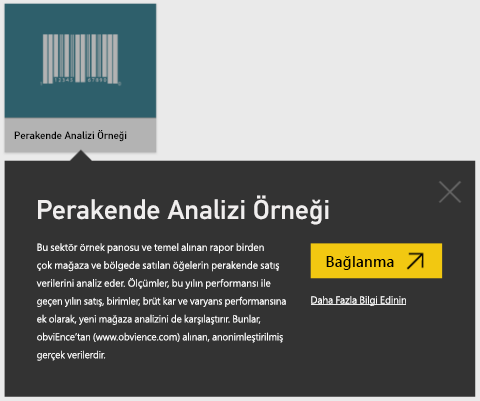
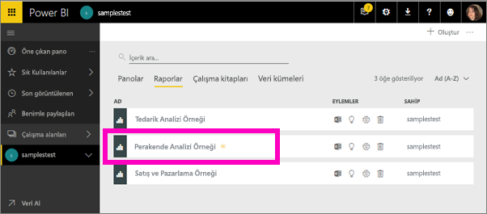
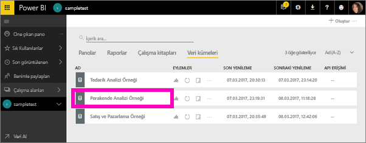
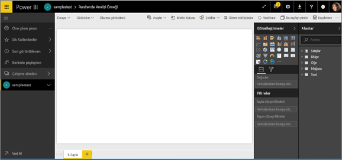
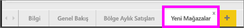
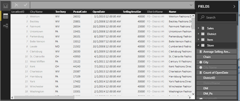
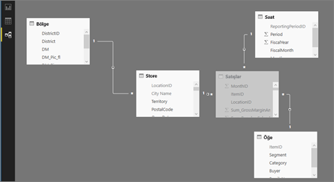

#  Power BI hizmetindeki örneklere bağlanma

Bu öğreticide aşağıdaki işlemler hakkında bilgi edinirsiniz: 
- Örnek içerik paketini içeri aktarın, Power BI hizmetine ekleyin ve içeriği açın. *İçerik paketleri*, veri kümesinin bir pano ve raporla birlikte sunulduğu bir örnek türüdür. 
- Power BI Desktop'ta örnek bir .pbix dosyası açma.

Daha fazla arka plan bilgisi istiyorsanız bkz. [Power BI için örnek veri kümeleri](sample-datasets.md). Söz konusu makalede örnekler hakkında her şeyi, nasıl alındıklarını, nereye kaydedildiklerini ve örneklerin sunduğu içeriklerden bazılarını öğrenebilirsiniz. 

## Önkoşullar
Örnekler, Power BI hizmetinde ve Power BI Desktop'ta kullanılabilir. Örneği takip etmek için Perakende analizi örneğini kullanacağız.

Bu eğitimde kullanılan *Perakende Analizi* örnek içerik paketi, bir pano, rapor ve veri kümesinden oluşur.
Bu içerik paketine ve senaryosuna aşina olmanız için, bkz. [Power BI için Perakende Analizi örneği: Başlamadan önce tura katılın](sample-retail-analysis.md).

## Power BI hizmetinde örnekler

1. Power BI hizmetini açın (app.powerbi.com), oturum açın ve örneği kaydetmek istediğiniz çalışma alanını açın. 

    Power BI Pro lisansınız yoksa örneği Çalışma Alanım alanınıza kaydedebilirsiniz.

2. Sol gezinti bölmesinin alt kısmında bulunan **Veri Al**'ı seçin. 

   

   **Veri Al** seçeneğini görmüyorsanız, bölmenin en üstünde bulunan aşağıdaki simgeyi seçerek gezinti bölmesini genişletin: .

5. Görüntülenen **Veri Al** sayfasında **Örnekler**'i seçin.
   
6. **Perakende Analizi Örneği**'ni ve ardından **Bağlan**'ı seçin.   
   
   

## İçeri aktarılan nedir?
Örnek içerik paketleri söz konusuysa **Bağlan**'ı seçtiğinizde Power BI, ilgili içerik paketinin bir kopyasını alıp sizin için bulutta depolar. İçerik paketini oluşturan kişi bir veri kümesi, rapor ve de pano eklemiş olduğundan, **Bağlan**’ı seçtiğinizde bunları alırsınız. 

1. **Bağlan**’ı seçtiğinizde, Power BI yeni bir Pano oluşturur ve bunu **Panolar** sekmesinde listeler. 
   
   
2. **Raporlar** sekmesini açın. Burada *Retail Analysis Sample* (Perakende Analizi Örneği) adlı yeni bir rapor göreceksiniz.
   
   
   
   **Veri kümeleri** sekmesine göz atın; burada yeni bir veri kümesi de mevcuttur.
   
   

## Yeni içeriğinizi keşfedin
Şimdi pano, veri kümesini ve raporu kendiniz keşfedin. Panolar, raporlar ve veri kümelerinde gezinmek için izleyebileceğiniz birçok farklı yol vardır. Bu yöntemlerden biri, aşağıdaki yordamda açıklanmaktadır.  

1. **Panolar** sekmesine geri gidin, **Retail Analysis Sample** (Perakende Analizi Örneği) panonuzu seçerek açın.       

   Çeşitli görselleştirme kutucukları içeren pano açılır.   
 
1. Bağlantılı raporu açmak için panoda bir kutucuk seçin. Bu örnekte, **This Year's Sales, Last Year's Sales by Fiscal Month** (Mali Aya göre Bu Yılın Satışları ve geçen Yılın Satışları) alan grafiğini seçeceğiz.  

   

   Rapor, seçtiğiniz alan grafiğini içeren sayfada açılır; bu durumda, raporun **District Monthly Sales** (Bölge Aylık Satışları) sayfası.
   
   
   
   > [!NOTE]
   > Kutucuk [Power BI Soru-Cevap](power-bi-tutorial-q-and-a.md) kullanılarak oluşturulduysa, bunun yerine bir Soru-Cevap sayfası açılır. Kutucuk [Excel'den sabitlenmişse](service-dashboard-pin-tile-from-excel.md), Power BI içinde Excel Online açılır.
   > 
   > 
1. Kişiler iş arkadaşlarıyla bir içerik paketi paylaştığında, normalde sadece içgörüleri paylaşmak isterler, iş arkadaşlarına doğrudan veriye erişim vermek istemezler. **Veri Kümeleri** sekmesinde, veri kümenizi araştırmanıza yönelik çeşitli seçenekleriniz vardır. Ancak, Power BI Desktop’ta veya Excel’de olduğu gibi verilerinizin satırlarını ve sütunlarını görüntüleyemezsiniz. 
   
   
   
1. Veri kümesini keşfetmenin bir yolu, sıfırdan kendi görselleştirmelerinizi ve raporlarınızı oluşturmaktır. Grafik simgesini  seçerek veri kümesini rapor düzenleme modunda açın.
     
   

1. Veri kümesini keşfetmenin bir başka yolu [hızlı içgörüler](consumer/end-user-insights.md) çalıştırmaktır. **Diğer seçenekler** (...) ve sonra **Hızlı içgörüler al**’ı seçin. Öngörüler hazır olduğunda **Öngörüleri görüntüle** seçeneğini belirleyin.
     
    

## Power BI Desktop’ta örnekler 
Örnek .pbix dosyasını Power BI Desktop’ta ilk kez açtığınızda, görsel öğeler içeren herhangi bir sayıdaki rapor sayfasını keşfedebileceğiniz, oluşturabileceğiniz ve değiştirebileceğiniz Rapor görünümünde gösterilir. Rapor görünümü, Power BI hizmetindeki Düzenleme görünümü ile neredeyse aynı tasarım deneyimini sunar. Görselleştirmeleri taşıma, kopyalayıp yapıştırma ve birleştirme gibi işlemler gerçekleştirebilirsiniz. 

Power BI hizmetinde rapor düzenlemekten farklı olarak, Power BI Desktop'ı kullanırken sorgularla çalışabilir ve verilerinizin raporlarınızdaki en etkileyici içgörüleri desteklediğinden emin olmak için verilerinizi modelleyebilirsiniz. Ardından, Power BI Desktop dosyanızı dilediğiniz yere (ister yerel sürücünüze ister buluta) kaydedebilirsiniz.

1. [Perakende Analizi örnek .pbix dosyasını](http://download.microsoft.com/download/9/6/D/96DDC2FF-2568-491D-AAFA-AFDD6F763AE3/Retail%20Analysis%20Sample%20PBIX.pbix) indirin ve Power BI Desktop’ta açın. 

    

1. Dosya, Rapor görünümünde açılır. Rapor düzenleyicisinin alt kısmındaki dört sekmeye dikkat edin; bu sekmeler bu rapordaki dört sayfayı temsil eder. Bu örnekte, **New Stores** (Yeni Depolar) sayfası şu anda seçilidir. 

    geçin.

1. Rapor düzenleyicisine derinlemesine bakış için bkz. [Rapor düzenleyicisi turuna katılın](service-the-report-editor-take-a-tour.md).

## Raporunuzda neler var?
Örnek .pbix dosyasını indirdiğinizde, yalnızca bir raporu değil, *temel alınan veri kümesini* de indirdiniz. Dosyayı açtığınızda Power BI Desktop, verileri ilişkili sorguları ve ilişkileri ile yükler. Temel alınan verileri ve ilişkileri görüntüleyebilirsiniz, ancak Sorgu Düzenleyicisi’nde temel alınan sorguları görüntüleyemezsiniz.

1. Tablo simgesini  seçerek [Veri görünümüne](desktop-data-view.md) geçin.
 
    

    Veri görünümünde, Power BI Desktop modelinizdeki verileri inceleyebilir, araştırabilir ve anlayabilirsiniz. Tabloları, sütunları ve verileri Sorgu Düzenleyicisi'nde görüntülemekten farklıdır. Veri görünümündeki veriler modele zaten yüklenmiş.

    Bazen verilerinizi modellerken rapor tuvalinde görsel oluşturmadan bir tablonun satırlarındaki ve sütunlardaki verileri görmek istersiniz. Bu durum özellikle ölçü ve hesaplanmış sütun oluşturduğunuzda veya bir veri türü ya da veri kategorisi tanımlamanız gerektiğinde ortaya çıkar.

1. Aşağıdaki simgeyi seçerek [İlişkiler görünümüne](desktop-relationship-view.md) geçin: .
 
    

    İlişki görünümü, modelinizdeki tüm tabloları, sütunları ve ilişkileri gösterir. Buradan ilişkileri görüntüleyebilir, değiştirebilir ve oluşturabilirsiniz.

## Sonraki adımlar
Değişikliklerinizi kaydetmek zorunda olmadığınızdan, bu ortamda güvenle farklı şeyler deneyebilirsiniz. Değişikliklerinizi kaydetseniz bile, dilediğiniz zaman **Veri Al**'ı seçip bu örneğin yeni bir kopyasını oluşturabilirsiniz.

Power BI panolarının, veri kümelerinin, ilişkilerin ve raporların örnek veriler için nasıl içgörüler sağlayacağını gösterme konusunda etkili bir tur deneyimi yaşadığınızı umuyoruz. Artık siz de kendi verilerinize bağlanarak çalışmaya başlayabilirsiniz. Power BI ile çok çeşitli veri kaynaklarına bağlanabilirsiniz. Daha fazla bilgi edinmek için bkz. [Power BI hizmetini kullanmaya başlama](service-get-started.md) ve [Power BI Desktop’ı kullanmaya başlama](desktop-getting-started.md).  

Daha fazla bilgi için bkz.  
- [Power BI hizmetinde tasarımcılara yönelik temel kavramlar](service-basic-concepts.md)
- [Power BI hizmeti için örnekler](sample-datasets.md)
- [Power BI için veri kaynakları](service-get-data.md)

Başka bir sorunuz mu var? [Power BI Topluluğu'na başvurun](http://community.powerbi.com/)
