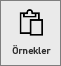
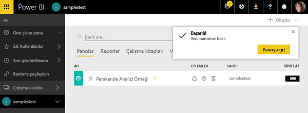
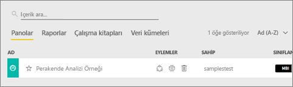
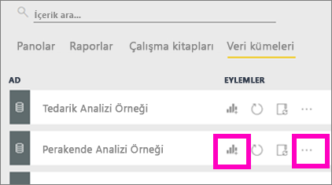

# Power BI örnekleri

[Power BI için örnek veri kümeleri](sample-datasets.md) makalesiyle başlamanızı öneririz. Söz konusu makalede örnekler hakkında her şeyi, nasıl alındıklarını, nereye kaydedildiklerini ve örneklerin sunduğu içeriklerden bazılarını öğrenebilirsiniz. Temel konuları kavradıktan sonra bu eğitime geri dönebilirsiniz.   

### Önkoşullar
Örnekler, Power BI hizmetinde ve Power BI Desktop'ta kullanılabilir. Örneği takip etmek için Perakende analizi örneğini kullanacağız.

Bu eğitimde kullanılan *Perakende Analizi* örnek içerik paketi, bir pano, rapor ve veri kümesinden oluşur.
Bu içerik paketine ve senaryosuna aşina olmanız için, başlamadan önce [Perakende Analizi örneğine ilişkin tura katılabilirsiniz](sample-retail-analysis.md).

## Bu eğitim hakkında
Bu öğreticide aşağıdaki işlemler hakkında bilgi edinirsiniz: 
- Örnek içerik paketini içeri aktarma, Power BI hizmetine ekleme ve içeriği açma. *İçerik paketleri*, veri kümesinin bir pano ve raporla birlikte sunulduğu bir örnek türüdür. 
-  Power BI Desktop'ta bir örnek .pbix dosyası açma.

## Örnekler ve Power BI hizmeti

1. Power BI hizmetine (app.powerbi.com) gidin ve oturum açın.
2. Sol gezinti bölmesinin alt kısmında bulunan **Veri Al**'ı seçin. **Veri Al**'ı görmüyorsanız  seçeneğini belirleyerek gezinti bölmesini genişletin.
   
   
5. **Örnekler**'i seçin.  
   
   
6. *Perakende Analizi Örneği*'ni ve ardından **Bağlan**'ı seçin.   
   
   

## Tam olarak neler içeri aktarılır?
Örnek içerik paketleri söz konusuysa **Bağlan**'ı seçtiğinizde Power BI, ilgili içerik paketinin bir kopyasını alıp sizin için bulutta depolar. İçerik paketini oluşturan kişi bir veri kümesi, rapor ve de pano eklemiş olduğundan, **Bağlan**a tıkladığınızda bunları edinirsiniz. 

1. Power BI yeni bir Pano oluşturur ve bunu **Panolar** sekmesinde listeler. Sarı yıldız işareti, yeni olduğunu bilmenizi sağlar.
   
   
2. **Raporlar** sekmesini açın.  Burada *Retail Analysis Sample* adlı yeni bir rapor göreceksiniz.
   
   
   
   Ardından, **Veri Kümeleri** sekmesine bakın.  Yeni bir veri kümesi de vardır.
   
   

## Yeni içeriğinizi keşfedin
Şimdi pano, veri kümesini ve raporu kendiniz keşfedin. Panolar, raporlar ve veri kümelerinde gezinmek için izleyebileceğiniz birçok farklı yol vardır ve bu yollardan yalnızca biri aşağıda ele alınmıştır.  

> [!TIP]
> Önce ayrıntılı bir açıklama ister misiniz?  Bu örneğe ilişkin adım adım kılavuz için [Perakende Analizi örneğine ilişkin turu](sample-retail-analysis.md) deneyin.
> 
> 

1. **Panolar** sekmenize geri gidin, *Retail Analysis Sample* panonuzu seçerek açın.    
   
   
2. Pano açılır.  Çeşitli görselleştirme kutucukları bulunur.
   
   
3. Bağlantılı raporu açmak için bir kutucuk seçin.  Bu örnekte, alan grafiğini seçeceğiz. (Önceki görüntüde pembeyle gösterilmiştir.) Raporun, alan grafiğini içeren sayfası açılır.
   
    
   
   > [!NOTE]
   > Kutucuk eğer [Power BI Soru-Cevap](power-bi-q-and-a.md) kullanılarak oluşturulsaydı bunun yerine Soru-Cevap sayfası açılırdı. Kutucuk [Excel'den sabitlenmişse](service-dashboard-pin-tile-from-excel.md), Power BI içinde Excel Online açılır.
   > 
   > 
1. **Veri Kümeleri** sekmenizde, veri kümenizi araştırmanıza yönelik çeşitli seçenekleriniz vardır.  Açıp tüm satırları ve sütunları (Power BI Desktop veya Excel'de görebildiğiniz gibi) görmeniz mümkün olmayacaktır.  Birisi iş arkadaşlarıyla bir içerik paketi paylaştığında, normalde sadece öngörüleri paylaşmak isterler, iş arkadaşlarına doğrudan veriye erişim vermek istemezler. Ancak bu, veri kümesini araştıramayacağınız anlamına gelmez.  
   
   
   
   * Veri kümesini keşfetmenin bir yolu, sıfırdan kendi görselleştirmelerinizi ve raporlarınızı oluşturmaktır.  Grafik simgesini  seçerek veri kümesini rapor düzenleme modunda açın.
     
       
   * Veri kümesini keşfetmenin bir başka yolu [Hızlı Öngörüler](service-insights.md) çalıştırmaktır. Üç nokta (...) simgesini ve ardından **Öngörü al**'ı seçin. Öngörüler hazır olduğunda **Öngörüleri görüntüle** seçeneğini belirleyin.
     
       

## Örnekler ve Power BI Desktop 
Örnek PBIX dosyasını ilk kez açtığınızda, görsel öğeler içeren herhangi bir sayıdaki rapor sayfasını keşfedebileceğiniz, oluşturabileceğiniz ve değiştirebileceğiniz Rapor görünümünde gösterilir. Rapor görünümü, Power BI hizmetindeki Düzenleme görünümü ile neredeyse aynı tasarım deneyimini sunar. Görselleştirmeleri taşıma, kopyalayıp yapıştırma ve birleştirme gibi işlemler gerçekleştirebilirsiniz.

Aralarındaki fark şudur: Power BI Desktop'ı kullanırken sorgularla çalışabilir ve verilerinizin raporlarınızdaki en etkileyici öngörüleri desteklediğinden emin olmak için verilerinizi modelleyebilirsiniz. Ardından, Power BI Desktop dosyanızı dilediğiniz yere (ister yerel sürücünüze ister buluta) kaydedebilirsiniz.

1. Power BI Desktop’ta [Perakende Analizi örneği .pbix dosyasını](http://download.microsoft.com/download/9/6/D/96DDC2FF-2568-491D-AAFA-AFDD6F763AE3/Retail-Analysis-Sample-PBIX.pbix) açın. 

    

1. Dosya, Rapor görünümünde açılır. Rapor düzenleyicisinin alt kısmındaki 4 sekmeyi fark ettiniz mi? Bunlar, raporda 4 sayfa olduğu anlamına gelir ve o anda "Yeni Depolar" sayfası seçilidir. 

    .

3. Rapor düzenleyicisine derinlemesine bakış için bkz. [Rapor düzenleyicisi turuna katılın](service-the-report-editor-take-a-tour.md)

## Tam olarak neler içeri aktarılır?
Desktop’ta örnek PBIX dosyasını ilk kez açtığınızda, Power BI aslında bu verilerin bir kopyasını getirir ve sizin için bulutta depolar. Desktop’tan rapora ***ve temel alınan veri kümesine*** erişebilirsiniz. Veriler yüklendiğinde Power BI Desktop, sizin yerinize bu ilişkileri bulup oluşturmayı dener.  

1. Tablo simgesini  seçerek [Veri görünümü](desktop-data-view.md)’ne geçiş yapın.
 
    

    Veri Görünümü, Power BI Desktop modelinizdeki verileri incelemenize, araştırmanıza ve anlamanıza yardımcı olur. Tabloları, sütunları ve verileri Sorgu Düzenleyicisi'nde görüntülemekten farklıdır. Veri Görünümü ile verilerinizin modele yüklendikten sonraki halini incelersiniz.

    Bazen verilerinizi modellerken rapor tuvalinde görsel oluşturmadan bir tablo veya sütundaki verileri satır düzeyinde görmek istersiniz. Bu durum özellikle ölçü ve hesaplanmış sütun oluşturduğunuzda veya bir veri türü ya da veri kategorisi tanımlamanız gerektiğinde ortaya çıkar.

1.  simgesini seçerek [İlişkiler görünümü](desktop-relationship-view.md)’ne geçin.
 
    

    İlişki görünümü, modelinizdeki tüm tabloları, sütunları ve ilişkileri gösterir. Buradan ilişkileri görüntüleyebilir, değiştirebilir ve oluşturabilirsiniz.

## Yeni içeriğinizi keşfedin
Şimdi veri kümesini, ilişkileri ve raporu kendiniz keşfedin. Başlamanıza yardımcı olması için [Desktop Başlarken Kılavuzu](desktop-getting-started.md)’nu ziyaret edin.    

## Sonraki adımlar
[Power BI temel kavramları](service-basic-concepts.md)

[Power BI hizmeti için örnekler](sample-datasets.md)

[Power BI için veri kaynakları](service-get-data.md)

Başka bir sorunuz mu var? [Power BI Topluluğu'na başvurun](http://community.powerbi.com/)

