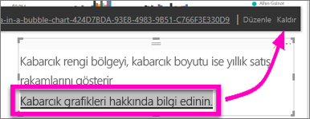

# Bir rapordaki metin kutusuna köprü ekleme
Metin kutuları raporlara eklenebilir, raporlardan panolara sabitlenebilir ve doğrudan panolara eklenebilir. Köprüler, bulunduğu yer fark etmeksizin bir metin kutusuna eklenebilir.  

> **NOT**: Power BI tablolarındaki ve matrislerindeki köprülerle ilgili bilgi için bkz. [Tablolardaki köprüler](power-bi-hyperlinks-in-tables.md). **Panonuza** metin kutusu ekleme ile ilgili bilgi için bkz. [Doğrudan panodan kutucuk ekleme](service-dashboard-add-widget.md). 
> 
> 

<iframe width="560" height="315" src="https://www.youtube.com/embed/_3q6VEBhGew#t=0m55s" frameborder="0" allowfullscreen></iframe>

## Bir rapordaki metin kutusuna köprü eklemek için
1. [Bir metin kutusu oluşturun ve metin ekleyin](power-bi-reports-add-text-and-shapes.md). 
2. Köprü olarak kullanmak için mevcut metni vurgulayın veya yeni metin ekleyin.
   
   
3. Köprü simgesini  seçin.
4. URL'yi köprü alanına yazın veya yapıştırın, ardından **Bitti**'yi seçin.
   
   
5. Bağlantıyı test edin.  
   
   
   
   * URL'yi görüntülemek için imleci vurgulanan metnin herhangi bir yerine götürün.  
     
      
   * Sayfayı yeni bir tarayıcı penceresinde açmak için URL'yi seçin.

## Köprüyü kaldırıp metni bırakmak için
1. Metin kutusunda, vurgulamak için köprüyü seçin.
   
     
2. **Kaldır** seçeneğini belirleyin. 

## Sonraki adımlar
[Power BI raporlarındaki metin kutuları](power-bi-reports-add-text-and-shapes.md)

Başka bir sorunuz mu var? [Power BI Topluluğu'na başvurun](http://community.powerbi.com/)

