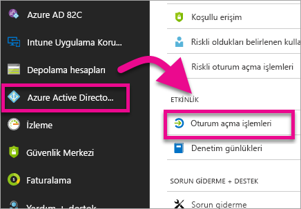
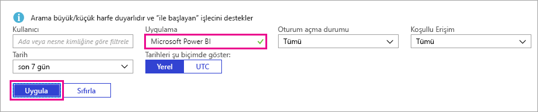

# Oturum açmış Power BI kullanıcılarını bulma

Kiracı yöneticisiyseniz ve Power BI oturumu açmış olan kullanıcıları görmek istiyorsanız [Azure Active Directory erişim ve kullanım raporlarını](/azure/active-directory/reports-monitoring/concept-sign-ins) kullanabilirsiniz.

<iframe width="640" height="360" src="https://www.youtube.com/embed/1AVgh9w9VM8?showinfo=0" frameborder="0" allowfullscreen></iframe>

> [!NOTE]
> Etkinlik raporu faydalı bilgiler sunar ancak her kullanıcının sahip olduğu lisans türünü tanımlamaz. Lisansları görüntülemek için Office 365 yönetim merkezini kullanın.

## Gereksinimler

Tüm kullanıcılar (yönetici olmayanlar dahil) kendi oturum açma işlemlerini içeren raporu görebilir ancak tüm kullanıcıları kapsayan bir rapor oluşturmak için aşağıdaki gereksinimleri karşılamanız gerekir.

* Kiracınızın ilgili Azure AD Premium lisansına sahip olması gerekir.

* Şu rollerden birinde olmalısınız: Genel Yönetici, Güvenlik Yöneticisi veya Güvenlik Okuyucusu.

## Oturum açma etkinliklerini görüntülemek için Azure portalı kullanma

Oturum açma etkinliğini görüntülemek için aşağıdaki adımları izleyin.

1. **Azure portalda** **Azure Active Directory**'yi seçin.

1. **İzleme** bölümünde **Oturum açma işlemleri**'ni seçin.
   
    

1. Uygulamayı **Microsoft Power BI** veya **Power BI Gateway** olarak filtreleyin ve **Uygula**'yı seçin.

    **Microsoft Power BI**, hizmetle ilgili oturum açma etkinliğini gösterecek şekilde filtreleme yaparken **Power BI Gateway**, Şirket içi ağ geçidiyle ilgili oturum açma etkinliğini gösterecek şekilde filtre uygular.
   
    

## Verileri dışarı aktarma

Oturum açma verilerini dışarı aktarmak için kullanabileceğiniz iki seçenek vardır: csv dosyası indirme veya PowerShell'i kullanma. Oturum açma raporunun en üstünde aşağıdaki seçeneklerden birini belirleyin:

* **İndir**: Filtrelenmiş verileri içeren bir csv dosyası indirilir.

* **Betik**: Filtrelenmiş verilere özgü bir PowerShell betiği indirilir. Betikteki filtreyi istediğiniz şekilde güncelleştirebilirsiniz.

## Veri saklama

Oturum açma verileri 30 güne kadar saklanabilir. Daha fazla bilgi için bkz. [Azure Active Directory report retention policies (Azure Active Directory rapor saklama ilkeleri)](/azure/active-directory/reports-monitoring/reference-reports-data-retention).

## Sonraki adımlar

[Kuruluşunuzda denetim özelliğini kullanma](service-admin-auditing.md)

Başka bir sorunuz mu var? [Power BI Topluluğu'na sorun](https://community.powerbi.com/)

