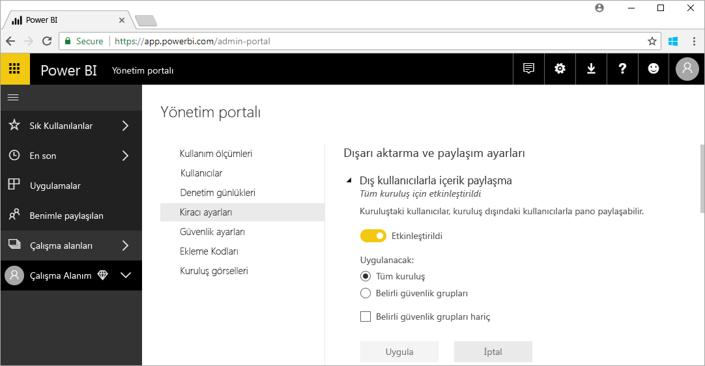

# Power BI yönetimi nedir?

Power BI yönetimi, yönetim ilkeleri yapılandırması, kullanım izleme ve lisans, kapasite ve kuruluş kaynaklarını sağlama dahil olmak üzere bir Power BI kiracısının yönetimidir. Bu makalede yönetim rolleri, görevleri ve araçlarına genel bir bakış ile daha fazla ayrıntı sağlayan makalelerin bağlantıları sunulmaktadır.

Power BI, self servis iş zekası için tasarlanmıştır ve yönetici, Power BI kiracısındaki veri, süreç ve ilkelerin koruyucusudur. Power BI yöneticisi; BI geliştiricileri, çözümleyicileri ve diğer rollerin oluşturduğu ekibin önemli bir üyesidir. Yönetici, kritik hedeflere ulaşıldığından emin olmak üzere bir kuruluşu desteklemeye yardımcı olabilir:

- Kullanıcıların _gerçekten_ ihtiyaç duyduğu KPI’ları ve ölçümleri anlama
- BT liderliğinde kurumsal raporlama için teslim süresini azaltma
- Bir Power BI dağıtımının benimsenmesini ve yatırım getirisini artırma

Görev, iş kullanıcılarını üretken hale getirmek ve güvenliğin yanı sıra kanun ile yönetmeliklere uyumu sağlamaktır. Sorumluluklar arasında yardım ve desteğin yanı sıra birçok durumda iş kullanıcılarına doğru hamleyi yapmalarında yardımcı olmak sayılabilir.

## Power BI ile ilgili yönetici rolleri

Power BI yönetimiyle ilgili olarak aşağıdaki tabloda ele alınan birkaç rol vardır.

| **Yönetici türü** | **Yönetim kapsamı** | **Power BI kapsamı** |
| --- | --- | --- |
| Office 365 Genel Yöneticisi | Office 365 | Bir Power BI kiracısını ve diğer hizmetleri tüm yönleriyle yönetebilir. |
| Office 365 Faturalama Yöneticisi | Office 365 | Office 365 abonelikleri aracılığıyla Power BI lisansları edinebilir. |
| Power BI Hizmet Yöneticisi | Power BI kiracısı | Bir Power BI kiracısı ve yönetim özellikleri (lisanslama hariç) üzerinde tam denetime sahiptir. |
| Power BI Premium Kapasite Yöneticisi | Tek bir Premium kapasite | Premium kapasite ve yönetim özellikleri üzerinde tam denetime sahiptir. |
| Power BI Embedded Kapasite Yöneticisi | Tek bir Embedded kapasitesi | Eklenmiş kapasite ve yönetim özellikleri üzerinde tam denetime sahiptir. |

Office 365 veya Azure Active Directory’deki Genel Yöneticiler, Power BI'da yönetici haklarına sahiptir. Bir Office 365 Genel Yöneticisi, diğer kullanıcıları Power BI Hizmet Yöneticisi rolüne atayarak yalnızca Power BI özellikleri üzerinde yönetim hakları verebilir.

Power BI Hizmet Yöneticileri işlevsellik, güvenlik ve izlemeyle ilgili kiracı düzeyinde çeşitli ayarlar içeren Power BI yönetim portalına erişebilir. Hizmet Yöneticileri bir Power BI kiracısının tüm kaynaklarına tam erişime sahiptir. Çoğu durumda, Hizmet Yöneticileri sorunları belirler ve sonra düzeltici eylemlerde bulunmak üzere kaynak sahipleri ile birlikte takip eder.

Power BI Hizmet Yöneticisi rolü, kullanıcılara lisans atama veya günlükleri Office 365'te görüntüleme yeteneği vermez. Bu nedenle, Power BI'yı yönetme görevi şu anda yalnızca Power BI Hizmet Yöneticisi rolünün üyeleri olan kullanıcılar tarafından gerçekleştirilemez.

## Yönetimsel görevler

Yöneticiler, kuruluşları için Power BI kiracısını desteklemek üzere aşağıdaki tabloda ele alınan birçok görev gerçekleştirir.

| **Görev alanı** | **Tipik görevler** |
| --- | --- |
| Power BI kiracısını yönetme |<ul><li>Önemli Power BI özelliklerini etkinleştirme ve devre dışı bırakma <li>Kullanım ve performans raporu oluşturma <li>Olayların denetimini gözden geçirme ve yönetme</ul>|
| Power BI lisansları edinme ve atama |<ul><li>Kullanıcı kaydını yönetme <li>Pro lisansları satın alma ve atama <li>Kullanıcıların Power BI’ya erişmesini engelleme</ul>|
| Premium kapasiteyi yönetme |<ul><li>Premium kapasite edinme ve birlikte çalışma <li>Hizmet kalitesi sağlama|
| Embedded kapasitesini yönetme |<ul><li>ISV’lerin ve geliştiricilerin Power BI özelliklerini kullanım şeklini kolaylaştırmak için Embedded kapasitesi edinme</ul>|
| Dahili ilke, kanun ve yönetmeliklere uyumu sağlama | <ul><li>İş verilerinin sınıflandırılmasını yönetme <li>İçerik yayımlama ve paylaşım ilkelerini uygulamaya yardımcı olma</ul>|
| Power BI kaynaklarını yönetme |<ul><li>Çalışma alanlarını yönetme <li>Özel görseller yayımlama <li>Power BI’yı diğer uygulamalara eklemek için kullanılan kodları doğrulama|
| Kiracı kullanıcılarına yardım ve destek sağlama |<ul><li>Veri erişimi ve diğer sorunları giderme</ul>|
| Diğer görevler |<ul><li>Örneğin System Center Configuration Manager kullanarak Power BI Desktop’ı dağıtma <li>Intune ile Power BI mobil uygulama dağıtımını yönetme <li>Kaynak veri güvenliği gibi veri gizliliği ve güvenliğini yönetme</ul>|

## Yönetim araçları

Power BI yönetimiyle ilgili olarak aşağıdaki tabloda ele alınan birkaç araç vardır. Yöneticiler genellikle zamanlarının çoğunu Power BI yönetim portalında geçirir ve gerektiğinde diğer araçları kullanır.

| **Araç** | **Tipik görevler** |
| --- | --- |
| Power BI Yönetim portalı |<ul><li>Premium kapasite edinme ve birlikte çalışma</li><li>Hizmet kalitesi sağlama</li><li>İş verilerinin sınıflandırılmasını yönetme</li><li>İçerik yayımlama ve paylaşım ilkelerini uygulamaya yardımcı olma</li><li>Çalışma alanlarını yönetme <li>Özel görseller yayımlama</li><li>Power BI’yı diğer uygulamalara eklemek için kullanılan kodları doğrulama</li><li>Veri erişimi ve diğer sorunları giderme</li></ul>|
| Office 365 Yönetim Merkezi |<ul><li>Kullanıcı kaydını yönetme</li><li>Pro lisansları satın alma ve atama</li><li>Kullanıcıların Power BI’ya erişmesini engelleme</li></ul>|
| Office 365 Güvenlik ve Uyumluluk Merkezi |<ul><li>Olayların denetimini gözden geçirme ve yönetme</li></ul>|
| Azure portalında Azure Active Directory (AAD) |<ul><li>AAD aracılığıyla Power BI kaynaklarına koşullu erişimi yapılandırma</li><li>Power BI Embedded kapasitesi sağlama</li></ul>|
| PowerShell cmdlet'leri |<ul><li>Betikler aracılığıyla çalışma alanlarını ve Power BI’ın diğer yönlerini yönetme</li></ul>|
| Yönetim API’leri ve SDK'sı |<ul><li>Bir Power BI yöneticisinin çalışmasını kolaylaştırmak için özel yönetim görevleri oluşturun. Örneğin, Power BI Desktop bu API’leri kullanarak yönetimle ilgili verileri temel alan raporlar oluşturabilir</li></ul>|

## Sonraki adımlar

Bu makalede Power BI yöneticisinin işi ve onunla ilgili belirli roller, görevler ve araçlara ilişkin bazı hızlı içgörüler bulduğunuzu umuyoruz. Öğrendiklerinizi pekiştirmek için aşağıdaki makaleleri okumanızı öneririz.

[Power BI yönetim portalını kullanma](service-admin-portal.md)

[PowerShell cmdlet’lerini kullanma](/powershell/power-bi/overview?toc=%2Fen-us%2Fpower-bi%2FTOC.json&bc=%2Fen-us%2Fpower-bi%2Fbreadcrumb%2Ftoc.json&view=powerbi-ps)

[Power BI yönetimi SSS](service-admin-faq.md)

Başka bir sorunuz mu var? [Power BI Topluluğu'na sorun](http://community.powerbi.com/)